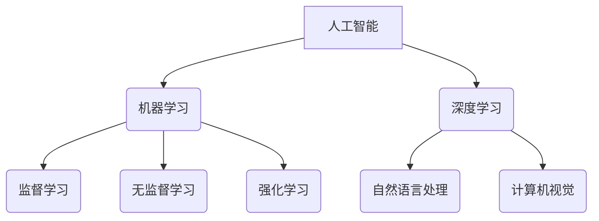

                 

## AI创业：人工智能的革命性突破

> 关键词：人工智能、创业、机器学习、深度学习、自然语言处理、计算机视觉、商业应用

### 1. 背景介绍

人工智能（AI）正以惊人的速度发展，其影响力正在深刻地改变着我们生活的方方面面。从自动驾驶汽车到智能家居，从医疗诊断到金融交易，AI技术正在被广泛应用于各个领域，并不断涌现出新的应用场景。

对于创业者来说，AI技术带来的机遇是前所未有的。AI可以帮助创业公司提高效率、降低成本、创造新的商业模式，并为用户提供更个性化、更智能化的体验。然而，AI创业也面临着许多挑战，例如数据获取、算法开发、人才短缺等。

### 2. 核心概念与联系

#### 2.1  人工智能（AI）

人工智能是指模拟人类智能行为的计算机系统。它涵盖了多种技术，包括机器学习、深度学习、自然语言处理、计算机视觉等。

#### 2.2  机器学习（ML）

机器学习是人工智能的一个重要分支，它使计算机能够从数据中学习，并根据学习到的知识进行预测或决策。机器学习算法可以分为监督学习、无监督学习和强化学习三大类。

#### 2.3  深度学习（DL）

深度学习是机器学习的一个子领域，它使用多层神经网络来模拟人类大脑的学习过程。深度学习算法在图像识别、语音识别、自然语言处理等领域取得了突破性的进展。

#### 2.4  自然语言处理（NLP）

自然语言处理是指使计算机能够理解、处理和生成人类语言的技术。NLP应用广泛，例如聊天机器人、机器翻译、文本摘要等。

#### 2.5  计算机视觉（CV）

计算机视觉是指使计算机能够“看”和理解图像的技术。计算机视觉应用于图像识别、物体检测、图像分割等领域。

**核心概念与联系流程图**



### 3. 核心算法原理 & 具体操作步骤

#### 3.1  算法原理概述

选择一个具体的AI算法，例如线性回归，并详细介绍其原理。

* 线性回归是一种监督学习算法，用于预测连续值。它假设数据之间存在线性关系，并通过最小化预测值与真实值的误差来找到最佳的回归线。

#### 3.2  算法步骤详解

1. **数据准备:** 收集和预处理数据，例如特征选择、数据清洗、数据标准化等。
2. **模型训练:** 使用训练数据训练线性回归模型，并通过梯度下降算法优化模型参数。
3. **模型评估:** 使用测试数据评估模型性能，例如计算均方误差（MSE）或R-squared值。
4. **模型调优:** 根据评估结果调整模型参数，例如学习率、正则化参数等，以提高模型性能。
5. **模型部署:** 将训练好的模型部署到实际应用场景中，例如预测未来销售额、评估客户信用风险等。

#### 3.3  算法优缺点

**优点:**

* 算法简单易懂，易于实现。
* 训练速度快，计算量小。
* 可解释性强，可以直观地理解模型的决策过程。

**缺点:**

* 只能处理线性关系的数据。
* 对异常值敏感。
* 无法处理高维数据。

#### 3.4  算法应用领域

* 预测分析
* 财务建模
* 市场营销
* 医疗诊断

### 4. 数学模型和公式 & 详细讲解 & 举例说明

#### 4.1  数学模型构建

线性回归模型的数学表达式为：

$$y = \theta_0 + \theta_1x_1 + \theta_2x_2 + ... + \theta_nx_n + \epsilon$$

其中：

* $y$ 是预测值
* $\theta_0, \theta_1, ..., \theta_n$ 是模型参数
* $x_1, x_2, ..., x_n$ 是输入特征
* $\epsilon$ 是误差项

#### 4.2  公式推导过程

线性回归的目标是找到最佳的模型参数，使预测值与真实值之间的误差最小化。常用的误差函数是均方误差（MSE）：

$$MSE = \frac{1}{n}\sum_{i=1}^{n}(y_i - \hat{y}_i)^2$$

其中：

* $n$ 是样本数量
* $y_i$ 是真实值
* $\hat{y}_i$ 是预测值

通过梯度下降算法，可以迭代地更新模型参数，使MSE不断减小。

#### 4.3  案例分析与讲解

假设我们想要预测房屋价格，输入特征包括房屋面积、房间数量、地理位置等。我们可以使用线性回归模型来建立房屋价格预测模型。

通过训练数据，我们可以找到最佳的模型参数，例如：

* $\theta_0 = 100000$
* $\theta_1 = 500$ (每平方米面积增加500元)
* $\theta_2 = 10000$ (每增加一间房间增加10000元)

根据这些参数，我们可以预测新房子的价格。例如，如果新房子的面积为100平方米，房间数量为3间，地理位置在市中心，那么预测价格为：

$$y = 100000 + 500 * 100 + 10000 * 3 = 200000$$

### 5. 项目实践：代码实例和详细解释说明

#### 5.1  开发环境搭建

使用Python语言和相关库，例如Scikit-learn，TensorFlow等。

#### 5.2  源代码详细实现

```python
from sklearn.linear_model import LinearRegression
from sklearn.model_selection import train_test_split
import numpy as np

# 准备数据
X = np.array([[100, 3], [150, 4], [200, 5], [250, 6]])  # 面积，房间数量
y = np.array([180000, 220000, 260000, 300000])  # 房屋价格

# 将数据分为训练集和测试集
X_train, X_test, y_train, y_test = train_test_split(X, y, test_size=0.2, random_state=42)

# 创建线性回归模型
model = LinearRegression()

# 训练模型
model.fit(X_train, y_train)

# 预测测试集数据
y_pred = model.predict(X_test)

# 评估模型性能
print('Coefficients:', model.coef_)
print('Intercept:', model.intercept_)
print('Mean Squared Error:', np.mean((y_test - y_pred)**2))
```

#### 5.3  代码解读与分析

* 首先，我们准备了房屋面积和房间数量作为输入特征，以及房屋价格作为目标变量。
* 然后，我们将数据分为训练集和测试集，用于训练和评估模型。
* 创建线性回归模型，并使用训练数据进行模型训练。
* 训练完成后，我们可以使用模型预测测试集数据，并评估模型性能。

#### 5.4  运行结果展示

运行代码后，会输出模型的系数、截距以及均方误差等指标，用于评估模型的性能。

### 6. 实际应用场景

#### 6.1  医疗诊断

AI可以帮助医生更快、更准确地诊断疾病，例如癌症、心血管疾病等。

#### 6.2  金融风险评估

AI可以帮助金融机构评估客户的信用风险，并进行精准的风险控制。

#### 6.3  个性化推荐

AI可以根据用户的行为数据，提供个性化的商品推荐、内容推荐等。

#### 6.4  未来应用展望

AI技术将继续发展，并应用于更多领域，例如自动驾驶、机器人、教育等。

### 7. 工具和资源推荐

#### 7.1  学习资源推荐

* **在线课程:** Coursera, edX, Udacity
* **书籍:** 《深度学习》、《机器学习实战》
* **博客:** Towards Data Science, Machine Learning Mastery

#### 7.2  开发工具推荐

* **Python:** 广泛用于AI开发
* **Scikit-learn:** 机器学习库
* **TensorFlow:** 深度学习框架
* **PyTorch:** 深度学习框架

#### 7.3  相关论文推荐

* **《ImageNet Classification with Deep Convolutional Neural Networks》**
* **《Attention Is All You Need》**
* **《BERT: Pre-training of Deep Bidirectional Transformers for Language Understanding》**

### 8. 总结：未来发展趋势与挑战

#### 8.1  研究成果总结

AI技术取得了显著的进展，在多个领域取得了突破性的应用。

#### 8.2  未来发展趋势

* **模型更加强大:** 模型规模、复杂度和性能将继续提升。
* **应用更加广泛:** AI将应用于更多领域，例如医疗、教育、金融等。
* **伦理问题更加突出:** AI的伦理问题，例如算法偏见、数据隐私等，需要得到更加重视。

#### 8.3  面临的挑战

* **数据获取:** 高质量的数据是AI训练的基础，但获取高质量数据仍然是一个挑战。
* **算法开发:** 开发更强大、更鲁棒的AI算法仍然是一个难题。
* **人才短缺:** AI领域人才短缺是一个普遍问题。

#### 8.4  研究展望

未来AI研究将更加注重模型的可解释性、安全性、鲁棒性等方面，并探索AI与人类更加紧密地合作的模式。

### 9. 附录：常见问题与解答

* **什么是AI？**

AI是指模拟人类智能行为的计算机系统。

* **AI有哪些应用场景？**

AI应用广泛，例如医疗诊断、金融风险评估、个性化推荐等。

* **如何学习AI？**

可以通过在线课程、书籍、博客等方式学习AI。

* **AI的未来发展趋势是什么？**

AI将更加强大、更加广泛地应用于各个领域。

作者：禅与计算机程序设计艺术 / Zen and the Art of Computer Programming


<end_of_turn>

