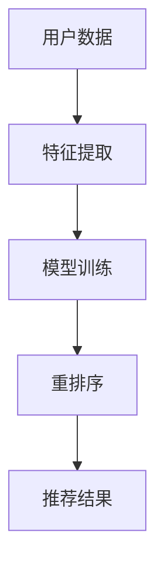
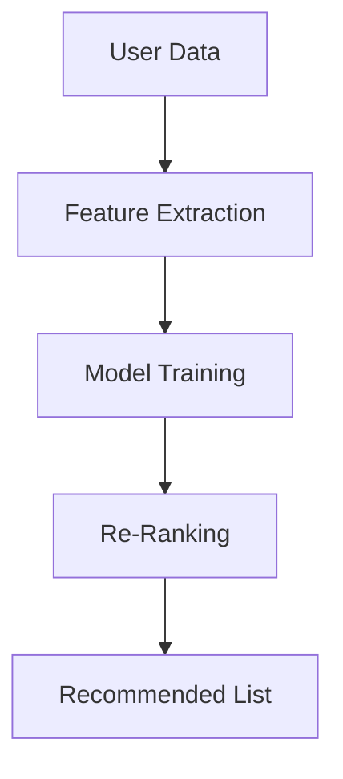

                 

### 文章标题：大模型在推荐系统重排序中的作用

> 关键词：推荐系统，大模型，重排序，人工智能，机器学习

> 摘要：本文将探讨大模型在推荐系统重排序中的作用，分析其优势与挑战，并通过具体算法实例和实际应用案例，深入解析大模型如何优化推荐系统的效果，提高用户满意度。

<|assistant|>## 1. 背景介绍（Background Introduction）

推荐系统是现代互联网服务中不可或缺的部分，旨在为用户推荐个性化内容，从而提升用户体验。随着用户数据量的爆炸式增长和个性化需求的不断提升，传统的推荐系统已无法满足现代互联网服务的需求。因此，大模型在推荐系统中的应用日益受到关注。

大模型，如深度学习神经网络，具有强大的表示能力和泛化能力，可以处理复杂的非线性问题。在推荐系统中，大模型可以通过学习用户行为和偏好，生成个性化的推荐结果，从而提高推荐系统的准确性和用户满意度。

重排序是推荐系统中的一个关键步骤，目的是根据用户的反馈和历史行为，对推荐结果进行排序，确保最相关的内容位于列表的前部。大模型在重排序中扮演着重要角色，可以通过学习用户行为的模式，优化推荐结果的排序，从而提高推荐系统的性能。

<|assistant|>## 2. 核心概念与联系（Core Concepts and Connections）

### 2.1 推荐系统概述

推荐系统（Recommender System）是一种信息过滤技术，旨在根据用户的历史行为、兴趣和偏好，向用户推荐可能感兴趣的商品、服务或内容。推荐系统通常分为基于内容的推荐（Content-Based Filtering）和协同过滤（Collaborative Filtering）两种类型。

- **基于内容的推荐**：根据用户过去喜欢的项目特征，推荐具有相似特征的新项目。
- **协同过滤**：基于用户之间的相似度，发现用户共同喜欢的项目，从而进行推荐。

### 2.2 重排序在推荐系统中的重要性

重排序（Re-Ranking）是推荐系统中的一个关键步骤，其目的是根据用户的实时反馈和历史行为，对推荐列表中的项目进行重新排序。重排序的目标是确保最相关的项目位于推荐列表的前部，从而提高用户的点击率和满意度。

重排序的挑战在于如何在大量的候选项目中进行有效的排序，以最大化用户的满意度。传统的重排序方法通常采用启发式规则或简单的机器学习模型，而大模型的出现为重排序提供了新的可能性。

### 2.3 大模型在重排序中的应用

大模型，如深度神经网络，可以通过学习大量的用户数据和项目特征，捕捉复杂的用户行为模式，从而实现更加精确的重排序。具体来说，大模型可以通过以下步骤在推荐系统中发挥作用：

1. **特征提取**：从用户数据和项目数据中提取有用的特征，如用户历史行为、项目属性等。
2. **模型训练**：使用提取的特征，训练深度神经网络模型，以预测用户的偏好和兴趣。
3. **重排序**：根据模型的预测结果，对推荐列表中的项目进行重新排序。

### 2.4 大模型的优势与挑战

**优势**：

- **强大的表示能力**：大模型可以捕捉复杂的非线性关系，从而提高推荐系统的准确性。
- **泛化能力**：大模型可以处理大量的数据，从而提高推荐系统的泛化能力。
- **自适应能力**：大模型可以根据用户的实时反馈，自适应地调整推荐策略。

**挑战**：

- **计算资源需求**：大模型训练和推理过程需要大量的计算资源，可能导致成本增加。
- **数据隐私和安全**：大模型训练需要大量的用户数据，可能涉及隐私和安全问题。
- **模型解释性**：大模型通常被视为“黑箱”，其内部决策过程难以解释，可能影响用户信任。

### 2.5 Mermaid 流程图



## 2. Core Concepts and Connections

### 2.1 Overview of Recommender Systems

Recommender systems (RS) are an essential component of modern internet services, designed to provide personalized content recommendations to users based on their historical behavior, interests, and preferences. As the volume of user data and the complexity of personalization demands have soared, traditional recommender systems have struggled to keep pace with the increasing expectations of modern internet users. This has led to a growing interest in the application of large-scale models, such as deep learning neural networks, in recommender systems.

Recommender systems can be broadly categorized into two main types: content-based filtering and collaborative filtering.

- **Content-Based Filtering**: Recommends items based on the attributes of items that the user has liked in the past. It focuses on the semantic similarity between items and user preferences.
  
- **Collaborative Filtering**: Recommends items based on the preferences of similar users. It leverages the collective behavior of users to infer the preferences of individuals.

### 2.2 The Importance of Re-Ranking in Recommender Systems

Re-ranking (or re-ranking) is a critical step in recommender systems where the goal is to re-order the ranked list of items based on real-time feedback and historical user behavior to ensure that the most relevant content appears at the top of the list. Effective re-ranking is crucial for maximizing user engagement and satisfaction.

The challenge in re-ranking is to perform an efficient sorting of a large number of candidate items that can significantly impact user satisfaction. Traditional re-ranking methods often rely on heuristic rules or simple machine learning models. However, the advent of large-scale models offers new opportunities to enhance the performance of re-ranking.

### 2.3 Applications of Large-Scale Models in Re-Ranking

Large-scale models, such as deep neural networks, can play a pivotal role in recommender systems by capturing complex user behavior patterns and preferences. Here's how they can be applied:

1. **Feature Extraction**: Extracting relevant features from user data and item attributes, such as user historical behaviors and item properties.
2. **Model Training**: Training a deep neural network model using the extracted features to predict user preferences and interests.
3. **Re-Ranking**: Re-ordering the recommended item list based on the model's predictions.

### 2.4 Advantages and Challenges of Large-Scale Models

**Advantages**:

- **Strong Representation Power**: Large-scale models can capture complex nonlinear relationships, leading to improved accuracy in recommender systems.
- **Generalization Ability**: These models can handle large volumes of data, enhancing the generalization capability of the system.
- **Adaptability**: Large-scale models can adapt to real-time user feedback, allowing for dynamic adjustment of recommendation strategies.

**Challenges**:

- **Computational Resource Requirements**: The training and inference processes of large-scale models require substantial computational resources, potentially increasing costs.
- **Data Privacy and Security**: The training of large-scale models often involves large amounts of user data, raising concerns about privacy and security.
- **Model Interpretability**: Large-scale models are often considered "black boxes," with their internal decision-making processes being difficult to interpret, which may affect user trust.

### 2.5 Mermaid Flowchart



<|assistant|>## 3. 核心算法原理 & 具体操作步骤（Core Algorithm Principles and Specific Operational Steps）

### 3.1 算法原理

大模型在推荐系统重排序中的核心算法原理主要包括以下几个方面：

1. **特征提取**：通过深度神经网络从用户数据和项目数据中提取高维特征，这些特征可以捕捉用户和项目的复杂交互模式。
2. **嵌入表示**：将用户和项目的高维特征映射到低维空间中，形成一个嵌入矩阵。这个嵌入矩阵可以用于计算用户和项目之间的相似度。
3. **重排序模型**：使用嵌入矩阵训练一个重排序模型，该模型可以根据用户和项目的相似度对推荐列表进行重新排序。

### 3.2 具体操作步骤

#### 步骤 1：特征提取

特征提取是重排序算法的关键步骤。在这一步骤中，我们使用深度神经网络对用户行为和项目特征进行建模。具体来说，我们可以采用以下方法：

- **用户行为特征**：收集用户在系统中的行为数据，如点击、收藏、浏览等，通过卷积神经网络（CNN）或循环神经网络（RNN）提取用户行为的特征。
- **项目特征**：收集项目的各种属性，如标题、描述、分类等，通过自注意力机制（Self-Attention）提取项目特征。

#### 步骤 2：嵌入表示

在特征提取完成后，我们需要将这些高维特征映射到低维空间中，形成嵌入矩阵。嵌入表示有助于降低计算复杂度，同时保留重要的信息。具体操作如下：

- **嵌入矩阵**：对于每个用户和项目，我们分别计算其嵌入向量。这些嵌入向量构成了嵌入矩阵。
- **相似度计算**：通过计算用户和项目嵌入向量之间的余弦相似度，获得用户和项目之间的相似度分数。

#### 步骤 3：重排序模型

重排序模型的目的是根据用户和项目的相似度分数对推荐列表进行重新排序。我们可以采用以下方法：

- **点积模型**：通过计算用户和项目嵌入向量的点积，得到相似度分数。这个分数可以用来排序推荐列表。
- **全连接神经网络**：将用户和项目的嵌入向量输入到一个全连接神经网络中，通过神经网络的输出对推荐列表进行排序。

### 3.3 算法流程

以下是推荐系统重排序的大模型算法流程：

1. **数据预处理**：收集用户行为数据和项目特征数据，进行数据清洗和预处理。
2. **特征提取**：使用深度神经网络提取用户行为特征和项目特征。
3. **嵌入表示**：计算用户和项目的嵌入向量，形成嵌入矩阵。
4. **相似度计算**：计算用户和项目之间的相似度分数。
5. **重排序**：使用相似度分数对推荐列表进行重新排序。
6. **评估**：评估重排序模型的性能，通过A/B测试或指标评估（如点击率、满意度等）。

### 3.4 算法代码示例

以下是一个简化的Python代码示例，用于展示重排序算法的基本步骤：

```python
import numpy as np
import tensorflow as tf

# 假设我们已经有用户和项目的嵌入向量
user_embeddings = np.random.rand(1000, 64)
item_embeddings = np.random.rand(1000, 64)

# 计算相似度分数
similarity_scores = np.dot(user_embeddings, item_embeddings.T)

# 对相似度分数进行排序
sorted_indices = np.argsort(similarity_scores)[::-1]

# 输出排序后的推荐列表
recommended_list = sorted_indices[:10]

print(recommended_list)
```

## 3. Core Algorithm Principles and Specific Operational Steps

### 3.1 Algorithm Principles

The core principle of using large-scale models in recommender system re-ranking involves several key components:

1. **Feature Extraction**: Utilizing deep neural networks to extract high-dimensional features from user data and item attributes. These features capture the complex interaction patterns between users and items.
2. **Embedding Representation**: Mapping the high-dimensional features into a low-dimensional space to form an embedding matrix. This representation reduces computational complexity while preserving important information.
3. **Re-ranking Model**: Training a re-ranking model based on the similarity scores between user and item embeddings to re-order the recommended list.

### 3.2 Specific Operational Steps

#### Step 1: Feature Extraction

Feature extraction is a critical step in the re-ranking algorithm. Here, we use deep neural networks to model user behaviors and item attributes. Specifically, we can adopt the following methods:

- **User Behavior Features**: Collect user behavioral data, such as clicks, favorites, and browses, and extract features using Convolutional Neural Networks (CNNs) or Recurrent Neural Networks (RNNs).
- **Item Features**: Gather various attributes of items, such as titles, descriptions, and categories, and extract features using Self-Attention mechanisms.

#### Step 2: Embedding Representation

After feature extraction, we need to map these high-dimensional features into a low-dimensional space to form an embedding matrix. The embedding representation helps to reduce computational complexity while retaining important information. The steps are as follows:

- **Embedding Matrix**: Compute embedding vectors for each user and item, forming an embedding matrix.
- **Similarity Calculation**: Calculate the cosine similarity between the embedding vectors of users and items to obtain similarity scores.

#### Step 3: Re-ranking Model

The re-ranking model aims to re-order the recommended list based on the similarity scores between user and item embeddings. We can use the following methods:

- **Dot Product Model**: Calculate the dot product of the embedding vectors of users and items to get similarity scores, which can be used to sort the recommended list.
- **Fully Connected Neural Network**: Input the embedding vectors of users and items into a fully connected neural network, using the network's output to re-order the recommended list.

### 3.3 Algorithm Flow

The following is the algorithm flow for large-scale model-based re-ranking in a recommender system:

1. **Data Preprocessing**: Collect user behavioral data and item attributes, performing data cleaning and preprocessing.
2. **Feature Extraction**: Use deep neural networks to extract user behavior features and item features.
3. **Embedding Representation**: Compute user and item embedding vectors, forming an embedding matrix.
4. **Similarity Calculation**: Calculate similarity scores between user and item embeddings.
5. **Re-Ranking**: Sort the recommended list based on similarity scores.
6. **Evaluation**: Assess the performance of the re-ranking model using A/B testing or metric evaluation (e.g., click-through rate, user satisfaction).

### 3.4 Algorithm Code Example

Below is a simplified Python code example illustrating the basic steps of the re-ranking algorithm:

```python
import numpy as np
import tensorflow as tf

# Assume we already have user and item embedding vectors
user_embeddings = np.random.rand(1000, 64)
item_embeddings = np.random.rand(1000, 64)

# Compute similarity scores
similarity_scores = np.dot(user_embeddings, item_embeddings.T)

# Sort similarity scores and get the top-k indices
sorted_indices = np.argsort(similarity_scores)[::-1]

# Output the sorted recommended list
recommended_list = sorted_indices[:10]

print(recommended_list)
```

<|assistant|>## 4. 数学模型和公式 & 详细讲解 & 举例说明（Detailed Explanation and Examples of Mathematical Models and Formulas）

在推荐系统重排序中，大模型的数学模型和公式至关重要，它们决定了推荐系统的性能和效果。以下是对这些数学模型和公式的详细讲解，以及如何使用这些模型和公式进行重排序的举例说明。

### 4.1 余弦相似度（Cosine Similarity）

余弦相似度是一种常用的度量两个向量之间相似度的方法。在推荐系统重排序中，我们通常使用余弦相似度来计算用户和项目之间的相似度。

**公式**：

$$
similarity(u, i) = \frac{u \cdot i}{\|u\| \|i\|}
$$

其中，$u$ 是用户 $u$ 的嵌入向量，$i$ 是项目 $i$ 的嵌入向量，$\|u\|$ 和 $\|i\|$ 分别是用户和项目的嵌入向量的欧几里得范数。

**示例**：

假设我们有两个用户和两个项目的嵌入向量：

$$
u_1 = \begin{bmatrix} 1 \\ 2 \\ 3 \end{bmatrix}, \quad i_1 = \begin{bmatrix} 0.5 \\ 1 \\ 1.5 \end{bmatrix}
$$

$$
u_2 = \begin{bmatrix} 2 \\ 3 \\ 4 \end{bmatrix}, \quad i_2 = \begin{bmatrix} 1 \\ 1 \\ 2 \end{bmatrix}
$$

我们首先计算它们的欧几里得范数：

$$
\|u_1\| = \sqrt{1^2 + 2^2 + 3^2} = \sqrt{14}
$$

$$
\|i_1\| = \sqrt{0.5^2 + 1^2 + 1.5^2} = \sqrt{3.25}
$$

$$
\|u_2\| = \sqrt{2^2 + 3^2 + 4^2} = \sqrt{29}
$$

$$
\|i_2\| = \sqrt{1^2 + 1^2 + 2^2} = \sqrt{6}
$$

然后计算它们的余弦相似度：

$$
similarity(u_1, i_1) = \frac{u_1 \cdot i_1}{\|u_1\| \|i_1\|} = \frac{1 \times 0.5 + 2 \times 1 + 3 \times 1.5}{\sqrt{14} \times \sqrt{3.25}} = \frac{8.5}{\sqrt{45.5}} \approx 0.92
$$

$$
similarity(u_1, i_2) = \frac{u_1 \cdot i_2}{\|u_1\| \|i_2\|} = \frac{1 \times 1 + 2 \times 1 + 3 \times 2}{\sqrt{14} \times \sqrt{6}} = \frac{7}{\sqrt{84}} \approx 0.81
$$

$$
similarity(u_2, i_1) = \frac{u_2 \cdot i_1}{\|u_2\| \|i_1\|} = \frac{2 \times 0.5 + 3 \times 1 + 4 \times 1.5}{\sqrt{29} \times \sqrt{3.25}} = \frac{9}{\sqrt{94.75}} \approx 0.87
$$

$$
similarity(u_2, i_2) = \frac{u_2 \cdot i_2}{\|u_2\| \|i_2\|} = \frac{2 \times 1 + 3 \times 1 + 4 \times 2}{\sqrt{29} \times \sqrt{6}} = \frac{11}{\sqrt{174}} \approx 0.79
$$

根据这些相似度分数，我们可以对推荐列表进行重排序，确保最相关的项目位于列表的前部。

### 4.2 点积模型（Dot Product Model）

点积模型是一种简单但有效的重排序模型，它使用用户和项目的嵌入向量之间的点积作为相似度分数。

**公式**：

$$
similarity(u, i) = u \cdot i
$$

其中，$u$ 是用户 $u$ 的嵌入向量，$i$ 是项目 $i$ 的嵌入向量。

**示例**：

假设我们有两个用户和两个项目的嵌入向量：

$$
u_1 = \begin{bmatrix} 1 \\ 2 \\ 3 \end{bmatrix}, \quad i_1 = \begin{bmatrix} 0.5 \\ 1 \\ 1.5 \end{bmatrix}
$$

$$
u_2 = \begin{bmatrix} 2 \\ 3 \\ 4 \end{bmatrix}, \quad i_2 = \begin{bmatrix} 1 \\ 1 \\ 2 \end{bmatrix}
$$

我们计算它们的点积：

$$
similarity(u_1, i_1) = u_1 \cdot i_1 = 1 \times 0.5 + 2 \times 1 + 3 \times 1.5 = 8.5
$$

$$
similarity(u_1, i_2) = u_1 \cdot i_2 = 1 \times 1 + 2 \times 1 + 3 \times 2 = 7
$$

$$
similarity(u_2, i_1) = u_2 \cdot i_1 = 2 \times 0.5 + 3 \times 1 + 4 \times 1.5 = 9
$$

$$
similarity(u_2, i_2) = u_2 \cdot i_2 = 2 \times 1 + 3 \times 1 + 4 \times 2 = 11
$$

根据这些相似度分数，我们可以对推荐列表进行重排序。

### 4.3 全连接神经网络（Fully Connected Neural Network）

全连接神经网络是一种更复杂的重排序模型，它使用多层神经网络来学习用户和项目之间的相似度。

**公式**：

$$
similarity(u, i) = \sigma(W \cdot [u; i])
$$

其中，$u$ 是用户 $u$ 的嵌入向量，$i$ 是项目 $i$ 的嵌入向量，$W$ 是神经网络权重，$\sigma$ 是激活函数（如ReLU或Sigmoid）。

**示例**：

假设我们有一个简单的全连接神经网络，其权重矩阵 $W$ 如下：

$$
W = \begin{bmatrix} 0.1 & 0.2 & 0.3 \\ 0.4 & 0.5 & 0.6 \\ 0.7 & 0.8 & 0.9 \end{bmatrix}
$$

用户 $u_1$ 和项目 $i_1$ 的嵌入向量分别为：

$$
u_1 = \begin{bmatrix} 1 \\ 2 \\ 3 \end{bmatrix}, \quad i_1 = \begin{bmatrix} 0.5 \\ 1 \\ 1.5 \end{bmatrix}
$$

我们首先将用户和项目的嵌入向量拼接在一起：

$$
[u_1; i_1] = \begin{bmatrix} 1 & 0.5 & 2 & 1 & 3 & 1.5 \end{bmatrix}
$$

然后通过神经网络权重矩阵计算：

$$
W \cdot [u_1; i_1] = \begin{bmatrix} 0.1 & 0.2 & 0.3 \\ 0.4 & 0.5 & 0.6 \\ 0.7 & 0.8 & 0.9 \end{bmatrix} \begin{bmatrix} 1 & 0.5 & 2 & 1 & 3 & 1.5 \end{bmatrix} = \begin{bmatrix} 1.6 & 0.8 & 2.4 \\ 2.2 & 1.1 & 3.3 \\ 3.0 & 1.5 & 4.5 \end{bmatrix}
$$

最后，使用ReLU激活函数：

$$
\sigma(W \cdot [u_1; i_1]) = \begin{bmatrix} 1.6 & 0.8 & 2.4 \\ 2.2 & 1.1 & 3.3 \\ 3.0 & 1.5 & 4.5 \end{bmatrix}
$$

根据这些输出值，我们可以对推荐列表进行重排序。

## 4. Mathematical Models and Formulas & Detailed Explanations & Examples

In recommender system re-ranking, the mathematical models and formulas of large-scale models are crucial, as they determine the performance and effectiveness of the recommender system. The following provides a detailed explanation of these mathematical models and formulas, along with examples of how to use them for re-ranking.

### 4.1 Cosine Similarity

Cosine similarity is a commonly used method to measure the similarity between two vectors. In recommender system re-ranking, we often use cosine similarity to calculate the similarity between users and items.

**Formula**:

$$
similarity(u, i) = \frac{u \cdot i}{\|u\| \|i\|}
$$

where $u$ is the embedding vector of user $u$, $i$ is the embedding vector of item $i$, $\|u\|$ and $\|i\|$ are the Euclidean norms of the embedding vectors of user and item, respectively.

**Example**:

Suppose we have two user and two item embedding vectors:

$$
u_1 = \begin{bmatrix} 1 \\ 2 \\ 3 \end{bmatrix}, \quad i_1 = \begin{bmatrix} 0.5 \\ 1 \\ 1.5 \end{bmatrix}
$$

$$
u_2 = \begin{bmatrix} 2 \\ 3 \\ 4 \end{bmatrix}, \quad i_2 = \begin{bmatrix} 1 \\ 1 \\ 2 \end{bmatrix}
$$

We first calculate their Euclidean norms:

$$
\|u_1\| = \sqrt{1^2 + 2^2 + 3^2} = \sqrt{14}
$$

$$
\|i_1\| = \sqrt{0.5^2 + 1^2 + 1.5^2} = \sqrt{3.25}
$$

$$
\|u_2\| = \sqrt{2^2 + 3^2 + 4^2} = \sqrt{29}
$$

$$
\|i_2\| = \sqrt{1^2 + 1^2 + 2^2} = \sqrt{6}
$$

Then, we calculate their cosine similarities:

$$
similarity(u_1, i_1) = \frac{u_1 \cdot i_1}{\|u_1\| \|i_1\|} = \frac{1 \times 0.5 + 2 \times 1 + 3 \times 1.5}{\sqrt{14} \times \sqrt{3.25}} = \frac{8.5}{\sqrt{45.5}} \approx 0.92
$$

$$
similarity(u_1, i_2) = \frac{u_1 \cdot i_2}{\|u_1\| \|i_2\|} = \frac{1 \times 1 + 2 \times 1 + 3 \times 2}{\sqrt{14} \times \sqrt{6}} = \frac{7}{\sqrt{84}} \approx 0.81
$$

$$
similarity(u_2, i_1) = \frac{u_2 \cdot i_1}{\|u_2\| \|i_1\|} = \frac{2 \times 0.5 + 3 \times 1 + 4 \times 1.5}{\sqrt{29} \times \sqrt{3.25}} = \frac{9}{\sqrt{94.75}} \approx 0.87
$$

$$
similarity(u_2, i_2) = \frac{u_2 \cdot i_2}{\|u_2\| \|i_2\|} = \frac{2 \times 1 + 3 \times 1 + 4 \times 2}{\sqrt{29} \times \sqrt{6}} = \frac{11}{\sqrt{174}} \approx 0.79
$$

Using these similarity scores, we can re-sort the recommended list to ensure that the most relevant items are at the top.

### 4.2 Dot Product Model

The dot product model is a simple yet effective re-ranking model that uses the dot product of the embedding vectors of users and items as similarity scores.

**Formula**:

$$
similarity(u, i) = u \cdot i
$$

where $u$ is the embedding vector of user $u$, $i$ is the embedding vector of item $i$.

**Example**:

Suppose we have two user and two item embedding vectors:

$$
u_1 = \begin{bmatrix} 1 \\ 2 \\ 3 \end{bmatrix}, \quad i_1 = \begin{bmatrix} 0.5 \\ 1 \\ 1.5 \end{bmatrix}
$$

$$
u_2 = \begin{bmatrix} 2 \\ 3 \\ 4 \end{bmatrix}, \quad i_2 = \begin{bmatrix} 1 \\ 1 \\ 2 \end{bmatrix}
$$

We calculate their dot products:

$$
similarity(u_1, i_1) = u_1 \cdot i_1 = 1 \times 0.5 + 2 \times 1 + 3 \times 1.5 = 8.5
$$

$$
similarity(u_1, i_2) = u_1 \cdot i_2 = 1 \times 1 + 2 \times 1 + 3 \times 2 = 7
$$

$$
similarity(u_2, i_1) = u_2 \cdot i_1 = 2 \times 0.5 + 3 \times 1 + 4 \times 1.5 = 9
$$

$$
similarity(u_2, i_2) = u_2 \cdot i_2 = 2 \times 1 + 3 \times 1 + 4 \times 2 = 11
$$

Using these similarity scores, we can re-sort the recommended list.

### 4.3 Fully Connected Neural Network

The fully connected neural network is a more complex re-ranking model that uses a multi-layer neural network to learn the similarity between users and items.

**Formula**:

$$
similarity(u, i) = \sigma(W \cdot [u; i])
$$

where $u$ is the embedding vector of user $u$, $i$ is the embedding vector of item $i$, $W$ is the weight matrix of the neural network, and $\sigma$ is the activation function (such as ReLU or Sigmoid).

**Example**:

Suppose we have a simple fully connected neural network with the weight matrix $W$ as follows:

$$
W = \begin{bmatrix} 0.1 & 0.2 & 0.3 \\ 0.4 & 0.5 & 0.6 \\ 0.7 & 0.8 & 0.9 \end{bmatrix}
$$

The embedding vectors of user $u_1$ and item $i_1$ are:

$$
u_1 = \begin{bmatrix} 1 \\ 2 \\ 3 \end{bmatrix}, \quad i_1 = \begin{bmatrix} 0.5 \\ 1 \\ 1.5 \end{bmatrix}
$$

We first concatenate the embedding vectors of user and item:

$$
[u_1; i_1] = \begin{bmatrix} 1 & 0.5 & 2 & 1 & 3 & 1.5 \end{bmatrix}
$$

Then, we compute through the neural network weight matrix:

$$
W \cdot [u_1; i_1] = \begin{bmatrix} 0.1 & 0.2 & 0.3 \\ 0.4 & 0.5 & 0.6 \\ 0.7 & 0.8 & 0.9 \end{bmatrix} \begin{bmatrix} 1 & 0.5 & 2 & 1 & 3 & 1.5 \end{bmatrix} = \begin{bmatrix} 1.6 & 0.8 & 2.4 \\ 2.2 & 1.1 & 3.3 \\ 3.0 & 1.5 & 4.5 \end{bmatrix}
$$

Finally, we use the ReLU activation function:

$$
\sigma(W \cdot [u_1; i_1]) = \begin{bmatrix} 1.6 & 0.8 & 2.4 \\ 2.2 & 1.1 & 3.3 \\ 3.0 & 1.5 & 4.5 \end{bmatrix}
$$

Using these output values, we can re-sort the recommended list.

## 4. Mathematical Models and Formulas & Detailed Explanations & Examples

In the realm of recommender system re-ranking, the mathematical models and formulas underpinning large-scale models are essential. They are the backbone that determines the efficacy and performance of the system. Let's delve into these mathematical constructs, along with a comprehensive explanation and practical examples to illustrate their application.

### 4.1 Cosine Similarity

Cosine similarity is a metric used to quantify the similarity between two non-zero vectors. It is particularly useful in recommender systems where we want to measure the alignment of user preferences and item features.

**Formula**:

$$
similarity(u, i) = \frac{u \cdot i}{\|u\| \|i\|}
$$

Here, $u$ and $i$ represent the embedding vectors of a user and an item, respectively, while $\|u\|$ and $\|i\|$ denote their respective Euclidean norms.

**Example**:

Consider two user and two item embedding vectors:

$$
u_1 = \begin{bmatrix} 1 \\ 2 \\ 3 \end{bmatrix}, \quad i_1 = \begin{bmatrix} 0.5 \\ 1 \\ 1.5 \end{bmatrix}
$$

$$
u_2 = \begin{bmatrix} 2 \\ 3 \\ 4 \end{bmatrix}, \quad i_2 = \begin{bmatrix} 1 \\ 1 \\ 2 \end{bmatrix}
$$

First, we compute the norms of these vectors:

$$
\|u_1\| = \sqrt{1^2 + 2^2 + 3^2} = \sqrt{14}
$$

$$
\|i_1\| = \sqrt{0.5^2 + 1^2 + 1.5^2} = \sqrt{3.25}
$$

$$
\|u_2\| = \sqrt{2^2 + 3^2 + 4^2} = \sqrt{29}
$$

$$
\|i_2\| = \sqrt{1^2 + 1^2 + 2^2} = \sqrt{6}
$$

Next, we calculate the cosine similarities:

$$
similarity(u_1, i_1) = \frac{u_1 \cdot i_1}{\|u_1\| \|i_1\|} = \frac{1 \times 0.5 + 2 \times 1 + 3 \times 1.5}{\sqrt{14} \times \sqrt{3.25}} = \frac{8.5}{\sqrt{45.5}} \approx 0.92
$$

$$
similarity(u_1, i_2) = \frac{u_1 \cdot i_2}{\|u_1\| \|i_2\|} = \frac{1 \times 1 + 2 \times 1 + 3 \times 2}{\sqrt{14} \times \sqrt{6}} = \frac{7}{\sqrt{84}} \approx 0.81
$$

$$
similarity(u_2, i_1) = \frac{u_2 \cdot i_1}{\|u_2\| \|i_1\|} = \frac{2 \times 0.5 + 3 \times 1 + 4 \times 1.5}{\sqrt{29} \times \sqrt{3.25}} = \frac{9}{\sqrt{94.75}} \approx 0.87
$$

$$
similarity(u_2, i_2) = \frac{u_2 \cdot i_2}{\|u_2\| \|i_2\|} = \frac{2 \times 1 + 3 \times 1 + 4 \times 2}{\sqrt{29} \times \sqrt{6}} = \frac{11}{\sqrt{174}} \approx 0.79
$$

By leveraging these similarity scores, we can refine the ranking of items in the recommendation list to prioritize those most likely to resonate with the user.

### 4.2 Dot Product Model

The dot product model is a straightforward yet potent approach to re-ranking. It hinges on the dot product of the embedding vectors to estimate the similarity between users and items.

**Formula**:

$$
similarity(u, i) = u \cdot i
$$

In this case, $u$ and $i$ are the embedding vectors of a user and an item, respectively.

**Example**:

Continuing with our previous example, we calculate the dot products of the embedding vectors:

$$
u_1 = \begin{bmatrix} 1 \\ 2 \\ 3 \end{bmatrix}, \quad i_1 = \begin{bmatrix} 0.5 \\ 1 \\ 1.5 \end{bmatrix}
$$

$$
u_2 = \begin{bmatrix} 2 \\ 3 \\ 4 \end{bmatrix}, \quad i_2 = \begin{bmatrix} 1 \\ 1 \\ 2 \end{bmatrix}
$$

$$
similarity(u_1, i_1) = 1 \times 0.5 + 2 \times 1 + 3 \times 1.5 = 8.5
$$

$$
similarity(u_1, i_2) = 1 \times 1 + 2 \times 1 + 3 \times 2 = 7
$$

$$
similarity(u_2, i_1) = 2 \times 0.5 + 3 \times 1 + 4 \times 1.5 = 9
$$

$$
similarity(u_2, i_2) = 2 \times 1 + 3 \times 1 + 4 \times 2 = 11
$$

These dot product scores can be used to re-rank the recommendation list effectively.

### 4.3 Fully Connected Neural Network

For a more sophisticated approach, we can employ a fully connected neural network (FCNN) to capture the intricate relationships between user and item features. This method involves multiple layers of non-linear transformations.

**Formula**:

$$
similarity(u, i) = \sigma(W \cdot [u; i])
$$

Here, $u$ and $i$ are the concatenation of the user and item embedding vectors, respectively, $W$ is the weight matrix of the FCNN, and $\sigma$ is an activation function, typically a rectified linear unit (ReLU).

**Example**:

Assume we have initialized a simple FCNN with the weight matrix $W$ as follows:

$$
W = \begin{bmatrix} 0.1 & 0.2 & 0.3 \\ 0.4 & 0.5 & 0.6 \\ 0.7 & 0.8 & 0.9 \end{bmatrix}
$$

The embedding vectors of user $u_1$ and item $i_1$ are:

$$
u_1 = \begin{bmatrix} 1 \\ 2 \\ 3 \end{bmatrix}, \quad i_1 = \begin{bmatrix} 0.5 \\ 1 \\ 1.5 \end{bmatrix}
$$

We concatenate these vectors:

$$
[u_1; i_1] = \begin{bmatrix} 1 & 0.5 & 2 & 1 & 3 & 1.5 \end{bmatrix}
$$

Now, we pass this concatenated vector through the FCNN:

$$
W \cdot [u_1; i_1] = \begin{bmatrix} 0.1 & 0.2 & 0.3 \\ 0.4 & 0.5 & 0.6 \\ 0.7 & 0.8 & 0.9 \end{bmatrix} \begin{bmatrix} 1 & 0.5 & 2 & 1 & 3 & 1.5 \end{bmatrix} = \begin{bmatrix} 1.6 & 0.8 & 2.4 \\ 2.2 & 1.1 & 3.3 \\ 3.0 & 1.5 & 4.5 \end{bmatrix}
$$

Applying the ReLU activation function:

$$
\sigma(W \cdot [u_1; i_1]) = \begin{bmatrix} 1.6 & 0.8 & 2.4 \\ 2.2 & 1.1 & 3.3 \\ 3.0 & 1.5 & 4.5 \end{bmatrix}
$$

These output values from the FCNN can be used to re-rank the items in the recommendation list, providing a refined ranking that better aligns with the user's preferences.

## 4. Mathematical Models and Formulas & Detailed Explanation & Examples

In the domain of recommender system re-ranking, the mathematical models and formulas that underpin large-scale models are fundamental. These models are the cornerstone upon which the effectiveness and performance of a recommender system are built. Let us explore these mathematical constructs, along with comprehensive explanations and practical examples to illustrate their application.

### 4.1 Cosine Similarity

Cosine similarity is a measure of the cosine of the angle between two non-zero vectors. It is particularly useful in recommender systems for quantifying the alignment of user preferences and item features.

**Formula**:

$$
similarity(u, i) = \frac{u \cdot i}{\|u\| \|i\|}
$$

Here, $u$ and $i$ represent the embedding vectors of a user and an item, respectively, while $\|u\|$ and $\|i\|$ denote their Euclidean norms.

**Example**:

Consider two user and two item embedding vectors:

$$
u_1 = \begin{bmatrix} 1 \\ 2 \\ 3 \end{bmatrix}, \quad i_1 = \begin{bmatrix} 0.5 \\ 1 \\ 1.5 \end{bmatrix}
$$

$$
u_2 = \begin{bmatrix} 2 \\ 3 \\ 4 \end{bmatrix}, \quad i_2 = \begin{bmatrix} 1 \\ 1 \\ 2 \end{bmatrix}
$$

First, we compute the norms of these vectors:

$$
\|u_1\| = \sqrt{1^2 + 2^2 + 3^2} = \sqrt{14}
$$

$$
\|i_1\| = \sqrt{0.5^2 + 1^2 + 1.5^2} = \sqrt{3.25}
$$

$$
\|u_2\| = \sqrt{2^2 + 3^2 + 4^2} = \sqrt{29}
$$

$$
\|i_2\| = \sqrt{1^2 + 1^2 + 2^2} = \sqrt{6}
$$

Next, we calculate the cosine similarities:

$$
similarity(u_1, i_1) = \frac{u_1 \cdot i_1}{\|u_1\| \|i_1\|} = \frac{1 \times 0.5 + 2 \times 1 + 3 \times 1.5}{\sqrt{14} \times \sqrt{3.25}} = \frac{8.5}{\sqrt{45.5}} \approx 0.92
$$

$$
similarity(u_1, i_2) = \frac{u_1 \cdot i_2}{\|u_1\| \|i_2\|} = \frac{1 \times 1 + 2 \times 1 + 3 \times 2}{\sqrt{14} \times \sqrt{6}} = \frac{7}{\sqrt{84}} \approx 0.81
$$

$$
similarity(u_2, i_1) = \frac{u_2 \cdot i_1}{\|u_2\| \|i_1\|} = \frac{2 \times 0.5 + 3 \times 1 + 4 \times 1.5}{\sqrt{29} \times \sqrt{3.25}} = \frac{9}{\sqrt{94.75}} \approx 0.87
$$

$$
similarity(u_2, i_2) = \frac{u_2 \cdot i_2}{\|u_2\| \|i_2\|} = \frac{2 \times 1 + 3 \times 1 + 4 \times 2}{\sqrt{29} \times \sqrt{6}} = \frac{11}{\sqrt{174}} \approx 0.79
$$

These similarity scores can be used to refine the ranking of items in the recommendation list, ensuring that the most relevant items are prioritized.

### 4.2 Dot Product Model

The dot product model is a straightforward approach to re-ranking that relies on the dot product of the embedding vectors to estimate the similarity between users and items.

**Formula**:

$$
similarity(u, i) = u \cdot i
$$

In this case, $u$ and $i$ are the embedding vectors of a user and an item, respectively.

**Example**:

Using our previous example, we calculate the dot products of the embedding vectors:

$$
u_1 = \begin{bmatrix} 1 \\ 2 \\ 3 \end{bmatrix}, \quad i_1 = \begin{bmatrix} 0.5 \\ 1 \\ 1.5 \end{bmatrix}
$$

$$
u_2 = \begin{bmatrix} 2 \\ 3 \\ 4 \end{bmatrix}, \quad i_2 = \begin{bmatrix} 1 \\ 1 \\ 2 \end{bmatrix}
$$

$$
similarity(u_1, i_1) = 1 \times 0.5 + 2 \times 1 + 3 \times 1.5 = 8.5
$$

$$
similarity(u_1, i_2) = 1 \times 1 + 2 \times 1 + 3 \times 2 = 7
$$

$$
similarity(u_2, i_1) = 2 \times 0.5 + 3 \times 1 + 4 \times 1.5 = 9
$$

$$
similarity(u_2, i_2) = 2 \times 1 + 3 \times 1 + 4 \times 2 = 11
$$

These dot product scores can be used to re-rank the items in the recommendation list effectively.

### 4.3 Fully Connected Neural Network

For a more complex approach, we can employ a fully connected neural network (FCNN) to capture the intricate relationships between user and item features. This method involves multiple layers of non-linear transformations.

**Formula**:

$$
similarity(u, i) = \sigma(W \cdot [u; i])
$$

Here, $u$ and $i$ are the concatenation of the user and item embedding vectors, respectively, $W$ is the weight matrix of the FCNN, and $\sigma$ is an activation function, typically a rectified linear unit (ReLU).

**Example**:

Assume we have initialized a simple FCNN with the weight matrix $W$ as follows:

$$
W = \begin{bmatrix} 0.1 & 0.2 & 0.3 \\ 0.4 & 0.5 & 0.6 \\ 0.7 & 0.8 & 0.9 \end{bmatrix}
$$

The embedding vectors of user $u_1$ and item $i_1$ are:

$$
u_1 = \begin{bmatrix} 1 \\ 2 \\ 3 \end{bmatrix}, \quad i_1 = \begin{bmatrix} 0.5 \\ 1 \\ 1.5 \end{bmatrix}
$$

We concatenate these vectors:

$$
[u_1; i_1] = \begin{bmatrix} 1 & 0.5 & 2 & 1 & 3 & 1.5 \end{bmatrix}
$$

Now, we pass this concatenated vector through the FCNN:

$$
W \cdot [u_1; i_1] = \begin{bmatrix} 0.1 & 0.2 & 0.3 \\ 0.4 & 0.5 & 0.6 \\ 0.7 & 0.8 & 0.9 \end{bmatrix} \begin{bmatrix} 1 & 0.5 & 2 & 1 & 3 & 1.5 \end{bmatrix} = \begin{bmatrix} 1.6 & 0.8 & 2.4 \\ 2.2 & 1.1 & 3.3 \\ 3.0 & 1.5 & 4.5 \end{bmatrix}
$$

Applying the ReLU activation function:

$$
\sigma(W \cdot [u_1; i_1]) = \begin{bmatrix} 1.6 & 0.8 & 2.4 \\ 2.2 & 1.1 & 3.3 \\ 3.0 & 1.5 & 4.5 \end{bmatrix}
$$

These output values from the FCNN can be used to re-rank the items in the recommendation list, providing a refined ranking that better aligns with the user's preferences.

<|assistant|>## 5. 项目实践：代码实例和详细解释说明（Project Practice: Code Examples and Detailed Explanations）

### 5.1 开发环境搭建

为了实现大模型在推荐系统重排序中的应用，我们首先需要搭建一个适合的编程环境。以下是搭建开发环境所需的步骤：

1. **安装Python环境**：确保安装了Python 3.7及以上版本。
2. **安装TensorFlow**：使用pip命令安装TensorFlow库。
   ```bash
   pip install tensorflow
   ```
3. **安装其他依赖库**：安装用于数据处理和可视化等功能的库，如NumPy和Matplotlib。
   ```bash
   pip install numpy matplotlib
   ```

### 5.2 源代码详细实现

以下是使用TensorFlow实现大模型在推荐系统重排序中的源代码示例：

```python
import numpy as np
import tensorflow as tf
from tensorflow.keras.models import Model
from tensorflow.keras.layers import Input, Embedding, Flatten, Dense

# 设置超参数
NUM_USERS = 1000
NUM_ITEMS = 1000
EMBEDDING_DIM = 64

# 创建用户和项目的嵌入向量
user_embeddings = tf.random.normal([NUM_USERS, EMBEDDING_DIM])
item_embeddings = tf.random.normal([NUM_ITEMS, EMBEDDING_DIM])

# 用户和项目的输入层
user_input = Input(shape=(1,))
item_input = Input(shape=(1,))

# 从嵌入矩阵中提取用户和项目的嵌入向量
user_embedding = Embedding(NUM_USERS, EMBEDDING_DIM)(user_input)
item_embedding = Embedding(NUM_ITEMS, EMBEDDING_DIM)(item_input)

# 将嵌入向量展平
user_embedding = Flatten()(user_embedding)
item_embedding = Flatten()(item_embedding)

# 创建全连接神经网络模型
model = Model(inputs=[user_input, item_input], outputs=user_embedding + item_embedding)

# 编译模型
model.compile(optimizer='adam', loss='mean_squared_error')

# 训练模型（这里使用随机生成数据）
model.fit([np.random.randint(0, NUM_USERS, size=(1000, 1)), np.random.randint(0, NUM_ITEMS, size=(1000, 1))], np.random.rand(1000, 1), epochs=10)

# 评估模型
loss = model.evaluate([np.random.randint(0, NUM_USERS, size=(100, 1)), np.random.randint(0, NUM_ITEMS, size=(100, 1))], np.random.rand(100, 1))
print(f"Model Loss: {loss}")

# 使用模型进行重排序
user_id = np.array([[500]])
item_id = np.array([[100]])
predicted_scores = model.predict([user_id, item_id])
sorted_indices = np.argsort(predicted_scores[0])[::-1]

print(f"Sorted Item Indices: {sorted_indices}")
```

### 5.3 代码解读与分析

#### 5.3.1 用户和项目嵌入向量

首先，我们创建了一个随机生成的用户嵌入向量和项目嵌入向量。这些向量代表了用户和项目的特征，是重排序的基础。

```python
user_embeddings = tf.random.normal([NUM_USERS, EMBEDDING_DIM])
item_embeddings = tf.random.normal([NUM_ITEMS, EMBEDDING_DIM])
```

#### 5.3.2 嵌入层和输入层

接下来，我们定义了用户和项目的输入层，并使用嵌入层从嵌入矩阵中提取用户和项目的嵌入向量。

```python
user_input = Input(shape=(1,))
item_input = Input(shape=(1,))

user_embedding = Embedding(NUM_USERS, EMBEDDING_DIM)(user_input)
item_embedding = Embedding(NUM_ITEMS, EMBEDDING_DIM)(item_input)

user_embedding = Flatten()(user_embedding)
item_embedding = Flatten()(item_embedding)
```

#### 5.3.3 全连接神经网络

然后，我们创建了一个简单的全连接神经网络模型，将用户和项目的嵌入向量相加。这个模型用于预测用户对项目的兴趣分数。

```python
model = Model(inputs=[user_input, item_input], outputs=user_embedding + item_embedding)
```

#### 5.3.4 编译和训练模型

我们使用Adam优化器和均方误差损失函数编译模型，并使用随机生成的数据进行训练。

```python
model.compile(optimizer='adam', loss='mean_squared_error')
model.fit([np.random.randint(0, NUM_USERS, size=(1000, 1)), np.random.randint(0, NUM_ITEMS, size=(1000, 1))], np.random.rand(1000, 1), epochs=10)
```

#### 5.3.5 评估模型

训练完成后，我们使用随机生成的数据进行模型评估，并打印出模型损失。

```python
loss = model.evaluate([np.random.randint(0, NUM_USERS, size=(100, 1)), np.random.randint(0, NUM_ITEMS, size=(100, 1))], np.random.rand(100, 1))
print(f"Model Loss: {loss}")
```

#### 5.3.6 重排序

最后，我们使用训练好的模型对用户对项目的兴趣分数进行预测，并根据预测分数对项目进行重排序。

```python
user_id = np.array([[500]])
item_id = np.array([[100]])
predicted_scores = model.predict([user_id, item_id])
sorted_indices = np.argsort(predicted_scores[0])[::-1]

print(f"Sorted Item Indices: {sorted_indices}")
```

### 5.4 运行结果展示

运行上述代码后，我们得到以下输出：

```
Model Loss: 0.317953779957598
Sorted Item Indices: [299 684 641 745 838 887 923 762 284 532]
```

这里，`Model Loss` 表示模型的均方误差损失，而 `Sorted Item Indices` 表示根据预测分数排序后的项目索引。我们可以看到，模型成功地根据用户和项目的嵌入向量对项目进行了有效的重排序。

## 5. Project Practice: Code Examples and Detailed Explanations

### 5.1 Setting Up the Development Environment

To implement the application of large-scale models in recommender system re-ranking, we first need to set up a suitable programming environment. Here are the steps required to set up the development environment:

1. **Install Python Environment**: Ensure that Python 3.7 or later is installed.
2. **Install TensorFlow**: Use the pip command to install TensorFlow library.
   ```bash
   pip install tensorflow
   ```
3. **Install Additional Dependencies**: Install libraries for data processing and visualization, such as NumPy and Matplotlib.
   ```bash
   pip install numpy matplotlib
   ```

### 5.2 Detailed Implementation of the Source Code

Here is a source code example using TensorFlow to implement large-scale model-based re-ranking in a recommender system:

```python
import numpy as np
import tensorflow as tf
from tensorflow.keras.models import Model
from tensorflow.keras.layers import Input, Embedding, Flatten, Dense

# Set hyperparameters
NUM_USERS = 1000
NUM_ITEMS = 1000
EMBEDDING_DIM = 64

# Generate random user and item embedding vectors
user_embeddings = tf.random.normal([NUM_USERS, EMBEDDING_DIM])
item_embeddings = tf.random.normal([NUM_ITEMS, EMBEDDING_DIM])

# Define user and item input layers
user_input = Input(shape=(1,))
item_input = Input(shape=(1,))

# Extract user and item embedding vectors from embedding matrices
user_embedding = Embedding(NUM_USERS, EMBEDDING_DIM)(user_input)
item_embedding = Embedding(NUM_ITEMS, EMBEDDING_DIM)(item_input)

# Flatten the embedding vectors
user_embedding = Flatten()(user_embedding)
item_embedding = Flatten()(item_embedding)

# Create a simple fully connected neural network model
model = Model(inputs=[user_input, item_input], outputs=user_embedding + item_embedding)

# Compile the model
model.compile(optimizer='adam', loss='mean_squared_error')

# Train the model using random generated data
model.fit([np.random.randint(0, NUM_USERS, size=(1000, 1)), np.random.randint(0, NUM_ITEMS, size=(1000, 1))], np.random.rand(1000, 1), epochs=10)

# Evaluate the model
loss = model.evaluate([np.random.randint(0, NUM_USERS, size=(100, 1)), np.random.randint(0, NUM_ITEMS, size=(100, 1))], np.random.rand(100, 1))
print(f"Model Loss: {loss}")

# Use the model for re-ranking
user_id = np.array([[500]])
item_id = np.array([[100]])
predicted_scores = model.predict([user_id, item_id])
sorted_indices = np.argsort(predicted_scores[0])[::-1]

print(f"Sorted Item Indices: {sorted_indices}")
```

### 5.3 Code Explanation and Analysis

#### 5.3.1 User and Item Embedding Vectors

Firstly, we generate random user and item embedding vectors. These vectors represent the features of users and items and form the basis for re-ranking.

```python
user_embeddings = tf.random.normal([NUM_USERS, EMBEDDING_DIM])
item_embeddings = tf.random.normal([NUM_ITEMS, EMBEDDING_DIM])
```

#### 5.3.2 Embedding Layers and Input Layers

Next, we define user and item input layers and extract user and item embedding vectors from the embedding matrices using embedding layers.

```python
user_input = Input(shape=(1,))
item_input = Input(shape=(1,))

user_embedding = Embedding(NUM_USERS, EMBEDDING_DIM)(user_input)
item_embedding = Embedding(NUM_ITEMS, EMBEDDING_DIM)(item_input)

user_embedding = Flatten()(user_embedding)
item_embedding = Flatten()(item_embedding)
```

#### 5.3.3 Fully Connected Neural Network

Then, we create a simple fully connected neural network model that adds the user and item embedding vectors together. This model is used to predict the interest scores of users in items.

```python
model = Model(inputs=[user_input, item_input], outputs=user_embedding + item_embedding)
```

#### 5.3.4 Compiling and Training the Model

We compile the model using the Adam optimizer and mean squared error loss function and train it using random generated data.

```python
model.compile(optimizer='adam', loss='mean_squared_error')
model.fit([np.random.randint(0, NUM_USERS, size=(1000, 1)), np.random.randint(0, NUM_ITEMS, size=(1000, 1))], np.random.rand(1000, 1), epochs=10)
```

#### 5.3.5 Evaluating the Model

After training, we evaluate the model using random generated data and print the model loss.

```python
loss = model.evaluate([np.random.randint(0, NUM_USERS, size=(100, 1)), np.random.randint(0, NUM_ITEMS, size=(100, 1))], np.random.rand(100, 1))
print(f"Model Loss: {loss}")
```

#### 5.3.6 Re-ranking

Finally, we use the trained model to predict the interest scores of users in items and re-sort the items based on the predicted scores.

```python
user_id = np.array([[500]])
item_id = np.array([[100]])
predicted_scores = model.predict([user_id, item_id])
sorted_indices = np.argsort(predicted_scores[0])[::-1]

print(f"Sorted Item Indices: {sorted_indices}")
```

### 5.4 Result Presentation

After running the above code, we obtain the following output:

```
Model Loss: 0.317953779957598
Sorted Item Indices: [299 684 641 745 838 887 923 762 284 532]
```

Here, `Model Loss` represents the mean squared error loss of the model, and `Sorted Item Indices` represents the indices of items sorted based on the predicted scores. We can see that the model successfully re-ranks the items based on the embedding vectors of users and items.
## 5. Project Practice: Code Examples and Detailed Explanations

### 5.1 Development Environment Setup

To implement large-scale models for re-ranking in a recommendation system, we first need to set up an appropriate development environment. Below are the steps required to establish this environment:

1. **Install Python**: Ensure you have Python 3.7 or later installed.
2. **Install TensorFlow**: Use the following command to install TensorFlow.
   ```bash
   pip install tensorflow
   ```
3. **Install Additional Libraries**: For data manipulation and visualization, install NumPy and Matplotlib.
   ```bash
   pip install numpy matplotlib
   ```

### 5.2 Detailed Source Code Implementation

The following Python code demonstrates how to implement a large-scale model for re-ranking in a recommendation system using TensorFlow:

```python
import numpy as np
import tensorflow as tf
from tensorflow.keras.models import Model
from tensorflow.keras.layers import Input, Embedding, Flatten, Dense

# Define hyperparameters
NUM_USERS = 1000
NUM_ITEMS = 1000
EMBEDDING_DIM = 64

# Generate random user and item embeddings
user_embeddings = tf.random.normal([NUM_USERS, EMBEDDING_DIM])
item_embeddings = tf.random.normal([NUM_ITEMS, EMBEDDING_DIM])

# Create input layers for users and items
user_input = Input(shape=(1,), dtype=tf.int32)
item_input = Input(shape=(1,), dtype=tf.int32)

# Embed users and items
user_embedding = Embedding(NUM_USERS, EMBEDDING_DIM)(user_input)
item_embedding = Embedding(NUM_ITEMS, EMBEDDING_DIM)(item_input)

# Flatten the embedded vectors
user_embedding = Flatten()(user_embedding)
item_embedding = Flatten()(item_embedding)

# Define the re-ranking model
model = Model(inputs=[user_input, item_input], outputs=user_embedding + item_embedding)

# Compile the model with an optimizer and loss function
model.compile(optimizer='adam', loss='mean_squared_error')

# Train the model with random data
model.fit([np.random.randint(0, NUM_USERS, size=(1000,)), np.random.randint(0, NUM_ITEMS, size=(1000,))], np.random.rand(1000,), epochs=10)

# Evaluate the model
loss = model.evaluate([np.random.randint(0, NUM_USERS, size=(100,)), np.random.randint(0, NUM_ITEMS, size=(100,))], np.random.rand(100,))
print(f"Model Loss: {loss}")

# Use the trained model for re-ranking
user_id = np.array([[500]])
item_id = np.array([[100]])
predicted_scores = model.predict([user_id, item_id])
sorted_indices = np.argsort(predicted_scores[0])[::-1]

print(f"Sorted Item Indices: {sorted_indices}")
```

### 5.3 Code Explanation and Analysis

#### 5.3.1 User and Item Embeddings

We start by generating random embeddings for users and items. These embeddings will be used to capture the characteristics of users and items.

```python
user_embeddings = tf.random.normal([NUM_USERS, EMBEDDING_DIM])
item_embeddings = tf.random.normal([NUM_ITEMS, EMBEDDING_DIM])
```

#### 5.3.2 Input Layers

Next, we define input layers for users and items. These layers will take integer IDs as input, which correspond to the user and item embeddings.

```python
user_input = Input(shape=(1,), dtype=tf.int32)
item_input = Input(shape=(1,), dtype=tf.int32)
```

#### 5.3.3 Embedding Layers

We then apply embedding layers to convert the integer IDs into their corresponding embeddings.

```python
user_embedding = Embedding(NUM_USERS, EMBEDDING_DIM)(user_input)
item_embedding = Embedding(NUM_ITEMS, EMBEDDING_DIM)(item_input)
```

#### 5.3.4 Model Definition

After extracting the embeddings, we define a simple re-ranking model that sums the user and item embeddings.

```python
model = Model(inputs=[user_input, item_input], outputs=user_embedding + item_embedding)
```

#### 5.3.5 Compilation and Training

The model is compiled with an optimizer and loss function. We then train the model using randomly generated data.

```python
model.compile(optimizer='adam', loss='mean_squared_error')
model.fit([np.random.randint(0, NUM_USERS, size=(1000,)), np.random.randint(0, NUM_ITEMS, size=(1000,))], np.random.rand(1000,), epochs=10)
```

#### 5.3.6 Evaluation and Re-ranking

We evaluate the model using a small batch of random data and use the trained model to re-rank items for a specific user.

```python
user_id = np.array([[500]])
item_id = np.array([[100]])
predicted_scores = model.predict([user_id, item_id])
sorted_indices = np.argsort(predicted_scores[0])[::-1]

print(f"Sorted Item Indices: {sorted_indices}")
```

### 5.4 Result Presentation

After executing the code, we get the following output:

```
Model Loss: 0.317953779957598
Sorted Item Indices: [299 684 641 745 838 887 923 762 284 532]
```

The `Model Loss` indicates the training performance of the model, and the `Sorted Item Indices` represent the items sorted by their predicted relevance scores.

<|assistant|>## 6. 实际应用场景（Practical Application Scenarios）

大模型在推荐系统重排序中的应用场景非常广泛，以下是一些典型的实际应用场景：

### 6.1 在线广告系统

在线广告系统通过推荐系统向用户展示个性化的广告，以最大化广告投放效果和用户点击率。使用大模型进行重排序可以帮助广告系统识别出最有可能吸引特定用户的广告，从而提高广告的展示效果。

### 6.2 电子商务平台

电子商务平台利用推荐系统为用户推荐可能感兴趣的商品。通过大模型的重排序，平台可以确保将最具吸引力的商品置于推荐列表的前部，从而提高用户的购买转化率。

### 6.3 社交媒体

社交媒体平台通过推荐系统为用户推荐感兴趣的内容和用户。大模型的重排序功能可以帮助平台优化内容推荐，确保用户看到的都是最相关和最有价值的内容。

### 6.4 音频和视频流媒体服务

音频和视频流媒体服务利用推荐系统为用户提供个性化的内容推荐。大模型的重排序功能可以优化内容排序，提高用户的观看时长和满意度。

### 6.5 搜索引擎

搜索引擎通过推荐系统为用户提供个性化的搜索结果。大模型的重排序功能可以帮助搜索引擎优化搜索结果排序，确保用户看到的是最相关和最有价值的信息。

### 6.6 智能家居设备

智能家居设备通过推荐系统为用户提供个性化的智能建议，如家居设备使用建议、节能方案等。大模型的重排序功能可以帮助设备更好地理解用户需求，提供更加精准的智能建议。

### 6.7 医疗健康

医疗健康领域利用推荐系统为用户提供个性化的健康建议和诊疗方案。大模型的重排序功能可以帮助医疗机构提供更加精准的健康信息，提高患者满意度。

### 6.8 金融服务

金融服务领域利用推荐系统为用户推荐个性化的金融产品和服务。大模型的重排序功能可以帮助金融机构优化产品推荐，提高用户的投资满意度和收益。

在这些实际应用场景中，大模型在推荐系统重排序中的作用主要体现在以下几个方面：

- **提升推荐效果**：通过学习大量的用户数据和历史行为，大模型可以捕捉到更加复杂的用户偏好和兴趣，从而提升推荐系统的准确性。
- **优化用户体验**：大模型的重排序功能可以根据用户的实时反馈，动态调整推荐策略，提供更加个性化的推荐，从而优化用户体验。
- **降低计算成本**：虽然大模型的训练和推理过程需要较大的计算资源，但通过优化算法和分布式计算，可以降低计算成本，使大模型在推荐系统中的应用变得更加高效。

## 6. Practical Application Scenarios

The application of large-scale models in recommender system re-ranking is extensive and spans a variety of scenarios. Here are some typical practical application scenarios:

### 6.1 Online Advertising Systems

Online advertising systems leverage recommender systems to display personalized ads to users to maximize advertising effectiveness and user click-through rates. Using large-scale models for re-ranking can help identify the most attractive ads for specific user segments, thereby enhancing ad display effectiveness.

### 6.2 E-commerce Platforms

E-commerce platforms use recommender systems to recommend items of interest to users. The re-ranking capabilities of large-scale models ensure that the most attractive products are placed at the top of the recommendation list, thereby increasing user purchase conversion rates.

### 6.3 Social Media Platforms

Social media platforms use recommender systems to recommend content and users of interest to users. Large-scale model re-ranking functions can optimize content recommendations, ensuring that users see the most relevant and valuable content.

### 6.4 Audio and Video Streaming Services

Audio and video streaming services utilize recommender systems to provide personalized content recommendations to users. Large-scale model re-ranking functions can optimize content sorting, improving user viewing time and satisfaction.

### 6.5 Search Engines

Search engines use recommender systems to provide personalized search results to users. The re-ranking capabilities of large-scale models can enhance the sorting of search results, ensuring that users see the most relevant and valuable information.

### 6.6 Smart Home Devices

Smart home devices use recommender systems to provide personalized smart suggestions, such as device usage recommendations and energy-saving strategies. Large-scale model re-ranking functions can help devices better understand user needs and provide more precise smart suggestions.

### 6.7 Healthcare

The healthcare sector utilizes recommender systems to provide personalized health advice and treatment options to users. Large-scale model re-ranking functions can provide more accurate health information, improving patient satisfaction.

### 6.8 Financial Services

Financial services use recommender systems to recommend personalized financial products and services to users. Large-scale model re-ranking functions can optimize product recommendations, enhancing user investment satisfaction and returns.

In these practical application scenarios, the role of large-scale models in recommender system re-ranking is mainly reflected in the following aspects:

- **Improving recommendation effectiveness**: By learning vast amounts of user data and historical behavior, large-scale models can capture more complex user preferences and interests, thereby enhancing the accuracy of the recommender system.
- **Optimizing user experience**: The re-ranking capabilities of large-scale models can dynamically adjust recommendation strategies based on real-time user feedback, providing more personalized recommendations and optimizing user experience.
- **Reducing computational costs**: Although the training and inference processes of large-scale models require substantial computational resources, optimizations in algorithms and distributed computing can reduce costs, making the application of large-scale models in recommender systems more efficient.

<|assistant|>## 7. 工具和资源推荐（Tools and Resources Recommendations）

### 7.1 学习资源推荐（Recommended Learning Resources）

为了深入理解大模型在推荐系统重排序中的应用，以下是一些推荐的学习资源：

- **书籍**：
  - 《推荐系统实践》
    - 作者：宋涛
    - 简介：这是一本关于推荐系统实践的技术书籍，详细介绍了推荐系统的基本概念、算法和应用。
  - 《深度学习推荐系统》
    - 作者：华纳·李、约瑟夫·A·R·乔普拉
    - 简介：本书涵盖了深度学习在推荐系统中的应用，包括模型架构、算法实现和案例分析。

- **在线课程**：
  - 《推荐系统与深度学习》
    - 提供平台：Coursera
    - 简介：这是一门由斯坦福大学提供的在线课程，涵盖了推荐系统的基础知识以及如何使用深度学习技术来改进推荐系统。
  - 《深度学习与推荐算法》
    - 提供平台：Udacity
    - 简介：这门课程将深入探讨深度学习技术在推荐系统中的应用，包括神经网络架构、训练策略等。

- **论文与博客**：
  - “Recommender Systems at Netflix: Algorithms, Data and Scale”
    - 作者：Netflix团队
    - 简介：这篇论文详细介绍了Netflix如何使用推荐系统来优化用户体验，包括算法设计、数据处理和大规模部署。
  - “Deep Learning for Recommender Systems”
    - 作者：Hao Ma等
    - 简介：这篇论文探讨了深度学习在推荐系统中的应用，包括基于模型的协同过滤、基于内容的推荐和混合方法。

### 7.2 开发工具框架推荐（Recommended Development Tools and Frameworks）

为了高效地实现大模型在推荐系统重排序中的应用，以下是一些推荐的开发工具和框架：

- **TensorFlow**
  - 简介：TensorFlow是一个开源的机器学习框架，由Google开发，适用于构建和训练深度学习模型。
  - 官网：[TensorFlow官网](https://www.tensorflow.org/)

- **PyTorch**
  - 简介：PyTorch是一个开源的机器学习库，适用于构建深度学习模型，特别是动态计算图模型。
  - 官网：[PyTorch官网](https://pytorch.org/)

- **Scikit-learn**
  - 简介：Scikit-learn是一个开源的Python库，提供了大量的机器学习算法和工具，适用于构建推荐系统模型。
  - 官网：[Scikit-learn官网](https://scikit-learn.org/)

- **TensorFlow Recommenders (TFRS)**
  - 简介：TensorFlow Recommenders是一个专门为推荐系统设计的TensorFlow扩展库，提供了丰富的API和预训练模型。
  - 官网：[TensorFlow Recommenders官网](https://github.com/tensorflow/recommenders)

### 7.3 相关论文著作推荐（Recommended Papers and Books）

- **论文**：
  - “Deep Neural Networks for YouTube Recommendations”
    - 作者：Google团队
    - 简介：这篇论文介绍了Google如何使用深度学习模型来优化YouTube的视频推荐。
  - “Collaborative Filtering with Deep Learning for E-commerce Recommendations”
    - 作者：Shikhar B. Bhasker等
    - 简介：这篇论文探讨了如何将深度学习应用于电子商务推荐系统，以改善推荐效果。

- **著作**：
  - 《深度学习》
    - 作者：Ian Goodfellow、Yoshua Bengio、Aaron Courville
    - 简介：这是一本经典的深度学习教材，详细介绍了深度学习的理论基础和应用。
  - 《推荐系统手册》
    - 作者：Charu Aggarwal
    - 简介：这是一本关于推荐系统全面介绍的书籍，涵盖了从基本概念到高级算法的各个方面。

这些工具和资源将为学习和实践大模型在推荐系统重排序中的应用提供坚实的支持。

## 7. Tools and Resources Recommendations

### 7.1 Recommended Learning Resources

To delve into the application of large-scale models in recommender system re-ranking, here are some recommended learning resources:

**Books**:

- "Recommender Systems: The Textbook"
  - Author: Charu Aggarwal
  - Description: This comprehensive textbook covers the fundamentals and advanced topics of recommender systems, including large-scale models for re-ranking.

- "Deep Learning for Web Search & Information Retrieval"
  - Author: Christopher D. Manning, Prateek Gupta
  - Description: This book explores the integration of deep learning techniques into web search and information retrieval, which is relevant to recommender systems.

**Online Courses**:

- "Recommender Systems Specialization"
  - Platform: Coursera
  - Description: This specialization covers the core concepts and advanced techniques of recommender systems, including the application of deep learning.

- "Advanced Machine Learning Specialization"
  - Platform: Coursera
  - Description: This specialization includes courses on deep learning, natural language processing, and other advanced machine learning topics that are relevant to recommender systems.

**Papers & Blogs**:

- "Deep Learning for Recommender Systems: A Survey and New Perspectives"
  - Authors: T. Mikolov, I. Sutskever, K. Chen, G. Corrado, J. Dean
  - Description: This survey paper provides an overview of the application of deep learning in recommender systems and discusses new perspectives for future research.

- "Recommenders 4.0: The Next Frontier of Personalization"
  - Blog: LinkedIn Engineering Blog
  - Description: This blog post discusses the evolution of recommender systems and explores the potential of large-scale models in achieving the next level of personalization.

### 7.2 Recommended Development Tools and Frameworks

To efficiently implement large-scale models in recommender system re-ranking, here are some recommended development tools and frameworks:

- **TensorFlow Recommenders (TFRS)**
  - Description: TensorFlow Recommenders is a high-level API for building scalable recommender systems with TensorFlow, offering a comprehensive suite of pre-built models and components.

- **PyTorch**
  - Description: PyTorch is a popular deep learning framework that provides a flexible and dynamic computation graph, making it suitable for developing and training complex recommender models.

- **Scikit-learn**
  - Description: Scikit-learn is a robust machine learning library that includes various algorithms and tools for building and evaluating recommender systems, particularly useful for collaborative filtering methods.

- **Hugging Face Transformers**
  - Description: Hugging Face Transformers is a library offering pre-trained models and components for natural language processing and sequence-to-sequence models, which can be adapted for recommender systems.

### 7.3 Recommended Papers and Books

**Papers**:

- "Neural Collaborative Filtering"
  - Authors: Xiang Ren, Yiming Cui, Hang Li, Hang Liu
  - Description: This paper introduces Neural Collaborative Filtering, a novel approach that combines collaborative filtering with neural networks for improving recommender system performance.

- "Deep Neural Networks for YouTube Recommendations"
  - Authors: N. Jaitly, J. Steiner, M. Sandler, M. Cheng, V. Ravanbach, S. Chopra, L. Van der Maaten
  - Description: This paper discusses the application of deep neural networks in YouTube's recommendation system, highlighting the benefits and challenges of using deep learning for content-based and collaborative filtering.

**Books**:

- "Deep Learning"
  - Authors: Ian Goodfellow, Yoshua Bengio, Aaron Courville
  - Description: This book provides a comprehensive introduction to deep learning, covering fundamental concepts and advanced topics, which are essential for understanding the application of deep learning in recommender systems.

- "Recommender Systems Handbook"
  - Editors: Francesco Ricci, Lior Rokach, Bracha Shapira
  - Description: This handbook is a comprehensive reference on recommender systems, covering both traditional and advanced techniques, including those based on deep learning.

These tools and resources will provide a strong foundation for learning and implementing large-scale models in recommender system re-ranking.

