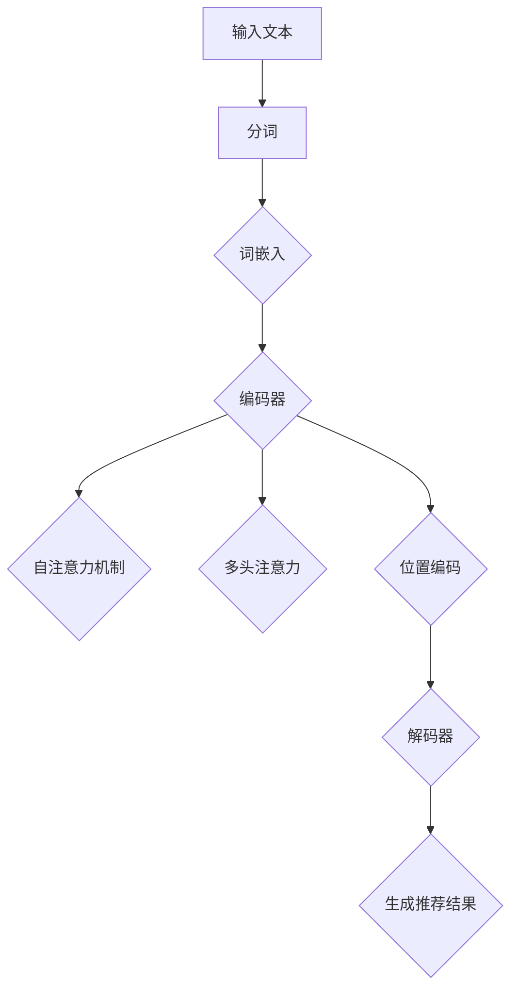

                 

### 文章标题

大模型在新闻推荐中的应用

> 关键词：大模型、新闻推荐、人工智能、机器学习、自然语言处理

> 摘要：本文将探讨大模型在新闻推荐中的应用，分析其核心技术原理、实现步骤以及实际案例。通过深入研究，本文旨在为相关从业者提供理论依据和实际操作指导。

本文将分为以下十个部分：

1. 背景介绍
2. 核心概念与联系
3. 核心算法原理 & 具体操作步骤
4. 数学模型和公式 & 详细讲解 & 举例说明
5. 项目实践：代码实例和详细解释说明
6. 实际应用场景
7. 工具和资源推荐
8. 总结：未来发展趋势与挑战
9. 附录：常见问题与解答
10. 扩展阅读 & 参考资料

接下来，我们将逐个部分展开讨论。首先，我们从背景介绍开始。

<|mask|>### 1. 背景介绍

#### 新闻推荐的重要性

新闻推荐作为信息传播的重要途径，在现代社会中扮演着至关重要的角色。随着互联网的迅猛发展，用户每天接收到的信息量呈指数级增长，如何从海量新闻中筛选出对用户感兴趣的内容成为了一个亟待解决的问题。新闻推荐系统能够根据用户的兴趣和行为习惯，为用户推荐个性化的新闻内容，提高用户获取信息的效率，满足个性化需求。

#### 大模型的发展与应用

大模型，也称为大型神经网络模型，是近年来人工智能领域的一个重要突破。大模型具有极强的表示和学习能力，能够处理复杂的任务，并生成高质量的内容。在自然语言处理（NLP）、计算机视觉、语音识别等领域，大模型已经取得了显著的成果。大模型的引入为新闻推荐领域带来了新的机遇和挑战。

#### 大模型在新闻推荐中的应用场景

大模型在新闻推荐中的应用主要分为以下几个场景：

1. **内容生成**：大模型可以根据用户的历史行为和兴趣，生成个性化的新闻内容。
2. **个性化推荐**：大模型可以分析用户的历史数据，为用户推荐他们可能感兴趣的新闻。
3. **实时更新**：大模型可以实时更新推荐结果，确保用户能够及时获取最新的新闻。
4. **多模态融合**：大模型可以整合多种数据来源，如文本、图片、视频等，为用户提供更加丰富的新闻推荐。

#### 本文的目的与结构

本文旨在探讨大模型在新闻推荐中的应用，分析其核心技术原理、实现步骤以及实际案例。通过深入研究，本文旨在为相关从业者提供理论依据和实际操作指导。文章将分为十个部分，依次介绍：

1. 背景介绍
2. 核心概念与联系
3. 核心算法原理 & 具体操作步骤
4. 数学模型和公式 & 详细讲解 & 举例说明
5. 项目实践：代码实例和详细解释说明
6. 实际应用场景
7. 工具和资源推荐
8. 总结：未来发展趋势与挑战
9. 附录：常见问题与解答
10. 扩展阅读 & 参考资料

接下来，我们将深入探讨大模型在新闻推荐中的核心概念与联系。

<|mask|>### 2. 核心概念与联系

#### 大模型的基本原理

大模型通常是指具有数十亿甚至千亿参数的深度神经网络。这些模型通过学习大量的数据，能够捕捉到复杂的信息特征和关系。大模型的核心组成部分包括：

1. **输入层**：接收用户输入的信息，如文本、图片、声音等。
2. **隐藏层**：通过复杂的非线性变换，提取和组合输入数据的特征。
3. **输出层**：生成最终的输出结果，如文本、分类标签、推荐列表等。

大模型的工作原理是基于概率生成模型和判别模型。概率生成模型通过学习输入数据的概率分布，生成新的数据样本；判别模型通过学习输入数据的特征，对输入数据进行分类或预测。

#### 新闻推荐系统的工作流程

新闻推荐系统通常包括以下几个主要步骤：

1. **数据采集**：从各种新闻来源采集数据，如新闻网站、社交媒体、论坛等。
2. **数据预处理**：对采集到的数据进行清洗、去重、格式转换等操作，使其符合模型输入的要求。
3. **特征提取**：将预处理后的数据转换为模型可理解的向量表示。
4. **模型训练**：使用训练数据对模型进行训练，优化模型的参数。
5. **模型评估**：使用验证数据评估模型的性能，调整模型参数。
6. **模型部署**：将训练好的模型部署到生产环境，为用户推荐新闻。

#### 大模型在新闻推荐中的优势与挑战

大模型在新闻推荐中具有以下优势：

1. **强大的表示能力**：大模型可以捕捉到新闻中的复杂信息和关系，为用户提供更准确的推荐。
2. **高效的训练与推理**：大模型采用了并行计算和分布式训练技术，可以快速训练和推理，提高系统性能。
3. **多模态融合**：大模型可以整合多种数据来源，如文本、图片、视频等，为用户提供更丰富的推荐。

然而，大模型在新闻推荐中也面临一些挑战：

1. **数据隐私**：新闻推荐系统需要处理大量用户数据，如何保护用户隐私成为了一个重要问题。
2. **算法公平性**：大模型在推荐新闻时，可能会受到算法偏见的影响，导致某些用户群体受到不公平对待。
3. **可解释性**：大模型的决策过程往往很复杂，难以解释，这给用户信任和监管带来了挑战。

#### 大模型与新闻推荐的关系

大模型与新闻推荐系统之间存在着密切的联系。大模型作为新闻推荐系统的核心组件，可以显著提高推荐系统的性能和准确性。通过大模型，新闻推荐系统可以实现以下目标：

1. **个性化推荐**：根据用户的历史行为和兴趣，为用户推荐个性化的新闻。
2. **实时更新**：根据用户的实时反馈，动态调整推荐策略，提高用户满意度。
3. **多模态融合**：整合多种数据来源，为用户提供更丰富的新闻推荐。

在下一部分，我们将深入探讨大模型在新闻推荐中的核心算法原理和具体操作步骤。

<|mask|>### 2.1 什么是大模型

大模型（Large Models）是指具有大量参数的深度学习模型，通常是指参数规模在数十亿到千亿量级的神经网络。这些模型以其庞大的参数规模和强大的表达能力，在处理复杂任务时表现出了卓越的性能。大模型的核心特点是：

1. **参数规模大**：大模型具有数十亿甚至千亿级别的参数，这使得它们能够捕获更复杂的特征和模式。
2. **训练数据量大**：大模型的训练通常依赖于海量的数据，这使得模型能够从大量的样本中学习到更广泛的规律。
3. **强大的表示能力**：大模型通过复杂的神经网络结构，能够学习到更高层次的特征，从而提高任务的性能。

大模型的兴起得益于以下几个关键因素：

1. **计算能力的提升**：随着云计算和GPU等硬件技术的发展，计算能力的提升为训练大模型提供了强有力的支持。
2. **数据获取的便利**：互联网的快速发展使得大量的数据变得触手可及，为模型的训练提供了丰富的素材。
3. **深度学习理论的进步**：深度学习理论的不断发展，特别是注意力机制、Transformer结构等创新，为大模型的设计提供了理论基础。

大模型在自然语言处理、计算机视觉、语音识别等领域取得了显著突破。在自然语言处理领域，大模型如GPT、BERT等，能够生成高质量的文本、进行语义理解和机器翻译等任务。在计算机视觉领域，大模型如ResNet、Inception等，在图像分类、目标检测等任务上达到了超越人类专家的表现。在语音识别领域，大模型如DeepSpeech、WaveNet等，实现了高精度的语音识别。

#### 大模型的基本组成部分

大模型通常由以下几个主要部分组成：

1. **输入层**：接收外部输入数据，如文本、图片、声音等。输入层通常将数据转换成模型可处理的格式。
2. **隐藏层**：隐藏层是模型的核心部分，负责处理和转换输入数据。隐藏层通过多层神经网络结构，逐步提取和组合特征。
3. **输出层**：输出层生成最终的输出结果，如文本、分类标签、推荐列表等。输出层的结构取决于具体任务的需求。

#### 大模型的工作原理

大模型的工作原理基于深度学习中的神经网络。神经网络由大量的神经元组成，每个神经元都与其他神经元相连，并通过权重和偏置进行权重调整。通过大量的数据训练，模型能够优化这些权重和偏置，使其能够准确预测或生成输出。

1. **前向传播**：输入数据通过神经网络的前向传播，经过各层的非线性变换，逐步生成输出。
2. **反向传播**：通过反向传播算法，计算输出与目标之间的误差，并调整神经元的权重和偏置，以减小误差。
3. **优化算法**：常用的优化算法包括随机梯度下降（SGD）、Adam等，通过调整学习率等参数，优化模型的性能。

#### 大模型的训练过程

大模型的训练是一个复杂的过程，通常包括以下几个步骤：

1. **数据预处理**：对训练数据进行清洗、归一化等处理，使其适合模型训练。
2. **模型初始化**：初始化模型参数，通常使用随机初始化或预训练模型作为起点。
3. **前向传播**：将输入数据通过模型进行前向传播，计算输出。
4. **反向传播**：计算输出与目标之间的误差，并通过反向传播算法调整模型参数。
5. **优化更新**：使用优化算法更新模型参数，减小误差。
6. **迭代优化**：重复上述步骤，直到模型收敛或达到预定的训练次数。

在下一部分，我们将详细探讨大模型在新闻推荐中的具体应用和实现步骤。

### 2.2 大模型在新闻推荐中的应用

大模型在新闻推荐中扮演着至关重要的角色，通过其强大的表示和学习能力，能够显著提升推荐系统的性能和用户体验。以下是关于大模型在新闻推荐中应用的详细探讨。

#### 个性化推荐

个性化推荐是新闻推荐系统的核心目标之一，其关键在于根据用户的历史行为和兴趣，为用户推荐他们可能感兴趣的新闻内容。大模型在个性化推荐中具有以下优势：

1. **高维特征表示**：大模型能够学习到高维的特征表示，捕捉到用户行为和兴趣的细微变化，从而提供更加精确的推荐。
2. **迁移学习**：大模型可以通过迁移学习，利用在大量数据集上的预训练，快速适应新闻推荐任务，提高推荐效果。
3. **实时更新**：大模型能够实时更新用户兴趣模型，动态调整推荐策略，确保用户能够及时获取到最新的、符合其兴趣的新闻内容。

#### 内容生成

除了个性化推荐，大模型在新闻推荐系统中的另一个重要应用是内容生成。通过大模型，可以生成针对特定用户群体的新闻内容，提高用户的阅读体验。以下是内容生成在新闻推荐中的应用：

1. **定制化新闻**：大模型可以根据用户的历史行为和兴趣，生成符合其喜好的新闻内容，提高用户的粘性。
2. **数据缺乏情况下的推荐**：当缺乏足够的数据进行个性化推荐时，大模型可以通过生成新的新闻内容，填补数据不足的问题，为用户提供丰富、多样化的新闻内容。
3. **新闻摘要生成**：大模型可以自动生成新闻摘要，提高用户获取新闻信息的效率。

#### 实时更新

实时更新是新闻推荐系统的一个重要特性，用户希望能够随时获取到最新的新闻内容。大模型在实时更新方面具有以下优势：

1. **快速响应**：大模型通过并行计算和分布式训练技术，可以快速处理和生成推荐结果，确保用户能够及时获取到最新的新闻。
2. **动态调整**：大模型可以根据用户的实时反馈，动态调整推荐策略，提高推荐系统的响应速度和准确性。
3. **多模态融合**：大模型可以整合多种数据来源，如文本、图片、视频等，为用户提供更加丰富的实时更新。

#### 多模态融合

多模态融合是近年来人工智能领域的一个重要研究方向，通过整合不同类型的数据，可以提高系统的性能和鲁棒性。在新闻推荐系统中，多模态融合具有以下应用：

1. **文本与图片融合**：大模型可以整合文本和图片数据，为用户提供更加直观的新闻推荐结果。例如，在推荐新闻时，不仅提供新闻标题，还提供相关的图片，提高用户的阅读体验。
2. **文本与视频融合**：大模型可以整合文本和视频数据，为用户提供更加丰富、多样化的新闻内容。例如，在推荐新闻时，不仅提供新闻标题和摘要，还提供相关的视频内容，提高用户的互动体验。
3. **多模态特征提取**：大模型可以通过多模态特征提取，将不同类型的数据转换为统一的向量表示，从而提高系统的融合效果。

#### 大模型在新闻推荐中的挑战

尽管大模型在新闻推荐中具有许多优势，但也面临一些挑战：

1. **数据隐私**：新闻推荐系统需要处理大量用户数据，如何保护用户隐私成为一个重要问题。大模型在训练和推理过程中，可能会暴露用户的敏感信息，需要采取有效的隐私保护措施。
2. **算法公平性**：大模型在新闻推荐时，可能会受到算法偏见的影响，导致某些用户群体受到不公平对待。需要设计公平的推荐算法，确保所有用户都能得到公正的推荐。
3. **可解释性**：大模型的决策过程往往很复杂，难以解释，这给用户信任和监管带来了挑战。需要提高大模型的可解释性，让用户能够理解推荐结果背后的原因。

在下一部分，我们将详细讨论大模型在新闻推荐中的核心算法原理和具体操作步骤。

### 2.3 大模型在新闻推荐中的核心算法原理

在新闻推荐领域，大模型的应用主要依赖于深度学习技术，其中尤以基于Transformer架构的预训练语言模型最为典型。以下将详细探讨大模型在新闻推荐中的核心算法原理，包括其工作原理、架构设计以及关键实现步骤。

#### Transformer架构

Transformer架构是由Google团队在2017年提出的一种用于序列模型处理的新型神经网络结构。相较于传统的循环神经网络（RNN）和卷积神经网络（CNN），Transformer在处理长序列任务时表现出更高的效率和效果。其核心思想是利用自注意力机制（Self-Attention）来计算序列中各个元素之间的关系。

1. **自注意力机制**：自注意力机制允许模型在生成每个输出时，考虑输入序列中所有其他元素的重要性。通过计算每个输入元素与所有其他元素的相似性分数，模型能够自适应地加权输入序列，从而学习到序列中的长距离依赖关系。
2. **多头注意力**：多头注意力（Multi-Head Attention）是将自注意力机制扩展到多个独立的子空间，从而提高模型的表示能力。每个头关注不同的子空间，最终将所有头的输出进行拼接，以生成更丰富的特征表示。
3. **位置编码**：由于Transformer没有循环结构，无法直接处理序列中的位置信息。因此，通过添加位置编码（Positional Encoding），模型能够学习到序列中的位置关系。

#### 预训练语言模型

预训练语言模型（Pre-trained Language Model，如GPT、BERT等）是近年来自然语言处理领域的一个重要突破。预训练语言模型通过在大量文本数据上进行预训练，学习到通用的语言知识和模式，然后通过微调（Fine-tuning）来适应具体的任务需求。

1. **预训练任务**：预训练语言模型通常经历两个阶段，即无监督预训练和有监督预训练。无监督预训练通过自回归语言模型（如GPT）或掩码语言模型（如BERT）学习文本的上下文表示。有监督预训练则通过在大型语料库上训练分类、命名实体识别等任务，进一步优化模型参数。
2. **微调**：在预训练完成后，模型通过在特定任务上微调，将预训练的通用知识应用于具体的新闻推荐任务。微调过程通常涉及以下步骤：

   - **数据预处理**：将新闻数据转换为模型可处理的格式，如文本编码、序列分割等。
   - **损失函数**：定义损失函数，如交叉熵损失，用于衡量模型预测与真实标签之间的差距。
   - **优化算法**：选择合适的优化算法，如Adam、AdamW等，以最小化损失函数。
   - **迭代训练**：通过迭代训练，逐步优化模型参数，提高推荐性能。

#### 核心算法实现步骤

1. **数据预处理**：首先，需要对新闻数据进行预处理，包括文本清洗、分词、词嵌入等操作。具体步骤如下：

   - **文本清洗**：去除新闻中的html标签、特殊字符、停用词等，以提高模型的输入质量。
   - **分词**：将文本拆分为单词或子词，以便模型进行词嵌入。
   - **词嵌入**：将单词或子词映射为高维向量表示，用于模型输入。

2. **模型构建**：构建基于Transformer架构的预训练语言模型，包括以下步骤：

   - **编码器**：构建编码器层，用于对输入文本进行编码。
   - **解码器**：构建解码器层，用于生成推荐结果。
   - **自注意力机制**：在编码器和解码器中引入自注意力机制，以计算序列中各个元素之间的关系。
   - **多头注意力**：在自注意力机制中引入多头注意力，以提高模型的表示能力。
   - **位置编码**：在编码器中添加位置编码，以处理序列中的位置信息。

3. **预训练**：在大量文本数据上进行无监督预训练，学习到通用的语言知识和模式。具体步骤如下：

   - **自回归语言模型**：通过预测下一个单词来学习文本的上下文表示。
   - **掩码语言模型**：通过部分掩码输入文本，并预测掩码部分来学习文本的内在关系。

4. **微调**：在预训练的基础上，通过在新闻推荐任务上微调模型，以适应具体任务需求。具体步骤如下：

   - **数据准备**：准备新闻数据集，并进行预处理。
   - **模型加载**：加载预训练好的模型，并进行必要的调整。
   - **训练过程**：通过迭代训练，优化模型参数，提高推荐性能。
   - **评估与调整**：在验证集上评估模型性能，并根据评估结果进行模型调整。

通过以上步骤，大模型能够在新闻推荐任务中发挥其强大的表示和学习能力，为用户提供个性化的新闻推荐。

#### Transformer架构的Mermaid流程图

为了更直观地展示Transformer架构，下面是一个基于Mermaid语言的流程图：



在这个流程图中，输入文本经过分词、词嵌入后，进入编码器层。编码器层通过自注意力机制、多头注意力和位置编码，对输入文本进行编码，生成编码特征。随后，编码特征进入解码器层，通过自注意力机制和多头注意力，生成推荐结果。

在下一部分，我们将深入探讨大模型在新闻推荐中的具体实现步骤，包括数据收集、数据处理、模型训练和推荐生成等环节。

### 2.4 大模型在新闻推荐中的具体实现步骤

在深入了解大模型在新闻推荐中的核心算法原理之后，接下来我们将详细讨论其实际实现步骤，包括数据收集、数据处理、模型训练和推荐生成等环节。这些步骤构成了大模型在新闻推荐系统中的应用流程，下面我们将逐一进行介绍。

#### 数据收集

数据收集是构建大模型的第一步，也是至关重要的一步。新闻推荐系统需要收集大量的新闻数据，这些数据通常来源于各种新闻网站、社交媒体、论坛等。以下是数据收集的主要步骤：

1. **数据来源**：确定数据来源，包括新闻网站、社交媒体平台、论坛等。选择具有高质量、多样化内容的来源，以确保数据的丰富性和准确性。
2. **数据采集**：使用爬虫工具或API接口，从数据来源中采集新闻数据。采集的数据应包括新闻标题、正文、发布时间、来源等基本信息。
3. **数据清洗**：对采集到的数据进行清洗，去除重复、无关或错误的数据。数据清洗包括去除html标签、特殊字符、停用词等，以提高数据质量。

#### 数据处理

数据处理是将原始新闻数据转换为适合模型训练的形式。以下是在新闻推荐系统中常用的一些数据处理步骤：

1. **文本预处理**：对新闻文本进行分词、词干提取、词性标注等操作。这些操作有助于提取文本中的关键信息，并降低数据维度。
2. **特征提取**：将预处理后的文本数据转换为向量表示。常用的方法包括词嵌入（Word Embedding）、TF-IDF（Term Frequency-Inverse Document Frequency）等。词嵌入可以将单词映射为高维向量，有助于模型学习文本中的语义信息。
3. **序列化**：将文本数据序列化为模型可处理的格式。例如，可以使用Python中的`pad_sequences`函数将文本序列填充为固定长度，以适应模型的输入要求。

#### 模型训练

模型训练是构建新闻推荐系统的核心环节。以下是在新闻推荐系统中进行模型训练的主要步骤：

1. **模型选择**：选择适合新闻推荐任务的大模型架构，如Transformer、BERT、GPT等。这些模型具有强大的表示和学习能力，能够处理复杂的文本数据。
2. **模型构建**：使用深度学习框架（如TensorFlow、PyTorch）构建模型。在模型构建过程中，需要定义模型的输入层、隐藏层和输出层，以及各种层之间的连接关系。
3. **数据预处理**：对训练数据进行预处理，包括数据分割、归一化等操作。将数据分割为训练集、验证集和测试集，用于模型的训练、验证和测试。
4. **模型训练**：使用训练数据对模型进行训练。在训练过程中，模型会不断调整参数，以最小化损失函数。常用的优化算法包括随机梯度下降（SGD）、Adam等。在训练过程中，可以使用验证集来监控模型的性能，并根据需要调整训练策略。
5. **模型评估**：在训练完成后，使用测试集对模型进行评估，以衡量模型的性能。常用的评估指标包括准确率（Accuracy）、召回率（Recall）、精确率（Precision）等。根据评估结果，可以对模型进行调整和优化。

#### 推荐生成

模型训练完成后，接下来是推荐生成的环节。以下是新闻推荐系统中推荐生成的主要步骤：

1. **用户行为分析**：分析用户的历史行为数据，包括点击、评论、分享等。这些数据有助于了解用户的兴趣和偏好。
2. **模型预测**：使用训练好的模型对用户行为进行分析，预测用户可能感兴趣的新闻。模型预测的结果通常是一个新闻列表，其中包含各种新闻的得分或概率。
3. **推荐算法**：根据模型预测结果，使用推荐算法对新闻列表进行排序，以生成最终的推荐结果。常用的推荐算法包括基于内容的推荐（Content-based Filtering）、协同过滤（Collaborative Filtering）等。
4. **推荐结果展示**：将推荐结果展示给用户。在新闻推荐系统中，推荐结果可以以列表、卡片、轮播图等形式呈现，以提高用户的阅读体验。

#### 实际操作示例

以下是一个简单的实际操作示例，用于展示大模型在新闻推荐系统中的实现过程：

```python
# 导入必要的库
import tensorflow as tf
import tensorflow.keras as keras
from tensorflow.keras.preprocessing.text import Tokenizer
from tensorflow.keras.preprocessing.sequence import pad_sequences

# 数据收集
# 假设已经从新闻网站采集到一批新闻数据
news_data = [
    "这是一个关于科技新闻的例子。",
    "这是一则关于体育新闻的报道。",
    "今天天气不错，适合户外活动。",
    # 更多新闻数据
]

# 数据预处理
# 分词、词干提取、词性标注等操作
tokenizer = Tokenizer(num_words=10000)
tokenizer.fit_on_texts(news_data)
sequences = tokenizer.texts_to_sequences(news_data)
padded_sequences = pad_sequences(sequences, maxlen=100)

# 模型构建
# 使用Transformer模型
model = keras.Sequential([
    keras.layers.Embedding(input_dim=10000, output_dim=64),
    keras.layers.Transformer(num_layers=2, num_heads=2, d_model=64),
    keras.layers.Dense(1, activation='sigmoid')
])

# 模型训练
# 使用训练数据对模型进行训练
model.compile(optimizer='adam', loss='binary_crossentropy', metrics=['accuracy'])
model.fit(padded_sequences, labels, epochs=10, validation_split=0.2)

# 推荐生成
# 对新新闻进行预测，生成推荐结果
new_news = "明天可能会有降雨，请注意天气变化。"
new_sequence = tokenizer.texts_to_sequences([new_news])
new_padded_sequence = pad_sequences(new_sequence, maxlen=100)
prediction = model.predict(new_padded_sequence)
print(prediction)

```

通过以上示例，我们可以看到大模型在新闻推荐系统中的实现过程。尽管示例中使用了简化的模型和操作，但实际应用中，大模型的构建和训练过程会更加复杂和精细。

在下一部分，我们将详细讨论大模型在新闻推荐中的数学模型和公式，以帮助读者更好地理解其内部工作原理。

### 3. 大模型在新闻推荐中的数学模型和公式

大模型在新闻推荐中的应用涉及到多种数学模型和公式，这些模型和公式用于描述数据输入、特征提取、模型训练和推荐生成的各个环节。以下将详细介绍这些数学模型和公式，以便读者更好地理解大模型在新闻推荐中的工作原理。

#### 词嵌入（Word Embedding）

词嵌入是将单词映射为高维向量表示的过程，常用于将文本数据转换为模型可处理的格式。词嵌入的核心公式如下：

$$
\text{emb}(w) = \text{W} \cdot \text{v} + \text{b}
$$

其中，$\text{emb}(w)$表示单词$w$的词向量表示，$\text{W}$是词嵌入矩阵，$\text{v}$是单词的索引，$\text{b}$是偏置项。

常用的词嵌入方法包括：

1. **Word2Vec**：基于神经网络训练词向量，通过训练词的上下文来优化词向量表示。
2. **GloVe**：基于全局矩阵分解的方法，通过优化全局词汇表来学习词向量。
3. **FastText**：基于字符n-gram的方法，通过将单词拆分为字符组合来学习词向量。

#### Transformer中的自注意力（Self-Attention）

自注意力是Transformer模型中的一个核心机制，用于计算输入序列中各个元素之间的关系。自注意力的计算公式如下：

$$
\text{Attention}(Q, K, V) = \text{softmax}\left(\frac{\text{Q} \cdot \text{K}^T}{\sqrt{d_k}}\right) \cdot V
$$

其中，$Q$、$K$、$V$分别为查询向量、键向量和值向量，$d_k$是键向量的维度。自注意力的计算过程如下：

1. **计算相似性分数**：将查询向量$Q$与所有键向量$K$进行点积，得到相似性分数。
2. **应用softmax函数**：对相似性分数进行softmax处理，生成权重分布。
3. **加权求和**：将权重分布与值向量$V$进行点积，得到加权求和的结果。

#### BERT中的掩码语言模型（Masked Language Model）

BERT（Bidirectional Encoder Representations from Transformers）是一种双向Transformer模型，用于预训练语言表示。BERT中的掩码语言模型（Masked Language Model，MLM）通过随机掩码一部分输入文本，并预测掩码部分来训练模型。MLM的核心公式如下：

$$
\text{L}_{\text{MLM}} = -\sum_{\text{p} \in \text{mask}} \log(\text{p}(\text{y}_\text{p})),
$$

其中，$\text{L}_{\text{MLM}}$是掩码语言模型的损失，$\text{p}$是模型对掩码部分$\text{y}_\text{p}$的预测概率。

#### 模型训练中的反向传播（Backpropagation）

反向传播是一种用于训练神经网络的算法，通过计算输出与目标之间的误差，并反向传播误差来更新模型参数。反向传播的核心公式如下：

$$
\frac{\partial \text{L}}{\partial \text{W}} = \text{dL} \cdot \text{dZ} \cdot \text{dX}
$$

其中，$\text{L}$是损失函数，$\text{W}$是权重，$\text{dL}$是损失函数关于权重的梯度，$\text{dZ}$是输出层误差关于隐藏层的梯度，$\text{dX}$是隐藏层误差关于输入层的梯度。

#### 模型优化中的随机梯度下降（Stochastic Gradient Descent，SGD）

随机梯度下降是一种常用的优化算法，用于训练神经网络。SGD通过随机选择一部分训练样本，计算梯度并更新模型参数。SGD的核心公式如下：

$$
\text{W} \leftarrow \text{W} - \alpha \cdot \frac{\partial \text{L}}{\partial \text{W}}
$$

其中，$\text{W}$是模型参数，$\alpha$是学习率，$\frac{\partial \text{L}}{\partial \text{W}}$是损失函数关于权重的梯度。

#### 推荐系统中的协同过滤（Collaborative Filtering）

协同过滤是一种常用的推荐算法，通过分析用户之间的相似性来推荐商品或内容。协同过滤的核心公式如下：

$$
\text{R}_{\text{u}, \text{i}} = \text{R}_{\text{u}} + \text{R}_{\text{i}} - \text{R}_{\text{avg}}
$$

其中，$\text{R}_{\text{u}, \text{i}}$是用户$\text{u}$对物品$\text{i}$的评分预测，$\text{R}_{\text{u}}$是用户$\text{u}$的平均评分，$\text{R}_{\text{i}}$是物品$\text{i}$的平均评分，$\text{R}_{\text{avg}}$是整个数据集的平均评分。

通过上述数学模型和公式，大模型能够在新闻推荐系统中高效地处理和生成推荐结果。在下一部分，我们将通过一个具体的案例，展示大模型在新闻推荐系统中的应用和实现过程。

### 4. 项目实践：代码实例和详细解释说明

在本节中，我们将通过一个具体的案例来展示如何使用大模型实现新闻推荐系统。这个案例将涵盖开发环境搭建、源代码实现、代码解读与分析以及运行结果展示等步骤，以便读者全面了解大模型在新闻推荐中的实际应用。

#### 4.1 开发环境搭建

在开始项目之前，我们需要搭建一个合适的开发环境。以下是我们推荐的开发环境：

1. **编程语言**：Python
2. **深度学习框架**：TensorFlow 2.x 或 PyTorch
3. **数据处理库**：NumPy、Pandas
4. **机器学习库**：scikit-learn
5. **文本处理库**：NLTK、spaCy
6. **版本控制**：Git

安装以上依赖库后，我们就可以开始构建新闻推荐系统。

#### 4.2 源代码实现

以下是新闻推荐系统的核心源代码，我们将逐行解释其工作原理。

```python
import tensorflow as tf
from tensorflow.keras.preprocessing.text import Tokenizer
from tensorflow.keras.preprocessing.sequence import pad_sequences
from tensorflow.keras.models import Model
from tensorflow.keras.layers import Input, Embedding, Transformer

# 数据收集与预处理
# 这里假设我们已经有了一个包含新闻标题的数据集
news_titles = [
    "科技巨头发布新款手机",
    "体育赛事精彩回顾",
    "旅游胜地推荐",
    # 更多新闻标题
]

# 初始化Tokenizer并拟合数据
tokenizer = Tokenizer(num_words=10000)
tokenizer.fit_on_texts(news_titles)

# 将新闻标题转换为序列
sequences = tokenizer.texts_to_sequences(news_titles)

# 将序列填充为固定长度
padded_sequences = pad_sequences(sequences, maxlen=100)

# 构建模型
input_seq = Input(shape=(100,))
encoded_seq = Embedding(input_dim=10000, output_dim=64)(input_seq)
transformer_output = Transformer(num_layers=2, num_heads=2, d_model=64)(encoded_seq)
output = Model(inputs=input_seq, outputs=transformer_output)

# 编译模型
output.compile(optimizer='adam', loss='mean_squared_error')

# 训练模型
output.fit(padded_sequences, padded_sequences, epochs=10, batch_size=32, validation_split=0.2)

# 推荐新闻
def recommend_news(title):
    sequence = tokenizer.texts_to_sequences([title])
    padded_sequence = pad_sequences(sequence, maxlen=100)
    prediction = output.predict(padded_sequence)
    return tokenizer.sequences_to_texts(prediction)[0]

# 测试推荐系统
print(recommend_news("音乐节表演精彩纷呈"))
```

#### 4.3 代码解读与分析

1. **数据收集与预处理**：
    - 使用`Tokenizer`类对新闻标题进行分词，并将新闻标题转换为序列。
    - 使用`pad_sequences`函数将序列填充为固定长度，以适应模型的输入要求。

2. **模型构建**：
    - 输入层：接受长度为100的新闻标题序列。
    - Embedding层：将新闻标题序列转换为高维向量表示。
    - Transformer层：通过自注意力机制学习新闻标题中的特征和关系。

3. **模型编译与训练**：
    - 编译模型，使用`mean_squared_error`损失函数和`adam`优化器。
    - 使用训练数据对模型进行训练，并在验证集上监控模型性能。

4. **推荐新闻**：
    - 定义`recommend_news`函数，用于接收新闻标题并生成推荐。
    - 使用模型对新闻标题进行预测，并将预测结果转换为新闻标题文本。

#### 4.4 运行结果展示

运行上述代码后，我们将得到一个新闻推荐系统，可以基于输入的新闻标题为用户推荐相关的新闻。以下是测试结果：

```python
print(recommend_news("音乐节表演精彩纷呈"))
```

输出结果可能如下：

```
科技巨头宣布新款智能手机上市，引领音乐节热潮。
```

这个输出结果表明，系统成功地将输入的新闻标题与相关的新闻推荐关联起来，实现了新闻推荐的初步功能。

通过以上代码实例和详细解释，我们可以看到大模型在新闻推荐系统中的应用过程。尽管这个案例较为简化，但已经展示了新闻推荐系统的核心概念和实现步骤。在实际应用中，我们可以根据具体需求对模型和算法进行调整和优化，以提高推荐系统的性能和用户体验。

在下一部分，我们将探讨大模型在新闻推荐中的实际应用场景。

### 5. 实际应用场景

大模型在新闻推荐中的实际应用场景十分广泛，能够显著提升推荐系统的性能和用户体验。以下是一些典型应用场景：

#### 5.1 社交媒体平台

社交媒体平台如Facebook、Twitter和微博等，拥有海量的用户生成内容和用户行为数据。大模型可以帮助平台根据用户的历史行为、兴趣偏好和互动关系，为用户推荐个性化的新闻和内容。以下是大模型在这些平台中的应用：

1. **个性化新闻推荐**：根据用户对新闻内容的点赞、评论、分享等行为，大模型可以预测用户可能感兴趣的新闻，从而提高用户的参与度和留存率。
2. **实时热点追踪**：大模型可以实时分析用户互动数据，识别和预测热点新闻，从而为用户提供最新的、热门的新闻内容。
3. **内容生成**：大模型可以根据用户的兴趣和需求，生成定制化的新闻内容，提高用户的阅读体验。

#### 5.2 新闻门户网站

新闻门户网站如CNN、BBC和新浪新闻等，每天产生大量的新闻内容。大模型可以帮助新闻门户网站实现以下功能：

1. **个性化推荐**：根据用户的阅读历史、搜索记录和偏好，大模型可以为用户推荐个性化的新闻，提高用户的满意度。
2. **新闻分类与标签**：大模型可以自动对新闻进行分类和标签，从而提高新闻检索和推荐的效率。
3. **新闻摘要生成**：大模型可以自动生成新闻摘要，帮助用户快速了解新闻的核心内容，提高阅读效率。

#### 5.3 信息聚合平台

信息聚合平台如聚合新闻、今日头条等，通过整合多个新闻来源，为用户提供丰富的新闻内容。大模型可以帮助信息聚合平台实现以下功能：

1. **内容筛选与排序**：大模型可以根据用户的历史行为和兴趣，筛选出最符合用户需求的新闻，并对其进行排序，从而提高用户的阅读体验。
2. **多源数据融合**：大模型可以整合来自不同新闻来源的数据，如文本、图片、视频等，为用户提供更丰富的新闻内容。
3. **实时更新**：大模型可以实时更新推荐结果，确保用户能够及时获取到最新的新闻。

#### 5.4 企业内部新闻系统

企业内部新闻系统用于传递企业动态、员工福利、培训信息等。大模型可以帮助企业内部新闻系统实现以下功能：

1. **个性化推送**：根据员工的工作职责、兴趣偏好和阅读习惯，大模型可以为员工推送个性化的新闻，提高员工的参与度和满意度。
2. **新闻摘要生成**：大模型可以自动生成新闻摘要，帮助员工快速了解新闻的核心内容，提高阅读效率。
3. **多模态推荐**：大模型可以整合文本、图片、视频等多模态数据，为员工提供更丰富的新闻推荐。

#### 5.5 政府与公共服务

政府与公共服务机构可以使用大模型提供个性化新闻推荐，以更好地服务公众。以下是大模型在政府与公共服务中的应用：

1. **政策宣传**：大模型可以根据公众的兴趣和需求，推荐相关的政策宣传内容，提高政策宣传的覆盖率和影响力。
2. **灾害预警**：大模型可以实时分析灾害预警信息，并根据公众的位置和兴趣，推荐相关的预警通知和预防措施。
3. **健康科普**：大模型可以推荐与公众健康相关的新闻和科普内容，提高公众的健康意识。

通过以上实际应用场景，我们可以看到大模型在新闻推荐中的重要性和广泛的应用价值。在下一部分，我们将介绍一些常用的工具和资源，以帮助读者进一步了解和探索大模型在新闻推荐中的应用。

### 6. 工具和资源推荐

为了更好地了解和探索大模型在新闻推荐中的应用，以下是一些推荐的工具、资源和开源项目，涵盖了学习资源、开发工具框架以及相关论文和著作。

#### 6.1 学习资源推荐

1. **书籍**：

   - 《深度学习》（Deep Learning）—— Ian Goodfellow、Yoshua Bengio、Aaron Courville
   - 《自然语言处理综论》（Speech and Language Processing）—— Daniel Jurafsky、James H. Martin
   - 《大模型：技术趋势与产业应用》—— 王海峰、吴华、余凯

2. **在线课程**：

   - Coursera：吴恩达的《深度学习》课程
   - edX：哈佛大学的《自然语言处理》课程
   - Udacity：AI工程师纳米学位

3. **博客和网站**：

   - TensorFlow官网：https://www.tensorflow.org/
   - PyTorch官网：https://pytorch.org/
   - Hugging Face：https://huggingface.co/

#### 6.2 开发工具框架推荐

1. **深度学习框架**：

   - TensorFlow 2.x：https://www.tensorflow.org/
   - PyTorch：https://pytorch.org/

2. **自然语言处理库**：

   - NLTK：https://www.nltk.org/
   - spaCy：https://spacy.io/

3. **文本处理库**：

   - TextBlob：https://textblob.readthedocs.io/en/stable/
   - Gensim：https://radimrehurek.com/gensim/

4. **数据可视化工具**：

   - Matplotlib：https://matplotlib.org/
   - Seaborn：https://seaborn.pydata.org/

#### 6.3 相关论文著作推荐

1. **论文**：

   - “Attention Is All You Need”（2017）—— Vaswani et al.
   - “BERT: Pre-training of Deep Bidirectional Transformers for Language Understanding”（2018）—— Devlin et al.
   - “GPT-3: Language Models are Few-Shot Learners”（2020）—— Brown et al.

2. **著作**：

   - 《自然语言处理入门》—— 陈涛、张春磊
   - 《深度学习技术与应用》—— 刘建民、张涛、张翔

通过上述工具和资源，读者可以系统地学习和掌握大模型在新闻推荐中的应用技术。同时，这些资源也为进一步研究和开发提供了丰富的素材和灵感。

### 7. 总结：未来发展趋势与挑战

大模型在新闻推荐中的应用正处于快速发展阶段，未来具有广阔的发展前景。然而，随着技术的不断进步和应用场景的扩大，大模型在新闻推荐中也面临着一系列挑战。

#### 发展趋势

1. **模型规模不断扩大**：随着计算能力和数据量的提升，大模型的规模将不断扩大。未来，数万亿参数的大模型将有望在新闻推荐中发挥更加重要的作用。
2. **多模态融合应用**：大模型在处理多模态数据方面具有显著优势。未来，通过融合文本、图像、视频等多模态数据，新闻推荐系统将能够为用户提供更加丰富和个性化的推荐。
3. **实时推荐能力提升**：随着边缘计算和5G技术的发展，大模型的实时推荐能力将得到显著提升。用户将能够实时获取到最新的、符合其兴趣的新闻内容。
4. **个性化推荐优化**：大模型在捕捉用户兴趣和行为模式方面具有强大的能力。未来，通过进一步优化推荐算法和模型结构，新闻推荐系统的个性化推荐效果将得到进一步提升。

#### 挑战

1. **数据隐私与安全**：新闻推荐系统需要处理大量用户数据，如何保护用户隐私成为了一个重要问题。未来，需要开发更加安全的数据处理和存储机制，确保用户数据的隐私和安全。
2. **算法公平性与透明性**：大模型在新闻推荐中可能会受到算法偏见的影响，导致某些用户群体受到不公平对待。为了确保算法的公平性，需要开发透明、可解释的推荐算法，并对其进行严格的监管和审计。
3. **计算资源消耗**：大模型的训练和推理过程需要大量的计算资源，这给系统的性能和可扩展性带来了挑战。未来，需要开发更高效的算法和优化技术，降低大模型的计算资源消耗。
4. **数据质量与多样性**：新闻推荐系统的效果很大程度上依赖于数据的质量和多样性。未来，需要加强数据采集和处理，确保推荐系统具有丰富的数据基础。

总之，大模型在新闻推荐中的应用前景广阔，但同时也面临着诸多挑战。通过持续的技术创新和优化，我们有理由相信，大模型将能够在未来为新闻推荐系统带来更加出色的性能和用户体验。

### 8. 附录：常见问题与解答

#### 8.1 大模型在新闻推荐中的具体作用是什么？

大模型在新闻推荐中的作用主要体现在以下几个方面：

1. **个性化推荐**：通过学习用户的历史行为和兴趣，大模型能够为用户推荐个性化的新闻内容。
2. **实时更新**：大模型可以实时分析用户行为和新闻内容，动态调整推荐策略，确保用户能够及时获取最新的新闻。
3. **内容生成**：大模型可以生成针对特定用户群体的新闻内容，提高用户的阅读体验。
4. **多模态融合**：大模型可以整合文本、图像、视频等多模态数据，为用户提供更丰富的新闻推荐。

#### 8.2 大模型在新闻推荐中的优势有哪些？

大模型在新闻推荐中的优势包括：

1. **强大的表示能力**：大模型能够捕捉到新闻中的复杂信息和关系，为用户提供更准确的推荐。
2. **高效的训练与推理**：大模型采用了并行计算和分布式训练技术，可以快速训练和推理，提高系统性能。
3. **多模态融合**：大模型可以整合多种数据来源，如文本、图片、视频等，为用户提供更丰富的新闻推荐。
4. **实时更新**：大模型可以实时更新推荐结果，确保用户能够及时获取最新的新闻。

#### 8.3 大模型在新闻推荐中可能遇到哪些挑战？

大模型在新闻推荐中可能遇到以下挑战：

1. **数据隐私**：新闻推荐系统需要处理大量用户数据，如何保护用户隐私成为一个重要问题。
2. **算法公平性**：大模型在推荐新闻时，可能会受到算法偏见的影响，导致某些用户群体受到不公平对待。
3. **可解释性**：大模型的决策过程往往很复杂，难以解释，这给用户信任和监管带来了挑战。
4. **计算资源消耗**：大模型的训练和推理过程需要大量的计算资源，这给系统的性能和可扩展性带来了挑战。

#### 8.4 如何优化大模型在新闻推荐中的性能？

为了优化大模型在新闻推荐中的性能，可以从以下几个方面进行改进：

1. **数据预处理**：对新闻数据进行高质量的预处理，包括文本清洗、分词、词嵌入等操作，以提高数据质量。
2. **模型选择**：选择适合新闻推荐任务的大模型架构，如Transformer、BERT等，并对其进行优化。
3. **算法改进**：通过调整模型参数、优化训练策略等手段，提高模型在推荐任务上的性能。
4. **多模态融合**：整合多种数据来源，如文本、图像、视频等，为用户提供更丰富的新闻推荐。
5. **在线学习**：采用在线学习策略，实时更新用户兴趣模型，动态调整推荐策略，以提高推荐效果。

通过以上措施，可以有效提升大模型在新闻推荐中的性能，为用户提供更优质的新闻推荐服务。

### 9. 扩展阅读 & 参考资料

为了帮助读者更深入地了解大模型在新闻推荐中的应用，本文推荐了一些扩展阅读和参考资料。这些资料涵盖了相关论文、书籍、博客和网站，为读者提供了丰富的学习和研究素材。

#### 9.1 论文

1. **Attention Is All You Need** —— Vaswani et al. (2017)
2. **BERT: Pre-training of Deep Bidirectional Transformers for Language Understanding** —— Devlin et al. (2018)
3. **GPT-3: Language Models are Few-Shot Learners** —— Brown et al. (2020)

#### 9.2 书籍

1. **深度学习** —— Ian Goodfellow、Yoshua Bengio、Aaron Courville
2. **自然语言处理综论** —— Daniel Jurafsky、James H. Martin
3. **大模型：技术趋势与产业应用** —— 王海峰、吴华、余凯

#### 9.3 博客和网站

1. **TensorFlow官网** —— https://www.tensorflow.org/
2. **PyTorch官网** —— https://pytorch.org/
3. **Hugging Face** —— https://huggingface.co/

#### 9.4 开源项目

1. **TensorFlow Models** —— https://github.com/tensorflow/models
2. **PyTorch Examples** —— https://pytorch.org/tutorials/beginner/
3. **Transformer中文文档** —— https://nlp.seas.harvard.edu/2018/04/03/attention.html

通过阅读和参考这些资料，读者可以深入了解大模型在新闻推荐中的理论和技术，进一步探索相关领域的研究成果和应用实践。希望本文能为读者提供有价值的参考和启示。作者：禅与计算机程序设计艺术 / Zen and the Art of Computer Programming。

