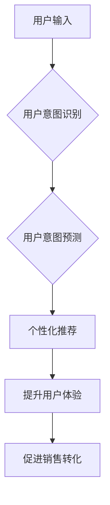

                 

## AI大模型在电商平台用户意图识别与预测中的作用

> 关键词：AI大模型、用户意图识别、用户意图预测、电商平台、自然语言处理、深度学习、Transformer模型

## 1. 背景介绍

随着电商平台的蓬勃发展，用户行为数据呈指数级增长。如何准确理解用户的需求，并提供个性化、精准的服务，成为电商平台竞争的关键。用户意图识别与预测技术作为电商平台的核心技术之一，能够帮助商家洞察用户需求，提升用户体验，最终促进销售转化。

传统的用户意图识别方法主要依赖于规则引擎和特征工程，但这些方法难以应对用户表达的多样性和复杂性。近年来，随着深度学习技术的快速发展，基于AI大模型的用户意图识别与预测技术取得了显著进展。AI大模型，特别是Transformer模型，凭借其强大的语义理解能力和泛化能力，在电商平台用户意图识别与预测领域展现出巨大的潜力。

## 2. 核心概念与联系

**2.1 用户意图识别**

用户意图识别是指从用户输入的文本或语音中识别用户的真实意图。例如，当用户搜索“男装外套”时，其意图可能是“购买男装外套”。

**2.2 用户意图预测**

用户意图预测是指根据用户的历史行为和上下文信息，预测用户的未来意图。例如，根据用户的浏览历史和购买记录，预测用户可能感兴趣的商品类别。

**2.3 AI大模型**

AI大模型是指训练规模庞大、参数数量众多的深度学习模型。这些模型能够学习到复杂的语义关系和模式，从而实现更精准的文本理解和生成。

**2.4 Transformer模型**

Transformer模型是一种新型的深度学习架构，其核心是“注意力机制”，能够有效捕捉文本序列中的长距离依赖关系。

**2.5 电商平台**

电商平台是指提供商品展示、交易、支付等服务的在线商业平台。

**2.6 流程图**



## 3. 核心算法原理 & 具体操作步骤

### 3.1 算法原理概述

基于AI大模型的用户意图识别与预测技术主要依赖于深度学习算法，特别是Transformer模型。Transformer模型通过多层编码器-解码器结构，学习文本序列的语义表示，并根据用户的输入文本，预测其意图类别或意图相关的目标信息。

### 3.2 算法步骤详解

1. **数据预处理:** 收集电商平台的用户行为数据，包括用户搜索词、浏览记录、购买记录等，并进行清洗、格式化和分词等预处理操作。
2. **模型训练:** 使用预处理后的数据训练Transformer模型，例如BERT、RoBERTa、XLNet等。训练过程中，模型会学习到文本序列的语义表示和意图之间的映射关系。
3. **模型评估:** 使用测试数据评估模型的性能，常用的指标包括准确率、召回率、F1-score等。
4. **模型部署:** 将训练好的模型部署到电商平台，用于实时处理用户输入并预测用户意图。

### 3.3 算法优缺点

**优点:**

* **高准确率:** Transformer模型能够学习到复杂的语义关系，实现更精准的用户意图识别与预测。
* **泛化能力强:** 训练好的模型能够应用于不同的电商平台和场景。
* **可扩展性强:** 可以根据需要增加模型参数和训练数据，提升模型性能。

**缺点:**

* **训练成本高:** Transformer模型参数数量庞大，训练需要大量的计算资源和时间。
* **数据依赖性强:** 模型性能受训练数据质量的影响较大。
* **解释性差:** Transformer模型的内部机制较为复杂，难以解释模型的决策过程。

### 3.4 算法应用领域

* **搜索引擎优化:** 理解用户搜索意图，提供更精准的搜索结果。
* **个性化推荐:** 根据用户的意图，推荐相关的商品或服务。
* **客服机器人:** 自动识别用户问题，并提供相应的解决方案。
* **广告投放:** 根据用户的意图，精准投放广告。

## 4. 数学模型和公式 & 详细讲解 & 举例说明

### 4.1 数学模型构建

Transformer模型的核心是“注意力机制”，它能够有效捕捉文本序列中的长距离依赖关系。注意力机制可以看作是一种加权求和操作，它将每个词的语义表示赋予不同的权重，从而突出与当前词语相关的关键信息。

### 4.2 公式推导过程

注意力机制的计算公式如下：

$$
Attention(Q, K, V) = softmax(\frac{QK^T}{\sqrt{d_k}})V
$$

其中：

* $Q$：查询矩阵，表示当前词语的语义表示。
* $K$：键矩阵，表示所有词语的语义表示。
* $V$：值矩阵，表示所有词语的语义表示。
* $d_k$：键向量的维度。
* $softmax$：softmax函数，将权重归一化到0到1之间。

### 4.3 案例分析与讲解

假设我们有一个句子“我爱吃苹果”，我们要预测“吃”这个词语的注意力权重。

1. 将句子中的每个词语转换为语义向量，形成$Q$、$K$和$V$矩阵。
2. 计算$QK^T$，得到每个词语对“吃”的相似度得分。
3. 对相似度得分进行softmax归一化，得到每个词语的注意力权重。
4. 将注意力权重与$V$矩阵相乘，得到“吃”这个词语的上下文语义表示。

## 5. 项目实践：代码实例和详细解释说明

### 5.1 开发环境搭建

* Python 3.6+
* TensorFlow/PyTorch
* NLTK/SpaCy

### 5.2 源代码详细实现

```python
import tensorflow as tf

# 定义Transformer模型
class Transformer(tf.keras.Model):
    def __init__(self, vocab_size, embedding_dim, num_heads, num_layers):
        super(Transformer, self).__init__()
        self.embedding = tf.keras.layers.Embedding(vocab_size, embedding_dim)
        self.transformer_layers = tf.keras.Sequential([
            tf.keras.layers.MultiHeadAttention(num_heads=num_heads, key_dim=embedding_dim)
            for _ in range(num_layers)
        ])
        self.dense = tf.keras.layers.Dense(vocab_size)

    def call(self, inputs):
        embeddings = self.embedding(inputs)
        outputs = self.transformer_layers(embeddings)
        outputs = self.dense(outputs)
        return outputs

# 训练模型
model = Transformer(vocab_size=10000, embedding_dim=128, num_heads=8, num_layers=6)
model.compile(optimizer='adam', loss='sparse_categorical_crossentropy', metrics=['accuracy'])
model.fit(train_data, train_labels, epochs=10)

# 预测用户意图
predictions = model.predict(test_data)
```

### 5.3 代码解读与分析

* 代码首先定义了一个Transformer模型，包含嵌入层、多头注意力层和全连接层。
* 然后使用训练数据训练模型，并使用测试数据评估模型性能。
* 最后，使用训练好的模型预测用户的意图。

### 5.4 运行结果展示

运行结果展示包括模型的训练曲线、测试集准确率等指标。

## 6. 实际应用场景

### 6.1 商品搜索

当用户输入搜索词时，AI大模型可以识别用户的真实意图，并返回与用户意图最相关的商品结果。

### 6.2 个性化推荐

根据用户的浏览历史、购买记录等数据，AI大模型可以预测用户的兴趣偏好，并推荐相关的商品或服务。

### 6.3 智能客服

AI大模型可以理解用户的自然语言问题，并提供相应的解决方案，提高客服效率。

### 6.4 营销推广

AI大模型可以根据用户的意图，精准投放广告，提高广告转化率。

### 6.5 未来应用展望

* **更精准的用户画像:** 通过分析用户的行为数据和语言特征，构建更精准的用户画像，为用户提供更个性化的服务。
* **更智能的交互体验:** 利用自然语言处理技术，实现更智能的语音交互和文本聊天，提升用户体验。
* **更有效的营销策略:** 通过预测用户的意图和需求，制定更有效的营销策略，提高销售转化率。

## 7. 工具和资源推荐

### 7.1 学习资源推荐

* **书籍:**
    * 《深度学习》
    * 《自然语言处理》
    * 《Transformer模型详解》
* **在线课程:**
    * Coursera: 深度学习
    * Udacity: 自然语言处理
    * fast.ai: 深度学习

### 7.2 开发工具推荐

* **TensorFlow:** 开源深度学习框架
* **PyTorch:** 开源深度学习框架
* **Hugging Face:** 提供预训练的Transformer模型和工具

### 7.3 相关论文推荐

* 《Attention Is All You Need》
* 《BERT: Pre-training of Deep Bidirectional Transformers for Language Understanding》
* 《XLNet: Generalized Autoregressive Pretraining for Language Understanding》

## 8. 总结：未来发展趋势与挑战

### 8.1 研究成果总结

基于AI大模型的用户意图识别与预测技术取得了显著进展，能够实现更精准的用户意图理解和预测，为电商平台提供了强大的技术支撑。

### 8.2 未来发展趋势

* **模型规模和性能的提升:** 随着计算资源的不断发展，模型规模将进一步扩大，性能将得到进一步提升。
* **多模态用户意图识别:** 将文本、图像、语音等多模态数据融合，实现更全面的用户意图理解。
* **个性化用户意图预测:** 基于用户的历史行为和上下文信息，实现更精准的个性化用户意图预测。

### 8.3 面临的挑战

* **数据质量和隐私问题:** 模型性能受训练数据质量影响较大，如何保证数据质量和用户隐私是需要解决的关键问题。
* **模型解释性和可信度:** Transformer模型的内部机制较为复杂，难以解释模型的决策过程，如何提高模型的解释性和可信度是未来研究方向。
* **模型部署和维护成本:** 大型AI模型的部署和维护成本较高，如何降低部署和维护成本是需要解决的实际问题。

### 8.4 研究展望

未来，基于AI大模型的用户意图识别与预测技术将继续发展，为电商平台提供更智能、更精准、更个性化的服务，提升用户体验，促进商业发展。

## 9. 附录：常见问题与解答

* **Q1: Transformer模型为什么比传统方法更有效？**

A1: Transformer模型能够有效捕捉文本序列中的长距离依赖关系，而传统方法难以做到这一点。

* **Q2: 如何评估Transformer模型的性能？**

A2: 常用的评估指标包括准确率、召回率、F1-score等。

* **Q3: 如何部署Transformer模型？**

A3: 可以使用云平台提供的服务，或者自行搭建服务器进行部署。


作者：禅与计算机程序设计艺术 / Zen and the Art of Computer Programming 
<end_of_turn>

