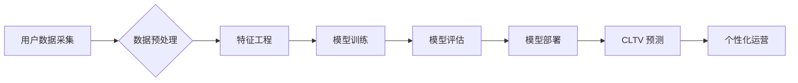

                 

## AI大模型在电商平台用户生命周期价值预测与管理中的作用

> 关键词：AI大模型、用户生命周期价值、预测模型、电商平台、客户关系管理

## 1. 背景介绍

在当今数据爆炸的时代，电商平台面临着日益激烈的竞争。用户获取成本不断上升，而用户留存率和复购率却成为衡量平台成功与否的关键指标。因此，准确预测用户生命周期价值 (CLTV) 成为电商平台运营和发展的重要战略。

用户生命周期价值是指用户在整个生命周期内为平台带来的总价值，包括购买金额、复购次数、推荐贡献等。传统的 CLTV 预测方法主要依赖于历史数据分析和规则引擎，但这些方法难以捕捉用户行为的复杂性和动态性。

近年来，随着深度学习技术的快速发展，AI 大模型在数据分析和预测领域展现出强大的潜力。其强大的学习能力和泛化能力能够更好地理解用户行为模式，从而实现更精准的 CLTV 预测。

## 2. 核心概念与联系

### 2.1 用户生命周期价值 (CLTV)

用户生命周期价值 (CLTV) 是指用户在整个生命周期内为平台带来的总价值。它是一个重要的商业指标，可以帮助电商平台：

* **精准用户画像：** 通过分析用户的 CLTV，可以更深入地了解用户的消费习惯、偏好和价值。
* **优化营销策略：** 根据用户的 CLTV，可以制定个性化的营销策略，提高营销效率和转化率。
* **提升用户留存率：** 通过针对不同 CLTV 用户群体的个性化服务，可以提高用户留存率和复购率。
* **提高资源配置效率：** 通过对用户进行分层管理，可以将资源集中投入到高价值用户的服务和运营中。

### 2.2 AI 大模型

AI 大模型是指在海量数据上训练的深度学习模型，具有强大的学习能力和泛化能力。常见的 AI 大模型包括：

* **Transformer 模型：** 擅长处理序列数据，例如文本和时间序列数据。
* **生成式对抗网络 (GAN)：** 能够生成逼真的数据，例如图像、文本和音频。
* **强化学习模型：** 可以通过与环境交互学习最优策略。

### 2.3 核心架构

AI 大模型在电商平台用户生命周期价值预测与管理中的应用架构如下：



## 3. 核心算法原理 & 具体操作步骤

### 3.1 算法原理概述

在电商平台用户生命周期价值预测中，常用的算法包括：

* **线性回归：** 是一种简单易懂的回归算法，可以用来预测用户未来的消费金额。
* **逻辑回归：** 是一种分类算法，可以用来预测用户是否会再次购买。
* **决策树：** 是一种树形结构的算法，可以用来根据用户的特征进行分类和预测。
* **支持向量机 (SVM)：** 是一种分类算法，可以用来识别用户不同的消费行为模式。
* **神经网络：** 是一种复杂的算法，可以学习用户行为的复杂关系，实现更精准的预测。

### 3.2 算法步骤详解

以神经网络为例，其具体操作步骤如下：

1. **数据采集：** 收集用户的历史购买数据、浏览记录、评价信息等。
2. **数据预处理：** 对数据进行清洗、转换和特征工程，例如将文本数据转换为数值数据。
3. **模型构建：** 选择合适的网络结构，例如多层感知机 (MLP) 或循环神经网络 (RNN)。
4. **模型训练：** 使用训练数据训练模型，调整模型参数，使模型能够准确预测用户 CLTV。
5. **模型评估：** 使用测试数据评估模型的性能，例如准确率、召回率和 F1 值。
6. **模型部署：** 将训练好的模型部署到线上环境，用于实时预测用户 CLTV。

### 3.3 算法优缺点

**神经网络算法**

* **优点：** 能够学习用户行为的复杂关系，实现更精准的预测。
* **缺点：** 训练数据量大，训练时间长，模型解释性差。

### 3.4 算法应用领域

* **用户分层：** 根据用户 CLTV 将用户进行分层管理，为不同层级的用户提供个性化的服务。
* **营销策略优化：** 根据用户 CLTV 优化营销策略，提高营销效率和转化率。
* **产品推荐：** 根据用户 CLTV 推送个性化的产品推荐，提高用户购买意愿。
* **客户关系管理：** 根据用户 CLTV 进行客户关系管理，提升用户满意度和忠诚度。

## 4. 数学模型和公式 & 详细讲解 & 举例说明

### 4.1 数学模型构建

用户生命周期价值 (CLTV) 的数学模型可以表示为：

$$CLTV = \sum_{t=1}^{T} \frac{R_t}{(1+r)^t}$$

其中：

* $R_t$ 是用户在第 $t$ 个时间段的净收入。
* $r$ 是用户生命周期价值的贴现率。
* $T$ 是用户生命周期的总时间段。

### 4.2 公式推导过程

该公式基于以下假设：

* 用户的未来收入是可预测的。
* 用户的收入会随着时间推移而递减。
* 货币价值随着时间的推移而贬值。

### 4.3 案例分析与讲解

假设一个电商平台的用户在第一个月购买了 100 元商品，第二个月购买了 50 元商品，第三个月购买了 20 元商品。用户生命周期价值的贴现率为 0.1，则该用户的 CLTV 为：

$$CLTV = \frac{100}{(1+0.1)^1} + \frac{50}{(1+0.1)^2} + \frac{20}{(1+0.1)^3} \approx 145.45$$

## 5. 项目实践：代码实例和详细解释说明

### 5.1 开发环境搭建

* Python 3.7+
* TensorFlow 或 PyTorch
* Jupyter Notebook

### 5.2 源代码详细实现

```python
import tensorflow as tf

# 定义神经网络模型
model = tf.keras.models.Sequential([
    tf.keras.layers.Dense(64, activation='relu', input_shape=(num_features,)),
    tf.keras.layers.Dense(32, activation='relu'),
    tf.keras.layers.Dense(1)
])

# 编译模型
model.compile(optimizer='adam', loss='mse')

# 训练模型
model.fit(X_train, y_train, epochs=10, batch_size=32)

# 评估模型
loss = model.evaluate(X_test, y_test)
print('Loss:', loss)

# 预测用户 CLTV
predictions = model.predict(new_user_data)
print('Predictions:', predictions)
```

### 5.3 代码解读与分析

* 该代码示例使用 TensorFlow 库构建了一个简单的多层感知机 (MLP) 模型。
* 模型输入为用户的特征向量，输出为用户的 CLTV 预测值。
* 模型使用 Adam 优化器和均方误差 (MSE) 损失函数进行训练。
* 训练完成后，可以使用测试数据评估模型的性能。
* 最后，可以使用训练好的模型预测新用户的 CLTV。

### 5.4 运行结果展示

运行结果将显示模型的训练损失和测试损失，以及对新用户数据的 CLTV 预测值。

## 6. 实际应用场景

### 6.1 用户分层

根据用户的 CLTV，电商平台可以将用户进行分层管理，例如：

* **VIP 用户：** CLTV 高的用户，享受优先服务、专属优惠和个性化推荐。
* **普通用户：** CLTV 中等的的用户，享受标准服务和常规优惠。
* **潜在用户：** CLTV 低的用户，需要通过营销活动和个性化推荐进行引导。

### 6.2 营销策略优化

根据用户的 CLTV，电商平台可以优化营销策略，例如：

* **精准推送：** 将广告和促销活动精准推送给高价值用户，提高营销效率。
* **个性化推荐：** 根据用户的消费习惯和偏好，推荐个性化的产品和服务，提高用户购买意愿。
* **会员体系：** 建立会员体系，根据用户的 CLTV 提供不同的会员等级和权益，提高用户粘性。

### 6.3 产品开发

根据用户的 CLTV，电商平台可以了解用户需求，开发更符合用户需求的产品和服务。

### 6.4 未来应用展望

随着 AI 技术的不断发展，AI 大模型在电商平台用户生命周期价值预测与管理中的应用将更加广泛和深入，例如：

* **更精准的预测：** 利用更先进的 AI 算法和更丰富的用户数据，实现更精准的 CLTV 预测。
* **更个性化的服务：** 根据用户的 CLTV 和其他个性化信息，提供更个性化的服务和体验。
* **更智能的运营：** 利用 AI 算法自动进行用户分层、营销策略优化和产品开发，提高运营效率。

## 7. 工具和资源推荐

### 7.1 学习资源推荐

* **书籍：**
    * 《深度学习》 - Ian Goodfellow, Yoshua Bengio, Aaron Courville
    * 《机器学习》 - Tom Mitchell
* **在线课程：**
    * Coursera: 深度学习 Specialization
    * Udacity: AI Programming with Python Nanodegree

### 7.2 开发工具推荐

* **Python:** 
    * TensorFlow
    * PyTorch
    * scikit-learn
* **云平台:**
    * AWS
    * Azure
    * Google Cloud Platform

### 7.3 相关论文推荐

* **《Recurrent Neural Networks for Sequence Modeling》** - Hochreiter, S., & Schmidhuber, J. (1997)
* **《Attention Is All You Need》** - Vaswani, A., Shazeer, N., Parmar, N., Uszkoreit, J., Jones, L., Gomez, A. N., ... & Polosukhin, I. (2017)

## 8. 总结：未来发展趋势与挑战

### 8.1 研究成果总结

AI 大模型在电商平台用户生命周期价值预测与管理领域取得了显著成果，能够实现更精准的预测和更个性化的服务。

### 8.2 未来发展趋势

* **模型复杂度提升：** 利用更复杂的 AI 算法和更丰富的用户数据，实现更精准的 CLTV 预测。
* **跨平台数据融合：** 将来自不同平台的用户数据进行融合，构建更全面的用户画像。
* **实时预测与动态调整：** 实现实时用户行为分析和 CLTV 预测，动态调整营销策略和服务方案。

### 8.3 面临的挑战

* **数据质量和隐私保护：** 确保用户数据的质量和隐私安全。
* **模型解释性和可信度：** 提高 AI 模型的解释性和可信度，增强用户对预测结果的信任。
* **算法公平性和可控性：** 避免算法产生偏见和歧视，确保算法的公平性和可控性。

### 8.4 研究展望

未来，AI 大模型在电商平台用户生命周期价值预测与管理领域将继续发挥重要作用，并与其他技术融合发展，例如：

* **自然语言处理 (NLP)：** 利用 NLP 技术分析用户文本数据，更深入地理解用户的需求和意图。
* **计算机视觉 (CV)：** 利用 CV 技术分析用户画像和行为视频，更全面地了解用户的消费习惯。
* **增强现实 (AR) 和虚拟现实 (VR)：** 利用 AR 和 VR 技术为用户提供更沉浸式的购物体验，提高用户粘性和转化率。


## 9. 附录：常见问题与解答

**Q1：如何选择合适的 AI 大模型？**

**A1：** 选择合适的 AI 大模型需要根据具体业务需求和数据特点进行评估。例如，对于文本数据，Transformer 模型效果较好；对于时间序列数据，RNN 模型效果较好。

**Q2：如何处理用户数据中的缺失值？**

**A2：** 可以使用多种方法处理用户数据中的缺失值，例如：

* **删除缺失值：** 如果缺失值较少，可以删除缺失值的行或列。
* **填充缺失值：** 使用平均值、中位数或其他统计方法填充缺失值。
* **使用机器学习算法进行预测：** 利用机器学习算法预测缺失值。

**Q3：如何评估 AI 模型的性能？**

**A3：** 可以使用多种指标评估 AI 模型的性能，例如：

* **准确率：** 模型正确预测的样本数占总样本数的比例。
* **召回率：** 模型预测出的正样本数占实际正样本数的比例。
* **F1 值：** 准确率和召回率的调和平均数。

**Q4：如何确保 AI 模型的公平性和可控性？**

**A4：** 可以采取以下措施确保 AI 模型的公平性和可控性：

* **使用公平性评估指标：** 评估模型是否对不同用户群体产生偏见。
* **进行模型解释性分析：** 了解模型的决策过程，识别潜在的偏见来源。
* **建立模型监控机制：** 定期监控模型的性能和公平性，及时进行调整和优化。


作者：禅与计算机程序设计艺术 / Zen and the Art of Computer Programming<end_of_turn>

