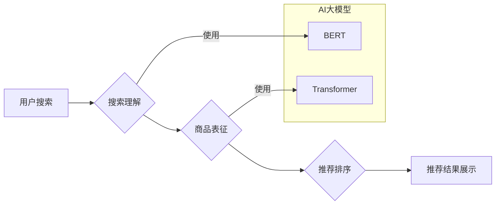

                 

## AI大模型赋能电商搜索推荐的业务创新思维训练课程优化方案

> 关键词：AI大模型、电商搜索、推荐系统、业务创新、深度学习、自然语言处理

### 1. 背景介绍

电子商务行业竞争日益激烈，用户需求日益多元化，如何提升用户体验、提高转化率成为电商平台面临的重大挑战。搜索推荐系统作为电商平台的核心功能之一，直接影响着用户购物决策，其优化升级至关重要。

传统电商搜索推荐系统主要依赖于基于规则的算法和协同过滤算法，这些算法在一定程度上能够满足用户需求，但存在以下局限性：

* **缺乏个性化：** 基于规则的算法难以捕捉用户细微的个性化需求，协同过滤算法受冷启动问题和数据稀疏性影响较大。
* **难以处理语义信息：** 传统算法难以理解用户搜索意图背后的语义信息，导致推荐结果不精准。
* **更新迭代成本高：** 基于规则的算法需要人工维护和更新，效率低下。

近年来，随着深度学习技术的快速发展，AI大模型的出现为电商搜索推荐带来了新的机遇。AI大模型具备强大的语义理解能力、泛化能力和学习能力，能够有效解决传统算法的局限性，为电商平台带来更精准、个性化的搜索推荐体验。

### 2. 核心概念与联系

**2.1 AI大模型概述**

AI大模型是指在海量数据上训练的深度学习模型，其参数规模巨大，具备强大的泛化能力和学习能力。常见的AI大模型包括BERT、GPT、T5等。

**2.2 电商搜索推荐系统概述**

电商搜索推荐系统旨在根据用户的搜索行为、浏览历史、购买记录等信息，推荐用户感兴趣的商品。

**2.3 AI大模型赋能电商搜索推荐系统**

AI大模型可以应用于电商搜索推荐系统的各个环节，例如：

* **搜索理解：** 利用BERT等模型对用户搜索词进行语义分析，理解用户真实意图。
* **商品表征：** 利用Transformer等模型对商品信息进行表征，提取商品的语义特征。
* **推荐排序：** 利用深度学习模型对用户和商品进行匹配，并根据用户偏好进行排序。
* **个性化推荐：** 利用用户行为数据训练个性化推荐模型，为每个用户提供个性化的商品推荐。

**2.4 架构图**



### 3. 核心算法原理 & 具体操作步骤

**3.1 算法原理概述**

本文将介绍基于Transformer的电商搜索推荐算法，该算法利用Transformer的注意力机制和编码-解码结构，能够有效捕捉用户搜索意图和商品语义信息，实现精准的商品推荐。

**3.2 算法步骤详解**

1. **数据预处理:** 将用户搜索词、商品信息等数据进行清洗、格式化和向量化处理。
2. **用户搜索词编码:** 利用BERT模型对用户搜索词进行编码，得到用户搜索意图的向量表示。
3. **商品信息编码:** 利用Transformer模型对商品信息进行编码，得到商品语义特征的向量表示。
4. **注意力机制:** 利用注意力机制计算用户搜索词和商品信息之间的相关性，突出用户感兴趣的商品信息。
5. **推荐排序:** 利用深度学习模型对用户搜索词、商品信息和注意力权重进行融合，并进行排序，得到推荐结果。
6. **结果展示:** 将排序后的商品信息展示给用户。

**3.3 算法优缺点**

* **优点:**

    * 能够有效捕捉用户搜索意图和商品语义信息。
    * 推荐结果更加精准和个性化。
    * 算法具有良好的泛化能力，能够适应不同的电商场景。

* **缺点:**

    * 训练成本较高，需要大量的计算资源和数据。
    * 模型复杂度较高，需要专业的技术人员进行开发和维护。

**3.4 算法应用领域**

* 电商搜索推荐
* 内容推荐
* 个性化广告推荐
* 智能客服

### 4. 数学模型和公式 & 详细讲解 & 举例说明

**4.1 数学模型构建**

假设用户搜索词为 $q$, 商品信息为 $d$, 推荐结果为 $r$. 

推荐模型的目标是最大化用户点击商品的概率，即：

$$
P(r|q,d)
$$

**4.2 公式推导过程**

利用Transformer模型，可以将用户搜索词 $q$ 和商品信息 $d$ 编码为向量表示 $q_e$ 和 $d_e$。

$$
q_e = BERT(q)
$$

$$
d_e = Transformer(d)
$$

然后，利用注意力机制计算 $q_e$ 和 $d_e$ 之间的相关性，得到注意力权重 $a$.

$$
a = Attention(q_e, d_e)
$$

最后，将注意力权重 $a$ 与 $d_e$ 进行加权求和，得到最终的推荐结果 $r$.

$$
r = \sum_{i} a_i * d_{e,i}
$$

**4.3 案例分析与讲解**

假设用户搜索词为 "运动鞋", 商品信息包括商品名称、品牌、价格、颜色等。

Transformer模型可以将 "运动鞋" 编码为一个向量表示，并对每个商品信息进行编码，得到商品的语义特征向量。

注意力机制可以计算 "运动鞋" 和每个商品信息之间的相关性，例如，对于 "耐克" 品牌的运动鞋，注意力权重会更高。

最终，推荐结果 $r$ 将会是那些与 "运动鞋" 相关性最高的商品信息，例如，"耐克" 品牌的运动鞋，价格在 500 元左右，颜色为黑色。

### 5. 项目实践：代码实例和详细解释说明

**5.1 开发环境搭建**

* Python 3.7+
* TensorFlow 2.0+
* PyTorch 1.0+
* CUDA 10.0+

**5.2 源代码详细实现**

```python
import tensorflow as tf

# 定义Transformer模型
class Transformer(tf.keras.Model):
    def __init__(self, vocab_size, embedding_dim, num_heads, num_layers):
        super(Transformer, self).__init__()
        self.embedding = tf.keras.layers.Embedding(vocab_size, embedding_dim)
        self.transformer_layers = tf.keras.layers.StackedRNNCells([tf.keras.layers.MultiHeadAttention(num_heads=num_heads, key_dim=embedding_dim) for _ in range(num_layers)])

    def call(self, inputs):
        embedded_inputs = self.embedding(inputs)
        outputs = self.transformer_layers(embedded_inputs)
        return outputs

# 定义推荐模型
class RecommenderModel(tf.keras.Model):
    def __init__(self, embedding_dim, num_heads, num_layers):
        super(RecommenderModel, self).__init__()
        self.transformer = Transformer(vocab_size=vocab_size, embedding_dim=embedding_dim, num_heads=num_heads, num_layers=num_layers)
        self.dense = tf.keras.layers.Dense(units=num_classes)

    def call(self, user_query, item_features):
        user_query_embedding = self.transformer(user_query)
        item_features_embedding = self.transformer(item_features)
        attention_weights = tf.keras.layers.Dot(axes=1)([user_query_embedding, item_features_embedding])
        weighted_item_features = tf.keras.layers.Multiply()([attention_weights, item_features_embedding])
        output = self.dense(weighted_item_features)
        return output

# 训练模型
model = RecommenderModel(embedding_dim=128, num_heads=8, num_layers=4)
model.compile(optimizer='adam', loss='categorical_crossentropy', metrics=['accuracy'])
model.fit(user_query_data, item_labels, epochs=10)

```

**5.3 代码解读与分析**

* 代码首先定义了Transformer模型和推荐模型。
* Transformer模型用于对用户搜索词和商品信息进行编码。
* 推荐模型利用Transformer模型的输出和商品特征进行融合，并进行分类，得到推荐结果。
* 代码最后展示了模型训练的步骤。

**5.4 运行结果展示**

训练完成后，可以将模型应用于实际场景，并评估模型的性能。

### 6. 实际应用场景

**6.1 电商搜索推荐**

AI大模型可以用于电商平台的搜索推荐系统，提高用户搜索体验和转化率。例如，可以利用AI大模型理解用户搜索意图，推荐更精准的商品。

**6.2 个性化广告推荐**

AI大模型可以根据用户的兴趣爱好和行为数据，进行个性化的广告推荐，提高广告点击率和转化率。

**6.3 内容推荐**

AI大模型可以用于推荐新闻、视频、文章等内容，根据用户的阅读习惯和偏好，提供更个性化的内容推荐。

**6.4 未来应用展望**

随着AI大模型技术的不断发展，其在电商搜索推荐领域的应用场景将更加广泛，例如：

* **多模态推荐:** 利用图像、视频等多模态数据进行商品推荐。
* **实时推荐:** 基于用户的实时行为数据，进行动态的商品推荐。
* **跨平台推荐:** 将用户行为数据整合，实现跨平台的个性化推荐。

### 7. 工具和资源推荐

**7.1 学习资源推荐**

* **书籍:**

    * 《深度学习》
    * 《自然语言处理》
    * 《Transformer模型详解》

* **在线课程:**

    * Coursera: 深度学习
    * Udacity: 自然语言处理
    * fast.ai: 深度学习

**7.2 开发工具推荐**

* **TensorFlow:** 开源深度学习框架
* **PyTorch:** 开源深度学习框架
* **HuggingFace:** 提供预训练的AI大模型和工具

**7.3 相关论文推荐**

* 《Attention Is All You Need》
* 《BERT: Pre-training of Deep Bidirectional Transformers for Language Understanding》
* 《T5: Text-to-Text Transfer Transformer》

### 8. 总结：未来发展趋势与挑战

**8.1 研究成果总结**

AI大模型在电商搜索推荐领域取得了显著的成果，能够有效提升用户体验和转化率。

**8.2 未来发展趋势**

* **模型规模和性能的提升:** 未来AI大模型的规模和性能将会进一步提升，能够处理更复杂的任务。
* **多模态融合:** AI大模型将与其他模态数据融合，实现更精准的商品推荐。
* **个性化推荐的增强:** AI大模型将更加深入地理解用户的需求，提供更个性化的推荐。

**8.3 面临的挑战**

* **数据隐私和安全:** AI大模型的训练需要大量的用户数据，如何保护用户隐私和数据安全是一个重要的挑战。
* **模型解释性和可信度:** AI大模型的决策过程往往是复杂的，如何提高模型的解释性和可信度是一个重要的研究方向。
* **模型部署和维护成本:** AI大模型的部署和维护成本较高，需要专业的技术人员进行管理。

**8.4 研究展望**

未来，AI大模型在电商搜索推荐领域将继续发挥重要作用，并带来更多创新应用。

### 9. 附录：常见问题与解答

**9.1 如何选择合适的AI大模型？**

选择合适的AI大模型需要根据具体的应用场景和数据特点进行选择。例如，对于文本分类任务，BERT模型是一个不错的选择；对于图像识别任务，ResNet模型是一个不错的选择。

**9.2 如何训练AI大模型？**

训练AI大模型需要大量的计算资源和数据。可以使用云计算平台进行训练，例如Google Cloud Platform、Amazon Web Services、Microsoft Azure等。

**9.3 如何评估AI大模型的性能？**

可以使用准确率、召回率、F1-score等指标评估AI大模型的性能。

作者：禅与计算机程序设计艺术 / Zen and the Art of Computer Programming 


<end_of_turn>

