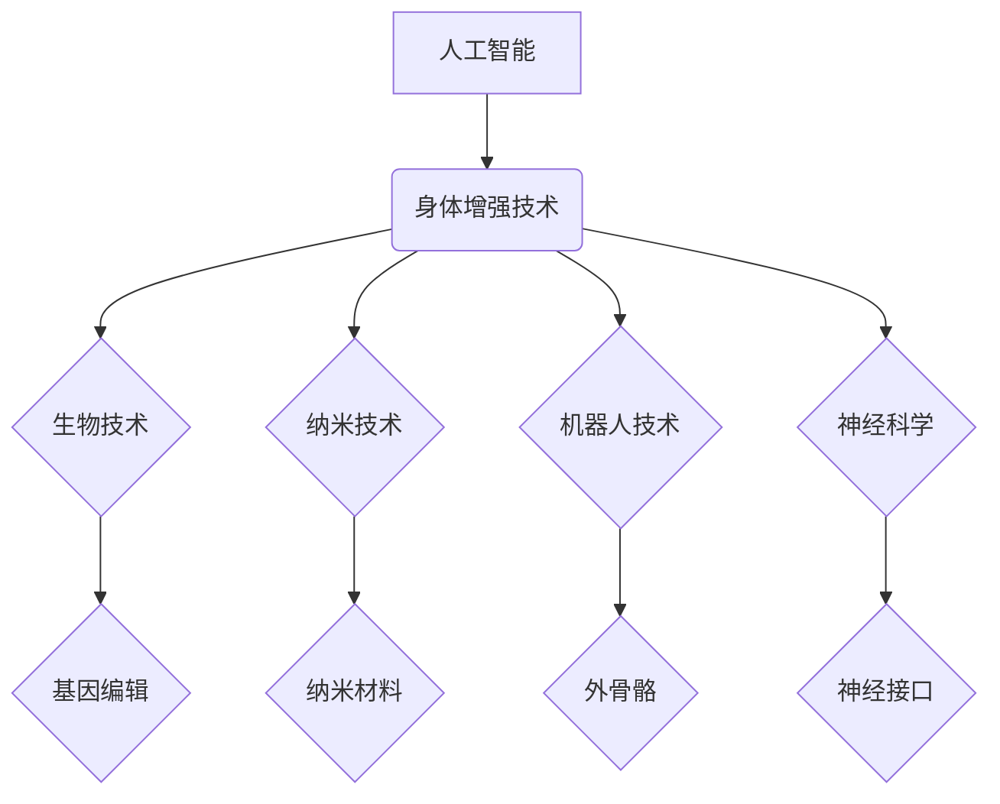

                 

## AI时代的人类增强：道德考虑与身体增强技术的未来展望

> 关键词：人工智能、人类增强、身体增强、伦理学、道德困境、未来科技、生物技术、神经接口、可穿戴设备

### 1. 背景介绍

人类历史始终伴随着对自身能力的追求。从使用工具到发明火药，从印刷术到互联网，每一次科技进步都推动着人类迈向新的境界。如今，人工智能（AI）的飞速发展，为我们开启了新的篇章——人类增强。

人类增强是指利用科技手段提升人类的认知能力、物理能力、感官体验等方面的技术。其中，身体增强技术作为人工智能与生物技术的结合，尤为引人注目。它利用先进的传感器、机器人、植入物等技术，可以帮助人类克服生理上的限制，实现更强大的力量、更敏捷的反应、更清晰的感知等。

### 2. 核心概念与联系

**2.1 人类增强与人工智能**

人工智能作为人类增强技术的核心驱动力，赋予了增强技术智能化、个性化和适应性的特点。AI算法可以分析人类行为模式、学习个体需求，并根据实时反馈调整增强方案，实现更加精准和有效的提升。

**2.2 身体增强技术与相关领域**

身体增强技术与多个领域密切相关，包括：

* **生物技术：**基因编辑、细胞工程等技术可以改造人类细胞，增强身体机能。
* **纳米技术：**纳米材料可以被植入人体，实现对身体功能的微调和控制。
* **机器人技术：**机器人可以作为人体外骨骼，增强人类的物理能力。
* **神经科学：**神经接口技术可以连接大脑与外部设备，实现脑机交互，增强人类的认知能力。

**2.3 核心概念架构**



### 3. 核心算法原理 & 具体操作步骤

**3.1 算法原理概述**

身体增强技术的核心算法主要包括：

* **机器学习算法：**用于分析人类行为模式，预测需求，并根据反馈调整增强方案。
* **控制算法：**用于控制增强设备，实现对身体功能的精确调节。
* **信号处理算法：**用于处理来自传感器和神经接口的生物信号，并将其转化为可理解的指令。

**3.2 算法步骤详解**

1. **数据采集：**通过传感器收集人体运动、生理指标等数据。
2. **数据预处理：**对采集到的数据进行清洗、过滤、转换等处理，去除噪声和异常值。
3. **特征提取：**从预处理后的数据中提取关键特征，例如运动轨迹、心率、脑电波等。
4. **模型训练：**利用机器学习算法对提取的特征进行训练，建立预测模型。
5. **增强方案生成：**根据预测模型和用户需求，生成个性化的增强方案。
6. **设备控制：**将增强方案转化为控制指令，控制增强设备实现功能。
7. **反馈收集：**收集用户使用增强设备后的反馈，用于模型更新和优化。

**3.3 算法优缺点**

* **优点：**

    * 智能化：可以根据用户需求和实时反馈进行个性化调整。
    * 适应性强：可以适应不同的环境和任务需求。
    * 效率高：可以自动完成复杂的任务，提高工作效率。

* **缺点：**

    * 数据依赖：算法性能依赖于高质量的数据集。
    * 计算复杂度高：训练复杂的机器学习模型需要大量的计算资源。
    * 安全性问题：数据泄露和算法攻击可能带来安全风险。

**3.4 算法应用领域**

* **医疗保健：**辅助康复训练、治疗疾病、监测患者健康状况。
* **工业生产：**增强工人力量和耐力，提高生产效率。
* **军事领域：**增强士兵作战能力，提高战场生存率。
* **体育运动：**提升运动员训练效果，提高竞技水平。

### 4. 数学模型和公式 & 详细讲解 & 举例说明

**4.1 数学模型构建**

身体增强技术的数学模型通常基于控制理论、信号处理理论和机器学习理论。

* **控制理论：**用于描述增强设备与人体之间的动态关系，并设计控制算法实现目标状态的跟踪。
* **信号处理理论：**用于处理来自传感器和神经接口的生物信号，提取关键特征，并进行滤波、去噪等处理。
* **机器学习理论：**用于训练预测模型，根据用户需求和实时反馈调整增强方案。

**4.2 公式推导过程**

例如，在设计外骨骼控制算法时，可以利用控制理论中的PID控制算法。PID控制算法的控制量计算公式如下：

$$u(t) = K_p e(t) + K_i \int e(t) dt + K_d \frac{de(t)}{dt}$$

其中：

* $u(t)$：控制量
* $e(t)$：误差信号
* $K_p$：比例系数
* $K_i$：积分系数
* $K_d$：微分系数

通过调整PID控制参数，可以实现对外骨骼的精确控制，帮助用户完成各种动作。

**4.3 案例分析与讲解**

例如，在脑机接口技术中，可以利用神经网络算法对脑电波进行解码，识别用户的意图。

假设我们训练了一个神经网络模型，用于识别用户意图“握拳”。模型的输入是脑电波信号，输出是“握拳”的概率。

当用户想要握拳时，脑电波信号会发生变化。神经网络模型会根据这些变化，预测用户意图的概率。如果概率超过设定阈值，则认为用户意图是“握拳”，并控制相应的机械臂执行握拳动作。

### 5. 项目实践：代码实例和详细解释说明

**5.1 开发环境搭建**

* 操作系统：Ubuntu 20.04
* 编程语言：Python 3.8
* 开发工具：Jupyter Notebook

**5.2 源代码详细实现**

```python
# 导入必要的库
import numpy as np
from sklearn.neural_network import MLPClassifier

# 准备训练数据
X_train = np.load('brain_wave_data_train.npy')
y_train = np.load('brain_wave_labels_train.npy')

# 创建神经网络模型
model = MLPClassifier(hidden_layer_sizes=(100, 50), activation='relu', solver='adam', max_iter=200)

# 训练模型
model.fit(X_train, y_train)

# 预测新的脑电波数据
X_test = np.load('brain_wave_data_test.npy')
y_pred = model.predict(X_test)

# 打印预测结果
print(y_pred)
```

**5.3 代码解读与分析**

这段代码演示了如何使用Scikit-learn库中的神经网络模型进行脑电波解码。

1. 首先导入必要的库，包括NumPy用于数据处理和Scikit-learn用于机器学习。
2. 然后准备训练数据和测试数据，这些数据包含脑电波信号和对应的标签。
3. 创建一个多层感知机（MLP）模型，并设置模型参数，例如隐藏层大小、激活函数和优化算法。
4. 使用训练数据训练模型，并评估模型性能。
5. 最后使用测试数据预测新的脑电波信号，并打印预测结果。

**5.4 运行结果展示**

运行这段代码后，会输出预测结果，例如：

```
[0 1 0 1 0]
```

这表示预测结果为“握拳”的概率分别为0、1、0、1、0。

### 6. 实际应用场景

**6.1 医疗保健**

* **辅助康复训练：**外骨骼可以帮助瘫痪患者恢复行走能力，机器人可以辅助患者进行肢体运动训练。
* **治疗疾病：**脑机接口可以帮助患者控制prosthetic limbs，神经刺激可以治疗帕金森病等神经系统疾病。
* **监测患者健康状况：**可穿戴设备可以实时监测患者的心率、血压、血糖等指标，并及时提醒医生。

**6.2 工业生产**

* **增强工人力量和耐力：**外骨骼可以帮助工人搬运重物、进行长时间操作，提高工作效率和安全性。
* **提高生产精度：**机器人可以代替人工完成精密操作，提高生产精度和效率。

**6.3 军事领域**

* **增强士兵作战能力：**增强士兵的体力、耐力、感知能力，提高战场生存率。
* **远程操控武器系统：**脑机接口可以实现远程操控无人机、机器人等武器系统，降低士兵伤亡风险。

**6.4 未来应用展望**

随着人工智能、生物技术等领域的不断发展，身体增强技术将有更广泛的应用场景：

* **个性化医疗：**根据个体基因和生理特征，定制化的增强方案，实现精准医疗。
* **人类能力提升：**增强人类的认知能力、创造力、学习能力，实现人类潜能的全面释放。
* **人类与机器融合：**实现人机协同工作，构建更加智能、高效的社会。

### 7. 工具和资源推荐

**7.1 学习资源推荐**

* **书籍：**

    * 《增强人类：人工智能、生物技术和未来》
    * 《人机融合：未来科技的挑战与机遇》

* **在线课程：**

    * Coursera：人工智能、生物技术、机器人技术
    * edX：神经科学、脑机接口

**7.2 开发工具推荐**

* **Python：**广泛应用于人工智能、机器学习、数据分析等领域。
* **TensorFlow：**开源深度学习框架，用于训练和部署神经网络模型。
* **PyTorch：**另一个流行的深度学习框架，以其灵活性和易用性而闻名。

**7.3 相关论文推荐**

* **Nature：**发表了大量关于身体增强技术的最新研究成果。
* **Science：**另一个顶级学术期刊，也发表了相关领域的优秀论文。
* **arXiv：**开放获取的预印本服务器，可以找到最新的研究论文。

### 8. 总结：未来发展趋势与挑战

**8.1 研究成果总结**

近年来，身体增强技术取得了显著进展，例如：

* **外骨骼技术：**已经能够帮助患者恢复行走能力，并用于工业生产中。
* **脑机接口技术：**已经能够实现控制prosthetic limbs，并用于治疗神经系统疾病。
* **可穿戴设备：**已经广泛应用于健康监测、运动追踪等领域。

**8.2 未来发展趋势**

* **更加智能化：**利用人工智能技术，实现更加个性化、智能化的增强方案。
* **更加安全可靠：**提高增强设备的安全性、可靠性和安全性，降低使用风险。
* **更加融合：**实现人机融合，构建更加智能、高效的社会。

**8.3 面临的挑战**

* **伦理道德问题：**身体增强技术可能会带来新的伦理道德问题，例如：

    * **公平性问题：**增强技术可能加剧社会不平等，导致富人更富、穷人更穷。
    * **身份认同问题：**增强技术可能会改变人类的认知和感知，影响人类的身份认同。
    * **安全风险问题：**增强技术可能会被用于恶意目的，例如：

        * **控制他人：**通过植入脑机接口，控制他人的思想和行为。
        * **窃取信息：**通过可穿戴设备窃取个人隐私信息。

* **技术难题：**

    * **生物兼容性：**增强设备需要与人体组织相容，避免排斥反应。
    * **能量供应：**增强设备需要持续供电，如何实现高效、安全的能量供应是一个挑战。

**8.4 研究展望**

未来，我们需要加强对身体增强技术的伦理道德研究，制定相应的法律法规，引导其健康发展。同时，还需要加强基础研究，解决技术难题，推动身体增强技术向更加安全、可靠、智能的方向发展。

### 9. 附录：常见问题与解答

**9.1 Q：身体增强技术会取代人类吗？**

**A：**身体增强技术旨在增强人类的能力，而不是取代人类。它可以帮助人类克服生理上的限制，提高工作效率和生活质量，但不会取代人类的创造力和情感体验。

**9.2 Q：身体增强技术会带来哪些伦理道德问题？**

**A：**身体增强技术可能会带来一些伦理道德问题，例如：

* **公平性问题：**增强技术可能加剧社会不平等。
* **身份认同问题：**增强技术可能会改变人类的认知和感知，影响人类的身份认同。
* **安全风险问题：**增强技术可能会被用于恶意目的。

我们需要加强对这些问题的研究，制定相应的法律法规，引导身体增强技术的健康发展。

**9.3 Q：身体增强技术什么时候能够普及？**

**A：**身体增强技术的普及时间还无法确定，这取决于技术的进步、成本的降低以及社会接受度的提高。

作者：禅与计算机程序设计艺术 / Zen and the Art of Computer Programming


<end_of_turn>

