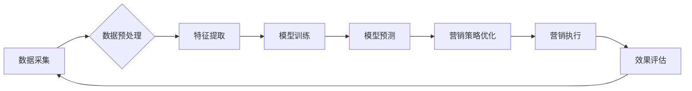

                 

## AI时尚品牌营销工具：利用AI技术提升品牌营销效果和客户参与度

> 关键词：人工智能、时尚营销、品牌推广、客户参与度、个性化推荐、机器学习、自然语言处理

## 1. 背景介绍

时尚行业是一个充满创意和竞争的领域，品牌需要不断创新以吸引消费者并保持市场竞争力。随着人工智能 (AI) 技术的快速发展，它为时尚品牌营销带来了前所未有的机遇。AI 赋予品牌以强大的数据分析、个性化推荐和自动化营销能力，帮助他们更好地了解消费者需求，提升营销效果，并增强客户参与度。

传统的时尚营销模式往往依赖于大规模的广告投放和线下活动，但其效果难以精准评估，且难以满足消费者日益个性化的需求。而 AI 驱动的营销工具则能够通过数据分析挖掘消费者偏好，提供个性化的产品推荐和营销内容，从而提高营销精准度和转化率。

## 2. 核心概念与联系

### 2.1  AI在时尚营销中的应用

AI 在时尚营销中的应用涵盖多个方面，包括：

* **个性化推荐:**  根据消费者的购买历史、浏览记录、社交媒体行为等数据，AI 算法可以精准推荐符合其个人风格和需求的商品。
* **内容创作:** AI 可以辅助设计师创作新颖的服装款式、配饰设计，甚至生成时尚相关的文字内容，如产品描述、博客文章等。
* **客户服务:** AI 驱动的聊天机器人可以提供24/7 的客户服务，解答消费者关于产品、订单、退换货等方面的疑问，提升客户体验。
* **市场分析:** AI 可以分析海量市场数据，洞察消费者趋势、竞争对手动态，为品牌制定更有效的营销策略。

### 2.2  核心架构

AI 驱动的时尚品牌营销工具通常由以下几个核心模块组成：



* **数据采集:** 从各种渠道收集消费者数据，包括购买记录、浏览历史、社交媒体行为、用户评论等。
* **数据预处理:** 对收集到的数据进行清洗、转换、整合等处理，使其符合模型训练的要求。
* **特征提取:** 从数据中提取有价值的特征，例如用户年龄、性别、购买偏好、兴趣爱好等。
* **模型训练:** 利用机器学习算法对提取的特征进行训练，构建预测模型，例如个性化推荐模型、客户画像模型等。
* **模型预测:** 将新用户数据输入到训练好的模型中，进行预测，例如推荐商品、预测购买意愿等。
* **营销策略优化:** 根据模型预测结果，优化营销策略，例如调整广告投放、个性化内容推送等。
* **营销执行:** 将优化后的营销策略执行到实际操作中，例如发送个性化邮件、推送推荐商品等。
* **效果评估:** 对营销活动的执行效果进行评估，例如转化率、客户满意度等，并反馈到数据采集环节，不断优化模型和策略。

## 3. 核心算法原理 & 具体操作步骤

### 3.1  算法原理概述

AI 驱动的时尚品牌营销工具通常采用以下几种核心算法：

* **协同过滤:**  根据用户的历史行为数据，预测用户对特定商品的喜好。
* **内容过滤:**  根据商品的特征信息，推荐与用户兴趣相符的商品。
* **深度学习:**  利用神经网络模型，从海量数据中学习更复杂的模式，实现更精准的预测和推荐。

### 3.2  算法步骤详解

以协同过滤算法为例，其具体操作步骤如下：

1. **数据收集:** 收集用户对商品的评分或购买记录数据。
2. **用户和商品相似度计算:**  利用余弦相似度等算法，计算用户之间的相似度和商品之间的相似度。
3. **推荐算法:**  根据用户与其他用户的相似度，推荐其他用户喜欢的商品给当前用户。

### 3.3  算法优缺点

**协同过滤算法:**

* **优点:**  能够发现用户之间的隐性关联，推荐个性化商品。
* **缺点:**  需要大量的用户数据才能训练出准确的模型，容易出现冷启动问题，即对于新用户或新商品难以进行推荐。

**内容过滤算法:**

* **优点:**  能够根据商品的特征信息进行推荐，不受用户数据量的限制。
* **缺点:**  推荐结果可能过于单一，缺乏个性化。

**深度学习算法:**

* **优点:**  能够学习更复杂的模式，实现更精准的预测和推荐。
* **缺点:**  需要大量的计算资源和数据才能训练出准确的模型。

### 3.4  算法应用领域

* **个性化推荐:**  推荐服装、配饰、化妆品等商品。
* **内容创作:**  生成时尚相关的文字内容、图片、视频等。
* **客户服务:**  提供24/7 的客户服务，解答消费者疑问。
* **市场分析:**  洞察消费者趋势、竞争对手动态。

## 4. 数学模型和公式 & 详细讲解 & 举例说明

### 4.1  数学模型构建

协同过滤算法的核心是计算用户和商品之间的相似度。常用的相似度度量方法包括余弦相似度、皮尔逊相关系数等。

**余弦相似度:**

$$
\text{相似度} = \frac{\mathbf{u} \cdot \mathbf{v}}{\|\mathbf{u}\| \|\mathbf{v}\|}
$$

其中：

* $\mathbf{u}$ 和 $\mathbf{v}$ 分别表示两个用户的评分向量或商品特征向量。
* $\mathbf{u} \cdot \mathbf{v}$ 表示两个向量的点积。
* $\|\mathbf{u}\|$ 和 $\|\mathbf{v}\|$ 分别表示两个向量的模长。

**皮尔逊相关系数:**

$$
\text{相关系数} = \frac{\sum_{i=1}^{n}(u_i - \bar{u})(v_i - \bar{v})}{\sqrt{\sum_{i=1}^{n}(u_i - \bar{u})^2} \sqrt{\sum_{i=1}^{n}(v_i - \bar{v})^2}}
$$

其中：

* $u_i$ 和 $v_i$ 分别表示用户 $u$ 和商品 $v$ 在第 $i$ 个商品上的评分。
* $\bar{u}$ 和 $\bar{v}$ 分别表示用户 $u$ 和商品 $v$ 的平均评分。

### 4.2  公式推导过程

余弦相似度的推导过程如下：

1. 两个向量的点积表示这两个向量在同一方向上的投影长度。
2. 向量的模长表示向量的大小。
3. 将点积除以两个向量的模长乘积，可以得到两个向量在同一方向上的投影长度与向量大小的比值，即余弦相似度。

### 4.3  案例分析与讲解

假设有两个用户 $A$ 和 $B$，他们对三件商品 $X$, $Y$, $Z$ 的评分分别如下：

| 用户 | 商品 X | 商品 Y | 商品 Z |
|---|---|---|---|
| A | 5 | 3 | 4 |
| B | 4 | 5 | 3 |

我们可以计算用户 $A$ 和 $B$ 的余弦相似度：

1. 计算用户 $A$ 和 $B$ 的评分向量：

$$
\mathbf{u}_A = [5, 3, 4], \quad \mathbf{u}_B = [4, 5, 3]
$$

2. 计算两个向量的点积：

$$
\mathbf{u}_A \cdot \mathbf{u}_B = (5 \times 4) + (3 \times 5) + (4 \times 3) = 20 + 15 + 12 = 47
$$

3. 计算两个向量的模长：

$$
\|\mathbf{u}_A\| = \sqrt{5^2 + 3^2 + 4^2} = \sqrt{50}, \quad \|\mathbf{u}_B\| = \sqrt{4^2 + 5^2 + 3^2} = \sqrt{50}
$$

4. 计算余弦相似度：

$$
\text{相似度} = \frac{47}{\sqrt{50} \times \sqrt{50}} = \frac{47}{50} = 0.94
$$

因此，用户 $A$ 和 $B$ 的余弦相似度为 0.94，说明他们具有较高的相似度。

## 5. 项目实践：代码实例和详细解释说明

### 5.1  开发环境搭建

* **操作系统:**  Windows, macOS, Linux
* **编程语言:**  Python
* **库依赖:**  pandas, numpy, scikit-learn

### 5.2  源代码详细实现

```python
import pandas as pd
from sklearn.metrics.pairwise import cosine_similarity

# 加载用户评分数据
data = pd.read_csv('user_ratings.csv')

# 提取用户评分矩阵
user_ratings = data.pivot_table(index='user_id', columns='item_id', values='rating')

# 计算用户之间的余弦相似度
similarity_matrix = cosine_similarity(user_ratings)

# 获取用户 A 和用户 B 的相似度
user_A_id = 1
user_B_id = 2
similarity = similarity_matrix[user_A_id - 1][user_B_id - 1]

print(f'用户 {user_A_id} 和用户 {user_B_id} 的相似度为: {similarity}')
```

### 5.3  代码解读与分析

* **数据加载:**  使用 pandas 库读取用户评分数据，并将其转换为评分矩阵。
* **相似度计算:**  使用 scikit-learn 库中的 cosine_similarity 函数计算用户之间的余弦相似度。
* **相似度输出:**  打印用户 A 和用户 B 的相似度。

### 5.4  运行结果展示

运行上述代码后，会输出用户 A 和用户 B 的余弦相似度。

## 6. 实际应用场景

AI 驱动的时尚品牌营销工具已在多个场景得到应用，例如：

* **个性化推荐:**  电商平台、时尚杂志网站等平台利用 AI 算法推荐个性化的服装、配饰、化妆品等商品给用户。
* **内容创作:**  一些时尚品牌利用 AI 算法生成新颖的服装款式、配饰设计，甚至生成时尚相关的文字内容，如产品描述、博客文章等。
* **客户服务:**  一些时尚品牌利用 AI 驱动的聊天机器人提供24/7 的客户服务，解答消费者关于产品、订单、退换货等方面的疑问。

### 6.4  未来应用展望

未来，AI 驱动的时尚品牌营销工具将更加智能化、个性化和自动化。例如：

* **更精准的推荐:**  利用深度学习算法，从更丰富的用户数据中学习更复杂的模式，实现更精准的商品推荐。
* **更个性化的内容创作:**  利用 AI 算法生成更符合用户个人风格和需求的时尚内容，例如定制服装设计、个性化穿搭建议等。
* **更智能化的客户服务:**  利用自然语言处理技术，使 AI 聊天机器人能够更自然地理解和回复用户的疑问，提供更人性化的服务体验。

## 7. 工具和资源推荐

### 7.1  学习资源推荐

* **书籍:**
    * 《深度学习》
    * 《机器学习实战》
    * 《Python机器学习》
* **在线课程:**
    * Coursera: 深度学习
    * edX: 机器学习
    * Udacity: AI 编程

### 7.2  开发工具推荐

* **Python:**  Python 是机器学习和深度学习领域最常用的编程语言。
* **TensorFlow:**  TensorFlow 是 Google 开发的开源机器学习框架。
* **PyTorch:**  PyTorch 是 Facebook 开发的开源机器学习框架。
* **Scikit-learn:**  Scikit-learn 是 Python 的一个机器学习库，提供各种常用的机器学习算法。

### 7.3  相关论文推荐

* **Collaborative Filtering for Recommender Systems**
* **Deep Learning for Recommender Systems**
* **Natural Language Processing for Fashion Recommendation**

## 8. 总结：未来发展趋势与挑战

### 8.1  研究成果总结

AI 驱动的时尚品牌营销工具已取得了显著的成果，能够帮助品牌更好地了解消费者需求，提升营销效果，并增强客户参与度。

### 8.2  未来发展趋势

未来，AI 驱动的时尚品牌营销工具将朝着以下几个方向发展：

* **更精准的推荐:**  利用更先进的机器学习算法，从更丰富的用户数据中学习更复杂的模式，实现更精准的商品推荐。
* **更个性化的内容创作:**  利用 AI 算法生成更符合用户个人风格和需求的时尚内容，例如定制服装设计、个性化穿搭建议等。
* **更智能化的客户服务:**  利用自然语言处理技术，使 AI 聊天机器人能够更自然地理解和回复用户的疑问，提供更人性化的服务体验。

### 8.3  面临的挑战

AI 驱动的时尚品牌营销工具也面临一些挑战：

* **数据隐私:**  收集和使用用户数据需要考虑数据隐私问题，确保用户数据的安全和合法性。
* **算法偏见:**  机器学习算法可能会受到训练数据的影响，导致算法偏见，从而影响推荐结果的公平性和准确性。
* **解释性问题:**  一些深度学习算法的决策过程难以解释，这可能会导致用户对推荐结果的信任度降低。

### 8.4  研究展望

未来，需要进一步研究以下问题：

* 如何开发更公平、更透明的机器学习算法，避免算法偏见。
* 如何更好地解释深度学习算法的决策过程，提高用户对推荐结果的信任度。
* 如何更好地利用 AI 技术，为用户提供更个性化、更智能化的时尚体验。

## 9. 附录：常见问题与解答

**Q1:  AI 驱动的时尚品牌营销工具需要多少数据才能训练出准确的模型？**

**A1:**  这取决于具体的算法和应用场景。一般来说，需要收集大量的用户数据才能训练出准确的模型。

**Q2:  AI 驱动的时尚品牌营销工具会取代人类的工作吗？**

**A2:**  AI 驱动的时尚品牌营销工具可以帮助人类提高工作效率，但不会完全取代人类的工作。人类仍然需要发挥创造力和判断力，来设计、开发和管理 AI 系统。

**Q3:  如何确保 AI 驱动的时尚品牌营销工具的安全性？**

**A3:**  需要采取多种措施来确保 AI 系统的安全性，例如数据加密、身份验证、安全审计等。

**作者：禅与计算机程序设计艺术 / Zen and the Art of Computer Programming**


<end_of_turn>

