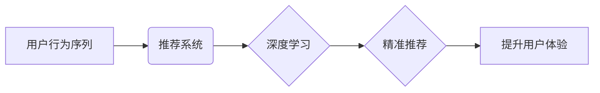

                 

## AI电商搜索平台的用户行为序列分析

> 关键词：电商搜索、用户行为序列、推荐系统、深度学习、自然语言处理、序列模型

## 1. 背景介绍

在当今数据爆炸的时代，电商平台的用户行为数据已成为宝贵的资源。用户在电商平台上的搜索、浏览、购买等行为序列蕴含着丰富的潜在信息，能够帮助平台更好地理解用户需求，提供更精准的商品推荐和个性化服务。

传统的电商搜索平台主要依赖于关键词匹配和商品属性检索，难以捕捉用户行为序列中的复杂关联和隐含意图。随着深度学习和自然语言处理技术的快速发展，基于用户行为序列分析的AI电商搜索平台应运而生，能够更深入地挖掘用户需求，提升搜索结果的精准度和用户体验。

## 2. 核心概念与联系

### 2.1 用户行为序列

用户行为序列是指用户在电商平台上进行的一系列交互行为，例如：

* 搜索关键词
* 商品浏览记录
* 添加购物车
* 购买历史
* 评价和反馈

这些行为序列可以被视为时间序列数据，蕴含着用户的兴趣偏好、购买习惯和潜在需求。

### 2.2 推荐系统

推荐系统是基于用户行为数据，预测用户潜在兴趣并推荐相关商品的系统。AI电商搜索平台的推荐系统通常采用基于内容的推荐、基于协同过滤的推荐和基于深度学习的推荐等多种算法。

### 2.3 深度学习

深度学习是一种机器学习的子领域，利用多层神经网络模拟人类大脑的学习过程。深度学习算法能够从海量用户行为序列数据中自动学习特征和模式，实现更精准的预测和推荐。

**核心概念与联系流程图**



## 3. 核心算法原理 & 具体操作步骤

### 3.1 算法原理概述

用户行为序列分析的核心算法通常是基于深度学习的序列模型，例如循环神经网络（RNN）、长短期记忆网络（LSTM）和Transformer等。这些模型能够捕捉序列数据中的时间依赖关系，学习用户行为模式和潜在意图。

### 3.2 算法步骤详解

1. **数据预处理:** 将用户行为序列数据清洗、格式化和编码，例如将搜索关键词转换为词向量，将商品浏览记录转换为序列标签等。
2. **模型构建:** 选择合适的深度学习序列模型，并根据具体任务进行参数配置和训练。
3. **模型训练:** 使用训练数据训练模型，优化模型参数，使其能够准确预测用户行为序列的下一个元素。
4. **模型评估:** 使用测试数据评估模型的性能，例如准确率、召回率和F1-score等指标。
5. **模型部署:** 将训练好的模型部署到电商平台，实时分析用户行为序列，并提供个性化推荐和服务。

### 3.3 算法优缺点

**优点:**

* 能够捕捉用户行为序列中的复杂关联和隐含意图。
* 能够学习用户个性化偏好和购买习惯。
* 能够提供更精准的商品推荐和个性化服务。

**缺点:**

* 需要海量用户行为数据进行训练。
* 模型训练和部署成本较高。
* 模型解释性较差，难以理解模型的决策过程。

### 3.4 算法应用领域

* **电商搜索推荐:** 提供更精准的商品搜索结果和个性化推荐。
* **用户画像分析:** 建立用户画像，了解用户兴趣偏好和购买习惯。
* **营销活动优化:** 根据用户行为序列分析，优化营销活动策略和目标人群。
* **个性化内容推荐:** 根据用户行为序列，推荐个性化内容，例如新闻、视频和文章。

## 4. 数学模型和公式 & 详细讲解 & 举例说明

### 4.1 数学模型构建

用户行为序列分析通常采用基于概率的数学模型，例如马尔科夫链和隐马尔科夫模型。

**马尔科夫链:**

马尔科夫链是一种统计模型，描述系统在不同状态之间的转移概率。在用户行为序列分析中，每个状态代表一个用户行为，例如搜索关键词、浏览商品等。马尔科夫链假设当前状态只依赖于前一个状态，而与更早的状态无关。

**隐马尔可夫模型:**

隐马尔可夫模型是马尔科夫链的扩展，它假设隐藏状态决定了观察到的状态。在用户行为序列分析中，隐藏状态可以代表用户的潜在意图，例如用户想要购买哪种类型的商品。

### 4.2 公式推导过程

**马尔科夫链状态转移概率:**

$$P(s_t|s_{t-1})$$

其中，$s_t$表示第t个状态，$s_{t-1}$表示第t-1个状态。

**隐马尔可夫模型状态转移概率:**

$$P(s_t|s_{t-1})$$

其中，$s_t$表示第t个隐藏状态，$s_{t-1}$表示第t-1个隐藏状态。

**隐马尔可夫模型观测概率:**

$$P(o_t|s_t)$$

其中，$o_t$表示第t个观测状态，$s_t$表示第t个隐藏状态。

### 4.3 案例分析与讲解

假设一个用户在电商平台上搜索了“手机”，然后浏览了“华为手机”和“小米手机”两款商品，最后购买了“华为手机”。

* **马尔科夫链:** 可以将用户行为序列建模为马尔科夫链，其中每个状态代表一个行为，例如“搜索手机”、“浏览华为手机”、“浏览小米手机”、“购买华为手机”。
* **隐马尔可夫模型:** 可以将用户行为序列建模为隐马尔可夫模型，其中隐藏状态代表用户的潜在意图，例如“寻找华为手机”、“寻找小米手机”、“购买华为手机”。

通过训练马尔可夫链或隐马尔可夫模型，可以学习用户行为序列的转移概率和观测概率，从而预测用户下一个行为。

## 5. 项目实践：代码实例和详细解释说明

### 5.1 开发环境搭建

* Python 3.x
* TensorFlow 或 PyTorch 深度学习框架
* NumPy、Pandas 等数据处理库

### 5.2 源代码详细实现

```python
import tensorflow as tf

# 定义LSTM模型
model = tf.keras.Sequential([
    tf.keras.layers.Embedding(input_dim=vocab_size, output_dim=embedding_dim),
    tf.keras.layers.LSTM(units=128),
    tf.keras.layers.Dense(units=num_classes, activation='softmax')
])

# 编译模型
model.compile(optimizer='adam',
              loss='sparse_categorical_crossentropy',
              metrics=['accuracy'])

# 训练模型
model.fit(x_train, y_train, epochs=10, batch_size=32)

# 评估模型
loss, accuracy = model.evaluate(x_test, y_test)
print('Loss:', loss)
print('Accuracy:', accuracy)
```

### 5.3 代码解读与分析

* **Embedding层:** 将用户行为序列中的词语转换为稠密的词向量，以便模型学习词语之间的语义关系。
* **LSTM层:** 捕捉用户行为序列中的时间依赖关系，学习用户行为模式和潜在意图。
* **Dense层:** 将LSTM层的输出映射到目标类别，例如下一个行为类型。
* **编译模型:** 选择优化器、损失函数和评价指标。
* **训练模型:** 使用训练数据训练模型，优化模型参数。
* **评估模型:** 使用测试数据评估模型的性能。

### 5.4 运行结果展示

训练完成后，可以将模型部署到电商平台，实时分析用户行为序列，并提供个性化推荐和服务。

## 6. 实际应用场景

### 6.1 商品推荐

基于用户行为序列分析的推荐系统能够提供更精准的商品推荐，例如：

* **基于浏览历史的推荐:** 推荐用户之前浏览过的商品或类似商品。
* **基于购买历史的推荐:** 推荐用户之前购买过的商品或用户购买过的商品类别中的其他商品。
* **基于搜索历史的推荐:** 推荐用户之前搜索过的商品或与用户搜索关键词相关的商品。

### 6.2 个性化内容推荐

电商平台可以根据用户行为序列分析，推荐个性化内容，例如：

* **新闻推荐:** 推荐与用户兴趣相关的新闻资讯。
* **视频推荐:** 推荐与用户观看历史相关的视频内容。
* **文章推荐:** 推荐与用户阅读历史相关的文章内容。

### 6.3 营销活动优化

电商平台可以根据用户行为序列分析，优化营销活动策略和目标人群，例如：

* **精准广告投放:** 根据用户兴趣和购买习惯，精准投放广告。
* **个性化促销活动:** 根据用户行为序列，设计个性化促销活动。
* **用户画像分析:** 建立用户画像，了解用户兴趣偏好和购买习惯。

### 6.4 未来应用展望

随着人工智能技术的不断发展，用户行为序列分析将在电商平台的应用场景中得到更广泛的应用，例如：

* **智能客服:** 基于用户行为序列分析，提供更智能的客服服务。
* **个性化商品设计:** 根据用户行为序列分析，设计更符合用户需求的商品。
* **预测用户行为:** 基于用户行为序列分析，预测用户未来的行为，例如购买意愿和浏览偏好。

## 7. 工具和资源推荐

### 7.1 学习资源推荐

* **书籍:**
    * 《深度学习》 - Ian Goodfellow, Yoshua Bengio, Aaron Courville
    * 《自然语言处理》 - Dan Jurafsky, James H. Martin
* **在线课程:**
    * Coursera: 深度学习 Specialization
    * Udacity: 自然语言处理 Nanodegree
* **博客和论坛:**
    * TensorFlow Blog
    * PyTorch Blog
    * Stack Overflow

### 7.2 开发工具推荐

* **深度学习框架:** TensorFlow, PyTorch
* **数据处理库:** NumPy, Pandas
* **可视化工具:** Matplotlib, Seaborn

### 7.3 相关论文推荐

* **Recurrent Neural Networks for Sequence Learning** - Sepp Hochreiter, Jürgen Schmidhuber
* **Long Short-Term Memory** - Geoffrey E. Hinton, John G. Hopfield, Joseph S. Osuna, Yoshua Bengio, Yann LeCun
* **Attention Is All You Need** - Ashish Vaswani, Noam Shazeer, Niki Parmar, Jakob Uszkoreit, Llion Jones, Aidan N. Gomez, Łukasz Kaiser, Illia Polosukhin

## 8. 总结：未来发展趋势与挑战

### 8.1 研究成果总结

用户行为序列分析在电商平台的应用取得了显著成果，能够提供更精准的商品推荐、个性化内容推荐和营销活动优化。

### 8.2 未来发展趋势

* **更深层次的模型:** 研究更深层次的深度学习模型，例如Transformer变体，以更好地捕捉用户行为序列中的复杂关联和隐含意图。
* **多模态数据融合:** 将用户行为序列与其他数据类型融合，例如文本、图像和视频，构建更全面的用户画像。
* **实时分析与个性化服务:** 实现实时用户行为序列分析，提供更个性化和即时的服务。
* **解释性模型:** 研究更具解释性的深度学习模型，以便更好地理解模型的决策过程。

### 8.3 面临的挑战

* **数据隐私保护:** 用户行为数据涉及隐私信息，需要采取有效措施保护用户隐私。
* **模型可解释性:** 深度学习模型的决策过程难以理解，需要研究更具可解释性的模型。
* **数据质量:** 用户行为数据质量参差不齐，需要进行有效的数据清洗和预处理。
* **算法效率:** 训练和部署深度学习模型需要大量的计算资源，需要研究更有效的算法和优化方法。

### 8.4 研究展望

未来，用户行为序列分析将在电商平台的应用场景中得到更广泛的应用，并与其他人工智能技术融合，为用户提供更智能、更个性化的服务体验。


## 9. 附录：常见问题与解答

**Q1: 如何处理用户行为序列中的缺失数据？**

**A1:** 可以使用多种方法处理缺失数据，例如：

* **删除缺失数据:** 如果缺失数据量较少，可以删除缺失数据。
* **填充缺失数据:** 使用平均值、中位数或其他填充策略填充缺失数据。
* **使用机器学习模型预测缺失数据:** 使用机器学习模型预测缺失数据。

**Q2: 如何评估用户行为序列分析模型的性能？**

**A2:** 可以使用多种指标评估模型性能，例如：

* **准确率:** 模型预测正确样本的比例。
* **召回率:** 模型预测出所有正样本的比例。
* **F1-score:** 准确率和召回率的调和平均值。
* **AUC:** 曲线下面积，衡量模型的区分能力。

**Q3: 如何部署用户行为序列分析模型到电商平台？**

**A3:** 可以使用多种方式部署模型，例如：

* **云端部署:** 将模型部署到云平台，例如AWS、Azure或GCP。
* **容器化部署:** 将模型打包成容器，例如Docker，方便部署和管理。
* **边缘部署:** 将模型部署到边缘设备，例如手机或智能电视，实现实时分析和服务。


作者：禅与计算机程序设计艺术 / Zen and the Art of Computer Programming 
<end_of_turn>

