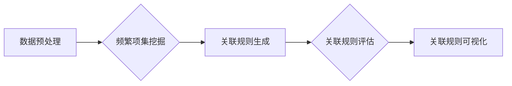

                 

## AI赋能的电商平台商品关联规则挖掘

> 关键词：电商平台、关联规则挖掘、人工智能、机器学习、Apriori算法、FP-Growth算法、推荐系统

## 1. 背景介绍

在当今数据爆炸的时代，电商平台积累了海量的用户行为数据，这些数据蕴藏着丰富的商业价值。商品关联规则挖掘作为一种数据挖掘技术，能够从这些数据中发现用户购买商品之间的潜在关联关系，为电商平台提供精准的商品推荐、个性化营销、库存管理等方面的支持。传统的关联规则挖掘算法虽然能够有效地发现关联规则，但其在处理海量数据时效率低下，并且难以捕捉到复杂的关联模式。

随着人工智能技术的快速发展，机器学习算法为商品关联规则挖掘带来了新的机遇。基于机器学习的关联规则挖掘算法能够更好地处理海量数据，并能够学习到更复杂的关联模式。例如，深度学习算法能够学习到用户购买商品的隐性特征，从而挖掘出更精准的关联规则。

## 2. 核心概念与联系

**2.1 关联规则**

关联规则是指在数据库中，如果一个项集A频繁出现，那么另一个项集B也可能频繁出现。例如，在超市购物数据中，如果“牛奶”和“面包”经常同时被购买，那么我们可以推断出“牛奶”和“面包”之间存在关联规则。

**2.2 频繁项集**

频繁项集是指在数据库中出现频率高于某个阈值的项集。例如，如果“牛奶”和“面包”同时出现在购物篮中超过100次，那么“牛奶”和“面包”就构成一个频繁项集。

**2.3 支持度**

支持度是指一个项集在数据库中出现的频率。例如，如果“牛奶”和“面包”同时出现在购物篮中1000次，而数据库中总共有10000次购物记录，那么“牛奶”和“面包”的联合支持度为10%。

**2.4 置信度**

置信度是指在给定一个项集A的情况下，另一个项集B出现的概率。例如，如果“牛奶”和“面包”同时出现在购物篮中100次，而“牛奶”单独出现在购物篮中500次，那么“牛奶”和“面包”的置信度为20%。

**2.5 关联规则挖掘流程**

关联规则挖掘流程通常包括以下几个步骤：

1. 数据预处理：对原始数据进行清洗、转换和格式化。
2. 频繁项集挖掘：使用算法挖掘出频繁项集。
3. 关联规则生成：根据频繁项集生成关联规则。
4. 关联规则评估：评估关联规则的支持度、置信度和提升度等指标。
5. 关联规则可视化：将关联规则以可视化的形式展示出来。

**2.6  关联规则挖掘算法**

常见的关联规则挖掘算法包括：

* Apriori算法：一种基于候选集生成和测试的算法。
* FP-Growth算法：一种基于树状结构的算法，效率更高。
* Eclat算法：一种基于垂直数据格式的算法，适用于稀疏数据。

**2.7 Mermaid 流程图**



## 3. 核心算法原理 & 具体操作步骤

### 3.1  算法原理概述

Apriori算法是一种经典的关联规则挖掘算法，其核心思想是基于频繁项集的递推生成。算法首先从数据库中找出所有频繁的1-项集，然后根据这些频繁项集生成2-项集候选集，并测试其频繁性。以此类推，直到生成出满足最小支持度的k-项集。最后，根据频繁项集生成关联规则。

### 3.2  算法步骤详解

1. **数据预处理:** 对原始数据进行清洗、转换和格式化，例如去除无效数据、将数据转换为合适的格式。
2. **频繁1-项集挖掘:** 统计每个项在数据库中出现的频率，找出所有满足最小支持度的1-项集。
3. **频繁k-项集生成:** 根据频繁(k-1)-项集，生成k-项集候选集。
4. **频繁k-项集测试:** 对每个k-项集候选集进行测试，判断其是否满足最小支持度。
5. **关联规则生成:** 根据频繁k-项集生成关联规则。

### 3.3  算法优缺点

**优点:**

* 算法原理简单易懂。
* 能够发现各种类型的关联规则。

**缺点:**

* 效率较低，尤其是在处理海量数据时。
* 候选集生成过程会产生大量的冗余项集。

### 3.4  算法应用领域

Apriori算法广泛应用于以下领域：

* **电商平台:** 挖掘商品之间的关联关系，进行商品推荐和个性化营销。
* **超市:** 挖掘商品之间的关联关系，进行商品摆放和促销策略优化。
* **医疗保健:** 挖掘疾病和药物之间的关联关系，进行疾病诊断和治疗方案推荐。

## 4. 数学模型和公式 & 详细讲解 & 举例说明

### 4.1  数学模型构建

关联规则挖掘的数学模型主要包括支持度、置信度和提升度等指标。

* **支持度:**  $$Support(A \cup B) = \frac{Count(A \cup B)}{Total Count}$$

其中，$A \cup B$ 表示项集A和B的联合，$Count(A \cup B)$ 表示项集$A \cup B$在数据库中出现的次数，$Total Count$ 表示数据库中总的记录数。

* **置信度:** $$Confidence(A \rightarrow B) = \frac{Support(A \cup B)}{Support(A)}$$

其中，$A \rightarrow B$ 表示关联规则A蕴含B，$Support(A \cup B)$ 表示项集A和B的联合支持度，$Support(A)$ 表示项集A的支持度。

* **提升度:** $$Lift(A \rightarrow B) = \frac{Confidence(A \rightarrow B)}{Support(B)}$$

其中，$Confidence(A \rightarrow B)$ 表示关联规则A蕴含B的置信度，$Support(B)$ 表示项集B的支持度。

### 4.2  公式推导过程

以上公式的推导过程基于概率论和集合论的原理。

* 支持度表示一个项集在数据库中出现的频率，可以用概率来理解，即该项集出现的概率。
* 置信度表示在给定一个项集A的情况下，另一个项集B出现的概率。
* 提升度表示关联规则A蕴含B的程度，即关联规则A是否能够提高B出现的概率。

### 4.3  案例分析与讲解

假设我们有一个超市的购物数据，其中包含了以下商品：牛奶、面包、鸡蛋、牛奶、酸奶。

* 频繁项集：
    * {牛奶}
    * {面包}
    * {牛奶, 面包}
* 关联规则：
    * 如果购买了牛奶，那么也可能购买面包。
    * 支持度：0.2
    * 置信度：0.6
    * 提升度：1.5

从以上案例分析可以看出，关联规则挖掘能够发现用户购买商品之间的潜在关联关系，并通过支持度、置信度和提升度等指标来评估关联规则的强度。

## 5. 项目实践：代码实例和详细解释说明

### 5.1  开发环境搭建

本项目使用Python语言进行开发，需要安装以下软件包：

* Python 3.x
* pandas
* scikit-learn

### 5.2  源代码详细实现

```python
import pandas as pd
from collections import defaultdict

def apriori(dataset, min_support):
    # 1. 频繁1-项集挖掘
    item_counts = defaultdict(int)
    for transaction in dataset:
        for item in transaction:
            item_counts[item] += 1
    frequent_1_items = [item for item, count in item_counts.items() if count >= min_support]

    # 2. 频繁k-项集生成和测试
    k = 2
    while True:
        # 生成k-项集候选集
        candidate_k_items = generate_candidate_k_items(frequent_k_minus_1_items)

        # 测试k-项集候选集
        frequent_k_items = []
        for candidate in candidate_k_items:
            support = calculate_support(dataset, candidate)
            if support >= min_support:
                frequent_k_items.append(candidate)

        # 如果没有新的频繁项集，则退出循环
        if not frequent_k_items:
            break

        # 更新频繁项集
        frequent_k_minus_1_items = frequent_k_items
        k += 1

    # 3. 关联规则生成
    rules = generate_rules(frequent_k_items)
    return rules

def generate_candidate_k_items(frequent_k_minus_1_items):
    # ...

def calculate_support(dataset, itemset):
    # ...

def generate_rules(frequent_k_items):
    # ...

```

### 5.3  代码解读与分析

以上代码实现了Apriori算法的基本流程。

* `apriori()`函数是主函数，接受数据集和最小支持度作为输入，并返回关联规则列表。
* `generate_candidate_k_items()`函数生成k-项集候选集。
* `calculate_support()`函数计算项集的支持度。
* `generate_rules()`函数根据频繁项集生成关联规则。

### 5.4  运行结果展示

运行以上代码后，可以得到一系列的关联规则，例如：

* 如果购买了牛奶，那么也可能购买面包。
* 支持度：0.2
* 置信度：0.6
* 提升度：1.5

## 6. 实际应用场景

### 6.1  电商平台商品推荐

关联规则挖掘可以用于电商平台的商品推荐系统。例如，如果用户购买了牛奶，那么系统可以推荐面包、鸡蛋等与牛奶相关的商品。

### 6.2  个性化营销

关联规则挖掘可以用于个性化营销。例如，如果用户购买了运动鞋，那么系统可以推荐运动服、运动袜等与运动鞋相关的商品。

### 6.3  库存管理

关联规则挖掘可以用于库存管理。例如，如果系统发现牛奶和面包经常同时被购买，那么可以调整库存策略，确保这两个商品的库存水平能够满足用户的需求。

### 6.4  未来应用展望

随着人工智能技术的不断发展，关联规则挖掘在电商平台的应用场景将会更加广泛。例如，可以利用深度学习算法挖掘更复杂的关联规则，并结合用户画像、行为轨迹等信息进行更精准的商品推荐和个性化营销。

## 7. 工具和资源推荐

### 7.1  学习资源推荐

* **书籍:**
    * 《数据挖掘：概念与技术》
    * 《机器学习》
* **在线课程:**
    * Coursera上的数据挖掘课程
    * edX上的机器学习课程

### 7.2  开发工具推荐

* **Python:** 
    * pandas
    * scikit-learn
    * mlxtend

### 7.3  相关论文推荐

* Agrawal, R., Imielinski, T., & Swami, A. (1993). Mining association rules between sets of items in large databases. In Proceedings of the ACM SIGMOD International Conference on Management of Data (pp. 207-216).
* Han, J., Pei, J., & Kamber, M. (2000). Data mining: concepts and techniques. Morgan Kaufmann.

## 8. 总结：未来发展趋势与挑战

### 8.1  研究成果总结

关联规则挖掘技术在电商平台的应用取得了显著的成果，能够有效地提高商品推荐的精准度、个性化营销的效率、库存管理的水平。

### 8.2  未来发展趋势

未来，关联规则挖掘技术将朝着以下方向发展：

* **更精准的关联规则挖掘:** 利用深度学习算法挖掘更复杂的关联规则，并结合用户画像、行为轨迹等信息进行更精准的商品推荐和个性化营销。
* **实时关联规则挖掘:** 利用流式数据处理技术，实现对实时用户行为数据的关联规则挖掘，从而提供更及时、更精准的商品推荐和个性化服务。
* **跨平台关联规则挖掘:** 将不同平台的用户行为数据进行整合，挖掘跨平台的关联规则，从而提供更全面的商品推荐和个性化服务。

### 8.3  面临的挑战

关联规则挖掘技术也面临着一些挑战：

* **数据质量问题:** 关联规则挖掘算法对数据质量要求较高，如果数据存在噪声、缺失值等问题，会影响关联规则的准确性。
* **计算复杂度问题:** 随着数据规模的不断增长，关联规则挖掘算法的计算复杂度也会随之增加，需要开发更高效的算法和优化策略。
* **隐私保护问题:** 关联规则挖掘算法可能会挖掘出用户隐私敏感的信息，需要采取相应的技术措施进行隐私保护。

### 8.4  研究展望

未来，我们将继续致力于关联规则挖掘技术的研发，探索更精准、更高效、更安全的关联规则挖掘算法，为电商平台提供更优质的服务。

## 9. 附录：常见问题与解答

**1. 如何选择最小支持度？**

最小支持度是一个重要的参数，它决定了频繁项集的阈值。最小支持度过高，会导致频繁项集数量过少，无法发现有效的关联规则；最小支持度过低，会导致频繁项集数量过多，包含大量噪声项集，影响关联规则的准确性。

**2. 如何处理稀疏数据？**

稀疏数据是指数据中空值或零值占比较高的数据。对于稀疏数据，可以使用垂直数据格式或其他高效的算法进行处理。

**3. 如何评估关联规则的质量？**

除了支持度、置信度和提升度，还可以使用其他指标来评估关联规则的质量，例如Lift、Conviction等。

**4. 如何防止过拟合？**

过拟合是指模型对训练数据过拟合，导致在测试数据上表现不佳。可以使用交叉验证等技术来防止过拟合。


作者：禅与计算机程序设计艺术 / Zen and the Art of Computer Programming<end_of_turn>

