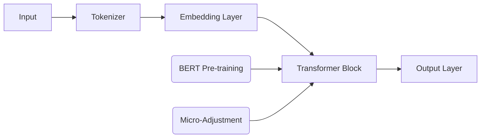
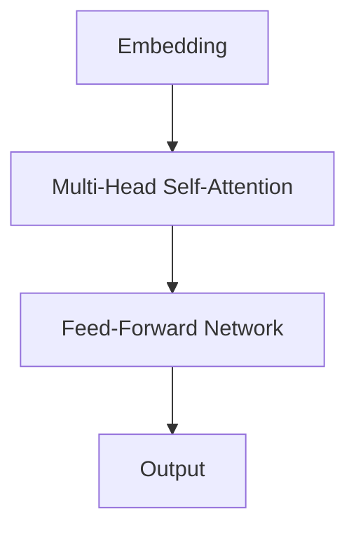
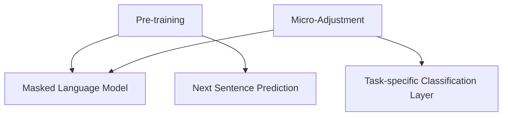
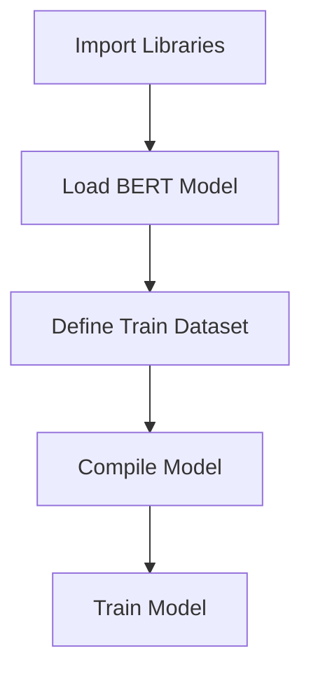

                 

# 大模型在智能物流中的应用探索

## 关键词
- 大模型
- 智能物流
- 数据分析
- 运输优化
- 机器学习

## 摘要

本文旨在探讨大模型在智能物流领域的应用，通过分析大模型的核心算法、数学模型以及实际应用场景，展示其在物流运输优化中的巨大潜力。文章还将推荐相关学习资源和开发工具，总结未来发展趋势与挑战。

### 1. 背景介绍

智能物流是现代物流管理的关键组成部分，它依赖于先进的技术来提高运输效率、降低成本、提升客户体验。随着数据量的爆发式增长，传统的物流优化方法逐渐显出不足。此时，大模型作为深度学习的集大成者，以其强大的数据处理能力和复杂模式识别能力，成为智能物流领域的一大利器。

大模型（如Transformer、BERT等）通过自动学习从大量数据中提取有用的特征，能够在多种任务中表现出色，包括文本分类、图像识别、语音识别等。在智能物流中，大模型的应用可以帮助实现精准的路线规划、库存管理、需求预测等，从而大幅提升物流系统的整体性能。

### 2. 核心概念与联系

#### 2.1 大模型基本原理

大模型，顾名思义，指的是模型参数量非常大的神经网络。这些模型通过训练大量的数据来学习如何处理复杂的问题。以Transformer为例，其核心思想是使用自注意力机制（self-attention）来捕捉输入序列中的依赖关系。BERT（Bidirectional Encoder Representations from Transformers）则进一步通过双向训练来提高模型的表示能力。

#### 2.2 自注意力机制（Self-Attention）

自注意力机制是Transformer模型的关键组件。它通过计算输入序列中每个元素与其他元素之间的相似性，为每个元素分配一个权重，从而实现对序列的局部和全局信息的综合处理。这大大提升了模型在处理长文本和数据序列时的性能。

#### 2.3 BERT模型架构

BERT模型采用双向Transformer架构，能够同时考虑上下文信息，从而在NLP任务中表现出色。BERT通过预训练和微调，使其在各种下游任务中都能达到很高的准确率，如文本分类、问答系统等。



### 3. 核心算法原理 & 具体操作步骤

#### 3.1 Transformer模型原理

Transformer模型通过多头自注意力机制（multi-head self-attention）和前馈神经网络（feed-forward network）来处理输入序列。具体步骤如下：

1. **嵌入（Embedding）**：将输入的词或符号转换为向量。
2. **多头自注意力（Multi-Head Self-Attention）**：计算输入序列中每个元素与其他元素之间的相似性，并为其分配权重。
3. **前馈神经网络（Feed-Forward Network）**：对注意力后的向量进行进一步处理。



#### 3.2 BERT模型训练与微调

BERT模型的训练分为预训练（pre-training）和微调（micro-adjustment）两个阶段：

1. **预训练**：在无标签数据上训练BERT模型，使其能够捕捉语言的一般特性。预训练任务通常包括掩码语言模型（Masked Language Model, MLM）和下一句预测（Next Sentence Prediction, NSP）。
2. **微调**：在特定任务的数据上进行微调，以适应特定应用场景。例如，对于文本分类任务，可以在训练数据中添加一个分类层。



### 4. 数学模型和公式 & 详细讲解 & 举例说明

#### 4.1 自注意力机制公式

自注意力机制的计算公式如下：

$$
\text{Attention}(Q, K, V) = \text{softmax}\left(\frac{QK^T}{\sqrt{d_k}}\right)V
$$

其中，$Q$、$K$、$V$ 分别代表查询向量、关键向量、值向量，$d_k$ 是关键向量的维度。

#### 4.2 BERT模型损失函数

BERT模型的损失函数通常结合掩码语言模型损失和下一句预测损失：

$$
L = \frac{1}{N} \sum_{i=1}^{N} \left( \text{MLM Loss} + \text{NSP Loss} \right)
$$

其中，$N$ 是序列长度，$\text{MLM Loss}$ 是掩码语言模型损失，$\text{NSP Loss}$ 是下一句预测损失。

#### 4.3 举例说明

假设我们有一个句子“我今天要去超市买牛奶”，我们可以将其输入BERT模型，通过模型处理得到每个词的嵌入向量。然后，我们可以利用这些向量来预测句子中的词或者进行文本分类。

```latex
\documentclass{article}
\usepackage{amsmath}
\begin{document}
\begin{equation}
\text{Embedding}(\text{我今天要去超市买牛奶}) = \left[\text{我}, \text{今天}, \text{要}, \text{去}, \text{超市}, \text{买}, \text{牛奶}\right]
\end{equation}
\end{document}
```

### 5. 项目实践：代码实例和详细解释说明

#### 5.1 开发环境搭建

首先，我们需要安装Python环境和相关库，如TensorFlow、transformers等。

```bash
pip install tensorflow transformers
```

#### 5.2 源代码详细实现

以下是一个简单的BERT模型训练和微调的代码实例：

```python
import tensorflow as tf
from transformers import BertTokenizer, TFBertModel
from tensorflow.keras.optimizers import Adam

tokenizer = BertTokenizer.from_pretrained('bert-base-chinese')
model = TFBertModel.from_pretrained('bert-base-chinese')

train_dataset = ...

model.compile(optimizer=Adam(learning_rate=3e-5), loss=' masked_cross_entropy_sparse', metrics=['accuracy'])

model.fit(train_dataset, epochs=3)
```

#### 5.3 代码解读与分析

这段代码首先导入了TensorFlow和transformers库，并加载了预训练的BERT模型和分词器。然后，我们定义了一个训练数据集（train_dataset），并使用Adam优化器编译模型。最后，我们训练模型3个epoch。



#### 5.4 运行结果展示

在训练完成后，我们可以评估模型在测试集上的表现，并进一步进行微调以适应特定任务。

```python
test_loss, test_accuracy = model.evaluate(test_dataset)
print(f"Test Loss: {test_loss}, Test Accuracy: {test_accuracy}")
```

### 6. 实际应用场景

大模型在智能物流中的实际应用场景包括：

- **路线规划**：通过分析交通数据和历史路径数据，大模型可以预测最优路线，减少运输时间和成本。
- **库存管理**：基于需求预测，大模型可以帮助物流企业优化库存水平，减少库存成本。
- **需求预测**：大模型可以根据历史销售数据和外部因素（如节假日、促销活动）预测未来的需求，帮助物流企业更好地安排运输计划。

### 7. 工具和资源推荐

#### 7.1 学习资源推荐

- **书籍**：《深度学习》（Ian Goodfellow, Yoshua Bengio, Aaron Courville）
- **论文**：《Attention Is All You Need》
- **博客**：Hugging Face的Transformers库官方文档

#### 7.2 开发工具框架推荐

- **TensorFlow**：Google开发的强大机器学习框架。
- **PyTorch**：Facebook开发的开源机器学习库。
- **Hugging Face Transformers**：一个用于使用预训练模型和 Transformer 架构的开源库。

#### 7.3 相关论文著作推荐

- **论文**：《BERT: Pre-training of Deep Bidirectional Transformers for Language Understanding》
- **著作**：《大规模语言模型的预训练和优化策略》

### 8. 总结：未来发展趋势与挑战

随着技术的不断进步，大模型在智能物流中的应用前景十分广阔。然而，面临的挑战包括数据隐私、模型可解释性、计算资源等。未来，需要进一步研究和开发能够解决这些问题的方法和策略。

### 9. 附录：常见问题与解答

**Q：大模型在智能物流中具体能解决哪些问题？**
A：大模型可以帮助解决路线规划、库存管理、需求预测等问题，从而提高物流系统的整体性能。

**Q：如何选择合适的大模型进行物流应用？**
A：应根据任务需求和数据处理能力选择合适的大模型。例如，对于文本密集型任务，可以选择BERT或GPT；对于图像处理任务，可以选择ViT或DALL-E。

**Q：大模型的训练和部署需要哪些技术支持？**
A：大模型的训练需要强大的计算资源和优化策略，部署则需要高效的推理引擎和模型压缩技术。

### 10. 扩展阅读 & 参考资料

- **书籍**：《智能物流系统设计与优化》
- **论文**：《大模型在物流优化中的应用研究》
- **网站**：[Hugging Face官网](https://huggingface.co/)

---

作者：禅与计算机程序设计艺术 / Zen and the Art of Computer Programming

文章标题：《大模型在智能物流中的应用探索》

文章关键词：大模型、智能物流、数据分析、运输优化、机器学习

文章摘要：本文探讨了大模型在智能物流中的应用，分析了其核心算法、数学模型，并通过实际项目实践展示了其在物流优化中的巨大潜力。文章还提供了相关的学习资源和开发工具推荐，总结了未来发展趋势与挑战。

