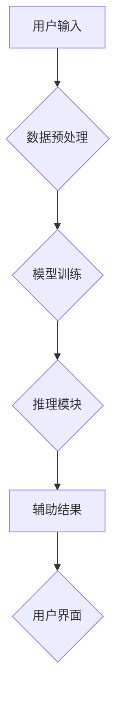

                 

## AI辅助编程：提高开发效率

> 关键词：人工智能、代码生成、代码补全、软件开发、效率提升、编程辅助、代码审查

### 1. 背景介绍

软件开发行业正经历着前所未有的变革，人工智能（AI）技术正在迅速渗透到各个环节，其中AI辅助编程尤为引人注目。随着软件开发的复杂性和规模不断扩大，传统的开发模式面临着效率低下、人力成本高昂等挑战。AI辅助编程旨在利用人工智能的强大能力，帮助程序员更高效地编写、测试和维护代码，从而加速软件开发周期，降低开发成本，提升软件质量。

### 2. 核心概念与联系

AI辅助编程的核心概念是利用机器学习算法分析和理解代码结构、语义和上下文，从而提供智能化的编程辅助功能。

**2.1 AI辅助编程的类型**

AI辅助编程可以分为以下几种类型：

* **代码生成:** 根据自然语言描述或部分代码片段，自动生成完整的代码。
* **代码补全:** 根据上下文提示，智能预测和补全程序员输入的代码。
* **代码重构:** 分析现有代码，并提供建议以优化代码结构、提高可读性和可维护性。
* **代码错误检测:** 利用机器学习模型识别代码中的潜在错误和漏洞。
* **代码文档生成:** 自动生成代码注释和文档，提高代码可理解性和维护性。

**2.2 AI辅助编程的架构**

AI辅助编程系统通常由以下几个主要模块组成：

* **数据预处理模块:** 收集和预处理代码数据，例如清洗、格式化、标记等。
* **模型训练模块:** 利用机器学习算法训练代码理解和生成模型。
* **推理模块:** 将用户输入的代码或自然语言描述输入模型，进行推理和分析，生成相应的辅助结果。
* **用户界面模块:** 提供用户友好的界面，方便用户与AI系统交互。

**Mermaid 流程图**



### 3. 核心算法原理 & 具体操作步骤

**3.1 算法原理概述**

AI辅助编程的核心算法主要包括自然语言处理（NLP）和机器学习（ML）算法。

* **自然语言处理（NLP）:** 用于理解和处理人类语言，例如代码中的注释、文档和自然语言描述。常见的NLP算法包括词嵌入、句法分析、语义分析等。
* **机器学习（ML）:** 用于训练模型，使其能够从代码数据中学习代码结构、语义和上下文关系。常见的ML算法包括监督学习、无监督学习和强化学习。

**3.2 算法步骤详解**

1. **数据收集和预处理:** 收集大量代码数据，并进行清洗、格式化、标记等预处理操作，以便于模型训练。
2. **特征提取:** 从代码数据中提取特征，例如语法结构、代码风格、变量名、函数名等，这些特征将作为模型训练的输入数据。
3. **模型训练:** 利用机器学习算法训练模型，例如使用监督学习算法训练代码生成模型，使用无监督学习算法训练代码补全模型。
4. **模型评估:** 使用测试数据评估模型的性能，例如代码生成模型的准确率、代码补全模型的完备度等。
5. **模型部署:** 将训练好的模型部署到实际应用环境中，提供AI辅助编程功能。

**3.3 算法优缺点**

**优点:**

* **提高开发效率:** 自动化代码生成、代码补全等任务，可以显著提高程序员的开发效率。
* **降低开发成本:** 通过自动化代码生成和错误检测，可以降低软件开发成本。
* **提升软件质量:** 代码重构和错误检测功能可以帮助提高软件质量。

**缺点:**

* **数据依赖:** AI辅助编程模型需要大量代码数据进行训练，数据质量和数量直接影响模型性能。
* **黑盒问题:** 一些AI模型的决策过程难以理解，这可能会导致程序员对模型结果缺乏信任。
* **伦理问题:** AI辅助编程可能会导致程序员依赖性过强，缺乏独立思考和解决问题的能力。

**3.4 算法应用领域**

AI辅助编程技术在软件开发领域有着广泛的应用前景，例如：

* **代码生成工具:** 自动生成代码模板、函数、类等，简化代码编写过程。
* **代码补全工具:** 智能预测和补全程序员输入的代码，提高代码编写效率。
* **代码审查工具:** 自动检测代码中的潜在错误和漏洞，提高代码质量。
* **代码文档生成工具:** 自动生成代码注释和文档，提高代码可理解性和维护性。

### 4. 数学模型和公式 & 详细讲解 & 举例说明

**4.1 数学模型构建**

AI辅助编程中常用的数学模型包括：

* **词嵌入模型:** 将代码中的单词或符号映射到低维向量空间，捕捉单词之间的语义关系。常见的词嵌入模型包括Word2Vec、GloVe等。
* **循环神经网络（RNN）:** 用于处理序列数据，例如代码中的语句和函数调用。RNN可以学习代码的上下文关系，并用于代码生成、代码补全等任务。
* **Transformer模型:** 是一种更强大的序列模型，可以更有效地捕捉长距离依赖关系。Transformer模型在自然语言处理领域取得了突破性进展，也逐渐应用于代码理解和生成任务。

**4.2 公式推导过程**

词嵌入模型的训练目标是学习一个词向量空间，使得相似的单词拥有相似的向量表示。常用的训练方法是基于负采样的最大似然估计。

假设我们有一个词典V，每个单词对应一个词向量v。训练目标是最大化以下似然函数：

$$
\mathcal{L} = \prod_{i=1}^{N} \prod_{j \in C_i} \sigma(v_i \cdot v_j) \prod_{k \notin C_i} \sigma(-v_i \cdot v_k)
$$

其中：

* N 是训练语料库中单词总数。
* $C_i$ 是单词 $i$ 的上下文词集合。
* $\sigma$ 是sigmoid函数。

**4.3 案例分析与讲解**

假设我们有一个词典V = {"cat", "dog", "run", "jump"}, 训练目标是学习词向量表示。

通过训练，模型可能会学习到以下词向量表示：

* cat: [0.2, 0.3, 0.1, 0.4]
* dog: [0.1, 0.4, 0.3, 0.2]
* run: [0.5, 0.1, 0.4, 0.2]
* jump: [0.3, 0.2, 0.5, 0.1]

可以观察到，相似的单词拥有相似的向量表示。例如，"cat" 和 "dog" 都是动物，它们的向量表示比较接近。

### 5. 项目实践：代码实例和详细解释说明

**5.1 开发环境搭建**

* Python 3.x
* TensorFlow 或 PyTorch
* Jupyter Notebook

**5.2 源代码详细实现**

以下是一个简单的代码生成示例，使用RNN模型生成Python代码片段：

```python
import tensorflow as tf

# 定义RNN模型
model = tf.keras.Sequential([
    tf.keras.layers.Embedding(input_dim=vocab_size, output_dim=embedding_dim),
    tf.keras.layers.LSTM(units=128),
    tf.keras.layers.Dense(units=vocab_size, activation='softmax')
])

# 训练模型
model.compile(optimizer='adam', loss='sparse_categorical_crossentropy', metrics=['accuracy'])
model.fit(x_train, y_train, epochs=10)

# 代码生成
input_sequence = ['def', 'function', '(', 'x', ')']
generated_sequence = model.predict(input_sequence)
```

**5.3 代码解读与分析**

* **Embedding层:** 将代码中的单词映射到低维向量空间。
* **LSTM层:** 学习代码的上下文关系。
* **Dense层:** 将LSTM输出映射到每个单词的概率分布。
* **训练过程:** 使用训练数据训练模型，使其能够生成符合语法规则和语义的代码片段。

**5.4 运行结果展示**

模型训练完成后，可以输入一段代码片段，模型会根据上下文关系生成后续代码片段。

### 6. 实际应用场景

**6.1 代码生成工具**

AI辅助编程技术可以用于开发代码生成工具，例如：

* **GitHub Copilot:** 基于OpenAI的 Codex模型，可以根据自然语言描述或部分代码片段自动生成代码。
* **Tabnine:** 基于深度学习的代码补全工具，可以智能预测和补全程序员输入的代码。

**6.2 代码审查工具**

AI辅助编程技术可以用于开发代码审查工具，例如：

* **DeepCode:** 利用深度学习模型检测代码中的潜在错误和漏洞。
* **Codacy:** 基于静态分析和机器学习的代码质量分析工具，可以识别代码中的潜在问题和建议改进方案。

**6.3 代码文档生成工具**

AI辅助编程技术可以用于开发代码文档生成工具，例如：

* **DocAI:** 利用自然语言处理技术自动生成代码注释和文档。
* **Google Cloud AI Platform:** 提供代码文档生成服务，可以自动生成代码注释和API文档。

**6.4 未来应用展望**

AI辅助编程技术在未来将有更广泛的应用场景，例如：

* **自动测试代码生成:** 利用AI技术自动生成测试用例，提高软件测试效率。
* **代码迁移和转换:** 利用AI技术自动将代码从一种编程语言迁移到另一种编程语言。
* **个性化代码建议:** 根据程序员的编程习惯和风格，提供个性化的代码建议。

### 7. 工具和资源推荐

**7.1 学习资源推荐**

* **Stanford CS224N: Natural Language Processing with Deep Learning:** https://web.stanford.edu/class/cs224n/
* **DeepLearning.AI: TensorFlow Developer Certificate:** https://www.deeplearning.ai/tensorflow-developer/
* **Hugging Face Transformers:** https://huggingface.co/docs/transformers/index

**7.2 开发工具推荐**

* **GitHub Copilot:** https://copilot.github.com/
* **Tabnine:** https://www.tabnine.com/
* **DeepCode:** https://deepcode.ai/

**7.3 相关论文推荐**

* **Attention Is All You Need:** https://arxiv.org/abs/1706.03762
* **BERT: Pre-training of Deep Bidirectional Transformers for Language Understanding:** https://arxiv.org/abs/1810.04805
* **CodeBERT: A Pre-trained Language Model for Code:** https://arxiv.org/abs/2006.05787

### 8. 总结：未来发展趋势与挑战

**8.1 研究成果总结**

AI辅助编程技术取得了显著进展，例如：代码生成、代码补全、代码审查等功能已经应用于实际开发场景。

**8.2 未来发展趋势**

* **更强大的模型:** 研究更强大的AI模型，例如基于Transformer的代码理解和生成模型。
* **更个性化的体验:** 根据程序员的编程习惯和风格，提供更个性化的代码建议和辅助功能。
* **跨语言支持:** 支持多种编程语言，实现代码迁移和转换功能。

**8.3 面临的挑战**

* **数据质量和数量:** AI模型需要大量高质量的代码数据进行训练，数据获取和预处理是一个挑战。
* **黑盒问题:** 一些AI模型的决策过程难以理解，这可能会导致程序员对模型结果缺乏信任。
* **伦理问题:** AI辅助编程可能会导致程序员依赖性过强，缺乏独立思考和解决问题的能力。

**8.4 研究展望**

未来研究方向包括：

* **解释性AI:** 研究如何解释AI模型的决策过程，提高模型的可解释性和信任度。
* **人类-AI协作:** 研究如何更好地融合人类和AI的优势，实现更有效的代码开发协作。
* **AI伦理:** 研究AI辅助编程的伦理问题，确保AI技术被安全和负责任地应用。

### 9. 附录：常见问题与解答

**9.1 Q: AI辅助编程会取代程序员吗？**

A: AI辅助编程技术可以提高程序员的开发效率，但不会取代程序员。程序员仍然需要负责软件设计、架构、测试和维护等工作，AI只是辅助工具，可以帮助程序员更高效地完成工作。

**9.2 Q: 如何选择合适的AI辅助编程工具？**

A: 选择合适的AI辅助编程工具需要根据实际需求和编程语言等因素进行考虑。可以参考开源社区的评价和使用案例，选择适合自己的工具。

**9.3 Q: 如何学习AI辅助编程技术？**

A: 可以通过在线课程、书籍和开源项目学习AI辅助编程技术。一些在线平台提供AI编程相关的课程和教程，例如DeepLearning.AI和Coursera。


作者：禅与计算机程序设计艺术 / Zen and the Art of Computer Programming 
<end_of_turn>

