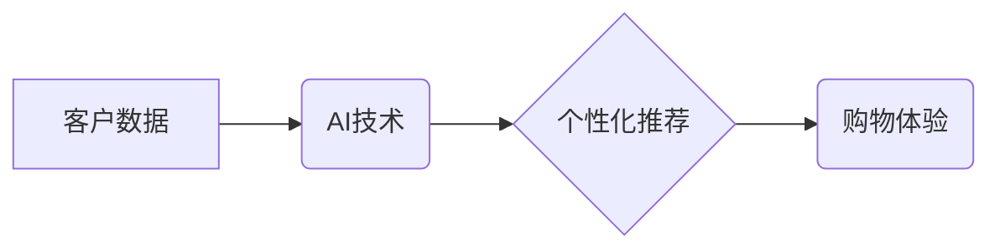

                 

## AI零售：如何利用客户数据提升购物体验

> 关键词：人工智能、零售、客户数据、个性化推荐、购物体验、机器学习、深度学习、预测分析

## 1. 背景介绍

零售业正处于数字化转型和智能化升级的关键时期。随着电商平台的蓬勃发展和移动互联网的普及，消费者购物习惯发生了深刻变化。他们更加注重个性化、便捷性和体验感。为了应对激烈的市场竞争，零售企业需要不断探索新的商业模式和技术手段，提升客户体验，增强客户粘性。

人工智能（AI）作为新一代信息技术，正在深刻地改变零售业的格局。AI技术能够通过对海量客户数据的分析和挖掘，洞察消费者需求，提供个性化服务，优化运营效率，从而提升购物体验，创造新的商业价值。

## 2. 核心概念与联系

**2.1 核心概念**

* **客户数据：**指零售企业在经营过程中收集到的关于客户的各种信息，包括客户基本信息、购买历史、浏览记录、评价反馈、社交行为等。
* **AI技术：**指能够模拟人类智能行为的计算机技术，例如机器学习、深度学习、自然语言处理等。
* **个性化推荐：**根据客户的兴趣、偏好和行为模式，推荐个性化的商品和服务。
* **购物体验：**指客户在购物过程中所感受到的整体感受，包括商品发现、浏览、选择、购买、售后等各个环节。

**2.2 架构关系**



**2.3 核心联系**

AI技术通过对客户数据的分析和挖掘，能够实现个性化推荐，从而提升购物体验。

## 3. 核心算法原理 & 具体操作步骤

**3.1 算法原理概述**

在AI零售中，常用的算法包括协同过滤、内容过滤、基于知识的推荐等。

* **协同过滤：**根据用户的历史行为数据，预测用户对特定商品的兴趣。
* **内容过滤：**根据商品的特征和描述，推荐与用户兴趣相符的商品。
* **基于知识的推荐：**利用商品之间的关联关系和用户偏好知识，推荐商品。

**3.2 算法步骤详解**

以协同过滤算法为例，其具体步骤如下：

1. **数据收集：**收集用户对商品的评分或购买记录等数据。
2. **数据预处理：**对数据进行清洗、去噪、标准化等处理。
3. **相似用户/商品计算：**根据用户行为数据或商品特征，计算用户之间的相似度或商品之间的相似度。
4. **推荐生成：**根据用户与相似用户的评分或购买记录，预测用户对特定商品的评分或购买意愿，并生成推荐列表。

**3.3 算法优缺点**

* **优点：**能够提供个性化推荐，提升用户体验。
* **缺点：**容易出现冷启动问题，数据稀疏性问题。

**3.4 算法应用领域**

协同过滤算法广泛应用于电商平台、音乐平台、视频平台等领域，用于个性化推荐商品、音乐、视频等内容。

## 4. 数学模型和公式 & 详细讲解 & 举例说明

**4.1 数学模型构建**

协同过滤算法的核心是计算用户之间的相似度或商品之间的相似度。常用的相似度度量方法包括余弦相似度、皮尔逊相关系数等。

**4.2 公式推导过程**

* **余弦相似度：**

$$
\text{相似度} = \frac{\mathbf{u} \cdot \mathbf{v}}{\|\mathbf{u}\| \|\mathbf{v}\|}
$$

其中，$\mathbf{u}$ 和 $\mathbf{v}$ 分别表示两个用户的评分向量，$\cdot$ 表示点积，$\|\mathbf{u}\|$ 和 $\|\mathbf{v}\|$ 分别表示两个向量的模长。

* **皮尔逊相关系数：**

$$
\text{相似度} = \frac{\sum_{i=1}^{n}(u_i - \bar{u})(v_i - \bar{v})}{\sqrt{\sum_{i=1}^{n}(u_i - \bar{u})^2} \sqrt{\sum_{i=1}^{n}(v_i - \bar{v})^2}}
$$

其中，$u_i$ 和 $v_i$ 分别表示两个用户对第 $i$ 个商品的评分，$\bar{u}$ 和 $\bar{v}$ 分别表示两个用户的平均评分。

**4.3 案例分析与讲解**

假设有两个用户A和B，他们对三部电影的评分如下：

| 电影 | 用户A | 用户B |
|---|---|---|
| 电影1 | 5 | 4 |
| 电影2 | 3 | 5 |
| 电影3 | 4 | 3 |

我们可以使用余弦相似度或皮尔逊相关系数计算用户A和B之间的相似度。

## 5. 项目实践：代码实例和详细解释说明

**5.1 开发环境搭建**

* Python 3.x
* scikit-learn 库
* pandas 库
* numpy 库

**5.2 源代码详细实现**

```python
import pandas as pd
from sklearn.metrics.pairwise import cosine_similarity

# 加载用户评分数据
ratings_data = pd.read_csv('ratings.csv')

# 计算用户之间的余弦相似度
user_similarity = cosine_similarity(ratings_data)

# 获取用户A与所有用户的相似度
user_a_similarity = user_similarity[0]

# 获取与用户A相似度最高的5个用户
top_5_similar_users = user_a_similarity.argsort()[-5:][::-1]

# 打印与用户A相似度最高的5个用户
print('与用户A相似度最高的5个用户：', top_5_similar_users)
```

**5.3 代码解读与分析**

* 首先，我们加载用户评分数据。
* 然后，我们使用scikit-learn库中的cosine_similarity函数计算用户之间的余弦相似度。
* 接着，我们获取用户A与所有用户的相似度，并排序，选择相似度最高的5个用户。

**5.4 运行结果展示**

运行代码后，会输出与用户A相似度最高的5个用户的索引。

## 6. 实际应用场景

**6.1 个性化商品推荐**

AI零售可以根据用户的兴趣、偏好和购买历史，推荐个性化的商品，提升用户购物体验。

**6.2 个性化营销活动**

AI零售可以根据用户的行为数据，精准推送营销活动，提高营销活动转化率。

**6.3 智能客服**

AI零售可以利用自然语言处理技术，开发智能客服系统，为用户提供24小时在线服务。

**6.4 库存优化**

AI零售可以预测商品需求，优化库存管理，降低库存成本。

**6.5 供应链管理**

AI零售可以优化供应链流程，提高物流效率。

## 7. 工具和资源推荐

**7.1 学习资源推荐**

* **书籍：**
    * 《深度学习》
    * 《机器学习实战》
    * 《Python机器学习》
* **在线课程：**
    * Coursera
    * edX
    * Udacity

**7.2 开发工具推荐**

* **Python:** 
    * scikit-learn
    * TensorFlow
    * PyTorch
* **云平台:**
    * AWS
    * Azure
    * Google Cloud

**7.3 相关论文推荐**

* **协同过滤算法：**
    * "Collaborative Filtering: A User-Based Approach"
    * "Memory-Based Collaborative Filtering"
* **深度学习推荐系统：**
    * "Deep Learning for Recommender Systems"
    * "Neural Collaborative Filtering"

## 8. 总结：未来发展趋势与挑战

**8.1 研究成果总结**

AI零售技术已经取得了显著的成果，能够有效提升购物体验，创造新的商业价值。

**8.2 未来发展趋势**

* **更精准的个性化推荐：**利用更先进的AI算法，例如深度学习，实现更精准的个性化推荐。
* **更丰富的购物体验：**利用AR/VR技术，为用户提供更丰富的购物体验。
* **更智能的运营管理：**利用AI技术，优化运营管理，提高效率。

**8.3 面临的挑战**

* **数据隐私保护：**如何保护用户数据隐私，是AI零售发展面临的重要挑战。
* **算法可解释性：**如何提高AI算法的可解释性，让用户理解推荐结果，是另一个挑战。
* **技术伦理：**如何确保AI技术在零售领域的应用符合伦理道德，是需要认真思考的问题。

**8.4 研究展望**

未来，AI零售技术将继续发展，为消费者提供更智能、更便捷、更个性化的购物体验。


## 9. 附录：常见问题与解答

**9.1 如何解决冷启动问题？**

冷启动问题是指在用户数据稀疏的情况下，难以进行准确的推荐。

解决方法：

* 利用用户画像信息，例如年龄、性别、兴趣爱好等，进行推荐。
* 利用商品的特征信息，例如类别、品牌、价格等，进行推荐。
* 利用协同过滤算法的扩展方法，例如基于内容的协同过滤。

**9.2 如何提高算法的可解释性？**

提高算法可解释性的方法包括：

* 使用可解释的机器学习算法，例如决策树、线性回归等。
* 使用可视化技术，例如特征重要性分析、决策路径可视化等，展示算法的决策过程。
* 开发解释性AI系统，能够解释AI模型的决策结果。


作者：禅与计算机程序设计艺术 / Zen and the Art of Computer Programming 
<end_of_turn>

