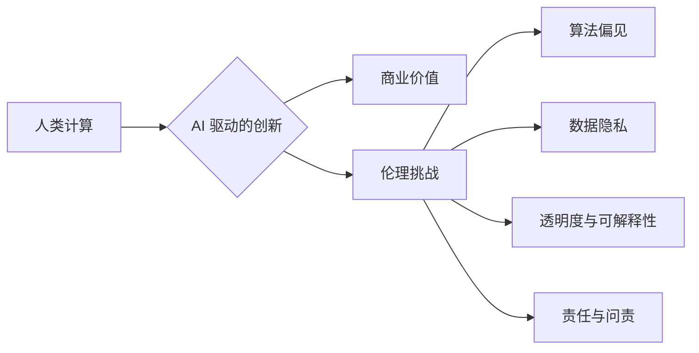

                 

## AI驱动的创新：人类计算在商业中的道德考虑

> 关键词：人工智能、商业伦理、人类计算、算法偏见、数据隐私、透明度、可解释性、责任

### 1. 背景介绍

人工智能 (AI) 正以惊人的速度发展，并在各个行业，包括商业领域，掀起了一场革命。从个性化推荐到自动化流程，AI 正在改变着我们工作、生活和与世界互动的方式。然而，随着 AI 技术的进步，它带来的伦理挑战也日益凸显。

商业界对 AI 的应用热情高涨，但我们必须谨慎地权衡其潜在益处和风险。AI 驱动的创新必须建立在道德基础之上，以确保其对人类社会和个体的益处大于其潜在危害。

### 2. 核心概念与联系

**2.1 人类计算与 AI**

人类计算是指人类利用其认知能力、经验和判断力进行计算和决策的过程。传统商业模式主要依赖于人类计算，但随着 AI 的发展，机器开始承担越来越多的计算任务。AI 算法能够处理海量数据，识别模式，并做出预测，从而提高效率、降低成本，并创造新的商业价值。

**2.2 AI 伦理与商业实践**

AI 伦理是指在设计、开发和部署 AI 系统时，需要遵循的道德原则和规范。商业界需要将 AI 伦理融入其实践中，以确保 AI 技术的应用符合社会价值观和道德标准。

**2.3 核心概念架构**



### 3. 核心算法原理 & 具体操作步骤

**3.1 算法原理概述**

机器学习 (ML) 是 AI 的核心技术之一，它允许机器从数据中学习并改进其性能。常见的 ML 算法包括：

* **监督学习:** 利用标记数据训练模型，预测未来结果。
* **无监督学习:** 从未标记数据中发现模式和结构。
* **强化学习:** 通过试错学习，最大化奖励并最小化惩罚。

**3.2 算法步骤详解**

1. **数据收集和预处理:** 收集相关数据并进行清洗、转换和特征工程。
2. **模型选择:** 根据任务需求选择合适的 ML 算法。
3. **模型训练:** 利用训练数据训练模型，调整模型参数以最小化误差。
4. **模型评估:** 使用测试数据评估模型性能，并进行调优。
5. **模型部署:** 将训练好的模型部署到实际应用场景中。

**3.3 算法优缺点**

* **优点:** 能够处理复杂数据，自动发现模式，提高预测精度。
* **缺点:** 需要大量数据进行训练，容易受到数据偏差的影响，解释性较差。

**3.4 算法应用领域**

* **个性化推荐:** 基于用户行为和偏好推荐商品或服务。
* **欺诈检测:** 识别异常交易行为，防止欺诈活动。
* **风险评估:** 评估客户信用风险，制定相应的策略。
* **客户服务:** 利用聊天机器人提供自动客户服务。

### 4. 数学模型和公式 & 详细讲解 & 举例说明

**4.1 数学模型构建**

假设我们有一个分类问题，目标是根据用户的特征预测是否会购买某个商品。我们可以使用逻辑回归模型，其数学模型如下：

$$
P(y=1|x) = \frac{1}{1 + e^{-(w^T x + b)}}
$$

其中：

* $P(y=1|x)$ 是用户购买商品的概率。
* $x$ 是用户的特征向量。
* $w$ 是模型参数向量。
* $b$ 是模型偏置项。

**4.2 公式推导过程**

逻辑回归模型基于 sigmoid 函数，该函数将任意实数映射到 (0, 1) 之间，从而表示概率。模型参数 $w$ 和 $b$ 通过最大似然估计方法进行训练，目标是最大化模型对训练数据的预测准确率。

**4.3 案例分析与讲解**

假设我们有一个电商平台，想要预测用户是否会购买某个商品。我们可以收集用户的特征数据，例如年龄、性别、购买历史等，并使用逻辑回归模型进行训练。训练完成后，我们可以将模型部署到平台上，根据用户的特征预测其购买商品的概率。

### 5. 项目实践：代码实例和详细解释说明

**5.1 开发环境搭建**

可以使用 Python 语言和 scikit-learn 库进行机器学习开发。需要安装 Python 和相关库，例如 NumPy、Pandas 和 scikit-learn。

**5.2 源代码详细实现**

```python
from sklearn.linear_model import LogisticRegression
from sklearn.model_selection import train_test_split
from sklearn.metrics import accuracy_score

# 加载数据
data = pd.read_csv('data.csv')

# 分割数据
X = data.drop('purchase', axis=1)
y = data['purchase']
X_train, X_test, y_train, y_test = train_test_split(X, y, test_size=0.2, random_state=42)

# 创建逻辑回归模型
model = LogisticRegression()

# 训练模型
model.fit(X_train, y_train)

# 预测结果
y_pred = model.predict(X_test)

# 计算准确率
accuracy = accuracy_score(y_test, y_pred)
print('准确率:', accuracy)
```

**5.3 代码解读与分析**

这段代码首先加载数据，然后将数据分割成训练集和测试集。接着，创建逻辑回归模型并进行训练。最后，使用训练好的模型预测测试集结果，并计算模型的准确率。

**5.4 运行结果展示**

运行代码后，会输出模型的准确率。

### 6. 实际应用场景

**6.1 个性化推荐**

AI 驱动的个性化推荐系统可以根据用户的历史行为、偏好和兴趣推荐相关商品或服务，提高用户体验和转化率。

**6.2 自动化流程**

AI 可以自动化许多商业流程，例如数据录入、客户服务和财务管理，提高效率和降低成本。

**6.3 预测分析**

AI 可以分析历史数据，预测未来的趋势和事件，帮助企业做出更明智的决策。

**6.4 未来应用展望**

随着 AI 技术的不断发展，其在商业领域的应用将更加广泛和深入。例如，AI 可以用于个性化营销、智能客服、自动驾驶和医疗诊断等领域。

### 7. 工具和资源推荐

**7.1 学习资源推荐**

* **在线课程:** Coursera、edX、Udacity 等平台提供丰富的 AI 和机器学习课程。
* **书籍:** 《深度学习》、《机器学习实战》等书籍是学习 AI 的经典教材。
* **开源项目:** TensorFlow、PyTorch 等开源项目提供了丰富的 AI 工具和资源。

**7.2 开发工具推荐**

* **Python:** Python 是 AI 开发最常用的编程语言。
* **scikit-learn:** scikit-learn 是 Python 的机器学习库，提供各种算法和工具。
* **TensorFlow:** TensorFlow 是 Google 开发的开源深度学习框架。
* **PyTorch:** PyTorch 是 Facebook 开发的开源深度学习框架。

**7.3 相关论文推荐**

* **《ImageNet Classification with Deep Convolutional Neural Networks》**
* **《Attention Is All You Need》**
* **《BERT: Pre-training of Deep Bidirectional Transformers for Language Understanding》**

### 8. 总结：未来发展趋势与挑战

**8.1 研究成果总结**

近年来，AI 技术取得了长足的进步，在各个领域都取得了显著的成果。例如，在图像识别、自然语言处理和语音识别等领域，AI 系统已经达到了或超过了人类水平。

**8.2 未来发展趋势**

* **更强大的计算能力:** 随着硬件技术的进步，AI 系统将拥有更强大的计算能力，能够处理更复杂的数据和任务。
* **更广泛的应用场景:** AI 将应用于更多领域，例如医疗、教育、金融和交通等。
* **更智能的 AI 系统:** AI 系统将更加智能，能够更好地理解和响应人类的需求。

**8.3 面临的挑战**

* **算法偏见:** AI 算法可能受到训练数据中的偏见影响，导致不公平的结果。
* **数据隐私:** AI 系统需要大量数据进行训练，这可能会侵犯用户的隐私。
* **透明度与可解释性:** 许多 AI 算法是黑箱模型，难以解释其决策过程。
* **责任与问责:** 当 AI 系统做出错误决策时，谁应该承担责任？

**8.4 研究展望**

未来，我们需要更加关注 AI 的伦理问题，确保其应用符合人类价值观和道德标准。我们需要开发更加公平、透明和可解释的 AI 算法，并建立相应的监管机制，以引导 AI 技术的健康发展。

### 9. 附录：常见问题与解答

**9.1 如何解决 AI 算法的偏见问题？**

* 使用更加多样化的训练数据。
* 开发能够识别和缓解算法偏见的算法。
* 设定明确的伦理准则，并对 AI 系统进行定期评估。

**9.2 如何保护用户数据隐私？**

* 采用数据加密和匿名化技术。
* 明确告知用户数据的使用目的和方式。
* 遵守相关的隐私保护法规。

**9.3 如何提高 AI 系统的透明度和可解释性？**

* 使用更加透明的算法模型。
* 开发能够解释 AI 系统决策过程的工具。
* 鼓励对 AI 系统进行公开审计。


作者：禅与计算机程序设计艺术 / Zen and the Art of Computer Programming 
<end_of_turn>

