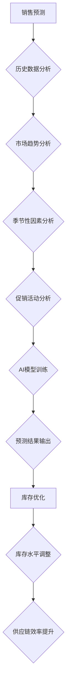

                 

## AI驱动的销售预测与库存优化

> 关键词：销售预测、库存优化、机器学习、深度学习、时间序列分析、预测模型、供应链管理

## 1. 背景介绍

在当今数据爆炸的时代，企业面临着越来越大的压力，需要准确预测未来销售需求，并优化库存水平以降低成本、提高效率。传统的销售预测方法往往依赖于历史数据和专家经验，难以捕捉复杂市场变化的趋势。而人工智能（AI）技术的兴起为企业提供了全新的解决方案。

AI驱动的销售预测与库存优化利用机器学习和深度学习算法，从海量数据中挖掘潜在的模式和关系，构建更精准的预测模型。通过对历史销售数据、市场趋势、季节性因素、促销活动等多方面数据的分析，AI系统能够更准确地预测未来销售需求，并根据预测结果优化库存水平，从而实现库存成本的降低、服务水平的提升和供应链效率的提高。

## 2. 核心概念与联系

### 2.1 销售预测

销售预测是指根据历史数据、市场趋势和各种因素分析，预测未来一段时间内的销售额、销量等指标。

### 2.2 库存优化

库存优化是指通过科学的方法管理库存水平，以达到最小化库存成本、最大化服务水平的目标。

### 2.3 AI技术应用

AI技术在销售预测与库存优化中的应用主要包括：

* **机器学习算法:** 
    * 回归算法（如线性回归、逻辑回归）用于预测连续型变量，如销售额。
    * 分类算法（如决策树、支持向量机）用于预测离散型变量，如产品是否畅销。
    * 聚类算法（如K-means）用于将客户或产品进行分组，以便针对不同群体的需求进行个性化预测。
* **深度学习算法:** 
    * 神经网络能够学习更复杂的非线性关系，适用于处理海量数据和复杂场景的预测。
    * 长短期记忆网络（LSTM）能够捕捉时间序列数据中的长期依赖关系，适用于预测具有季节性或趋势性的销售数据。

**核心概念与联系流程图:**



## 3. 核心算法原理 & 具体操作步骤

### 3.1 算法原理概述

在AI驱动的销售预测与库存优化中，常用的算法包括回归算法、分类算法和时间序列分析算法。

* **回归算法:** 用于预测连续型变量，例如销售额。常见的回归算法包括线性回归、逻辑回归、支持向量机回归等。
* **分类算法:** 用于预测离散型变量，例如产品是否畅销。常见的分类算法包括决策树、支持向量机分类、随机森林等。
* **时间序列分析算法:** 用于分析具有时间依赖性的数据，例如销售数据。常见的算法包括ARIMA模型、SARIMA模型、Prophet模型等。

### 3.2 算法步骤详解

**以ARIMA模型为例，详细说明其步骤:**

1. **数据收集和预处理:** 收集历史销售数据，并进行清洗、处理，例如处理缺失值、异常值等。
2. **数据分析:** 对历史销售数据进行分析，确定其时间序列特征，例如趋势、季节性、随机波动等。
3. **模型选择:** 根据数据特征选择合适的ARIMA模型参数(p, d, q)。
4. **模型训练:** 使用训练数据训练ARIMA模型，并评估模型的预测精度。
5. **模型预测:** 使用训练好的模型预测未来一段时间内的销售数据。
6. **结果评估:** 对预测结果进行评估，并根据评估结果调整模型参数或选择其他模型。

### 3.3 算法优缺点

**ARIMA模型的优缺点:**

* **优点:** 
    * 能够捕捉时间序列数据中的趋势、季节性等特征。
    * 模型参数相对容易解释和调整。
* **缺点:** 
    * 难以处理非线性关系和复杂数据。
    * 对数据质量要求较高，需要满足一定的平稳性假设。

### 3.4 算法应用领域

ARIMA模型广泛应用于以下领域:

* **销售预测:** 预测未来一段时间内的销售额、销量等指标。
* **库存优化:** 根据预测结果优化库存水平，降低库存成本。
* **财务预测:** 预测未来一段时间内的收入、支出、利润等指标。
* **经济预测:** 预测经济增长率、通货膨胀率等指标。

## 4. 数学模型和公式 & 详细讲解 & 举例说明

### 4.1 数学模型构建

ARIMA模型的数学模型可以表示为：

$$
y_t = c + \phi_1 y_{t-1} + \phi_2 y_{t-2} + ... + \phi_p y_{t-p} + \theta_1 \epsilon_{t-1} + \theta_2 \epsilon_{t-2} + ... + \theta_q \epsilon_{t-q} + \epsilon_t
$$

其中：

* $y_t$ 表示时间t的观测值。
* $c$ 表示截距项。
* $\phi_i$ 表示自回归系数，用于描述过去观测值对当前观测值的影响。
* $\theta_i$ 表示移动平均系数，用于描述过去误差项对当前观测值的影响。
* $\epsilon_t$ 表示时间t的随机误差项。
* $p$ 表示自回归阶数。
* $q$ 表示移动平均阶数。

### 4.2 公式推导过程

ARIMA模型的推导过程较为复杂，涉及到时间序列分析、统计学和线性代数等多个领域。

### 4.3 案例分析与讲解

假设一家零售公司想要预测未来三个月的销售额。他们收集了过去两年的销售数据，并使用ARIMA模型进行预测。

* 经过数据分析，确定ARIMA模型的参数为(p, d, q) = (2, 1, 1)。
* 使用训练数据训练ARIMA模型，并评估模型的预测精度。
* 使用训练好的模型预测未来三个月的销售额。

## 5. 项目实践：代码实例和详细解释说明

### 5.1 开发环境搭建

* Python 3.x
* pandas
* statsmodels
* matplotlib

### 5.2 源代码详细实现

```python
import pandas as pd
from statsmodels.tsa.arima.model import ARIMA
from matplotlib import pyplot as plt

# 加载销售数据
data = pd.read_csv('sales_data.csv', index_col='Date', parse_dates=True)

# 训练ARIMA模型
model = ARIMA(data['Sales'], order=(2, 1, 1))
model_fit = model.fit()

# 预测未来三个月的销售额
forecast = model_fit.predict(start=len(data), end=len(data) + 2)

# 可视化预测结果
plt.plot(data['Sales'], label='历史数据')
plt.plot(forecast, label='预测结果')
plt.legend()
plt.show()
```

### 5.3 代码解读与分析

* 首先，使用pandas库加载销售数据，并设置日期列为索引。
* 然后，使用statsmodels库中的ARIMA模型训练模型，并指定模型参数(p, d, q)。
* 接着，使用训练好的模型预测未来三个月的销售额。
* 最后，使用matplotlib库可视化预测结果。

### 5.4 运行结果展示

运行代码后，将生成一个包含历史销售数据和预测结果的图表。

## 6. 实际应用场景

AI驱动的销售预测与库存优化在各个行业都有广泛的应用场景，例如：

* **零售业:** 预测商品需求，优化库存水平，减少库存积压和缺货。
* **制造业:** 预测生产需求，优化生产计划，提高生产效率。
* **物流业:** 预测运输需求，优化运输路线，降低运输成本。
* **金融业:** 预测客户需求，优化产品服务，提高客户满意度。

### 6.4 未来应用展望

随着AI技术的不断发展，AI驱动的销售预测与库存优化将更加智能化、精准化和自动化。未来，我们将看到以下趋势:

* **更复杂的模型:** 采用更复杂的深度学习模型，例如Transformer模型，以更好地捕捉数据中的复杂关系。
* **更丰富的预测指标:** 不仅预测销售额和销量，还可以预测客户行为、市场趋势等更丰富的指标。
* **更智能的决策支持:** 将AI模型与其他业务系统集成，提供更智能的决策支持，帮助企业做出更优的决策。

## 7. 工具和资源推荐

### 7.1 学习资源推荐

* **书籍:**
    * 《机器学习》 - 周志华
    * 《深度学习》 - Ian Goodfellow
* **在线课程:**
    * Coursera: Machine Learning
    * edX: Deep Learning
* **博客和网站:**
    * Towards Data Science
    * Machine Learning Mastery

### 7.2 开发工具推荐

* **Python:** 
    * pandas
    * scikit-learn
    * TensorFlow
    * PyTorch
* **R:** 
    * forecast
    * caret

### 7.3 相关论文推荐

* **ARIMA模型:**
    * Box, G. E. P., & Jenkins, G. M. (1976). Time series analysis: Forecasting and control. Holden-Day.
* **深度学习:**
    * Goodfellow, I., Bengio, Y., & Courville, A. (2016). Deep learning. MIT press.

## 8. 总结：未来发展趋势与挑战

### 8.1 研究成果总结

AI驱动的销售预测与库存优化取得了显著的成果，能够帮助企业提高预测精度、降低库存成本、提升供应链效率。

### 8.2 未来发展趋势

未来，AI驱动的销售预测与库存优化将朝着更智能化、精准化和自动化方向发展，并应用于更多领域。

### 8.3 面临的挑战

* **数据质量:** AI模型的性能依赖于数据质量，需要不断提高数据采集、清洗和处理的效率。
* **模型解释性:** 许多AI模型的内部机制难以解释，需要开发更可解释的模型。
* **伦理问题:** AI技术的应用需要考虑伦理问题，例如数据隐私和算法偏见。

### 8.4 研究展望

未来研究方向包括:

* 开发更复杂、更精准的AI模型。
* 提高模型的解释性和可信度。
* 研究AI技术的伦理问题，并制定相应的规范和标准。

## 9. 附录：常见问题与解答

* **Q1: ARIMA模型适合所有类型的销售数据吗？**

* **A1:** ARIMA模型适用于具有时间依赖性的数据，例如销售数据。但对于非线性关系和复杂数据，ARIMA模型可能不适用。

* **Q2: 如何选择ARIMA模型的参数(p, d, q)?**

* **A2:** 可以使用信息准则，例如AIC、BIC等，来选择最优的模型参数。

* **Q3: 如何评估ARIMA模型的预测精度？**

* **A3:** 可以使用均方误差（MSE）、平均绝对误差（MAE）等指标来评估模型的预测精度。


作者：禅与计算机程序设计艺术 / Zen and the Art of Computer Programming 
<end_of_turn>

