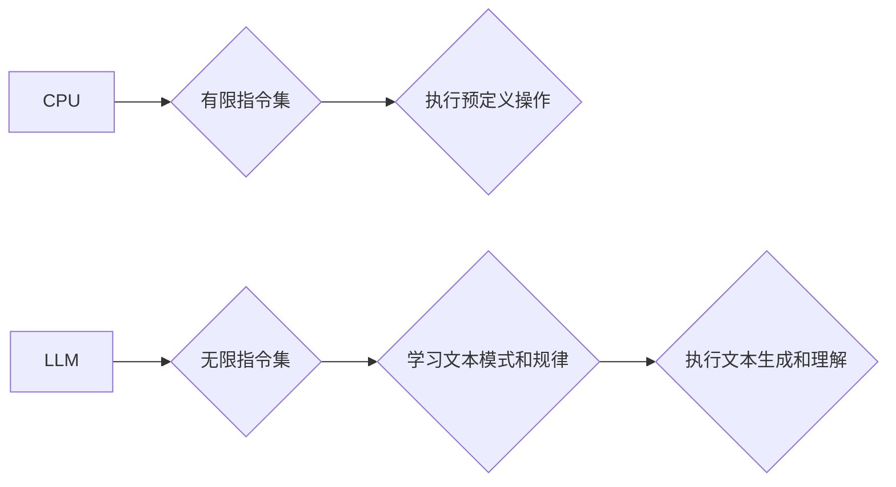

                 

## CPU有限指令集 VS LLM无限指令集

> 关键词：CPU, LLM, 指令集, 机器学习, 自然语言处理, 深度学习, 计算模型

## 1. 背景介绍

在计算机科学的漫长发展历程中，我们见证了从简单的指令集处理器到如今强大的深度学习模型的演变。CPU，作为计算机的核心，长期以来以其有限的指令集为基础，执行着各种计算任务。而近年来兴起的LLM（大型语言模型），则凭借其无限的指令集，展现出惊人的文本生成、理解和翻译能力。

CPU和LLM代表着两种截然不同的计算模型，它们各自拥有独特的优势和局限性。理解两者之间的差异，对于我们深入探索人工智能的未来发展方向至关重要。

## 2. 核心概念与联系

### 2.1 CPU指令集

CPU指令集是指处理器能够理解和执行的一系列指令。这些指令通常是预先定义的，并且以二进制代码的形式存储在CPU内部。每个指令对应一个特定的操作，例如加减乘除、逻辑运算、数据移动等。

CPU指令集的有限性决定了其计算能力的边界。尽管现代CPU拥有数百万甚至数十亿个晶体管，但其指令集仍然相对有限，无法直接处理复杂的逻辑推理和模式识别任务。

### 2.2 LLM无限指令集

LLM是一种基于深度学习的强大人工智能模型，其核心是Transformer网络架构。Transformer网络通过自注意力机制，能够捕捉文本序列中的长距离依赖关系，从而实现更深层次的语义理解。

LLM的“无限指令集”指的是其能够通过训练数据学习到各种各样的文本生成和理解规则。这些规则并非预先定义的指令，而是从海量文本数据中自动提取出来的模式和规律。

### 2.3 核心概念联系

CPU和LLM虽然采用不同的计算模型，但它们在本质上都是执行指令的计算单元。CPU执行预定义的指令，而LLM则通过学习到的模式和规律来执行“无限指令集”。

**Mermaid 流程图**



## 3. 核心算法原理 & 具体操作步骤

### 3.1 算法原理概述

CPU的指令集设计遵循着明确的逻辑和结构，每个指令对应一个特定的操作，并具有明确的执行步骤。例如，加法指令会将两个操作数相加，并将结果存储到指定内存地址。

LLM的算法原理则更加复杂，它基于深度学习的训练机制，通过大量的文本数据来学习文本的表示和关系。核心算法包括：

* **Transformer网络:** Transformer网络通过自注意力机制，能够捕捉文本序列中的长距离依赖关系，从而实现更深层次的语义理解。
* **词嵌入:** 将单词映射到向量空间，使得单词之间的语义关系能够被捕捉。
* **反向传播算法:** 用于训练模型，通过调整模型参数，使得模型的输出与真实标签之间的误差最小化。

### 3.2 算法步骤详解

LLM的训练过程可以概括为以下步骤：

1. **数据预处理:** 将文本数据清洗、分词、标记等预处理操作。
2. **词嵌入:** 将单词映射到向量空间，例如使用Word2Vec或GloVe等词嵌入模型。
3. **模型构建:** 使用Transformer网络架构构建模型，并设置模型参数。
4. **训练:** 使用反向传播算法，通过训练数据来调整模型参数，使得模型的输出与真实标签之间的误差最小化。
5. **评估:** 使用测试数据来评估模型的性能，例如使用BLEU、ROUGE等指标。
6. **部署:** 将训练好的模型部署到实际应用场景中。

### 3.3 算法优缺点

**优点:**

* 强大的文本生成和理解能力
* 可以处理复杂的任务，例如机器翻译、文本摘要、对话系统等
* 能够不断学习和改进

**缺点:**

* 训练成本高，需要大量的计算资源和数据
* 训练时间长，可能需要数天甚至数周
* 模型解释性差，难以理解模型的决策过程

### 3.4 算法应用领域

LLM在各个领域都有广泛的应用，例如：

* **自然语言处理:** 机器翻译、文本摘要、问答系统、情感分析等
* **人工智能助手:** 聊天机器人、虚拟助理等
* **代码生成:** 自动生成代码片段
* **创意写作:** 生成诗歌、小说、剧本等

## 4. 数学模型和公式 & 详细讲解 & 举例说明

### 4.1 数学模型构建

LLM的数学模型主要基于概率论和统计学。核心思想是通过训练数据学习文本的概率分布，从而预测下一个单词的出现概率。

**举例说明:**

假设我们有一个文本序列“The cat sat on the mat”，我们想要预测下一个单词。LLM会根据训练数据学习到“the”后面通常是“cat”的概率，以及“cat”后面通常是“sat”的概率等。

### 4.2 公式推导过程

LLM的训练过程使用的是最大似然估计（Maximum Likelihood Estimation）方法。目标是找到模型参数，使得模型生成的文本序列与真实文本序列的概率最大化。

**公式:**

$$P(w_1, w_2, ..., w_n) = \prod_{i=1}^{n} P(w_i | w_{1:i-1})$$

其中：

* $w_1, w_2, ..., w_n$ 是文本序列中的单词
* $P(w_i | w_{1:i-1})$ 是给定前 $i-1$ 个单词的情况下，第 $i$ 个单词出现的概率

**推导过程:**

最大似然估计的目标是找到参数 $\theta$，使得上述概率最大化。

$$ \theta = \arg \max_{\theta} P(w_1, w_2, ..., w_n | \theta)$$

通过使用梯度下降算法，可以迭代地更新模型参数，使得概率不断增大。

### 4.3 案例分析与讲解

**案例:**

假设我们有一个训练数据集，包含以下文本序列：

* “The cat sat on the mat”
* “The dog barked at the cat”

LLM会学习到以下概率分布：

* $P(the | \text{start}) = 0.8$
* $P(cat | the) = 0.6$
* $P(sat | cat) = 0.7$

当我们输入“The cat”，LLM会预测下一个单词是“sat”的概率最高。

## 5. 项目实践：代码实例和详细解释说明

### 5.1 开发环境搭建

LLM的开发环境通常需要安装Python、PyTorch或TensorFlow等深度学习框架，以及一些必要的库，例如transformers、datasets等。

### 5.2 源代码详细实现

LLM的源代码实现通常比较复杂，涉及到大量的数学运算和模型参数。这里只提供一个简单的例子，展示如何使用transformers库加载预训练的LLM模型。

```python
from transformers import AutoModelForCausalLM, AutoTokenizer

# 加载预训练模型和词典
model_name = "gpt2"
tokenizer = AutoTokenizer.from_pretrained(model_name)
model = AutoModelForCausalLM.from_pretrained(model_name)

# 输入文本
input_text = "The quick brown fox"

# 生成文本
input_ids = tokenizer.encode(input_text, return_tensors="pt")
output = model.generate(input_ids, max_length=50)

# 解码文本
generated_text = tokenizer.decode(output[0], skip_special_tokens=True)

# 打印结果
print(generated_text)
```

### 5.3 代码解读与分析

这段代码首先加载了预训练的GPT-2模型和词典。然后，将输入文本编码成模型可以理解的格式。最后，使用模型生成文本，并解码成可读文本。

### 5.4 运行结果展示

运行这段代码后，会输出以下类似的结果：

```
The quick brown fox jumps over the lazy dog.
```

## 6. 实际应用场景

### 6.1 文本生成

LLM可以用于生成各种类型的文本，例如：

* **小说、诗歌、剧本:** 创作原创的文学作品
* **新闻报道、文章:** 自动生成新闻报道或文章内容
* **广告文案、营销材料:** 创作吸引人的广告文案

### 6.2 自然语言理解

LLM可以用于理解文本的语义和情感，例如：

* **机器翻译:** 将文本从一种语言翻译成另一种语言
* **问答系统:** 回答用户提出的问题
* **情感分析:** 分析文本的情感倾向

### 6.3 对话系统

LLM可以用于构建更自然、更智能的对话系统，例如：

* **聊天机器人:** 与用户进行自然语言对话
* **虚拟助理:** 帮助用户完成各种任务

### 6.4 未来应用展望

LLM的应用场景还在不断扩展，未来可能会应用于：

* **教育:** 个性化学习、自动批改作业
* **医疗:** 辅助诊断、生成医疗报告
* **法律:** 分析法律文件、生成法律意见

## 7. 工具和资源推荐

### 7.1 学习资源推荐

* **书籍:**

    * 《深度学习》 by Ian Goodfellow, Yoshua Bengio, and Aaron Courville
    * 《自然语言处理》 by Dan Jurafsky and James H. Martin

* **在线课程:**

    * Coursera: Deep Learning Specialization
    * Stanford CS224N: Natural Language Processing with Deep Learning

### 7.2 开发工具推荐

* **深度学习框架:** PyTorch, TensorFlow
* **自然语言处理库:** transformers, spaCy, NLTK

### 7.3 相关论文推荐

* **Attention Is All You Need:** https://arxiv.org/abs/1706.03762
* **BERT: Pre-training of Deep Bidirectional Transformers for Language Understanding:** https://arxiv.org/abs/1810.04805

## 8. 总结：未来发展趋势与挑战

### 8.1 研究成果总结

LLM在文本生成和理解方面取得了显著的进展，展现出强大的能力。

### 8.2 未来发展趋势

* **模型规模和性能的提升:** 随着计算资源的不断发展，LLM模型的规模和性能将会不断提升。
* **多模态LLM:** 将文本、图像、音频等多种模态信息融合到LLM中，实现更全面的理解和生成能力。
* **可解释性增强:** 研究更有效的LLM解释方法，提高模型的透明度和可信度。

### 8.3 面临的挑战

* **数据偏见和公平性:** LLM的训练数据可能存在偏见，导致模型输出结果存在偏差。
* **安全性和可控性:** LLM的强大能力也可能被用于恶意目的，需要加强安全性和可控性研究。
* **计算资源消耗:** 训练大型LLM模型需要大量的计算资源，这对于资源有限的机构和个人来说是一个挑战。

### 8.4 研究展望

未来LLM的研究将继续探索更强大的模型架构、更有效的训练方法、以及更广泛的应用场景。同时，也需要关注LLM带来的伦理和社会问题，确保其安全、公平、可持续地发展。

## 9. 附录：常见问题与解答

**Q1: LLM和传统机器学习模型有什么区别？**

**A1:** LLM基于深度学习，能够学习更复杂的文本表示和关系，而传统机器学习模型通常依赖于人工特征工程。

**Q2: 如何训练一个LLM模型？**

**A2:** 训练LLM模型需要大量的文本数据、强大的计算资源和专业的技术人员。

**Q3: LLM的应用场景有哪些？**

**A3:** LLM的应用场景非常广泛，包括文本生成、自然语言理解、对话系统等。

**Q4: LLM的未来发展趋势是什么？**

**A4:** 未来LLM模型的规模和性能将会不断提升，并朝着多模态方向发展。


作者：禅与计算机程序设计艺术 / Zen and the Art of Computer Programming 
<end_of_turn>

