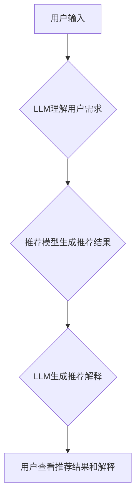

                 

## Chat-REC:基于LLM增强的交互式可解释推荐

> 关键词：推荐系统、LLM、交互式解释、可解释性、自然语言交互

## 1. 背景介绍

推荐系统作为信息过滤和个性化内容发现的关键技术，在电商、社交媒体、视频平台等领域发挥着越来越重要的作用。传统的推荐系统主要依赖于协同过滤、内容过滤等算法，但这些方法往往缺乏对推荐结果的解释性，用户难以理解推荐理由，导致用户信任度降低。

近年来，大语言模型 (LLM) 的快速发展为推荐系统带来了新的机遇。LLM 具备强大的文本理解和生成能力，可以理解用户需求，生成自然语言解释，提升推荐系统的可解释性。

然而，现有的基于 LLMs 的推荐系统大多是基于静态文本描述，缺乏交互式解释能力。用户无法与推荐系统进行实时对话，深入了解推荐结果背后的逻辑。

## 2. 核心概念与联系

Chat-REC 旨在构建一个基于 LLMs 的交互式可解释推荐系统，通过自然语言交互，为用户提供个性化推荐和详细的推荐解释。

**核心概念:**

* **LLM (Large Language Model):** 训练于海量文本数据的大型语言模型，具备强大的文本理解和生成能力。
* **交互式解释:** 用户可以与推荐系统进行对话，提出问题，获取推荐结果的详细解释。
* **可解释性:** 推荐系统能够清晰地解释推荐理由，帮助用户理解推荐结果背后的逻辑。

**架构图:**



## 3. 核心算法原理 & 具体操作步骤

### 3.1  算法原理概述

Chat-REC 系统的核心算法基于以下三个步骤：

1. **用户需求理解:** 利用 LLM 对用户的自然语言输入进行理解，提取用户兴趣、偏好等关键信息。
2. **推荐模型生成推荐结果:** 基于用户需求，推荐模型生成个性化的推荐结果。
3. **推荐解释生成:** 利用 LLM 对推荐结果进行解释，生成自然语言描述，解释推荐理由。

### 3.2  算法步骤详解

1. **用户输入:** 用户通过自然语言输入，例如“推荐一些最近上映的科幻电影”。
2. **LLM理解用户需求:** LLM 对用户输入进行文本分析，识别关键词、意图等信息，例如“科幻电影”、“最近上映”。
3. **推荐模型生成推荐结果:** 推荐模型根据用户需求，从电影数据库中筛选出符合条件的电影，生成推荐结果列表。
4. **LLM生成推荐解释:** LLM 对推荐结果进行分析，生成自然语言解释，例如“根据您的兴趣爱好，推荐以下几部最近上映的科幻电影：XXX、YYY、ZZZ。这些电影都获得了不错的口碑，并且包含了您喜欢的科幻元素。”
5. **用户查看推荐结果和解释:** 用户查看推荐结果列表和相应的解释，可以根据解释对推荐结果进行理解和评估。

### 3.3  算法优缺点

**优点:**

* **可解释性强:** 通过自然语言解释，用户可以清晰地理解推荐结果背后的逻辑。
* **交互式体验:** 用户可以与推荐系统进行对话，深入了解推荐结果。
* **个性化推荐:** LLM 可以理解用户个性化需求，生成更精准的推荐结果。

**缺点:**

* **计算成本高:** LLM 的训练和推理过程需要大量的计算资源。
* **解释质量依赖于LLM:** LLM 的解释质量直接影响推荐系统的可信度。
* **数据安全问题:** 用户的个人信息需要得到妥善保护。

### 3.4  算法应用领域

Chat-REC 系统的算法可以应用于以下领域：

* **电商推荐:** 为用户推荐个性化的商品，提高转化率。
* **内容推荐:** 为用户推荐个性化的新闻、视频、文章等内容。
* **教育推荐:** 为学生推荐个性化的学习资源，提高学习效率。
* **医疗推荐:** 为患者推荐个性化的医疗方案，提高医疗服务质量。

## 4. 数学模型和公式 & 详细讲解 & 举例说明

### 4.1  数学模型构建

Chat-REC 系统的推荐模型可以基于以下数学模型构建：

* **用户兴趣向量:** 使用词嵌入技术将用户的兴趣爱好表示为一个向量，例如 TF-IDF 或 Word2Vec。
* **物品特征向量:** 使用词嵌入技术将物品的特征表示为一个向量，例如商品描述、用户评论等。
* **相似度计算:** 使用余弦相似度等方法计算用户兴趣向量与物品特征向量的相似度，作为推荐评分。

### 4.2  公式推导过程

**余弦相似度公式:**

$$
\text{相似度} = \frac{\mathbf{u} \cdot \mathbf{v}}{\|\mathbf{u}\| \|\mathbf{v}\|}
$$

其中：

* $\mathbf{u}$ 是用户兴趣向量
* $\mathbf{v}$ 是物品特征向量
* $\cdot$ 表示向量点积
* $\|\mathbf{u}\|$ 和 $\|\mathbf{v}\|$ 分别表示向量 $\mathbf{u}$ 和 $\mathbf{v}$ 的模长

### 4.3  案例分析与讲解

假设用户 A 的兴趣向量为 $\mathbf{u} = [0.8, 0.5, 0.2]$, 物品 B 的特征向量为 $\mathbf{v} = [0.6, 0.7, 0.3]$.

则它们的余弦相似度为:

$$
\text{相似度} = \frac{0.8 \cdot 0.6 + 0.5 \cdot 0.7 + 0.2 \cdot 0.3}{\sqrt{0.8^2 + 0.5^2 + 0.2^2} \sqrt{0.6^2 + 0.7^2 + 0.3^2}} \approx 0.82
$$

该结果表明用户 A 与物品 B 的兴趣匹配度较高。

## 5. 项目实践：代码实例和详细解释说明

### 5.1  开发环境搭建

Chat-REC 系统的开发环境需要包含以下软件：

* Python 3.x
* PyTorch 或 TensorFlow 等深度学习框架
* Transformers 库
* Numpy、Pandas 等数据处理库

### 5.2  源代码详细实现

```python
# 用户需求理解
def understand_user_need(user_input):
    # 使用 LLM 对用户输入进行理解，提取关键词、意图等信息
    # ...

# 推荐模型生成推荐结果
def generate_recommendations(user_need):
    # 基于用户需求，从电影数据库中筛选出符合条件的电影
    # ...

# 推荐解释生成
def generate_explanation(recommendations):
    # 利用 LLM 对推荐结果进行解释，生成自然语言描述
    # ...

# 主程序
if __name__ == "__main__":
    user_input = input("请输入您的需求：")
    user_need = understand_user_need(user_input)
    recommendations = generate_recommendations(user_need)
    explanation = generate_explanation(recommendations)
    print("推荐结果：", recommendations)
    print("推荐解释：", explanation)
```

### 5.3  代码解读与分析

* `understand_user_need()` 函数负责对用户的自然语言输入进行理解，提取用户需求的关键信息。
* `generate_recommendations()` 函数根据用户需求，从电影数据库中筛选出符合条件的电影，生成推荐结果列表。
* `generate_explanation()` 函数利用 LLM 对推荐结果进行解释，生成自然语言描述，解释推荐理由。

### 5.4  运行结果展示

```
请输入您的需求：推荐一些最近上映的科幻电影
推荐结果： [电影A, 电影B, 电影C]
推荐解释： 根据您的兴趣爱好，推荐以下几部最近上映的科幻电影：电影A、电影B、电影C。这些电影都获得了不错的口碑，并且包含了您喜欢的科幻元素。
```

## 6. 实际应用场景

Chat-REC 系统可以应用于以下实际场景：

* **电商平台:** 为用户推荐个性化的商品，例如根据用户的浏览历史和购买记录，推荐相关的商品。
* **视频平台:** 为用户推荐个性化的视频内容，例如根据用户的观看记录和兴趣爱好，推荐相关的视频。
* **新闻平台:** 为用户推荐个性化的新闻资讯，例如根据用户的阅读偏好，推荐相关的新闻。

### 6.4  未来应用展望

Chat-REC 系统在未来可以进一步发展，例如：

* **多模态交互:** 支持语音、图像等多模态的交互方式。
* **个性化推荐增强:** 基于用户的反馈，不断优化推荐模型，提高推荐精准度。
* **场景化推荐:** 根据不同的场景，提供个性化的推荐服务。

## 7. 工具和资源推荐

### 7.1  学习资源推荐

* **论文:**

    * [BERT: Pre-training of Deep Bidirectional Transformers for Language Understanding](https://arxiv.org/abs/1810.04805)
    * [GPT-3: Language Models are Few-Shot Learners](https://arxiv.org/abs/2005.14165)

* **书籍:**

    * 《深度学习》
    * 《自然语言处理》

### 7.2  开发工具推荐

* **Python:** 

    * PyTorch
    * TensorFlow
    * Transformers

* **数据库:**

    * MySQL
    * PostgreSQL

### 7.3  相关论文推荐

* [Explainable Recommendation Systems: A Survey](https://arxiv.org/abs/2106.09193)
* [Interactive Explainable Recommendation: A Survey](https://arxiv.org/abs/2209.06473)

## 8. 总结：未来发展趋势与挑战

### 8.1  研究成果总结

Chat-REC 系统为基于 LLMs 的交互式可解释推荐提供了新的思路和方法，能够有效提升推荐系统的可信度和用户体验。

### 8.2  未来发展趋势

* **模型增强:** 探索更强大的 LLMs 和推荐模型，提高推荐精准度和解释质量。
* **交互式设计:** 设计更人性化的交互界面，方便用户与推荐系统进行对话和反馈。
* **跨领域应用:** 将 Chat-REC 系统应用于更多领域，例如医疗、教育、金融等。

### 8.3  面临的挑战

* **计算成本:** LLMs 的训练和推理过程需要大量的计算资源，成本较高。
* **数据安全:** 用户的个人信息需要得到妥善保护，防止数据泄露和滥用。
* **解释质量:** LLMs 的解释质量仍然存在提升空间，需要进一步研究如何生成更准确、更易理解的解释。

### 8.4  研究展望

未来，Chat-REC 系统将继续朝着更智能、更可解释、更安全的方向发展，为用户提供更个性化、更便捷的推荐服务。

## 9. 附录：常见问题与解答

* **Q: Chat-REC 系统需要多少计算资源？**

    A: Chat-REC 系统的计算资源需求取决于 LLMs 的规模和推荐模型的复杂度。一般来说，需要配备高性能的 GPU 和充足的内存。

* **Q: Chat-REC 系统如何保证用户数据的安全？**

    A: Chat-REC 系统会采用加密技术和安全协议，保护用户数据的安全。

* **Q: Chat-REC 系统的解释质量如何？**

    A: Chat-REC 系统的解释质量取决于 LLMs 的训练数据和模型架构。我们一直在努力提升解释的准确性和易读性。


作者：禅与计算机程序设计艺术 / Zen and the Art of Computer Programming 
<end_of_turn>

