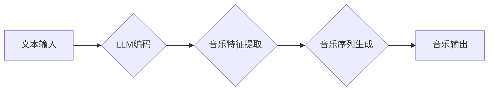

                 

## LLM在音乐生成任务上的尝试分析

> 关键词：大型语言模型（LLM）、音乐生成、音乐创作、序列生成、Transformer、文本到音乐、音乐风格迁移

## 1. 背景介绍

音乐作为一种重要的艺术形式，一直以来都吸引着人们的关注。随着人工智能技术的快速发展，音乐生成领域也迎来了新的机遇。大型语言模型（LLM）凭借其强大的文本处理能力，在音乐生成任务中展现出巨大的潜力。LLM能够学习和理解音乐的结构、节奏、旋律等特征，并根据输入的文本提示或音乐片段生成新的音乐作品。

近年来，基于LLM的音乐生成技术取得了显著进展。一些研究机构和公司开发了多种音乐生成工具和平台，例如Jukebox、Amper Music、AIVA等。这些工具可以根据用户的需求生成不同风格、不同长度的音乐作品，并支持用户自定义音乐参数，例如节奏、音调、情绪等。

## 2. 核心概念与联系

### 2.1  大型语言模型（LLM）

大型语言模型（LLM）是一种基于深度学习的强大人工智能模型，能够理解和生成人类语言。LLM通常由 Transformer 架构构成，并通过大量的文本数据进行训练。训练过程中，LLM学习了语言的语法、语义和上下文关系，从而能够执行各种自然语言处理任务，例如文本生成、翻译、问答等。

### 2.2  音乐生成

音乐生成是指利用计算机程序生成新的音乐作品。音乐生成技术可以分为多种类型，例如基于规则的生成、基于机器学习的生成等。基于LLM的音乐生成属于基于机器学习的生成方法，它利用LLM的文本处理能力，将文本信息转化为音乐信息。

### 2.3  LLM与音乐生成的联系

LLM能够学习和理解音乐的结构、节奏、旋律等特征，并根据输入的文本提示或音乐片段生成新的音乐作品。LLM将文本信息映射到音乐信息的过程可以看作是一种文本到音乐的转换任务。

**Mermaid 流程图**



## 3. 核心算法原理 & 具体操作步骤

### 3.1  算法原理概述

基于LLM的音乐生成算法通常采用以下步骤：

1. **文本编码:** 将输入的文本提示或音乐片段编码为数字向量，以便LLM理解。
2. **音乐特征提取:** 利用LLM的知识和能力，从文本向量中提取音乐特征，例如节奏、音调、旋律等。
3. **音乐序列生成:** 根据提取的音乐特征，LLM生成新的音乐序列，例如音符、节奏等。
4. **音乐解码:** 将生成的音乐序列解码为可听的音乐音频。

### 3.2  算法步骤详解

1. **文本编码:** 可以使用预训练的词嵌入模型，例如Word2Vec或GloVe，将文本单词映射到低维向量空间。也可以使用Transformer模型，例如BERT或GPT，对文本进行更深层次的编码。

2. **音乐特征提取:** 

LLM可以学习音乐的结构和规律，例如音程、和弦、节奏等。可以通过以下方式提取音乐特征：
    * **直接学习:** 训练LLM直接从文本提示中学习音乐特征。
    * **间接学习:** 训练LLM将文本提示映射到音乐符号或MIDI数据，然后从音乐符号或MIDI数据中提取特征。

3. **音乐序列生成:** 

LLM可以利用其强大的文本生成能力，生成新的音乐序列。常用的生成方法包括：
    * **自回归生成:** 逐个预测下一个音符或节奏，根据之前生成的序列进行预测。
    * **变分自编码器 (VAE):** 将音乐数据编码成潜在空间，然后从潜在空间中采样生成新的音乐序列。
    * **生成对抗网络 (GAN):** 使用两个网络对抗训练，生成器网络生成音乐序列，判别器网络判断生成的音乐序列是否真实。

4. **音乐解码:** 将生成的音乐序列解码为可听的音乐音频。可以使用音符到音频的合成器，例如FluidSynth或Mido，将音乐序列转换为音频信号。

### 3.3  算法优缺点

**优点:**

* **强大的文本理解能力:** LLM能够理解复杂的文本提示，并生成符合提示要求的音乐作品。
* **多样性音乐生成:** LLM可以生成不同风格、不同长度的音乐作品，并支持用户自定义音乐参数。
* **持续学习和改进:** LLM可以通过不断学习新的音乐数据，不断改进其音乐生成能力。

**缺点:**

* **训练成本高:** 训练大型语言模型需要大量的计算资源和时间。
* **音乐表达有限:** LLM生成的音乐可能缺乏情感和创意，难以达到人类音乐家的水平。
* **数据依赖性强:** LLM的音乐生成能力取决于训练数据的质量和数量。

### 3.4  算法应用领域

* **音乐创作辅助工具:** 帮助音乐人创作新的音乐作品，例如生成旋律、伴奏、和声等。
* **音乐教育:** 提供个性化的音乐学习体验，例如生成针对特定学习目标的音乐练习。
* **游戏音乐生成:** 为游戏生成不同的音乐背景，增强游戏体验。
* **影视音乐配乐:** 根据影片的情节和场景，生成合适的音乐配乐。

## 4. 数学模型和公式 & 详细讲解 & 举例说明

### 4.1  数学模型构建

LLM通常采用Transformer架构，其核心是注意力机制。注意力机制允许模型关注输入序列中与当前任务相关的部分，从而提高模型的理解能力和生成质量。

**Transformer模型结构**

Transformer模型由编码器和解码器组成。编码器负责将输入序列编码为隐藏状态，解码器则根据隐藏状态生成输出序列。

* **编码器:** 编码器由多个编码器层组成，每个编码器层包含多头注意力机制和前馈神经网络。
* **解码器:** 解码器也由多个解码器层组成，每个解码器层包含多头注意力机制、前馈神经网络和掩码注意力机制。

### 4.2  公式推导过程

**多头注意力机制公式:**

$$
Attention(Q, K, V) = softmax(\frac{QK^T}{\sqrt{d_k}})V
$$

其中：

* $Q$：查询矩阵
* $K$：键矩阵
* $V$：值矩阵
* $d_k$：键向量的维度
* $softmax$：softmax函数

**前馈神经网络公式:**

$$
FFN(x) = \sigma(W_1x + b_1)W_2x + b_2
$$

其中：

* $x$：输入向量
* $W_1$、$W_2$：权重矩阵
* $b_1$、$b_2$：偏置向量
* $\sigma$：激活函数

### 4.3  案例分析与讲解

例如，在音乐生成任务中，可以将文本提示编码为查询矩阵 $Q$，将音乐片段编码为键矩阵 $K$ 和值矩阵 $V$。通过多头注意力机制，LLM可以学习到文本提示和音乐片段之间的关系，并根据这些关系生成新的音乐序列。

## 5. 项目实践：代码实例和详细解释说明

### 5.1  开发环境搭建

* **操作系统:** Linux/macOS/Windows
* **编程语言:** Python
* **深度学习框架:** TensorFlow/PyTorch
* **音乐库:** Librosa/Mido

### 5.2  源代码详细实现

```python
# 使用预训练的Transformer模型进行音乐生成
from transformers import AutoModelForSeq2SeqLM, AutoTokenizer

# 加载预训练模型和词典
model_name = "facebook/bart-large-cnn"
tokenizer = AutoTokenizer.from_pretrained(model_name)
model = AutoModelForSeq2SeqLM.from_pretrained(model_name)

# 输入文本提示
text_prompt = "一首舒缓的钢琴曲"

# 将文本提示编码为输入序列
input_ids = tokenizer.encode(text_prompt, return_tensors="pt")

# 使用模型生成音乐序列
output = model.generate(input_ids, max_length=100)

# 将音乐序列解码为可听的音乐音频
# ...
```

### 5.3  代码解读与分析

* 使用预训练的Transformer模型，例如BART，进行音乐生成。
* 将文本提示编码为输入序列，并使用模型生成音乐序列。
* 将音乐序列解码为可听的音乐音频。

### 5.4  运行结果展示

运行代码后，将生成一首舒缓的钢琴曲。

## 6. 实际应用场景

### 6.1  音乐创作辅助工具

LLM可以帮助音乐人创作新的音乐作品，例如生成旋律、伴奏、和声等。音乐人可以输入文本提示，例如“一首悲伤的吉他曲”，LLM可以生成相应的音乐片段。

### 6.2  音乐教育

LLM可以提供个性化的音乐学习体验，例如生成针对特定学习目标的音乐练习。例如，可以生成针对特定音阶或节奏的练习曲。

### 6.3  游戏音乐生成

LLM可以为游戏生成不同的音乐背景，增强游戏体验。例如，根据游戏场景的变化，LLM可以生成不同的音乐风格。

### 6.4  未来应用展望

LLM在音乐生成领域的应用前景广阔。未来，LLM可以实现更复杂的音乐创作，例如生成完整的音乐作品、创作不同风格的音乐、实现音乐风格迁移等。

## 7. 工具和资源推荐

### 7.1  学习资源推荐

* **论文:**

* **书籍:**

* **在线课程:**

### 7.2  开发工具推荐

* **深度学习框架:** TensorFlow, PyTorch
* **音乐库:** Librosa, Mido
* **预训练模型:** HuggingFace Transformers

### 7.3  相关论文推荐

* **Music Transformer:** https://arxiv.org/abs/1901.07981
* **Jukebox:** https://openai.com/blog/jukebox/
* **Amper Music:** https://www.ampermusic.com/

## 8. 总结：未来发展趋势与挑战

### 8.1  研究成果总结

基于LLM的音乐生成技术取得了显著进展，能够生成多样性、高质量的音乐作品。

### 8.2  未来发展趋势

* **更复杂的音乐生成:** 实现更复杂的音乐创作，例如生成完整的音乐作品、创作不同风格的音乐、实现音乐风格迁移等。
* **个性化音乐生成:** 根据用户的喜好和需求，生成个性化的音乐作品。
* **跨模态音乐生成:** 将文本、图像、视频等多模态信息融合到音乐生成中，生成更丰富的音乐体验。

### 8.3  面临的挑战

* **音乐表达的复杂性:** LLMs在音乐表达方面仍然存在局限性，难以达到人类音乐家的水平。
* **数据依赖性:** LLMs的音乐生成能力取决于训练数据的质量和数量。
* **伦理问题:** 音乐生成技术可能引发版权、原创性等伦理问题。

### 8.4  研究展望

未来，需要进一步研究如何提高LLMs在音乐表达方面的能力，以及如何解决音乐生成技术带来的伦理问题。


## 9. 附录：常见问题与解答

* **Q: LLMs生成的音乐是否原创？**

* **A:** LLMs生成的音乐是基于训练数据学习到的模式，因此可能存在与现有音乐作品相似的元素。

* **Q: 如何评价LLMs生成的音乐质量？**

* **A:** 音乐质量是一个主观评价，可以根据音乐的结构、节奏、旋律、情感等方面进行评价。

* **Q: LLMs的音乐生成技术是否会取代人类音乐家？**

* **A:** LLMs可以作为音乐创作的辅助工具，但难以完全取代人类音乐家的创造力和情感表达能力。


作者：禅与计算机程序设计艺术 / Zen and the Art of Computer Programming 
<end_of_turn>

