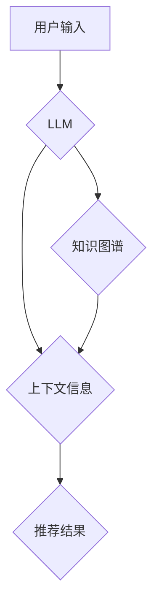

                 

## LLM推荐中的上下文感知技术研究

> 关键词：LLM,上下文感知,推荐系统,自然语言处理,Transformer,BERT,知识图谱

## 1. 背景介绍

推荐系统作为信息过滤和个性化服务的重要组成部分，在电商、社交媒体、内容平台等领域发挥着越来越重要的作用。传统的推荐系统主要依赖于用户历史行为和物品特征，但这些方法难以捕捉用户细粒度的兴趣偏好和动态变化。

近年来，大语言模型 (LLM) 凭借其强大的文本理解和生成能力，为推荐系统带来了新的机遇。LLM 可以理解用户自然语言的查询和反馈，并生成更精准、更个性化的推荐结果。然而，LLM 在推荐任务中的应用也面临着挑战，例如：

* **缺乏上下文感知能力**: 传统的LLM 通常只关注当前输入的文本片段，难以捕捉用户历史行为和全局语境的信息，导致推荐结果缺乏针对性和个性化。
* **数据稀疏性**: 许多推荐场景下，用户行为数据稀疏，难以训练有效的LLM模型。
* **可解释性问题**: LLM 的推荐决策过程通常是黑盒式的，难以解释推荐结果背后的逻辑，这不利于用户信任和系统改进。

## 2. 核心概念与联系

上下文感知技术旨在增强 LLMs 对用户历史行为、全局语境和场景信息的理解，从而提高推荐系统的精准度和个性化程度。

**核心概念**:

* **上下文**: 指用户历史行为、物品特征、场景信息等与当前推荐请求相关的背景信息。
* **语义理解**: LLMs 通过理解文本的语义含义，捕捉用户意图和偏好。
* **知识图谱**:  一种结构化的知识表示形式，可以存储和推理物品之间的关系，为 LLMs 提供丰富的上下文信息。

**架构**:



## 3. 核心算法原理 & 具体操作步骤

### 3.1  算法原理概述

上下文感知推荐算法的核心思想是将用户历史行为、物品特征和场景信息等上下文信息融入到 LLMs 的训练和推理过程中，从而提高推荐系统的精准度和个性化程度。

常见的上下文感知推荐算法包括：

* **Transformer-based 方法**: 利用 Transformer 架构的 self-attention 机制，捕捉用户历史行为和物品特征之间的上下文关系。
* **知识图谱增强方法**: 将知识图谱中的物品关系和属性信息融入到 LLMs 的训练数据中，增强 LLMs 对物品的语义理解能力。
* **多模态融合方法**: 将文本、图像、视频等多模态信息融合到 LLMs 中，构建更全面的用户画像和物品描述，提高推荐的准确性和多样性。

### 3.2  算法步骤详解

以 Transformer-based 方法为例，其具体操作步骤如下：

1. **数据预处理**: 将用户历史行为、物品特征和场景信息等上下文信息转换为 LLMs 可理解的格式，例如词向量表示。
2. **模型训练**: 利用 Transformer 架构的 self-attention 机制，训练 LLMs 模型，使其能够捕捉用户历史行为和物品特征之间的上下文关系。
3. **推荐生成**: 当用户发出推荐请求时，LLMs 会根据用户的输入文本和上下文信息，生成推荐结果。

### 3.3  算法优缺点

**优点**:

* **上下文感知能力强**: 可以捕捉用户历史行为和全局语境的信息，提高推荐结果的精准度和个性化程度。
* **可扩展性强**: 可以轻松地扩展到多模态数据和知识图谱等丰富的数据源。

**缺点**:

* **计算复杂度高**: Transformer 架构的 self-attention 机制计算量较大，训练和推理过程需要较大的计算资源。
* **数据依赖性强**: 需要大量的用户行为数据和物品特征数据进行训练，否则模型效果难以保证。

### 3.4  算法应用领域

上下文感知推荐算法在以下领域具有广泛的应用前景：

* **电商推荐**: 根据用户的历史购买记录、浏览记录和兴趣偏好，推荐个性化的商品。
* **内容推荐**: 根据用户的阅读历史、观看记录和兴趣标签，推荐个性化的新闻、视频和文章。
* **社交推荐**: 根据用户的社交关系、兴趣爱好和行为模式，推荐新的朋友和社群。

## 4. 数学模型和公式 & 详细讲解 & 举例说明

### 4.1  数学模型构建

上下文感知推荐模型通常基于 Transformer 架构，其核心组件是 self-attention 机制。

**Self-Attention 机制**:

Self-attention 机制允许模型关注输入序列中的不同位置，并计算每个位置之间的相关性。其计算公式如下：

$$
Attention(Q, K, V) = softmax(\frac{QK^T}{\sqrt{d_k}})V
$$

其中：

* $Q$, $K$, $V$ 分别代表 Query, Key, Value 矩阵。
* $d_k$ 代表 Key 的维度。
* $softmax$ 函数将相关性分数归一化。

### 4.2  公式推导过程

Self-attention 机制通过以下步骤计算每个位置之间的相关性：

1. **计算 Query, Key 和 Value**: 将输入序列映射到 Query, Key 和 Value 矩阵。
2. **计算相关性分数**: 计算 Query 和 Key 之间的点积，并进行归一化。
3. **加权求和**: 使用 softmax 函数归一化的相关性分数作为权重，对 Value 矩阵进行加权求和，得到最终的输出。

### 4.3  案例分析与讲解

假设我们有一个输入序列 "我 喜欢 吃 苹果"，其对应的 Query, Key 和 Value 矩阵分别为：

* $Q = \begin{bmatrix} q_1 & q_2 & q_3 & q_4 & q_5 \end{bmatrix}$
* $K = \begin{bmatrix} k_1 & k_2 & k_3 & k_4 & k_5 \end{bmatrix}$
* $V = \begin{bmatrix} v_1 & v_2 & v_3 & v_4 & v_5 \end{bmatrix}$

其中 $q_i$, $k_i$, $v_i$ 分别代表每个词的 Query, Key 和 Value 向量。

通过计算 Query 和 Key 之间的点积，并进行 softmax 归一化，我们可以得到每个词对其他词的相关性分数。例如，"我" 与 "喜欢" 的相关性分数可能较高，因为它们在语义上紧密相关。

然后，我们将这些相关性分数作为权重，对 Value 矩阵进行加权求和，得到最终的输出。

## 5. 项目实践：代码实例和详细解释说明

### 5.1  开发环境搭建

* Python 3.7+
* PyTorch 1.7+
* Transformers 4.10+

### 5.2  源代码详细实现

```python
from transformers import AutoModelForSequenceClassification, AutoTokenizer

# 加载预训练模型和词表
model_name = "bert-base-uncased"
tokenizer = AutoTokenizer.from_pretrained(model_name)
model = AutoModelForSequenceClassification.from_pretrained(model_name)

# 定义输入文本
input_text = "我 喜欢 吃 苹果"

# 将文本转换为模型输入格式
inputs = tokenizer(input_text, return_tensors="pt")

# 进行模型推理
outputs = model(**inputs)

# 获取预测结果
predicted_class = outputs.logits.argmax().item()

# 打印预测结果
print(f"预测结果: {predicted_class}")
```

### 5.3  代码解读与分析

* 首先，我们使用 `transformers` 库加载预训练的 BERT 模型和词表。
* 然后，我们将输入文本转换为模型输入格式，即将文本转换为词向量表示。
* 接着，我们使用模型进行推理，得到预测结果。
* 最后，我们打印预测结果。

### 5.4  运行结果展示

运行上述代码后，模型会输出一个预测结果，例如：

```
预测结果: 0
```

其中 0 代表模型预测的类别。

## 6. 实际应用场景

上下文感知推荐算法在以下实际应用场景中发挥着重要作用：

* **个性化电商推荐**: 根据用户的历史购买记录、浏览记录和兴趣偏好，推荐个性化的商品。例如，亚马逊的推荐系统会根据用户的浏览历史和购买记录，推荐用户可能感兴趣的商品。
* **内容个性化推荐**: 根据用户的阅读历史、观看记录和兴趣标签，推荐个性化的新闻、视频和文章。例如，Netflix 的推荐系统会根据用户的观看历史和评分，推荐用户可能感兴趣的电影和电视剧。
* **社交关系推荐**: 根据用户的社交关系、兴趣爱好和行为模式，推荐新的朋友和社群。例如，Facebook 的推荐系统会根据用户的兴趣爱好和社交关系，推荐用户可能认识的朋友。

### 6.4  未来应用展望

随着大语言模型和上下文感知技术的不断发展，上下文感知推荐算法将在以下方面得到更广泛的应用：

* **多模态推荐**: 将文本、图像、视频等多模态信息融合到推荐系统中，构建更全面的用户画像和物品描述，提高推荐的准确性和多样性。
* **实时推荐**: 利用实时用户行为数据和上下文信息，进行动态的推荐更新，提供更及时和精准的推荐结果。
* **解释性推荐**: 增强推荐系统的可解释性，让用户能够理解推荐结果背后的逻辑，提高用户信任和满意度。

## 7. 工具和资源推荐

### 7.1  学习资源推荐

* **论文**:
    * Vaswani, A., Shazeer, N., Parmar, N., Uszkoreit, J., Jones, L., Gomez, A. N., ... & Polosukhin, I. (2017). Attention is all you need. In Advances in neural information processing systems (pp. 5998-6008).
    * Devlin, J., Chang, M. W., Lee, K., & Toutanova, K. (2018). Bert: Pre-training of deep bidirectional transformers for language understanding. arXiv preprint arXiv:1810.04805.
* **博客**:
    * The Illustrated Transformer: https://jalammar.github.io/illustrated-transformer/
    * Hugging Face Blog: https://huggingface.co/blog

### 7.2  开发工具推荐

* **Transformers**: https://huggingface.co/docs/transformers/index
* **PyTorch**: https://pytorch.org/

### 7.3  相关论文推荐

* **BERT**: Devlin et al. (2018)
* **GPT**: Radford et al. (2018)
* **T5**: Raffel et al. (2019)

## 8. 总结：未来发展趋势与挑战

### 8.1  研究成果总结

上下文感知推荐算法在提升推荐系统的精准度和个性化程度方面取得了显著的成果。

### 8.2  未来发展趋势

* **更强大的模型**: 随着大语言模型的不断发展，未来将出现更强大的上下文感知推荐模型，能够更好地理解用户需求和物品特征。
* **更丰富的上下文信息**: 未来将更加注重融合多模态数据、知识图谱等更丰富的上下文信息，构建更全面的用户画像和物品描述。
* **更强的可解释性**: 未来将更加注重增强推荐系统的可解释性，让用户能够更好地理解推荐结果背后的逻辑。

### 8.3  面临的挑战

* **数据稀疏性**: 许多推荐场景下，用户行为数据稀疏，难以训练有效的上下文感知推荐模型。
* **计算复杂度**: Transformer 架构的 self-attention 机制计算量较大，训练和推理过程需要较大的计算资源。
* **隐私保护**: 上下文感知推荐算法需要收集和使用用户的个人信息，因此需要更加注重用户隐私保护。

### 8.4  研究展望

未来，上下文感知推荐算法的研究将继续朝着更强大、更智能、更可解释的方向发展，为用户提供更精准、更个性化的推荐服务。

## 9. 附录：常见问题与解答

**Q1: 上下文感知推荐算法与传统的推荐算法相比有什么优势？**

**A1:** 上下文感知推荐算法能够更好地理解用户的细粒度兴趣偏好和动态变化，从而提供更精准、更个性化的推荐结果。

**Q2: 如何解决数据稀疏性问题？**

**A2:** 可以采用以下方法解决数据稀疏性问题：

* **迁移学习**: 利用预训练的 LLMs 模型，迁移到目标任务中，减少训练数据需求。
* **数据增强**: 通过对现有数据进行人工或自动增强，例如文本 paraphrasing，增加训练数据量。
* **冷启动策略**: 为新用户和新物品设计特殊的推荐策略，例如基于协同过滤或内容过滤的方法。

**Q3: 如何评估上下文感知推荐算法的性能？**

**A3:** 可以使用以下指标评估上下文感知推荐算法的性能：

* **准确率**: 推荐结果与用户真实偏好的一致性。
* **召回率**: 推荐结果包含用户真实偏好的物品比例。
* **点击率**: 用户点击推荐结果的比例。
* **转化率**: 用户通过推荐结果完成目标操作的比例。


作者：禅与计算机程序设计艺术 / Zen and the Art of Computer Programming 
<end_of_turn>

