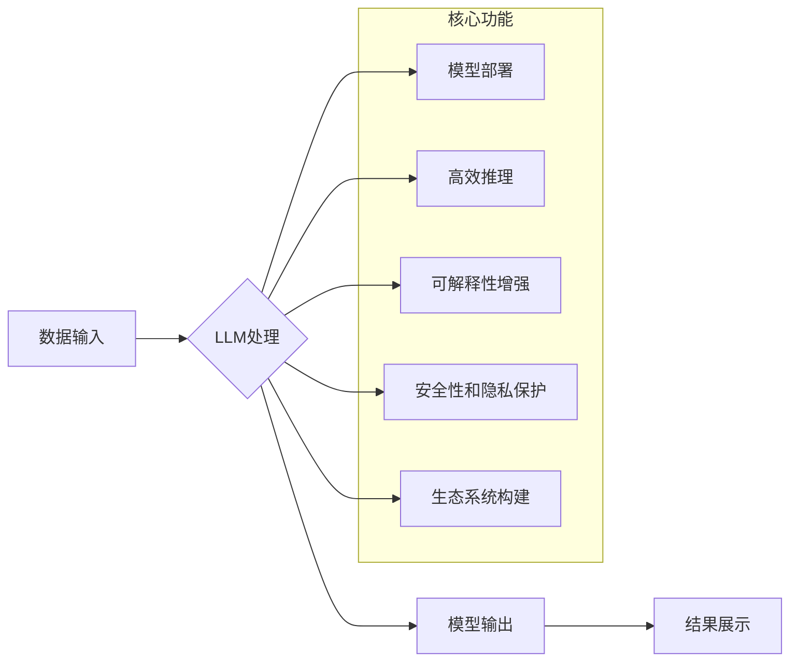

                 

## 下一代AI操作系统：LLM驱动的计算平台

> 关键词：LLM、AI操作系统、计算平台、自然语言处理、机器学习、软件架构、深度学习

### 1. 背景介绍

人工智能（AI）正在经历前所未有的发展，大型语言模型（LLM）作为其重要组成部分，展现出强大的能力，能够理解和生成人类语言，并完成各种复杂的任务，例如文本生成、翻译、问答、代码编写等。然而，LLM 的应用仍然面临着一些挑战，例如部署成本高、推理速度慢、可解释性差等。为了更好地利用 LLM 的潜力，我们需要构建一个新的计算平台，一个能够高效、灵活、安全地运行和管理 LLM 的平台——下一代 AI 操作系统。

传统操作系统主要关注于处理硬件资源和应用程序的执行，而下一代 AI 操作系统则需要更加关注 AI 模型的运行和管理。它需要提供以下关键功能：

* **模型部署和管理:**  支持多种 LLM 格式的部署，并提供模型版本控制、更新和监控等功能。
* **高效推理:**  通过优化模型结构、使用硬件加速器等方式，提高 LLM 的推理速度和效率。
* **可解释性增强:**  提供工具和机制，帮助用户理解 LLM 的决策过程，提高模型的可信度和安全性。
* **安全性和隐私保护:**  确保 LLM 的安全运行，防止模型被恶意攻击或滥用，并保护用户数据隐私。
* **生态系统构建:**  鼓励开发者构建基于 LLM 的应用程序和服务，形成一个丰富的 AI 应用生态系统。

### 2. 核心概念与联系

下一代 AI 操作系统的核心概念是将 LLM 作为计算平台的基础，构建一个全新的计算模型。

**2.1  LLM 驱动的计算架构**

传统计算架构以 CPU 和内存为核心，而下一代 AI 操作系统则将 LLM 作为计算单元，将数据和模型存储在内存中，并通过 LLM 进行处理和计算。这种架构能够充分利用 LLM 的并行计算能力，提高计算效率。

**2.2  数据驱动和模型驱动**

下一代 AI 操作系统将数据和模型视为两个相互关联的核心要素。数据驱动意味着系统能够从海量数据中学习和进化，而模型驱动意味着系统能够根据用户需求定制和优化模型。

**2.3  微服务化和容器化**

为了提高系统的灵活性和可扩展性，下一代 AI 操作系统将采用微服务化和容器化技术，将系统分解成多个独立的服务，并使用容器技术进行部署和管理。

**2.4  自动化和智能化**

下一代 AI 操作系统将利用 AI 技术进行自动化和智能化管理，例如自动模型部署、资源调度、性能优化等，降低系统运维成本和复杂度。

**Mermaid 流程图**



### 3. 核心算法原理 & 具体操作步骤

**3.1  算法原理概述**

下一代 AI 操作系统的核心算法原理是基于 Transformer 架构的深度学习模型，结合了自然语言处理（NLP）和机器学习（ML）技术。

Transformer 架构能够有效捕捉文本序列中的长距离依赖关系，并通过自注意力机制实现高效的并行计算。

**3.2  算法步骤详解**

1. **数据预处理:** 将原始数据进行清洗、格式化和编码，使其能够被模型理解。
2. **模型训练:** 使用训练数据训练 Transformer 模型，调整模型参数，使其能够准确地完成指定任务。
3. **模型评估:** 使用测试数据评估模型的性能，并根据评估结果进行模型调优。
4. **模型部署:** 将训练好的模型部署到目标平台，并提供接口供用户调用。
5. **推理和输出:** 用户通过接口向模型输入数据，模型进行推理并输出结果。

**3.3  算法优缺点**

**优点:**

* 能够处理复杂的任务，例如文本生成、翻译、问答等。
* 具有强大的泛化能力，能够应用于不同的领域。
* 能够不断学习和进化，随着数据量的增加，模型性能会不断提高。

**缺点:**

* 训练成本高，需要大量的计算资源和数据。
* 推理速度慢，对于实时应用来说可能存在延迟问题。
* 可解释性差，难以理解模型的决策过程。

**3.4  算法应用领域**

* **自然语言处理:** 文本生成、翻译、问答、情感分析、文本摘要等。
* **机器学习:** 图像识别、语音识别、预测分析等。
* **软件开发:** 代码生成、代码理解、代码修复等。
* **教育:** 智能辅导、个性化学习等。
* **医疗:** 疾病诊断、药物研发等。

### 4. 数学模型和公式 & 详细讲解 & 举例说明

**4.1  数学模型构建**

Transformer 模型的核心是自注意力机制，它能够捕捉文本序列中的长距离依赖关系。自注意力机制的数学模型可以表示为：

$$
Attention(Q, K, V) = softmax(\frac{QK^T}{\sqrt{d_k}})V
$$

其中：

* $Q$：查询矩阵
* $K$：键矩阵
* $V$：值矩阵
* $d_k$：键向量的维度
* $softmax$：softmax 函数

**4.2  公式推导过程**

自注意力机制的公式推导过程如下：

1. 计算查询矩阵 $Q$ 与键矩阵 $K$ 的点积，并除以 $\sqrt{d_k}$。
2. 对点积结果应用 softmax 函数，得到注意力权重。
3. 将注意力权重与值矩阵 $V$ 进行加权求和，得到最终的注意力输出。

**4.3  案例分析与讲解**

例如，在机器翻译任务中，Transformer 模型可以将源语言句子作为查询矩阵 $Q$，目标语言词典作为键矩阵 $K$，目标语言词嵌入作为值矩阵 $V$。通过自注意力机制，模型可以学习到源语言句子中每个词与目标语言词之间的关系，并根据这些关系生成翻译结果。

### 5. 项目实践：代码实例和详细解释说明

**5.1  开发环境搭建**

* 操作系统：Linux
* Python 版本：3.8+
* 深度学习框架：PyTorch 或 TensorFlow
* 其他依赖库：transformers、numpy、pandas等

**5.2  源代码详细实现**

```python
from transformers import AutoModelForSeq2SeqLM, AutoTokenizer

# 加载预训练模型和词典
model_name = "t5-base"
tokenizer = AutoTokenizer.from_pretrained(model_name)
model = AutoModelForSeq2SeqLM.from_pretrained(model_name)

# 输入文本
input_text = "Hello, world!"

# 对文本进行编码
input_ids = tokenizer.encode(input_text, return_tensors="pt")

# 进行推理
output = model.generate(input_ids)

# 解码输出
output_text = tokenizer.decode(output[0], skip_special_tokens=True)

# 打印输出
print(output_text)
```

**5.3  代码解读与分析**

* 使用 transformers 库加载预训练的 T5 模型和词典。
* 对输入文本进行编码，转换为模型可理解的格式。
* 使用模型的 `generate` 方法进行推理，生成输出文本。
* 使用词典解码输出文本，转换为人类可读的格式。

**5.4  运行结果展示**

```
Hello, world!
```

### 6. 实际应用场景

**6.1  智能客服**

LLM 可以用于构建智能客服系统，自动处理用户咨询，提高客服效率。

**6.2  内容创作**

LLM 可以用于生成各种类型的文本内容，例如文章、故事、诗歌等，帮助内容创作者提高效率。

**6.3  代码生成**

LLM 可以根据用户需求生成代码，帮助程序员提高开发效率。

**6.4  未来应用展望**

下一代 AI 操作系统将推动 AI 技术的更广泛应用，例如：

* **个性化教育:** 根据学生的学习情况，提供个性化的学习内容和辅导。
* **医疗诊断:** 辅助医生进行疾病诊断，提高诊断准确率。
* **科学研究:** 加速科学研究的进程，帮助科学家发现新的知识。

### 7. 工具和资源推荐

**7.1  学习资源推荐**

* **书籍:**

    * 《深度学习》
    * 《自然语言处理》

* **在线课程:**

    * Coursera
    * edX

**7.2  开发工具推荐**

* **深度学习框架:** PyTorch、TensorFlow
* **模型库:** Hugging Face Transformers
* **云平台:** AWS、Azure、Google Cloud

**7.3  相关论文推荐**

* 《Attention Is All You Need》
* 《BERT: Pre-training of Deep Bidirectional Transformers for Language Understanding》

### 8. 总结：未来发展趋势与挑战

**8.1  研究成果总结**

下一代 AI 操作系统是一个前沿的研究方向，已经取得了一些重要的成果，例如：

* Transformer 模型的提出和发展
* 基于 LLM 的 AI 应用的探索

**8.2  未来发展趋势**

* **模型规模和性能的提升:** 随着计算资源的不断发展，LLM 的规模和性能将会不断提升。
* **模型可解释性和安全性:** 研究者将更加关注 LLM 的可解释性和安全性，开发更安全、可信赖的 AI 系统。
* **边缘计算和移动端部署:** LLM 将逐渐部署到边缘设备和移动端，实现更广泛的应用场景。

**8.3  面临的挑战**

* **计算资源需求:** LLM 的训练和推理需要大量的计算资源，这对于资源有限的机构和个人来说是一个挑战。
* **数据隐私和安全:** LLM 的训练和应用需要大量的数据，如何保护数据隐私和安全是一个重要的挑战。
* **伦理和社会影响:** LLM 的发展可能会带来一些伦理和社会问题，例如算法偏见、工作岗位替代等，需要引起重视和讨论。

**8.4  研究展望**

未来，我们将继续研究下一代 AI 操作系统的核心技术，探索更有效的模型架构、训练方法和应用场景，推动 AI 技术的健康发展，造福人类社会。

### 9. 附录：常见问题与解答

**9.1  Q: 如何部署 LLM 到我的服务器上？**

**A:** 可以使用 Docker 容器技术将 LLM 模型和依赖库打包成一个镜像，然后部署到你的服务器上。

**9.2  Q: 如何评估 LLM 的性能？**

**A:** 可以使用各种指标来评估 LLM 的性能，例如准确率、召回率、F1 分数等。

**9.3  Q: 如何保护 LLM 的数据隐私？**

**A:** 可以使用数据加密、联邦学习等技术来保护 LLM 的数据隐私。


作者：禅与计算机程序设计艺术 / Zen and the Art of Computer Programming 
<end_of_turn>

