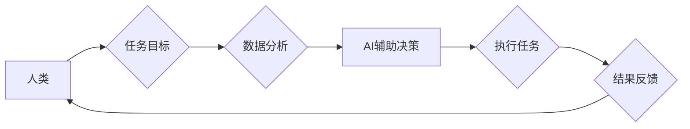

                 

## 人类-AI协作：增强人类潜能与AI能力的融合进步

> 关键词：人工智能、协作、人类潜能、AI能力、融合进步、算法、数学模型、项目实践、应用场景

### 1. 背景介绍

人工智能（AI）技术近年来发展迅速，已渗透到各个领域，深刻地改变着人类的生活方式和工作模式。从自动驾驶汽车到智能语音助手，从医疗诊断到金融分析，AI正在展现出强大的应用潜力。然而，AI技术的发展也引发了人们对未来工作格局、社会伦理等方面的思考。

当前，AI技术主要集中在数据处理、模式识别、决策优化等方面，而人类拥有创造力、批判性思维、情感理解等独特的优势。因此，将人类和AI的优势有机结合，实现协同工作，是未来发展的重要方向。人类-AI协作，是指人类与人工智能系统共同完成任务，相互补充、共同进步的模式。这种模式能够最大限度地发挥人类和AI的各自优势，从而实现更高效、更智能、更创新的工作成果。

### 2. 核心概念与联系

**2.1 人类-AI协作模式**

人类-AI协作模式可以分为以下几种类型：

* **人类在控制地位:** 人类制定目标和策略，AI提供数据分析、决策支持等辅助功能。
* **AI在控制地位:** AI根据预设规则和算法自动完成任务，人类进行监督和调整。
* **协同决策:** 人类和AI共同参与决策过程，权衡利弊，最终达成共识。

**2.2 协作关系图**



**2.3 协作优势**

* **提高效率:** AI可以自动化重复性任务，释放人类精力，专注于更复杂、更具创造性的工作。
* **增强准确性:** AI可以利用大数据进行分析，识别人类难以察觉的模式，提高决策的准确性。
* **促进创新:** 人类和AI的协作可以激发新的想法和解决方案，推动创新发展。

### 3. 核心算法原理 & 具体操作步骤

**3.1 算法原理概述**

人类-AI协作的核心算法通常基于机器学习、深度学习等人工智能技术。这些算法能够帮助AI系统学习人类的行为模式、决策规则，并根据学习到的知识进行预测、决策、执行任务。

**3.2 算法步骤详解**

1. **数据收集与预处理:** 收集与任务相关的各种数据，并进行清洗、转换、格式化等预处理工作。
2. **模型选择与训练:** 根据任务需求选择合适的机器学习算法，并利用训练数据训练模型，使其能够学习数据中的规律和模式。
3. **模型评估与优化:** 对训练好的模型进行评估，并根据评估结果进行调整和优化，提高模型的性能。
4. **部署与应用:** 将训练好的模型部署到实际应用场景中，并与人类系统进行交互，完成协作任务。

**3.3 算法优缺点**

* **优点:** 能够自动学习和适应数据变化，提高效率和准确性。
* **缺点:** 需要大量数据进行训练，训练过程耗时且资源消耗大。

**3.4 算法应用领域**

* **医疗诊断:** AI辅助医生诊断疾病，提高诊断准确率。
* **金融风险控制:** AI识别金融风险，降低金融风险。
* **智能客服:** AI提供智能客服服务，提高客户满意度。

### 4. 数学模型和公式 & 详细讲解 & 举例说明

**4.1 数学模型构建**

人类-AI协作过程可以抽象为一个数学模型，其中人类和AI分别代表不同的变量，任务目标、数据、决策等因素可以用数学公式来描述。例如，可以构建一个决策模型，其中人类的决策权重和AI的决策权重分别用 α 和 β 来表示，决策结果可以用以下公式计算：

$$
决策结果 = α * 人类决策 + β * AI决策
$$

**4.2 公式推导过程**

该公式的推导过程基于加权平均的思想，即根据人类和AI的决策权重，对各自的决策进行加权平均，最终得到最终的决策结果。

**4.3 案例分析与讲解**

例如，在医疗诊断领域，医生和AI系统可以共同参与诊断决策。医生拥有丰富的临床经验和专业知识，而AI系统可以利用大数据分析技术识别疾病的潜在特征。

假设医生对某患者的诊断结果给出 0.7 的置信度，AI系统给出 0.6 的置信度，并且设定 α = 0.6，β = 0.4。则根据公式，最终的诊断结果为：

$$
决策结果 = 0.6 * 0.7 + 0.4 * 0.6 = 0.66
$$

这意味着，在该案例中，医生和AI系统的共同决策结果对该患者的诊断结果具有 66% 的置信度。

### 5. 项目实践：代码实例和详细解释说明

**5.1 开发环境搭建**

* 操作系统: Ubuntu 20.04
* 编程语言: Python 3.8
* 库依赖: TensorFlow, PyTorch, scikit-learn

**5.2 源代码详细实现**

```python
import tensorflow as tf

# 定义模型结构
model = tf.keras.models.Sequential([
    tf.keras.layers.Dense(128, activation='relu', input_shape=(10,)),
    tf.keras.layers.Dense(64, activation='relu'),
    tf.keras.layers.Dense(1, activation='sigmoid')
])

# 编译模型
model.compile(optimizer='adam', loss='binary_crossentropy', metrics=['accuracy'])

# 训练模型
model.fit(x_train, y_train, epochs=10)

# 评估模型
loss, accuracy = model.evaluate(x_test, y_test)
print('Loss:', loss)
print('Accuracy:', accuracy)
```

**5.3 代码解读与分析**

这段代码实现了基于 TensorFlow 的一个简单的神经网络模型。该模型用于二分类任务，输入数据维度为 10，输出结果为 0 或 1。

* `tf.keras.models.Sequential` 用于构建一个顺序模型，即层级结构。
* `tf.keras.layers.Dense` 用于定义全连接层，其中 `activation` 指定激活函数，`input_shape` 指定输入数据的维度。
* `model.compile` 用于编译模型，指定优化器、损失函数和评估指标。
* `model.fit` 用于训练模型，传入训练数据和训练轮数。
* `model.evaluate` 用于评估模型，传入测试数据并返回损失值和准确率。

**5.4 运行结果展示**

训练完成后，可以将模型应用于新的数据进行预测。

### 6. 实际应用场景

**6.1 医疗诊断辅助**

AI可以辅助医生诊断疾病，例如识别肿瘤、预测患者的风险等。

**6.2 金融风险控制**

AI可以识别金融风险，例如欺诈交易、信用风险等。

**6.3 智能客服**

AI可以提供智能客服服务，例如回答客户问题、处理订单等。

**6.4 未来应用展望**

随着AI技术的不断发展，人类-AI协作将在更多领域得到应用，例如教育、科研、艺术创作等。

### 7. 工具和资源推荐

**7.1 学习资源推荐**

* **书籍:**
    * 《深度学习》
    * 《人工智能：一种现代方法》
* **在线课程:**
    * Coursera 上的机器学习课程
    * edX 上的 AI 课程

**7.2 开发工具推荐**

* **TensorFlow:** 开源深度学习框架
* **PyTorch:** 开源深度学习框架
* **scikit-learn:** 机器学习库

**7.3 相关论文推荐**

* 《Attention Is All You Need》
* 《BERT: Pre-training of Deep Bidirectional Transformers for Language Understanding》

### 8. 总结：未来发展趋势与挑战

**8.1 研究成果总结**

人类-AI协作技术取得了显著进展，在多个领域展现出巨大的应用潜力。

**8.2 未来发展趋势**

* **更智能的AI:** AI系统将更加智能，能够更好地理解人类需求，提供更精准的帮助。
* **更广泛的应用:** 人类-AI协作将应用于更多领域，例如教育、科研、艺术创作等。
* **更人性化的交互:** 人类-AI交互将更加自然、人性化，例如通过语音、图像、情感识别等方式。

**8.3 面临的挑战**

* **数据安全与隐私:** 人类-AI协作需要处理大量数据，如何保证数据安全和隐私是重要的挑战。
* **算法偏见:** AI算法可能存在偏见，需要进行公平性评估和修正。
* **伦理问题:** 人类-AI协作可能引发伦理问题，例如责任归属、工作岗位替代等，需要进行深入探讨和规范。

**8.4 研究展望**

未来，需要继续加强对人类-AI协作技术的研发，探索更智能、更安全、更人性化的协作模式，并制定相应的规范和政策，引导人类-AI协作朝着更加可持续、可持续发展方向发展。

### 9. 附录：常见问题与解答

**9.1 如何选择合适的AI模型？**

选择合适的AI模型需要根据具体任务需求和数据特点进行选择。例如，对于分类任务，可以考虑使用支持向量机、决策树、神经网络等模型；对于回归任务，可以考虑使用线性回归、逻辑回归、决策树等模型。

**9.2 如何解决AI算法的偏见问题？**

解决AI算法的偏见问题需要从多个方面入手，例如：

* 使用更加公平、更加代表性的训练数据。
* 对算法进行公平性评估，识别和修正偏见。
* 开发更加公平、更加透明的AI算法。

**9.3 人类-AI协作会取代人类的工作吗？**

人类-AI协作不会完全取代人类的工作，而是会改变工作方式，提高工作效率。AI可以自动化重复性任务，释放人类精力，专注于更复杂、更具创造性的工作。


作者：禅与计算机程序设计艺术 / Zen and the Art of Computer Programming 
<end_of_turn>

