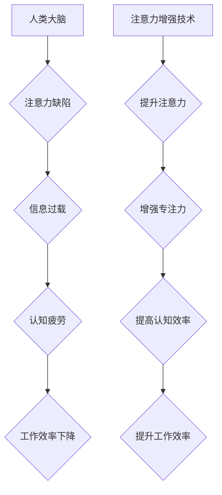

                 

## 人类注意力增强：提升专注力和注意力在商业中的应用趋势

> 关键词：注意力增强、专注力、深度学习、神经网络、脑机接口、商业应用、认知科学、未来趋势

## 1. 背景介绍

在当今信息爆炸的时代，人类的注意力面临着前所未有的挑战。来自社交媒体、电子邮件、新闻推送等各种信息源的不断轰炸，使得人们难以集中精力完成任务，效率低下，认知疲劳加剧。注意力力的下降不仅影响个人生活，也对商业发展产生重大影响。

商业领域对注意力力的需求日益增长。从营销推广到产品设计，从客户服务到团队协作，注意力都扮演着至关重要的角色。然而，注意力力的碎片化和下降趋势正在阻碍商业效率和创新能力的提升。

因此，如何增强人类注意力，提升专注力，成为一个亟待解决的难题。近年来，随着人工智能、神经科学等领域的快速发展，人类注意力增强技术逐渐崭露头角，并展现出巨大的应用潜力。

## 2. 核心概念与联系

**2.1 核心概念**

* **注意力：** 指对特定信息或刺激的认知选择性关注，排除其他干扰。
* **专注力：** 指持续地集中注意力在某一特定任务或目标上，并能够抵御外界干扰的能力。
* **注意力增强：** 通过技术手段，提升人类的注意力和专注力，使其能够更有效地处理信息，提高认知效率。

**2.2 架构图**



**2.3 联系**

注意力增强技术通过对人类大脑认知机制的深入研究，结合人工智能、神经科学等领域的最新成果，开发出各种辅助工具和方法，帮助人们克服注意力缺陷，提升专注力，最终提高工作效率和生活质量。

## 3. 核心算法原理 & 具体操作步骤

**3.1 算法原理概述**

注意力增强算法通常基于深度学习和神经网络技术，通过训练模型识别和分析人类大脑的注意力活动模式，并根据这些模式提供个性化的干预措施。

常见的注意力增强算法包括：

* **Transformer网络：** 能够捕捉长距离依赖关系，在自然语言处理领域取得了突破性进展，也应用于注意力增强领域，例如预测用户注意力转移点。
* **Recurrent Neural Networks (RNNs)：** 能够处理序列数据，适用于分析用户注意力在时间上的变化趋势。
* **Convolutional Neural Networks (CNNs)：** 擅长提取图像特征，可用于分析用户眼动轨迹，识别注意力焦点。

**3.2 算法步骤详解**

1. **数据采集：** 收集用户注意力相关数据，例如眼动轨迹、脑电波、行为记录等。
2. **数据预处理：** 对收集到的数据进行清洗、转换和特征提取，以便于模型训练。
3. **模型训练：** 使用深度学习算法训练模型，使其能够识别和预测用户注意力活动模式。
4. **模型评估：** 使用测试数据评估模型的性能，并进行调优。
5. **应用部署：** 将训练好的模型部署到实际应用场景中，例如提供个性化的注意力训练计划、提醒用户注意力的转移等。

**3.3 算法优缺点**

* **优点：**
    * 能够个性化定制注意力训练方案。
    * 能够实时监测和反馈用户注意力状态。
    * 具有较高的准确率和预测能力。
* **缺点：**
    * 数据采集和预处理成本较高。
    * 模型训练需要大量计算资源和时间。
    * 存在隐私安全和伦理问题。

**3.4 算法应用领域**

* **教育领域：** 帮助学生提高学习效率，增强专注力。
* **医疗领域：** 辅助治疗注意力缺陷多动障碍 (ADHD) 等认知障碍。
* **商业领域：** 提升员工工作效率，提高客户体验。
* **游戏领域：** 增强玩家沉浸感和游戏体验。

## 4. 数学模型和公式 & 详细讲解 & 举例说明

**4.1 数学模型构建**

注意力机制通常使用一个加权机制来分配不同输入的权重，从而突出重要的信息。

一个简单的注意力机制模型可以表示为：

$$
\text{Attention}(Q, K, V) = \text{softmax}\left(\frac{Q K^T}{\sqrt{d_k}}\right) V
$$

其中：

* $Q$：查询向量，表示需要关注的信息。
* $K$：键向量，表示所有输入信息的表示。
* $V$：值向量，表示所有输入信息的具体内容。
* $d_k$：键向量的维度。
* $\text{softmax}$：softmax函数，将权重归一化到0到1之间。

**4.2 公式推导过程**

该公式的核心思想是计算查询向量与所有键向量的相似度，然后根据相似度分配权重。

* $QK^T$：计算查询向量与每个键向量的点积，得到一个权重矩阵。
* $\frac{QK^T}{\sqrt{d_k}}$：对权重矩阵进行缩放，以避免梯度爆炸问题。
* $\text{softmax}$：对缩放后的权重矩阵应用softmax函数，得到每个键向量的归一化权重。
* $\text{softmax}\left(\frac{Q K^T}{\sqrt{d_k}}\right) V$：将归一化权重与值向量相乘，得到最终的注意力输出。

**4.3 案例分析与讲解**

例如，在机器翻译任务中，可以使用注意力机制来关注源语言句子中与目标语言句子相关的重要词语。

查询向量表示目标语言句子中的某个词语，键向量表示源语言句子中的每个词语，值向量表示源语言句子中的每个词语的含义。

通过计算查询向量与所有键向量的相似度，注意力机制可以识别出与目标语言词语最相关的源语言词语，并将其赋予更高的权重。

最终，注意力机制可以帮助机器翻译模型更好地理解上下文关系，生成更准确的翻译结果。

## 5. 项目实践：代码实例和详细解释说明

**5.1 开发环境搭建**

* Python 3.7+
* TensorFlow 2.0+
* PyTorch 1.0+
* Jupyter Notebook

**5.2 源代码详细实现**

```python
import tensorflow as tf

# 定义查询、键和值向量
query = tf.random.normal([1, 10])
key = tf.random.normal([10, 10])
value = tf.random.normal([10, 5])

# 计算注意力权重
attention_weights = tf.matmul(query, key, transpose_b=True) / tf.math.sqrt(key.shape[-1])
attention_weights = tf.nn.softmax(attention_weights, axis=-1)

# 计算注意力输出
attention_output = tf.matmul(attention_weights, value)

# 打印注意力输出
print(attention_output)
```

**5.3 代码解读与分析**

* 该代码示例演示了如何使用TensorFlow库实现一个简单的注意力机制。
* 首先定义了查询、键和值向量。
* 然后计算注意力权重，并使用softmax函数将其归一化。
* 最后，将注意力权重与值向量相乘，得到注意力输出。

**5.4 运行结果展示**

运行该代码后，会输出一个注意力输出张量，其形状为[1, 5]。

该张量表示注意力机制对值向量的加权平均，其中每个元素的权重由注意力权重决定。

## 6. 实际应用场景

**6.1 教育领域**

* **个性化学习：** 根据学生的注意力特点，定制个性化的学习计划和内容。
* **注意力训练：** 提供游戏化和互动式的注意力训练工具，帮助学生提高专注力。
* **远程教育：** 利用注意力增强技术，提高远程教育的参与度和学习效果。

**6.2 医疗领域**

* **ADHD 治疗：** 开发基于脑机接口的注意力训练系统，辅助治疗注意力缺陷多动障碍。
* **认知功能评估：** 利用注意力增强技术，评估患者的认知功能水平，辅助诊断和治疗。
* **康复训练：** 帮助脑损伤患者恢复注意力和认知功能。

**6.3 商业领域**

* **员工培训：** 利用注意力增强技术，提高员工培训的效率和效果。
* **客户服务：** 利用注意力增强技术，提升客户服务人员的专注力和沟通能力。
* **产品设计：** 利用注意力增强技术，设计更吸引人的产品和用户体验。

**6.4 未来应用展望**

随着人工智能和脑机接口技术的不断发展，注意力增强技术将有更广泛的应用场景。

例如，未来可能出现：

* **脑机接口驱动的注意力增强：** 通过脑机接口直接调节大脑活动，增强注意力和专注力。
* **沉浸式注意力增强：** 利用虚拟现实和增强现实技术，创造沉浸式的注意力训练环境。
* **个性化注意力增强：** 基于用户的生理特征和行为数据，提供更加个性化的注意力增强方案。

## 7. 工具和资源推荐

**7.1 学习资源推荐**

* **书籍：**
    * 《深度学习》 by Ian Goodfellow, Yoshua Bengio, and Aaron Courville
    * 《Attention Is All You Need》 by Vaswani et al.
* **在线课程：**
    * Coursera: Deep Learning Specialization
    * Udacity: Deep Learning Nanodegree
* **博客和网站：**
    * Towards Data Science
    * Machine Learning Mastery

**7.2 开发工具推荐**

* **TensorFlow:** https://www.tensorflow.org/
* **PyTorch:** https://pytorch.org/
* **Keras:** https://keras.io/

**7.3 相关论文推荐**

* **Attention Is All You Need:** https://arxiv.org/abs/1706.03762
* **BERT: Pre-training of Deep Bidirectional Transformers for Language Understanding:** https://arxiv.org/abs/1810.04805
* **Transformer-XL: Attentive Language Models Beyond a Fixed-Length Context:** https://arxiv.org/abs/1901.08316

## 8. 总结：未来发展趋势与挑战

**8.1 研究成果总结**

近年来，注意力增强技术取得了显著进展，在教育、医疗、商业等领域展现出巨大的应用潜力。

深度学习和神经网络技术为注意力增强提供了强大的工具，而脑机接口技术的不断发展也为注意力增强带来了新的可能性。

**8.2 未来发展趋势**

未来，注意力增强技术将朝着以下几个方向发展：

* **更加个性化和精准化：** 基于用户的生理特征、行为数据和学习风格，提供更加个性化的注意力增强方案。
* **更加智能化和自动化：** 利用人工智能技术，自动识别用户的注意力状态，并提供相应的干预措施。
* **更加融合和协同：** 与其他技术，例如虚拟现实、增强现实、脑机接口等融合，创造更加沉浸式和有效的注意力增强体验。

**8.3 面临的挑战**

注意力增强技术也面临着一些挑战：

* **数据隐私和安全：** 注意力增强技术需要收集大量的用户数据，如何保护用户隐私和数据安全是一个重要问题。
* **伦理问题：** 注意力增强技术可能会被用于操纵用户行为，因此需要谨慎考虑其伦理 Implications。
* **技术复杂性：** 注意力增强技术涉及多个领域，其开发和应用需要高水平的技术能力。

**8.4 研究展望**

尽管面临挑战，但注意力增强技术仍是一个充满希望的领域。

未来，随着技术的不断发展和应用的不断探索，注意力增强技术将为人类带来更多福祉，帮助人们更好地学习、工作和生活。

## 9. 附录：常见问题与解答

**9.1 如何提高注意力？**

* **保持良好的睡眠习惯：** 充足的睡眠可以帮助大脑恢复和集中精力。
* **规律运动：** 运动可以提高大脑的血液循环，增强注意力。
* **健康饮食：** 摄入足够的营养可以为大脑提供能量。
* **冥想和放松：** 冥想可以帮助平静思绪，提高专注力。
* **避免多任务处理：** 多任务处理会分散注意力，降低效率。

**9.2 注意力增强技术是否安全？**

注意力增强技术本身是安全的，但其应用需要谨慎考虑。

例如，需要确保用户数据隐私和安全，避免技术被用于操纵用户行为。

**9.3 注意力增强技术对每个人都适用吗？**

注意力增强技术可能对不同的人有不同的效果。

例如，对于注意力缺陷多动障碍患者来说，注意力增强技术可能会有显著的帮助，而对于注意力正常的个体来说，其效果可能相对较小。


作者：禅与计算机程序设计艺术 / Zen and the Art of Computer Programming 
<end_of_turn>

