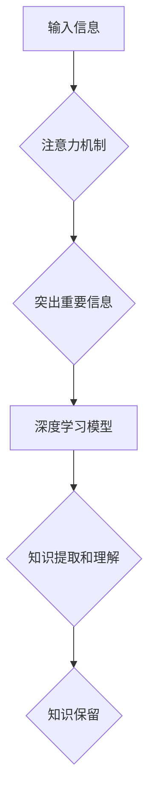

                 

## 人类注意力增强：提升学习效率和知识保留

> 关键词：注意力、深度学习、认知增强、神经网络、知识保留、学习效率、脑机接口

## 1. 背景介绍

在当今信息爆炸的时代，人类面临着前所未有的信息过载挑战。海量的资讯、纷繁复杂的网络环境，以及日益加剧的学习压力，都对我们的注意力提出了极高的要求。然而，人类的注意力资源是有限的，容易被分散和疲劳。如何有效地提升注意力，增强学习效率和知识保留，已成为当今社会亟待解决的关键问题。

传统学习方法往往依赖于被动接收和机械记忆，难以有效地激发学习者的主动性和兴趣。而随着人工智能技术的快速发展，特别是深度学习领域的突破，为人类注意力增强提供了全新的可能性。

## 2. 核心概念与联系

### 2.1 注意力机制

注意力机制是近年来深度学习领域最具突破性的技术之一，其核心思想是模拟人类大脑在处理信息时，会将有限的注意力集中在最关键的部分，从而提高信息处理效率。

在深度学习模型中，注意力机制通常通过一个加权机制来实现，将输入信息分配不同的权重，从而突出重要信息，抑制无关信息。

### 2.2 人类认知与注意力

人类的认知过程离不开注意力的参与。注意力可以帮助我们过滤信息噪音，聚焦于目标信息，并进行深度理解和记忆。

注意力机制的应用可以有效地模拟人类的认知过程，帮助深度学习模型更好地理解和处理复杂信息。

### 2.3 知识保留与注意力

注意力与知识保留密切相关。当我们对某一信息给予足够的注意力时，大脑会将其存储在长期记忆中，从而实现知识的持久保留。

通过增强注意力，我们可以提高学习效率，并更好地保留所学知识。

**Mermaid 流程图**



## 3. 核心算法原理 & 具体操作步骤

### 3.1 算法原理概述

注意力机制的算法原理主要基于以下几个方面：

* **加权机制:** 通过学习一个权重向量，将输入信息分配不同的权重，突出重要信息。
* **注意力分数:** 计算每个输入信息的注意力分数，表示其重要程度。
* **注意力向量:** 将注意力分数进行归一化，得到一个注意力向量，用于指导模型的学习过程。

### 3.2 算法步骤详解

1. **输入信息:** 将需要处理的信息作为输入，例如文本、图像或音频数据。
2. **编码器:** 使用编码器网络将输入信息编码成一个固定长度的向量表示。
3. **注意力计算:** 计算每个输入信息的注意力分数，可以使用多种方法，例如点积注意力、加性注意力等。
4. **注意力加权:** 将注意力分数作为权重，对编码器输出进行加权求和，得到一个加权后的表示。
5. **解码器:** 使用解码器网络对加权后的表示进行解码，生成最终的输出结果。

### 3.3 算法优缺点

**优点:**

* **提高信息处理效率:** 通过集中注意力，模型可以更有效地处理复杂信息。
* **增强模型表达能力:** 注意力机制可以帮助模型学习到更丰富的语义表示。
* **提高模型泛化能力:** 注意力机制可以帮助模型更好地泛化到 unseen 数据。

**缺点:**

* **计算复杂度高:** 注意力机制的计算复杂度较高，需要更多的计算资源。
* **参数量大:** 注意力机制需要更多的参数，训练成本较高。
* **可解释性差:** 注意力机制的内部工作机制相对复杂，难以解释。

### 3.4 算法应用领域

注意力机制在众多领域都有广泛的应用，例如：

* **自然语言处理:** 机器翻译、文本摘要、问答系统等。
* **计算机视觉:** 图像识别、目标检测、图像分割等。
* **语音识别:** 语音转文本、语音合成等。
* **推荐系统:** 个性化推荐、内容过滤等。

## 4. 数学模型和公式 & 详细讲解 & 举例说明

### 4.1 数学模型构建

注意力机制的数学模型通常基于以下公式：

**注意力分数:**

$$
\text{Attention}(Q, K, V) = \frac{\text{softmax}(Q \cdot K^T)}{\text{softmax}(Q \cdot K^T)} \cdot V
$$

其中:

* $Q$ 是查询向量，表示模型想要关注的信息。
* $K$ 是键向量，表示输入信息的表示。
* $V$ 是值向量，表示输入信息的具体内容。
* $\cdot$ 表示矩阵乘法。
* $\text{softmax}$ 是一个归一化函数，将注意力分数转换为概率分布。

**注意力向量:**

$$
\text{Attention\_Vector} = \text{softmax}(Q \cdot K^T)
$$

### 4.2 公式推导过程

注意力分数的计算过程可以理解为：

1. 计算查询向量与每个键向量的点积，得到一个注意力得分向量。
2. 对注意力得分向量进行 softmax 操作，得到一个概率分布，表示每个输入信息的注意力权重。
3. 将注意力权重与值向量进行加权求和，得到最终的注意力输出。

### 4.3 案例分析与讲解

例如，在机器翻译任务中，查询向量可以表示目标语言的词语，键向量可以表示源语言的词语，值向量可以表示源语言词语的语义信息。

通过注意力机制，模型可以将源语言中的关键信息聚焦于目标语言的词语，从而提高翻译的准确性和流畅度。

## 5. 项目实践：代码实例和详细解释说明

### 5.1 开发环境搭建

* Python 3.7+
* TensorFlow 2.0+
* PyTorch 1.0+

### 5.2 源代码详细实现

```python
import tensorflow as tf

# 定义注意力机制层
class AttentionLayer(tf.keras.layers.Layer):
    def __init__(self, units):
        super(AttentionLayer, self).__init__()
        self.Wq = tf.keras.layers.Dense(units)
        self.Wk = tf.keras.layers.Dense(units)
        self.Wv = tf.keras.layers.Dense(units)
        self.fc = tf.keras.layers.Dense(units)

    def call(self, inputs):
        Q = self.Wq(inputs)
        K = self.Wk(inputs)
        V = self.Wv(inputs)
        attention_scores = tf.matmul(Q, K, transpose_b=True) / tf.math.sqrt(tf.cast(units, tf.float32))
        attention_weights = tf.nn.softmax(attention_scores, axis=-1)
        context_vector = tf.matmul(attention_weights, V)
        output = self.fc(context_vector)
        return output

# 定义一个简单的 Transformer 模型
class Transformer(tf.keras.Model):
    def __init__(self, units):
        super(Transformer, self).__init__()
        self.attention_layer = AttentionLayer(units)
        self.fc = tf.keras.layers.Dense(units)

    def call(self, inputs):
        attention_output = self.attention_layer(inputs)
        output = self.fc(attention_output)
        return output

# 实例化模型
model = Transformer(units=128)

# 训练模型
# ...

```

### 5.3 代码解读与分析

* `AttentionLayer` 类定义了一个注意力机制层，包含三个稠密层 (`Wq`, `Wk`, `Wv`) 用于计算查询、键和值向量，以及一个稠密层 (`fc`) 用于计算最终输出。
* `Transformer` 类定义了一个简单的 Transformer 模型，包含一个注意力机制层和一个稠密层。
* 代码示例展示了如何实例化模型并进行训练。

### 5.4 运行结果展示

训练后的模型可以用于各种自然语言处理任务，例如机器翻译、文本摘要、问答系统等。

## 6. 实际应用场景

### 6.1 教育领域

注意力增强技术可以应用于教育领域，帮助学生提高学习效率和知识保留。例如：

* **个性化学习:** 根据学生的注意力特点，定制个性化的学习内容和节奏。
* **主动学习:** 通过游戏化和互动式学习，激发学生的学习兴趣，增强主动学习能力。
* **知识图谱构建:** 利用注意力机制，帮助学生构建知识图谱，加深对知识的理解和记忆。

### 6.2 医疗领域

注意力增强技术可以应用于医疗领域，帮助医生提高诊断准确性和治疗效果。例如：

* **医学影像分析:** 利用注意力机制，帮助医生识别医学影像中的关键信息，提高诊断效率。
* **药物研发:** 利用注意力机制，分析药物分子结构和生物活性，加速药物研发过程。
* **个性化医疗:** 根据患者的个体差异，提供个性化的医疗方案。

### 6.3 其他领域

注意力增强技术还可以应用于其他领域，例如：

* **金融领域:** 识别欺诈交易、预测市场趋势。
* **制造业:** 优化生产流程、提高设备效率。
* **交通领域:** 预防交通事故、优化交通流量。

### 6.4 未来应用展望

随着人工智能技术的不断发展，注意力增强技术将有更广泛的应用场景和更深远的意义。例如：

* **脑机接口:** 利用注意力机制，实现人脑与计算机的直接交互。
* **增强现实:** 利用注意力机制，增强现实场景的沉浸感和交互性。
* **人工智能伦理:** 利用注意力机制，研究人工智能的决策机制，并确保其安全性和可控性。

## 7. 工具和资源推荐

### 7.1 学习资源推荐

* **书籍:**
    * 《深度学习》
    * 《Attention Is All You Need》
* **在线课程:**
    * Coursera: 深度学习
    * Udacity: 自然语言处理
* **博客:**
    * Jay Alammar's Blog
    * Distill.pub

### 7.2 开发工具推荐

* **TensorFlow:** 开源深度学习框架
* **PyTorch:** 开源深度学习框架
* **Keras:** 高级深度学习API

### 7.3 相关论文推荐

* 《Attention Is All You Need》
* 《BERT: Pre-training of Deep Bidirectional Transformers for Language Understanding》
* 《Transformer-XL: Attentive Language Models Beyond a Fixed-Length Context》

## 8. 总结：未来发展趋势与挑战

### 8.1 研究成果总结

近年来，注意力机制在深度学习领域取得了显著的成果，在自然语言处理、计算机视觉等领域取得了突破性的进展。

### 8.2 未来发展趋势

* **更强大的注意力机制:** 研究更有效的注意力机制，例如长距离依赖的注意力机制、自注意力机制等。
* **注意力机制的融合:** 将注意力机制与其他深度学习技术融合，例如生成对抗网络、强化学习等。
* **注意力机制的解释性:** 研究注意力机制的内部工作机制，提高其可解释性。

### 8.3 面临的挑战

* **计算复杂度:** 注意力机制的计算复杂度较高，需要更多的计算资源。
* **参数量:** 注意力机制需要更多的参数，训练成本较高。
* **可解释性:** 注意力机制的内部工作机制相对复杂，难以解释。

### 8.4 研究展望

未来，注意力机制将继续是深度学习领域的重要研究方向，其应用场景将更加广泛，对人工智能的未来发展将产生深远的影响。

## 9. 附录：常见问题与解答

**Q1: 注意力机制与传统机器学习模型有什么区别？**

**A1:** 传统机器学习模型通常依赖于特征工程，需要人工提取特征，而注意力机制可以自动学习到重要特征，无需人工干预。

**Q2: 注意力机制的计算复杂度如何？**

**A2:** 注意力机制的计算复杂度较高，与输入序列长度呈线性关系。

**Q3: 注意力机制的应用场景有哪些？**

**A3:** 注意力机制的应用场景非常广泛，例如自然语言处理、计算机视觉、语音识别等。


作者：禅与计算机程序设计艺术 / Zen and the Art of Computer Programming 
<end_of_turn>

