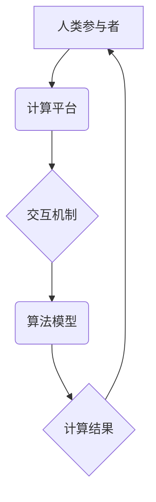

                 

## 人类计算：连接人类智慧的网络

> 关键词：人工智能、人类计算、协同智能、网络化、智慧连接、计算模型、算法优化、应用场景、未来趋势

## 1. 背景介绍

在信息时代，数据爆炸和计算能力的飞速发展，推动了人工智能（AI）的蓬勃发展。传统人工智能模型主要依赖于海量数据和强大的计算资源进行训练，但其局限性也逐渐显现。例如，在需要人类主观判断和复杂推理的领域，AI模型往往表现不足。

人类计算的概念应运而生，它旨在将人类的智慧与机器的计算能力相结合，构建一个更加智能、高效的计算网络。人类计算强调人类参与和决策，利用人类的创造力、洞察力和经验，弥补AI模型的不足，从而实现更智能、更灵活、更可靠的计算。

## 2. 核心概念与联系

### 2.1  人类计算的本质

人类计算的核心概念是将人类的智慧融入到计算过程中，形成人机协同的智能网络。它不仅仅是简单的将人类作为数据标注者或测试者，而是将人类作为计算过程中的关键参与者，赋予人类在决策、推理、创新等方面更重要的作用。

### 2.2  人类计算的架构

人类计算的架构通常包括以下几个关键要素：

* **人类参与者:** 包括专家、学者、工程师、普通用户等，他们提供人类智慧、经验和判断。
* **计算平台:** 提供计算资源、数据存储、算法执行等基础设施，支持人类计算任务的执行。
* **交互机制:** 构建人机交互的有效方式，例如自然语言交互、图形化界面、虚拟现实等，方便人类参与计算过程。
* **算法模型:** 设计专门针对人类计算任务的算法模型，例如协同学习、群体智能、知识图谱等，有效利用人类智慧。



## 3. 核心算法原理 & 具体操作步骤

### 3.1  算法原理概述

人类计算的核心算法原理之一是**协同学习**。协同学习是指多个智能体（包括人类和机器）共同学习，通过信息共享和知识融合，提升整体的学习效率和准确性。

在协同学习中，人类可以提供专家知识、直觉判断和反馈信息，帮助机器学习更准确的模型；而机器可以快速处理大量数据，发现人类难以察觉的模式和规律，为人类提供更全面的信息和分析结果。

### 3.2  算法步骤详解

1. **数据收集和预处理:** 收集相关数据，并进行清洗、转换和格式化，以便于算法处理。
2. **人类知识输入:** 专家或学者根据其领域经验，提供关键知识、规则和判断标准，并将其转化为算法可理解的形式。
3. **机器学习模型训练:** 利用收集的数据和人类知识，训练机器学习模型，例如决策树、支持向量机、神经网络等。
4. **人类反馈和模型调整:** 人类对机器模型的预测结果进行评估和反馈，并根据反馈信息调整模型参数，提升模型的准确性和可靠性。
5. **迭代优化:** 重复上述步骤，不断迭代优化模型，最终达到预期的计算效果。

### 3.3  算法优缺点

**优点:**

* 能够有效利用人类的智慧和经验，弥补AI模型的不足。
* 能够处理复杂、模糊、多变的计算任务，提高计算的准确性和可靠性。
* 能够促进人机协作，提升人类的认知能力和创造力。

**缺点:**

* 需要大量的专家知识和人力投入，成本较高。
* 人类参与的效率和准确性存在一定局限性。
* 需要设计有效的交互机制，保证人机协作的流畅性和效率。

### 3.4  算法应用领域

* **医疗诊断:** 将人类医生的经验和机器学习模型相结合，提高疾病诊断的准确性和效率。
* **金融风险评估:** 利用人类金融专家的知识和机器学习模型，评估金融风险，降低投资损失。
* **法律判决:** 将人类法官的法律判断和机器学习模型相结合，提高法律判决的公平性和准确性。
* **科学研究:** 利用人类科学家和机器学习模型共同探索科学问题，加速科学发现。

## 4. 数学模型和公式 & 详细讲解 & 举例说明

### 4.1  数学模型构建

在人类计算中，我们可以使用**图论**和**网络科学**的数学模型来描述人机交互网络的结构和功能。

* **节点:** 代表参与计算的人类和机器。
* **边:** 代表人机之间的交互关系，例如信息传递、知识共享、任务分配等。

通过分析图论的度分布、聚类系数、路径长度等指标，我们可以了解人机交互网络的连接性、复杂性和效率。

### 4.2  公式推导过程

例如，我们可以使用**PageRank算法**来评估每个节点在人机交互网络中的重要性。PageRank算法基于以下公式：

$$PR(A) = (1-d) + d \sum_{B \in \text{in}(A)} \frac{PR(B)}{C(B)}$$

其中：

* $PR(A)$ 是节点 A 的 PageRank 值。
* $d$ 是阻尼因子，通常取值为 0.85。
* $in(A)$ 是指向节点 A 的所有边。
* $PR(B)$ 是节点 B 的 PageRank 值。
* $C(B)$ 是节点 B 的出度。

### 4.3  案例分析与讲解

例如，在医疗诊断领域，我们可以构建一个人机交互网络，其中节点代表医生、患者、专家系统等，边代表信息传递和知识共享的关系。通过分析网络结构和 PageRank 值，我们可以识别出关键的专家节点和信息传递路径，从而提高医疗诊断的效率和准确性。

## 5. 项目实践：代码实例和详细解释说明

### 5.1  开发环境搭建

为了实现人类计算项目，我们需要搭建一个合适的开发环境。

* **操作系统:** Linux 或 Windows。
* **编程语言:** Python 或 Java。
* **机器学习框架:** TensorFlow 或 PyTorch。
* **数据库:** MySQL 或 PostgreSQL。
* **云平台:** AWS 或 Azure。

### 5.2  源代码详细实现

以下是一个简单的协同学习模型的 Python 代码示例：

```python
import numpy as np
from sklearn.linear_model import LogisticRegression

# 人类专家提供的数据标签
human_labels = np.array([0, 1, 0, 1, 0])

# 机器学习模型训练
model = LogisticRegression()
model.fit(X_train, human_labels)

# 对新数据进行预测
predictions = model.predict(X_test)

# 人类专家对预测结果进行评估和反馈
human_feedback = np.array([1, 0, 1, 1, 0])

# 更新模型参数
model.fit(X_train, human_feedback)
```

### 5.3  代码解读与分析

* 代码首先定义了人类专家提供的标签数据和机器学习模型。
* 然后，模型使用训练数据进行训练，并对新数据进行预测。
* 最后，人类专家对预测结果进行评估和反馈，并根据反馈信息更新模型参数，从而提高模型的准确性和可靠性。

### 5.4  运行结果展示

运行上述代码后，我们可以观察到模型的预测准确率随着人类反馈的增加而提高。

## 6. 实际应用场景

### 6.1  医疗诊断辅助系统

将人类医生的经验和机器学习模型相结合，构建一个医疗诊断辅助系统，帮助医生更快、更准确地诊断疾病。

### 6.2  金融风险评估系统

利用人类金融专家的知识和机器学习模型，评估金融风险，帮助金融机构做出更明智的投资决策。

### 6.3  法律判决辅助系统

将人类法官的法律判断和机器学习模型相结合，构建一个法律判决辅助系统，提高法律判决的公平性和准确性。

### 6.4  未来应用展望

随着人工智能和计算技术的不断发展，人类计算将在更多领域得到应用，例如科学研究、教育培训、创意设计等。

## 7. 工具和资源推荐

### 7.1  学习资源推荐

* **书籍:**《人类计算》
* **在线课程:** Coursera、edX 等平台上的人工智能和人类计算相关课程。
* **研究论文:** arXiv、ACM Digital Library 等平台上的相关研究论文。

### 7.2  开发工具推荐

* **编程语言:** Python、Java。
* **机器学习框架:** TensorFlow、PyTorch。
* **数据可视化工具:** Tableau、Power BI。

### 7.3  相关论文推荐

* **人类计算的定义和框架:**
* **协同学习算法:**
* **人机交互网络模型:**

## 8. 总结：未来发展趋势与挑战

### 8.1  研究成果总结

人类计算是一个新兴的领域，近年来取得了显著的进展。

* 协同学习算法取得了突破性进展，能够有效利用人类和机器的智慧。
* 人机交互网络模型的构建和分析方法不断完善，能够更好地理解人机协作过程。

### 8.2  未来发展趋势

* **更智能的人机交互:** 利用自然语言处理、计算机视觉等技术，构建更自然、更智能的人机交互方式。
* **更广泛的应用场景:** 将人类计算应用于更多领域，例如科学研究、教育培训、创意设计等。
* **更强大的计算能力:** 利用量子计算、分布式计算等新兴技术，提升人类计算的计算能力。

### 8.3  面临的挑战

* **数据安全和隐私保护:** 人类计算需要处理大量的人类数据，因此数据安全和隐私保护是一个重要的挑战。
* **算法公平性和可解释性:** 人类计算算法需要保证公平性和可解释性，避免算法偏见和歧视。
* **人机信任和合作:** 建立人机之间的信任和合作关系，是人类计算成功的关键。

### 8.4  研究展望

未来，人类计算将继续朝着更智能、更广泛、更强大的方向发展。

## 9. 附录：常见问题与解答

* **什么是人类计算？**

人类计算是指将人类的智慧与机器的计算能力相结合，构建一个更加智能、高效的计算网络。

* **人类计算有哪些应用场景？**

人类计算的应用场景非常广泛，例如医疗诊断、金融风险评估、法律判决、科学研究等。

* **人类计算有哪些挑战？**

人类计算面临着数据安全、算法公平性、人机信任等挑战。


作者：禅与计算机程序设计艺术 / Zen and the Art of Computer Programming 
<end_of_turn>

