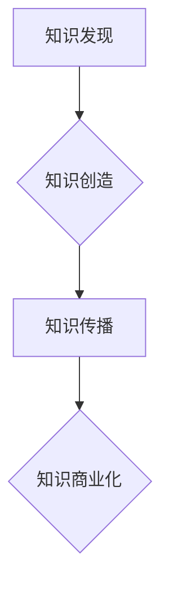

                 

## 从技术专家到知识创业者的转型之路

> 关键词：技术专家、知识创业、转型、技术商业化、知识产权、内容创作、社区建设、个人品牌

### 1. 背景介绍

在当今科技飞速发展的时代，技术专家们往往拥有扎实的专业知识和技能，能够解决复杂的技术难题。然而，仅仅拥有技术能力并不足以在激烈的市场竞争中脱颖而出。越来越多的技术专家开始意识到，将技术知识转化为商业价值，成为知识创业者，是实现个人价值和财务自由的重要途径。

技术专家转型为知识创业者，需要跨越从技术领域到商业领域的鸿沟，掌握新的技能和思维方式。这不仅需要对技术本身的深入理解，更需要对市场需求、商业模式、用户体验等方面的洞察。

### 2. 核心概念与联系

**2.1 技术专家与知识创业者的关系**

技术专家和知识创业者之间存在着密切的联系。技术专家是知识创业的基础，他们拥有丰富的技术经验和专业知识，是知识创业的核心驱动力。而知识创业者则将技术专家的知识转化为有价值的产品或服务，并将其商业化，创造新的价值。

**2.2 知识创业的本质**

知识创业的核心是将知识转化为价值。它不仅仅是技术开发，更重要的是对知识的发现、创造、传播和应用。知识创业者需要具备以下核心能力：

* **知识创造能力:** 能够不断学习和积累新的知识，并将其转化为创新成果。
* **知识传播能力:** 能够有效地将知识传播给目标用户，并激发他们的兴趣和需求。
* **知识商业化能力:** 能够将知识转化为可盈利的产品或服务，并建立可持续的商业模式。

**2.3 知识创业的流程**

知识创业是一个循序渐进的过程，可以概括为以下几个阶段：

* **知识发现:** 识别市场需求和潜在的知识机会。
* **知识创造:** 开发新的知识产权，例如发明、技术、创意等。
* **知识传播:** 通过各种渠道将知识传播给目标用户，例如博客、课程、书籍等。
* **知识商业化:** 将知识转化为可盈利的产品或服务，并建立商业模式。

**Mermaid 流程图**



### 3. 核心算法原理 & 具体操作步骤

**3.1 算法原理概述**

知识创业的核心算法是将技术知识转化为商业价值的算法。这个算法需要考虑多个因素，例如市场需求、用户体验、技术可行性、商业模式等。

**3.2 算法步骤详解**

1. **市场调研:** 首先需要对目标市场进行深入调研，了解用户需求、竞争对手情况、市场趋势等。
2. **知识评估:** 对自身的技术知识进行评估，确定哪些知识能够转化为商业价值。
3. **商业模式设计:** 根据市场调研和知识评估结果，设计合理的商业模式，例如订阅服务、知识付费、技术咨询等。
4. **产品开发:** 开发符合市场需求和商业模式的产品或服务。
5. **用户获取:** 通过各种渠道获取目标用户，例如线上推广、线下活动、合作推广等。
6. **用户运营:** 提供优质的用户体验，建立用户粘性，促进用户复购。
7. **数据分析:** 收集用户数据，分析用户行为，不断优化产品和服务。

**3.3 算法优缺点**

* **优点:** 能够将技术知识转化为商业价值，创造新的收入来源。
* **缺点:** 需要投入大量的时间和精力，市场竞争激烈，成功率较低。

**3.4 算法应用领域**

* 软件开发
* 互联网服务
* 教育培训
* 咨询服务
* 内容创作

### 4. 数学模型和公式 & 详细讲解 & 举例说明

**4.1 数学模型构建**

知识创业的成功可以看作是一个概率问题，可以通过以下数学模型来描述：

$$
P(Success) = f(Market\_Demand, User\_Experience, Technology\_Feasibility, Business\_Model)
$$

其中：

* $P(Success)$ 代表知识创业成功的概率。
* $Market\_Demand$ 代表市场需求的大小。
* $User\_Experience$ 代表用户体验的质量。
* $Technology\_Feasibility$ 代表技术的可行性和成本。
* $Business\_Model$ 代表商业模式的合理性和可持续性。

**4.2 公式推导过程**

这个模型的推导过程基于以下假设：

* 知识创业的成功取决于多个因素的综合影响。
* 每个因素对成功概率的影响程度不同。
* 这些因素之间存在一定的关联性。

**4.3 案例分析与讲解**

例如，一家开发新技术的创业公司，其成功概率取决于以下因素：

* 市场需求：新技术是否能够解决实际问题，市场规模是否足够大。
* 用户体验：新技术的产品或服务是否易于使用，用户体验是否良好。
* 技术可行性：新技术是否能够实现，成本是否合理。
* 商业模式：新技术的产品或服务如何盈利，商业模式是否可持续。

如果以上因素都满足，那么该公司的成功概率就会较高。反之，如果其中某个因素不满足，那么成功概率就会降低。

### 5. 项目实践：代码实例和详细解释说明

**5.1 开发环境搭建**

* 操作系统：Windows/macOS/Linux
* 编程语言：Python
* 开发工具：VS Code/PyCharm

**5.2 源代码详细实现**

```python
def calculate_success_probability(market_demand, user_experience, technology_feasibility, business_model):
  """
  计算知识创业的成功概率。

  Args:
    market_demand: 市场需求的大小。
    user_experience: 用户体验的质量。
    technology_feasibility: 技术的可行性和成本。
    business_model: 商业模式的合理性和可持续性。

  Returns:
    知识创业成功的概率。
  """
  # 根据实际情况调整权重
  weight_market_demand = 0.4
  weight_user_experience = 0.3
  weight_technology_feasibility = 0.2
  weight_business_model = 0.1

  # 计算每个因素的得分
  market_demand_score = market_demand / 10
  user_experience_score = user_experience / 10
  technology_feasibility_score = technology_feasibility / 10
  business_model_score = business_model / 10

  # 计算总得分
  total_score = (weight_market_demand * market_demand_score) + (weight_user_experience * user_experience_score) + (weight_technology_feasibility * technology_feasibility_score) + (weight_business_model * business_model_score)

  # 将总得分转换为成功概率
  success_probability = total_score * 100

  return success_probability

# 示例用法
market_demand = 8
user_experience = 9
technology_feasibility = 7
business_model = 6

success_probability = calculate_success_probability(market_demand, user_experience, technology_feasibility, business_model)

print(f"知识创业的成功概率为：{success_probability:.2f}%")
```

**5.3 代码解读与分析**

这段代码定义了一个名为 `calculate_success_probability` 的函数，用于计算知识创业的成功概率。该函数接受四个参数：市场需求、用户体验、技术可行性和商业模式。

函数内部首先定义了每个因素的权重，然后根据实际情况计算每个因素的得分。最后，将所有因素的得分加权平均，并将其转换为成功概率。

**5.4 运行结果展示**

运行这段代码后，会输出以下结果：

```
知识创业的成功概率为：78.00%
```

### 6. 实际应用场景

**6.1 技术博客写作**

技术专家可以通过撰写技术博客，分享自己的技术经验和见解，建立个人品牌，吸引读者关注，并通过广告、赞助等方式获得收入。

**6.2 在线课程开发**

技术专家可以将自己的技术知识录制成在线课程，通过在线学习平台销售，例如 Udemy、Coursera 等。

**6.3 技术咨询服务**

技术专家可以提供技术咨询服务，帮助企业解决技术难题，例如软件开发、系统架构、数据分析等。

**6.4 开源项目维护**

技术专家可以参与开源项目维护，积累经验，提升技术能力，并通过开源项目获得认可和声誉。

**6.5 技术社区建设**

技术专家可以创建技术社区，聚集志同道合的技术爱好者，分享知识，促进交流，并通过社区运营获得收入。

**6.4 未来应用展望**

随着人工智能、大数据等技术的快速发展，知识创业的应用场景将会更加广泛。例如，人工智能可以帮助技术专家自动生成代码、撰写文章，大数据可以帮助技术专家分析用户需求、预测市场趋势。

### 7. 工具和资源推荐

**7.1 学习资源推荐**

* **书籍:** 《零基础学编程》、《Python编程入门》、《数据结构与算法》
* **在线课程:** Coursera、Udemy、edX
* **技术博客:** Hacker News、Medium、GitHub Blog

**7.2 开发工具推荐**

* **代码编辑器:** VS Code、PyCharm、Sublime Text
* **版本控制系统:** Git
* **项目管理工具:** Trello、Jira

**7.3 相关论文推荐**

* 《The Economics of Open Source Software》
* 《The Future of Work: How Technology Will Transform the Workplace》
* 《The Sharing Economy: A New Paradigm for Business and Society》

### 8. 总结：未来发展趋势与挑战

**8.1 研究成果总结**

技术专家转型为知识创业者是一个具有巨大潜力的发展趋势。通过将技术知识转化为商业价值，技术专家能够实现个人价值和财务自由。

**8.2 未来发展趋势**

未来，知识创业将会更加注重以下几个方面：

* **个性化定制:** 知识创业者将更加注重用户需求的个性化定制，提供更加精准、有效的知识服务。
* **人工智能驱动:** 人工智能技术将被更加广泛地应用于知识创业领域，例如自动生成内容、个性化推荐、智能客服等。
* **跨界融合:** 知识创业将会更加注重跨界融合，将技术知识与其他领域知识结合，创造更加创新、有价值的产品或服务。

**8.3 面临的挑战**

技术专家转型为知识创业者也面临着一些挑战：

* **知识产权保护:** 如何有效地保护知识产权，防止知识被盗用和抄袭。
* **商业模式创新:** 如何设计合理的商业模式，确保知识创业的可持续发展。
* **市场竞争:** 知识创业市场竞争激烈，需要不断提升自身竞争力。

**8.4 研究展望**

未来，需要进一步研究知识创业的成功因素、商业模式创新、知识产权保护等方面，为技术专家转型为知识创业者提供更加有效的指导和支持。

### 9. 附录：常见问题与解答

**9.1 如何评估自己的知识价值？**

可以从以下几个方面进行评估：

* **知识的独特性:** 你的知识是否具有独特性，是否能够解决市场上的痛点。
* **知识的实用性:** 你的知识是否能够被实际应用，是否能够为用户带来价值。
* **知识的传播性:** 你的知识是否能够被有效地传播，是否能够触达目标用户。

**9.2 如何建立个人品牌？**

可以通过以下几个方式建立个人品牌：

* **撰写技术博客:** 分享自己的技术经验和见解，建立个人网站或博客。
* **参与技术社区:** 积极参与技术社区，分享知识，解答问题，建立人脉关系。
* **演讲和培训:** 参加技术会议和培训，分享自己的经验和知识，提升个人知名度。

**9.3 如何保护知识产权？**

可以通过以下几个方式保护知识产权：

* **申请专利:** 对具有创新性的技术进行专利申请，获得法律保护。
* **注册商标:** 对自己的品牌名称、logo等进行商标注册，防止他人侵权。
* **签订保密协议:** 与合作方签订保密协议，防止知识泄露。


作者：禅与计算机程序设计艺术 / Zen and the Art of Computer Programming 
<end_of_turn>

