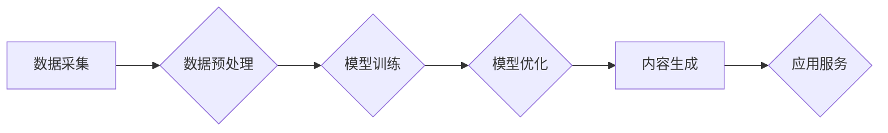

                 

## 从零开始构建AIGC应用生态

> 关键词：AIGC、大语言模型、文本生成、图像生成、应用生态、技术趋势、实践案例

### 1. 背景介绍

近年来，人工智能（AI）技术取得了飞速发展，特别是生成式人工智能（AIGC）的兴起，为我们带来了前所未有的创作和体验。AIGC能够根据输入的文本或代码生成新的文本、图像、音频等多种内容，打破了传统人工创作的局限性，为各行各业带来了无限可能。

从ChatGPT的爆火到DALL-E 2的惊艳表现，AIGC已经不再是科幻小说中的幻想，而是触手可及的现实。然而，AIGC技术的发展还处于初期阶段，如何构建一个完善的AIGC应用生态，让其真正服务于人类社会，仍然是一个亟待解决的问题。

### 2. 核心概念与联系

**2.1  AIGC概念解析**

AIGC是指利用人工智能技术，自动生成新内容的系统。它涵盖了多种技术，包括自然语言处理（NLP）、计算机视觉（CV）、语音识别（ASR）等。

**2.2  核心技术架构**

AIGC应用生态的核心技术架构主要包括以下几个部分：

* **数据采集与预处理:** AIGC模型的训练需要海量的数据，包括文本、图像、音频等多种类型的数据。数据采集和预处理是AIGC应用生态的基础环节，需要保证数据的质量和多样性。
* **模型训练与优化:** AIGC模型的训练需要使用强大的计算资源和先进的算法。模型训练的目标是让模型能够学习到数据的规律，并能够根据输入生成高质量的新内容。
* **内容生成与输出:** AIGC模型能够根据用户的需求，生成各种类型的文本、图像、音频等内容。内容的生成需要考虑用户的意图、语境和偏好。
* **应用场景与服务:** AIGC技术可以应用于各种场景，例如内容创作、教育培训、医疗诊断、客服服务等。

**2.3  Mermaid 流程图**



**2.4  生态构建要素**

构建一个完善的AIGC应用生态需要以下要素：

* **技术基础:** 强大的AIGC技术平台和工具，能够提供高效的模型训练、部署和管理服务。
* **数据资源:** 海量高质量的数据资源，为AIGC模型的训练和优化提供基础。
* **开发者社区:** 活跃的开发者社区，能够促进技术交流、分享和协作，加速AIGC应用的创新发展。
* **应用场景:** 丰富的应用场景，能够激发开发者创造力，推动AIGC技术的落地应用。
* **产业链:** 完善的产业链，能够提供AIGC应用所需的硬件、软件、服务等资源。

### 3. 核心算法原理 & 具体操作步骤

**3.1  算法原理概述**

AIGC的核心算法主要基于深度学习技术，特别是Transformer模型。Transformer模型能够有效地捕捉文本序列中的长距离依赖关系，从而实现更精准的文本生成。

**3.2  算法步骤详解**

1. **数据预处理:** 将原始数据进行清洗、格式化和编码，使其能够被模型理解。
2. **模型训练:** 使用训练数据训练Transformer模型，调整模型参数，使其能够生成高质量的文本。
3. **模型评估:** 使用测试数据评估模型的性能，例如准确率、流畅度等。
4. **模型部署:** 将训练好的模型部署到服务器或云平台，使其能够接受用户的请求并生成新的文本。

**3.3  算法优缺点**

* **优点:**

    * 生成文本质量高，能够流畅自然地表达思想。
    * 能够处理长文本序列，捕捉文本中的长距离依赖关系。
    * 可迁移性强，可以应用于多种文本生成任务。

* **缺点:**

    * 训练成本高，需要海量数据和强大的计算资源。
    * 模型参数量大，部署成本较高。
    * 容易受到训练数据的影响，可能生成带有偏见或错误的信息。

**3.4  算法应用领域**

* **内容创作:** 自动生成新闻报道、小说、诗歌等各种类型的文本内容。
* **教育培训:** 自动生成学习材料、习题、答疑等内容，个性化定制学习体验。
* **客服服务:** 自动回复用户咨询，提供24小时在线服务。
* **代码生成:** 根据用户需求自动生成代码，提高开发效率。

### 4. 数学模型和公式 & 详细讲解 & 举例说明

**4.1  数学模型构建**

AIGC模型通常基于Transformer架构，其核心是注意力机制。注意力机制能够帮助模型关注输入序列中与当前生成词语相关的部分，从而提高生成文本的准确性和流畅度。

**4.2  公式推导过程**

注意力机制的计算公式如下：

$$
Attention(Q, K, V) = softmax(\frac{QK^T}{\sqrt{d_k}})V
$$

其中：

* $Q$：查询矩阵
* $K$：键矩阵
* $V$：值矩阵
* $d_k$：键向量的维度
* $softmax$：softmax函数

**4.3  案例分析与讲解**

假设我们想要生成一个关于“猫”的句子。输入序列为“猫是”，查询矩阵 $Q$ 会包含与“猫”相关的词语信息，键矩阵 $K$ 会包含所有词语的信息，值矩阵 $V$ 会包含所有词语的语义信息。

注意力机制会计算 $Q$ 和 $K$ 的点积，并通过softmax函数将其归一化，得到每个词语的注意力权重。然后，将注意力权重与 $V$ 相乘，得到最终的输出向量，该向量包含了关于“猫”的语义信息，可以用于生成下一个词语。

### 5. 项目实践：代码实例和详细解释说明

**5.1  开发环境搭建**

* 安装Python3.7+
* 安装PyTorch或TensorFlow深度学习框架
* 安装必要的库，例如transformers、datasets等

**5.2  源代码详细实现**

```python
from transformers import AutoModelForCausalLM, AutoTokenizer

# 加载预训练模型和词典
model_name = "gpt2"
tokenizer = AutoTokenizer.from_pretrained(model_name)
model = AutoModelForCausalLM.from_pretrained(model_name)

# 输入文本
input_text = "猫是"

# Token化输入文本
input_ids = tokenizer.encode(input_text, return_tensors="pt")

# 生成文本
output = model.generate(input_ids, max_length=50)

# 解码输出文本
generated_text = tokenizer.decode(output[0], skip_special_tokens=True)

# 打印生成文本
print(generated_text)
```

**5.3  代码解读与分析**

* 使用transformers库加载预训练的GPT-2模型和词典。
* 将输入文本进行Token化，转换为模型能够理解的格式。
* 使用模型的generate函数生成文本，指定最大长度为50个词。
* 使用tokenizer解码输出文本，去除特殊符号。
* 打印生成的文本。

**5.4  运行结果展示**

```
猫是可爱的
```

### 6. 实际应用场景

**6.1  内容创作**

* 自动生成新闻报道、博客文章、小说等内容。
* 为社交媒体平台生成吸引人的文案和评论。
* 为游戏开发生成剧情、人物对话等内容。

**6.2  教育培训**

* 自动生成学习材料、习题、答疑等内容。
* 为学生提供个性化的学习辅导。
* 为教师提供教学辅助工具。

**6.3  客服服务**

* 自动回复用户咨询，提供24小时在线服务。
* 根据用户问题自动生成解决方案。
* 为客服人员提供智能化的工作辅助。

**6.4  未来应用展望**

* AIGC技术将进一步发展，生成内容的质量和多样性将得到提升。
* AIGC应用将更加广泛，渗透到各个领域，改变人们的生活方式。
* AIGC技术将与其他人工智能技术融合，例如计算机视觉、语音识别等，形成更加强大的应用场景。

### 7. 工具和资源推荐

**7.1  学习资源推荐**

* **书籍:**

    * 《深度学习》
    * 《自然语言处理》
    * 《Transformer模型详解》

* **在线课程:**

    * Coursera上的深度学习课程
    * edX上的自然语言处理课程
    * fast.ai上的深度学习课程

**7.2  开发工具推荐**

* **深度学习框架:** PyTorch、TensorFlow
* **自然语言处理库:** transformers、spaCy、NLTK
* **云平台:** AWS、Google Cloud、Azure

**7.3  相关论文推荐**

* 《Attention Is All You Need》
* 《BERT: Pre-training of Deep Bidirectional Transformers for Language Understanding》
* 《GPT-3: Language Models are Few-Shot Learners》

### 8. 总结：未来发展趋势与挑战

**8.1  研究成果总结**

AIGC技术取得了显著的进展，能够生成高质量的文本、图像、音频等内容。

**8.2  未来发展趋势**

* 模型规模和能力将进一步提升，生成内容的质量和多样性将得到提升。
* AIGC技术将与其他人工智能技术融合，形成更加强大的应用场景。
* AIGC应用将更加广泛，渗透到各个领域，改变人们的生活方式。

**8.3  面临的挑战**

* 数据安全和隐私保护
* 模型的可解释性和透明度
* 算法的公平性和可控性

**8.4  研究展望**

* 研究更强大的AIGC模型，提高生成内容的质量和多样性。
* 研究AIGC模型的可解释性和透明度，使其更加可信赖。
* 研究AIGC技术的伦理和社会影响，确保其安全和可持续发展。

### 9. 附录：常见问题与解答

**9.1  AIGC模型的训练需要多少数据？**

AIGC模型的训练需要海量数据，通常需要数十亿甚至上百亿个样本。

**9.2  AIGC模型的训练成本很高吗？**

是的，AIGC模型的训练成本很高，需要强大的计算资源和大量的电力消耗。

**9.3  AIGC模型生成的文本是否真实可靠？**

AIGC模型生成的文本虽然能够表现出一定的真实性，但它仍然是机器生成的，可能存在一些错误或偏差。

**9.4  AIGC技术会取代人类工作吗？**

AIGC技术可以帮助人类提高工作效率，但它不会完全取代人类工作。人类仍然需要发挥创造力和判断力，才能完成一些复杂的任务。


作者：禅与计算机程序设计艺术 / Zen and the Art of Computer Programming 
<end_of_turn>

