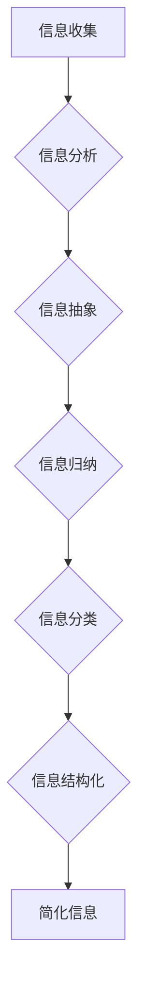

                 

## 信息简化的艺术：如何在混乱和复杂中找到简单和秩序

> 关键词：信息简化、复杂系统、算法设计、数学建模、代码实现、实际应用、未来趋势

### 1. 背景介绍

在当今信息爆炸的时代，我们被海量数据和复杂系统所包围。从庞大的社交网络到复杂的金融市场，从精密的医疗诊断到智能化的交通系统，无处不在的复杂性让人感到不知所措。如何从混乱中找到秩序，如何将复杂的信息简化成易于理解和处理的形式，已成为当今社会面临的重大挑战。

信息简化并非简单地减少信息量，而是要通过合理的分析、抽象和组织，将信息转化为更有价值、更易于理解和应用的形式。它需要我们具备敏锐的洞察力、严谨的逻辑思维和强大的抽象能力。

### 2. 核心概念与联系

信息简化的核心概念包括：

* **抽象:** 从复杂系统中提取关键要素，忽略不重要的细节，构建简化的模型。
* **归纳:** 从大量数据中发现规律和模式，总结出通用的原则和结论。
* **分类:** 将信息按照不同的标准进行分组和排序，提高信息的组织性和可检索性。
* **结构化:** 将信息按照逻辑关系进行排列和连接，构建清晰的层次结构和知识图谱。

这些概念相互关联，共同构成了信息简化的框架。

**Mermaid 流程图:**



### 3. 核心算法原理 & 具体操作步骤

#### 3.1 算法原理概述

信息简化算法通常基于以下原理：

* **数据压缩:** 利用数据冗余性，采用编码和压缩技术，减少信息的存储空间和传输带宽。
* **特征提取:** 从原始数据中提取关键特征，忽略无关信息，提高信息的表达效率。
* **模式识别:** 利用机器学习和人工智能技术，识别数据中的潜在模式和规律，进行预测和分析。

#### 3.2 算法步骤详解

信息简化算法的具体操作步骤通常包括：

1. **数据预处理:** 清洗、转换和格式化原始数据，使其符合算法的输入要求。
2. **特征选择:** 根据任务目标，选择最具代表性的特征，并进行降维处理。
3. **模型训练:** 利用训练数据，训练机器学习模型，学习数据中的模式和规律。
4. **模型评估:** 使用测试数据，评估模型的性能，并进行参数调整。
5. **信息简化:** 将训练好的模型应用于新的数据，进行信息提取、压缩和结构化。

#### 3.3 算法优缺点

信息简化算法具有以下优点：

* **提高信息效率:** 减少冗余信息，提高信息的表达效率。
* **降低复杂度:** 将复杂系统简化为易于理解和处理的形式。
* **促进知识发现:** 从海量数据中发现隐藏的规律和模式。

但也存在以下缺点：

* **信息损失:** 简化过程中可能会丢失部分信息。
* **算法选择:** 需要根据具体任务选择合适的算法。
* **模型训练:** 需要大量数据进行模型训练。

#### 3.4 算法应用领域

信息简化算法广泛应用于以下领域：

* **数据压缩:** 图像、音频、视频等数据的压缩存储和传输。
* **文本分析:** 文本分类、主题提取、情感分析等。
* **图像识别:** 人脸识别、物体检测、图像分类等。
* **机器翻译:** 自动将一种语言翻译成另一种语言。
* **医疗诊断:** 从医学影像数据中识别疾病。

### 4. 数学模型和公式 & 详细讲解 & 举例说明

#### 4.1 数学模型构建

信息简化可以利用信息论中的概念进行建模。信息熵可以用来度量信息的混乱程度，而信息增益可以用来衡量特征对信息的区分能力。

#### 4.2 公式推导过程

**信息熵:**

$$H(X) = -\sum_{i=1}^{n} p(x_i) \log_2 p(x_i)$$

其中，$X$ 是随机变量，$x_i$ 是 $X$ 的取值，$p(x_i)$ 是 $x_i$ 的概率。

**信息增益:**

$$Gain(S,A) = H(S) - \sum_{v \in V} \frac{|S_v|}{|S|} H(S_v|A=v)$$

其中，$S$ 是训练数据集，$A$ 是特征，$V$ 是 $A$ 的取值集合，$S_v$ 是 $A=v$ 的子集。

#### 4.3 案例分析与讲解

例如，在文本分类任务中，我们可以利用信息增益来选择最优的特征。假设我们有一个文本数据集，需要将其分类为正例和负例。我们可以选择不同的特征，例如单词频率、词性标签等，并计算每个特征的信息增益。选择信息增益最高的特征作为分类依据，可以提高分类的准确率。

### 5. 项目实践：代码实例和详细解释说明

#### 5.1 开发环境搭建

可以使用 Python 语言和 scikit-learn 库进行信息简化算法的实现。

#### 5.2 源代码详细实现

```python
from sklearn.tree import DecisionTreeClassifier
from sklearn.model_selection import train_test_split
from sklearn.metrics import accuracy_score

# 加载数据
data = ...

# 将数据分为特征和标签
X = data.drop('label', axis=1)
y = data['label']

# 将数据分为训练集和测试集
X_train, X_test, y_train, y_test = train_test_split(X, y, test_size=0.2)

# 创建决策树模型
model = DecisionTreeClassifier()

# 训练模型
model.fit(X_train, y_train)

# 预测测试集
y_pred = model.predict(X_test)

# 计算准确率
accuracy = accuracy_score(y_test, y_pred)
print(f'准确率: {accuracy}')
```

#### 5.3 代码解读与分析

这段代码实现了文本分类任务中的信息简化算法。首先，加载数据并将其分为特征和标签。然后，将数据分为训练集和测试集。接着，创建决策树模型并训练模型。最后，使用训练好的模型预测测试集，并计算准确率。

#### 5.4 运行结果展示

运行结果会显示出模型的准确率，可以用来评估模型的性能。

### 6. 实际应用场景

信息简化技术广泛应用于各个领域，例如：

* **数据可视化:** 将复杂的数据转化为易于理解的图表和图形。
* **知识管理:** 将海量知识信息进行分类、组织和结构化，方便检索和利用。
* **人工智能:** 从海量数据中提取特征，提高人工智能模型的性能。

#### 6.4 未来应用展望

随着信息技术的不断发展，信息简化技术将发挥越来越重要的作用。未来，信息简化技术将应用于更多领域，例如：

* **个性化推荐:** 根据用户的行为和偏好，提供个性化的信息推荐。
* **智能决策:** 利用信息简化技术，帮助企业和个人做出更智能的决策。
* **虚拟现实和增强现实:** 将复杂的信息以更直观的方式呈现，增强用户体验。

### 7. 工具和资源推荐

#### 7.1 学习资源推荐

* **书籍:**
    * 《信息简化》
    * 《数据科学入门》
    * 《机器学习》
* **在线课程:**
    * Coursera
    * edX
    * Udemy

#### 7.2 开发工具推荐

* **Python:** 
    * scikit-learn
    * pandas
    * matplotlib
* **R:**
    * tidyverse
    * ggplot2

#### 7.3 相关论文推荐

* **信息论基础:**
    * Shannon, C. E. (1948). A mathematical theory of communication.
* **机器学习:**
    * Bishop, C. M. (2006). Pattern recognition and machine learning.
* **数据可视化:**
    * Tufte, E. R. (2001). The visual display of quantitative information.

### 8. 总结：未来发展趋势与挑战

#### 8.1 研究成果总结

信息简化技术取得了显著的成果，为我们提供了处理复杂信息的新方法。

#### 8.2 未来发展趋势

未来，信息简化技术将朝着以下方向发展：

* **更加智能化:** 利用人工智能技术，实现更加智能的信息简化。
* **更加个性化:** 根据用户的需求和偏好，提供更加个性化的信息简化服务。
* **更加跨领域:** 将信息简化技术应用于更多领域，解决更多实际问题。

#### 8.3 面临的挑战

信息简化技术也面临着一些挑战：

* **数据质量:** 信息简化算法的性能依赖于数据质量，如何保证数据质量是一个重要问题。
* **算法复杂度:** 一些信息简化算法的复杂度较高，需要更高效的算法设计。
* **伦理问题:** 信息简化技术可能会带来一些伦理问题，例如信息偏差和隐私泄露，需要谨慎对待。

#### 8.4 研究展望

未来，我们需要继续深入研究信息简化技术，解决上述挑战，并将信息简化技术应用于更多领域，为人类社会创造更多价值。

### 9. 附录：常见问题与解答

* **信息简化和数据压缩有什么区别？**

信息简化是一种更广泛的概念，它不仅包括数据压缩，还包括信息抽象、归纳和结构化等。数据压缩只是信息简化的一种方法。

* **如何选择合适的算法进行信息简化？**

选择合适的算法需要根据具体任务和数据特点进行选择。例如，文本分类任务可以使用决策树算法，而图像识别任务可以使用卷积神经网络算法。

* **信息简化可能会丢失信息吗？**

是的，信息简化过程中可能会丢失部分信息。但是，通过合理的算法设计和参数调整，可以尽量减少信息损失。


作者：禅与计算机程序设计艺术 / Zen and the Art of Computer Programming 
<end_of_turn>

