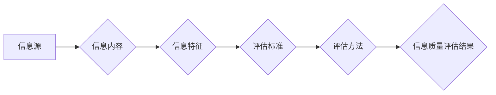

                 

## 信息过载与信息质量评估框架：批判性消费和评估信息

> 关键词：信息过载、信息质量、评估框架、批判性消费、人工智能、深度学习、自然语言处理

### 1. 背景介绍

在当今信息爆炸的时代，我们每天接触的海量信息呈指数级增长。从社交媒体的实时更新到新闻网站的不断涌现，从学术论文的爆炸式增长到在线课程的普及，信息无处不在，却并非都具有价值。面对如此庞大的信息洪流，如何有效地筛选、评估和利用信息，成为了当今社会面临的重大挑战。

信息过载是指个体在短时间内接收和处理信息量过大，导致认知能力超负荷，难以有效地理解、记忆和应用信息的情况。它会带来一系列负面影响，例如：

* **决策困难:** 过多的信息会使人们难以做出明智的决策，因为难以辨别真假、重要与不重要。
* **注意力分散:** 信息过载会分散人们的注意力，降低工作效率和学习效果。
* **焦虑和压力:** 无法有效处理信息会带来焦虑和压力，影响心理健康。

因此，建立有效的 **信息质量评估框架**，并培养 **批判性消费信息** 的能力，对于个人和社会而言都至关重要。

### 2. 核心概念与联系

信息质量是指信息在满足特定需求时，所具有的准确性、完整性、及时性、相关性、可信度等方面的程度。信息质量评估框架旨在提供一套标准和方法，用于对信息进行系统性的评估和评价。

**信息质量评估框架** 的核心概念包括：

* **信息源:** 信息的来源，包括作者、机构、网站等。
* **信息内容:** 信息本身的主题、内容、格式等。
* **信息特征:** 信息的准确性、完整性、及时性、相关性、可信度等。
* **评估标准:** 用于衡量信息质量的具体指标和标准。
* **评估方法:** 用于评估信息质量的具体技术和工具。

**信息质量评估框架** 与 **人工智能 (AI)**、**深度学习 (DL)** 和 **自然语言处理 (NLP)** 等技术密切相关。AI、DL 和 NLP 可以用于自动提取信息特征、识别信息源的可信度、分析信息内容的准确性和完整性等，从而提高信息质量评估的效率和准确性。

**Mermaid 流程图:**



### 3. 核心算法原理 & 具体操作步骤

#### 3.1 算法原理概述

信息质量评估算法通常基于机器学习或深度学习技术，通过训练模型来识别和评估信息质量特征。常见的算法包括：

* **支持向量机 (SVM):** 用于分类信息质量，例如判断信息是否真实可靠。
* **随机森林 (RF):** 用于回归信息质量，例如预测信息的准确度。
* **深度神经网络 (DNN):** 用于更复杂的信息质量评估任务，例如识别信息中的偏见或误导性内容。

#### 3.2 算法步骤详解

1. **数据收集:** 收集大量包含信息质量特征和标签的数据，例如新闻文章、社交媒体帖子、学术论文等。
2. **数据预处理:** 对数据进行清洗、格式化和转换，例如去除停用词、标注实体关系等。
3. **特征提取:** 使用 NLP 技术提取信息特征，例如词频、词性、语法结构、情感倾向等。
4. **模型训练:** 使用机器学习或深度学习算法训练模型，将信息特征与信息质量标签关联起来。
5. **模型评估:** 使用测试数据评估模型的性能，例如准确率、召回率、F1-score等。
6. **模型部署:** 将训练好的模型部署到实际应用场景中，用于自动评估信息质量。

#### 3.3 算法优缺点

**优点:**

* **自动化:** 可以自动评估大量信息，提高效率。
* **客观性:** 基于数据分析，减少主观判断的影响。
* **可扩展性:** 可以根据需要扩展评估指标和算法。

**缺点:**

* **数据依赖:** 算法性能依赖于训练数据的质量和数量。
* **解释性:** 深度学习模型的决策过程难以解释。
* **偏差风险:** 训练数据中的偏差可能会导致算法产生偏见。

#### 3.4 算法应用领域

信息质量评估算法在多个领域都有广泛的应用，例如：

* **新闻媒体:** 识别虚假新闻和谣言。
* **搜索引擎:** 提高搜索结果的质量和相关性。
* **社交媒体:** 识别和过滤垃圾信息和恶意内容。
* **电子商务:** 评估产品评论和用户评价的真实性。
* **医疗保健:** 评估医疗信息的准确性和可靠性。

### 4. 数学模型和公式 & 详细讲解 & 举例说明

#### 4.1 数学模型构建

信息质量评估模型通常采用基于概率的数学模型，例如贝叶斯网络或逻辑回归模型。

**贝叶斯网络:**

贝叶斯网络是一种概率图模型，用于表示变量之间的依赖关系。在信息质量评估中，可以将信息源、信息内容、信息特征等变量作为节点，并用边表示它们之间的依赖关系。通过学习贝叶斯网络的参数，可以计算出不同信息质量标签的概率。

**逻辑回归模型:**

逻辑回归模型是一种用于分类的线性模型，其输出是一个概率值，表示样本属于特定类别（例如，真实信息或虚假信息）的可能性。

#### 4.2 公式推导过程

**贝叶斯定理:**

$$P(A|B) = \frac{P(B|A)P(A)}{P(B)}$$

其中：

* $P(A|B)$ 是在已知事件 B 发生的情况下，事件 A 发生的概率。
* $P(B|A)$ 是在已知事件 A 发生的情况下，事件 B 发生的概率。
* $P(A)$ 是事件 A 发生的概率。
* $P(B)$ 是事件 B 发生的概率。

**逻辑回归模型:**

$$P(y=1|x) = \frac{1}{1 + e^{-(w^T x + b)}}$$

其中：

* $y$ 是目标变量，取值为 0 或 1。
* $x$ 是输入特征向量。
* $w$ 是权重向量。
* $b$ 是偏置项。

#### 4.3 案例分析与讲解

假设我们想要评估一篇新闻文章的真实性。我们可以使用贝叶斯网络模型，将信息源、信息内容、信息特征等变量作为节点，并根据训练数据学习它们的依赖关系。

例如，如果信息源是知名媒体机构，信息内容没有明显的逻辑错误，信息特征表明文章的引用来源可靠，那么根据贝叶斯网络模型的计算，该文章的真实性概率会较高。

### 5. 项目实践：代码实例和详细解释说明

#### 5.1 开发环境搭建

* Python 3.x
* TensorFlow 或 PyTorch 深度学习框架
* NLTK 自然语言处理库
* Scikit-learn 机器学习库

#### 5.2 源代码详细实现

```python
# 使用 TensorFlow 构建一个简单的深度神经网络模型

import tensorflow as tf

# 定义模型结构
model = tf.keras.models.Sequential([
    tf.keras.layers.Embedding(input_dim=10000, output_dim=128),
    tf.keras.layers.LSTM(units=64),
    tf.keras.layers.Dense(units=1, activation='sigmoid')
])

# 编译模型
model.compile(optimizer='adam', loss='binary_crossentropy', metrics=['accuracy'])

# 训练模型
model.fit(x_train, y_train, epochs=10)

# 评估模型
loss, accuracy = model.evaluate(x_test, y_test)
print('Loss:', loss)
print('Accuracy:', accuracy)
```

#### 5.3 代码解读与分析

* **Embedding 层:** 将词向量表示为稠密的向量，用于捕捉词语之间的语义关系。
* **LSTM 层:** 长短期记忆网络，用于处理序列数据，例如文本。
* **Dense 层:** 全连接层，用于将 LSTM 层的输出映射到输出类别。
* **sigmoid 激活函数:** 用于将输出值映射到 0 到 1 之间，表示概率值。

#### 5.4 运行结果展示

训练完成后，可以将模型应用于新的文本数据，预测其真实性概率。

### 6. 实际应用场景

#### 6.1 新闻媒体

* 识别虚假新闻和谣言，提高新闻的可信度。
* 自动审核新闻稿件，提高新闻质量。
* 为用户提供新闻真实性评估，帮助用户做出明智的判断。

#### 6.2 搜索引擎

* 提高搜索结果的质量和相关性，减少垃圾信息和虚假信息的出现。
* 为用户提供信息来源和真实性评估，帮助用户筛选信息。

#### 6.3 社交媒体

* 识别和过滤垃圾信息和恶意内容，营造健康安全的网络环境。
* 为用户提供社交媒体内容的真实性评估，帮助用户辨别真假信息。

#### 6.4 电子商务

* 评估产品评论和用户评价的真实性，提高用户购物体验。
* 识别虚假评价和恶意评论，保护商家利益。

#### 6.5 医疗保健

* 评估医疗信息的准确性和可靠性，提高医疗决策的质量。
* 识别医疗虚假信息和误导性内容，保护患者健康。

#### 6.4 未来应用展望

随着人工智能技术的不断发展，信息质量评估框架将更加智能化、自动化和个性化。未来，我们可以期待：

* 更准确、更全面的信息质量评估指标。
* 更强大的深度学习算法，能够识别更复杂的信息质量特征。
* 更个性化的信息质量评估结果，根据用户的需求和偏好进行定制。
* 更广泛的应用场景，例如教育、金融、法律等领域。

### 7. 工具和资源推荐

#### 7.1 学习资源推荐

* **书籍:**
    * "Information Quality: Concepts, Methodologies, Tools, and Applications" by IGI Global
    * "Data Quality for Business Intelligence" by Thomas Erl
* **在线课程:**
    * Coursera: "Data Quality Management"
    * edX: "Data Science Fundamentals"

#### 7.2 开发工具推荐

* **Python:** 
    * TensorFlow
    * PyTorch
    * Scikit-learn
    * NLTK
* **其他工具:**
    * Apache Spark
    * Apache Kafka

#### 7.3 相关论文推荐

* "A Survey of Information Quality Assessment Techniques" by Wang et al.
* "Deep Learning for Information Quality Assessment" by Zhang et al.

### 8. 总结：未来发展趋势与挑战

#### 8.1 研究成果总结

信息质量评估框架的发展取得了显著的进展，人工智能技术为信息质量评估提供了强大的工具和方法。

#### 8.2 未来发展趋势

未来，信息质量评估框架将朝着以下方向发展：

* **更加智能化:** 利用更先进的深度学习算法，识别更复杂的信息质量特征。
* **更加自动化:** 实现端到端的自动化信息质量评估流程。
* **更加个性化:** 根据用户的需求和偏好进行定制化信息质量评估。
* **更加跨领域:** 应用于更多领域，例如教育、金融、法律等。

#### 8.3 面临的挑战

信息质量评估仍然面临一些挑战：

* **数据质量:** 训练模型需要大量高质量的数据，而获取高质量数据仍然是一个难题。
* **解释性:** 深度学习模型的决策过程难以解释，这可能会影响人们对评估结果的信任。
* **偏差风险:** 训练数据中的偏差可能会导致算法产生偏见，影响评估结果的公平性。

#### 8.4 研究展望

未来研究方向包括：

* 开发新的信息质量评估指标和算法。
* 提高深度学习模型的解释性。
* 减少训练数据中的偏差，提高算法的公平性。
* 将信息质量评估与其他技术结合，例如知识图谱、事实验证等，构建更加完善的信息质量评估体系。

### 9. 附录：常见问题与解答

**Q1: 如何评估信息来源的可信度？**

**A1:** 可以参考信息来源的权威性、声誉、历史记录等因素。

**Q2: 如何识别虚假新闻和谣言？**

**A2:** 可以关注信息内容的逻辑性和真实性，查看信息来源的可信度，并参考多方信息进行核实。

**Q3: 如何培养批判性消费信息的能力？**

**A3:** 可以学习信息质量评估的知识和方法，养成质疑、思考、核实信息的态度，并提高信息辨别能力。


作者：禅与计算机程序设计艺术 / Zen and the Art of Computer Programming 
<end_of_turn>

