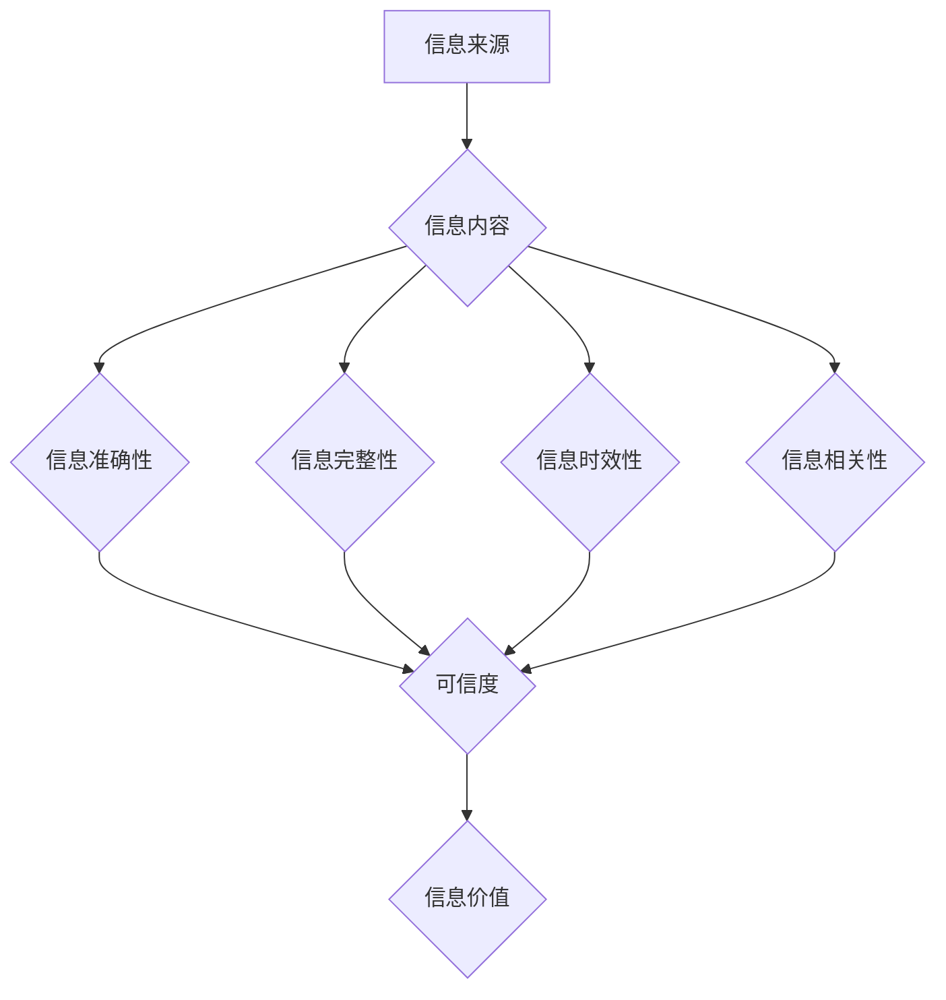

                 

## 信息过载与信息质量：如何评估和批判性地消费信息

> 关键词：信息过载、信息质量、批判性思维、信息筛选、数据分析、知识管理、人工智能、深度学习

### 1. 背景介绍

在当今数字时代，信息以前所未有的速度和规模涌入我们的生活。从社交媒体到新闻网站，从学术期刊到在线论坛，我们每天接触到海量的文字、图像、音频和视频信息。这种信息爆炸式的增长带来了便利和机遇，但也带来了新的挑战——信息过载。

信息过载是指个体在短时间内接收和处理信息量过大而导致认知能力超负荷，难以有效地获取、理解和利用信息的状态。它会导致注意力分散、决策困难、学习效率低下，甚至引发焦虑和压力。

然而，信息过载的本质并非仅仅是信息量的多寡，更重要的是信息质量。并非所有信息都是同等价值的，高质量的信息能够帮助我们更好地理解世界、做出明智的决策，并推动个人和社会的发展。而低质量的信息则可能包含错误、误导、偏见或噪音，甚至可能造成负面影响。

因此，在信息时代，如何有效地评估和批判性地消费信息变得尤为重要。

### 2. 核心概念与联系

**2.1 信息过载与信息质量的关系**

信息过载和信息质量是相互关联的两个概念。信息过载是指信息量过大，而信息质量是指信息的准确性、完整性、时效性、相关性和价值性等方面。

当信息量过大时，即使信息质量较高，我们也难以有效地处理和理解它，从而导致信息过载。

反之，如果信息质量较低，即使信息量较少，也可能导致我们做出错误的决策或形成错误的认知。

**2.2 信息筛选与批判性思维**

信息筛选是指从海量信息中识别和选择出有价值的信息，而批判性思维是指对信息进行深入思考和分析，评估其真实性、可靠性和价值性。

信息筛选和批判性思维是评估和批判性地消费信息的重要手段。

**2.3  信息评估模型**

我们可以使用以下模型来评估信息的质量：



**2.4  信息消费流程**

信息消费是一个循环的过程，包括以下步骤：

1. **信息获取**: 从各种渠道获取信息。
2. **信息筛选**: 根据自身需求和兴趣筛选信息。
3. **信息评估**: 评估信息的质量和价值。
4. **信息理解**: 深入理解信息的含义和内涵。
5. **信息应用**: 将信息应用于实际行动或思考。
6. **信息反馈**: 反馈信息消费的结果，并调整信息获取和筛选策略。

### 3. 核心算法原理 & 具体操作步骤

**3.1 算法原理概述**

在信息过载的时代，我们需要借助算法和技术手段来帮助我们有效地评估和筛选信息。

一些常用的算法包括：

* **文本分类算法**: 用于将文本信息分类到不同的类别，例如新闻、社交媒体帖子、学术论文等。
* **关键词提取算法**: 用于从文本信息中提取出最重要的关键词，帮助我们快速了解文本内容。
* **情感分析算法**: 用于分析文本信息中表达的情感，例如正面、负面或中性。
* **推荐算法**: 用于根据用户的兴趣和行为推荐相关的信息。

**3.2 算法步骤详解**

以文本分类算法为例，其基本步骤如下：

1. **数据预处理**: 对文本数据进行清洗、格式化和转换，例如去除停用词、转换大小写、分词等。
2. **特征提取**: 从文本数据中提取特征，例如词频、词向量、语法结构等。
3. **模型训练**: 使用训练数据训练分类模型，例如支持向量机、决策树、神经网络等。
4. **模型评估**: 使用测试数据评估模型的性能，例如准确率、召回率、F1-score等。
5. **模型部署**: 将训练好的模型部署到实际应用场景中，例如用于自动分类新闻文章、过滤垃圾邮件等。

**3.3 算法优缺点**

不同的算法具有不同的优缺点，需要根据具体应用场景选择合适的算法。

例如，支持向量机算法在文本分类任务中表现良好，但其训练时间较长；神经网络算法可以学习更复杂的特征，但其训练数据量要求较高。

**3.4 算法应用领域**

文本分类算法在许多领域都有广泛的应用，例如：

* **信息检索**: 用于自动分类和排序搜索结果。
* **垃圾邮件过滤**: 用于识别和过滤垃圾邮件。
* **社交媒体分析**: 用于分析社交媒体用户的观点和情绪。
* **客户服务**: 用于自动分类客户服务请求。

### 4. 数学模型和公式 & 详细讲解 & 举例说明

**4.1 数学模型构建**

在信息评估中，我们可以使用数学模型来量化信息的质量。例如，我们可以使用以下公式来计算信息的准确性：

$$Accuracy = \frac{TP + TN}{TP + TN + FP + FN}$$

其中：

* TP：真阳性（正确分类为正例）
* TN：真阴性（正确分类为负例）
* FP：假阳性（错误分类为正例）
* FN：假阴性（错误分类为负例）

**4.2 公式推导过程**

该公式的推导过程基于分类模型的混淆矩阵。混淆矩阵是一个表格，用于展示分类模型的预测结果与实际结果之间的关系。

**4.3 案例分析与讲解**

假设我们有一个文本分类模型，用于判断新闻文章是否属于政治类。

我们使用该模型对100篇新闻文章进行分类，结果如下：

* 真阳性：60篇
* 真阴性：30篇
* 假阳性：5篇
* 假阴性：5篇

则该模型的准确率为：

$$Accuracy = \frac{60 + 30}{60 + 30 + 5 + 5} = \frac{90}{100} = 0.9$$

### 5. 项目实践：代码实例和详细解释说明

**5.1 开发环境搭建**

* Python 3.x
* scikit-learn 库
* NLTK 库

**5.2 源代码详细实现**

```python
from sklearn.model_selection import train_test_split
from sklearn.linear_model import LogisticRegression
from sklearn.metrics import accuracy_score

# 加载文本数据
# ...

# 数据预处理
# ...

# 特征提取
# ...

# 将数据划分为训练集和测试集
X_train, X_test, y_train, y_test = train_test_split(X, y, test_size=0.2, random_state=42)

# 训练模型
model = LogisticRegression()
model.fit(X_train, y_train)

# 预测测试集结果
y_pred = model.predict(X_test)

# 计算模型准确率
accuracy = accuracy_score(y_test, y_pred)
print(f"模型准确率: {accuracy}")
```

**5.3 代码解读与分析**

这段代码演示了如何使用 scikit-learn 库训练一个文本分类模型。

首先，我们需要加载文本数据并进行预处理和特征提取。然后，我们将数据划分为训练集和测试集。

接下来，我们使用 LogisticRegression 模型训练模型，并使用测试集评估模型的性能。

最后，我们计算模型的准确率并打印结果。

**5.4 运行结果展示**

运行结果将显示模型的准确率，例如：

```
模型准确率: 0.92
```

### 6. 实际应用场景

信息过载和信息质量评估在各个领域都有着重要的应用场景：

* **新闻媒体**: 帮助新闻媒体识别和过滤虚假新闻，提高新闻质量。
* **教育**: 帮助学生筛选高质量的学习资源，提高学习效率。
* **医疗**: 帮助医生快速准确地获取患者信息，提高诊断和治疗效率。
* **商业**: 帮助企业分析市场趋势和客户需求，做出更明智的决策。

### 6.4 未来应用展望

随着人工智能和深度学习技术的不断发展，信息过载和信息质量评估将迎来新的突破。

未来，我们可能会看到：

* 更智能的算法，能够更准确地评估信息质量。
* 更个性化的信息推荐，能够根据用户的需求和兴趣推荐更相关的资讯。
* 更强大的信息过滤系统，能够有效地过滤掉虚假信息和垃圾信息。

### 7. 工具和资源推荐

**7.1 学习资源推荐**

* **书籍**:
    * 《信息过载：如何应对信息时代的信息洪流》
    * 《批判性思维：如何有效地思考和解决问题》
* **在线课程**:
    * Coursera 上的《信息检索》课程
    * edX 上的《数据科学》课程

**7.2 开发工具推荐**

* **Python**: 广泛用于数据分析和机器学习。
* **scikit-learn**: Python 的机器学习库。
* **NLTK**: Python 的自然语言处理库。

**7.3 相关论文推荐**

* **Information Overload and its Impact on Decision Making**
* **A Survey of Text Classification Algorithms**

### 8. 总结：未来发展趋势与挑战

**8.1 研究成果总结**

在信息时代，信息过载和信息质量评估已经成为重要的研究课题。

研究成果表明，人工智能和深度学习技术可以有效地帮助我们应对信息过载，并提高信息质量。

**8.2 未来发展趋势**

未来，信息过载和信息质量评估的研究将朝着以下方向发展：

* **更智能的算法**: 开发更智能、更准确的算法，能够更好地评估信息质量。
* **更个性化的信息推荐**: 基于用户的需求和兴趣，提供更个性化的信息推荐。
* **更强大的信息过滤系统**: 开发更强大的信息过滤系统，能够有效地过滤掉虚假信息和垃圾信息。

**8.3 面临的挑战**

信息过载和信息质量评估也面临着一些挑战：

* **数据质量**: 训练算法需要高质量的数据，而现实世界中的数据往往存在噪声和偏差。
* **算法解释性**: 一些深度学习算法的决策过程难以解释，这使得我们难以理解算法是如何评估信息质量的。
* **伦理问题**: 信息过滤和推荐可能会带来一些伦理问题，例如信息茧房和算法偏见。

**8.4 研究展望**

未来，我们需要继续努力解决这些挑战，并推动信息过载和信息质量评估的研究取得新的突破。

### 9. 附录：常见问题与解答

**9.1 如何判断信息的准确性？**

* 关注信息来源的可靠性。
* 查看信息是否经过事实核查。
* 比较不同来源的信息，寻找一致性。

**9.2 如何避免信息茧房？**

* 尝试接触不同观点和信息来源。
* 积极与不同背景的人交流。
* 培养批判性思维，不盲目相信任何信息。


作者：禅与计算机程序设计艺术 / Zen and the Art of Computer Programming 
<end_of_turn>

