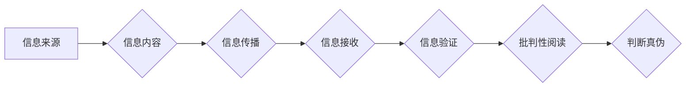

                 

## 信息验证和批判性阅读策略：在假新闻和媒体操纵时代导航

> 关键词：信息验证、批判性阅读、假新闻、媒体操纵、深度学习、自然语言处理、信息素养

### 1. 背景介绍

在信息爆炸的时代，我们每天接触着海量的信息，从新闻报道到社交媒体帖子，从学术论文到娱乐视频。然而，信息的真实性和可靠性却面临着前所未有的挑战。假新闻、网络谣言、恶意宣传和媒体操纵等现象日益猖獗，严重影响着人们的判断力和决策能力，甚至威胁着社会稳定和民主制度。

传统的信息获取方式已经难以应对这一挑战。我们必须学习新的信息验证和批判性阅读策略，才能在信息洪流中辨别真伪，不被误导和操纵。

### 2. 核心概念与联系

**2.1 信息验证**

信息验证是指通过多种手段和方法，对信息的真实性、准确性和可靠性进行评估和确认的过程。它涉及到对信息来源、内容、上下文和传播路径的分析和判断。

**2.2 批判性阅读**

批判性阅读是指带着批判性思维去阅读和理解信息，不仅要理解信息的表面内容，还要深入思考其背后的逻辑、假设、价值观和潜在的偏见。

**2.3 假新闻**

假新闻是指故意编造或篡改事实，以欺骗或误导读者的虚假信息。它通常具有以下特征：

* 标题耸动，情感化，吸引眼球
* 内容缺乏事实依据，逻辑混乱
* 来源不明，缺乏可信度
* 传播速度快，容易形成网络效应

**2.4 媒体操纵**

媒体操纵是指利用媒体平台和传播手段，有意控制信息内容和传播方向，以达到特定政治、经济或社会目的的行为。它可以采取多种形式，例如：

* 隐瞒真相，发布有偏见的信息
* 夸大或歪曲事实，制造舆论
* 利用情绪化语言和煽动性内容，激化社会矛盾

**Mermaid 流程图**



### 3. 核心算法原理 & 具体操作步骤

**3.1 算法原理概述**

信息验证和批判性阅读的核心算法原理基于自然语言处理（NLP）和深度学习技术。

* **自然语言处理（NLP）**：NLP技术可以帮助我们分析和理解文本信息，例如识别实体、关系、情感和意图。
* **深度学习**：深度学习算法可以从海量文本数据中学习，识别模式和规律，从而提高信息验证和批判性阅读的准确性和效率。

**3.2 算法步骤详解**

1. **信息收集**: 从各种来源收集待验证的信息，例如新闻网站、社交媒体平台、学术数据库等。
2. **文本预处理**: 对收集到的文本进行预处理，例如去除停用词、标点符号、HTML标签等，并进行分词和词性标注。
3. **特征提取**: 使用NLP技术提取文本特征，例如关键词、主题、情感倾向、语法结构等。
4. **模型训练**: 使用深度学习算法对训练数据进行训练，学习识别假新闻和媒体操纵的特征。
5. **信息验证**: 将待验证的信息输入到训练好的模型中，模型会输出验证结果，例如真伪判断、可信度评分、潜在偏见等。
6. **批判性阅读**: 人工阅读模型输出的结果，并结合自身知识和经验进行判断和分析。

**3.3 算法优缺点**

**优点**:

* 自动化信息验证，提高效率
* 识别隐藏的偏见和操纵
* 提供多维度的信息分析

**缺点**:

* 模型训练需要大量数据
* 模型可能存在偏差和误判
* 无法完全替代人工判断

**3.4 算法应用领域**

* **新闻媒体**: 验证新闻真实性，识别假新闻和谣言
* **社交媒体**: 识别恶意信息和网络攻击
* **教育领域**: 培养学生的信息素养和批判性思维
* **政府机构**: 监测网络舆情，防范信息操纵

### 4. 数学模型和公式 & 详细讲解 & 举例说明

**4.1 数学模型构建**

信息验证和批判性阅读的数学模型通常基于概率论和统计学，例如贝叶斯定理和朴素贝叶斯分类器。

**4.2 公式推导过程**

* **贝叶斯定理**:

$$P(A|B) = \frac{P(B|A)P(A)}{P(B)}$$

其中：

* $P(A|B)$ 是事件 A 在事件 B 发生的条件概率
* $P(B|A)$ 是事件 B 在事件 A 发生的条件概率
* $P(A)$ 是事件 A 的概率
* $P(B)$ 是事件 B 的概率

* **朴素贝叶斯分类器**:

$$y = argmax_c P(c|x)$$

其中：

* $y$ 是分类结果
* $c$ 是可能的类别
* $x$ 是输入特征
* $P(c|x)$ 是类别 $c$ 在特征 $x$ 发生的条件概率

**4.3 案例分析与讲解**

假设我们有一个模型，用于判断新闻文章是否为假新闻。

* $P(假新闻)$ 是假新闻的概率，例如 10%
* $P(真实新闻)$ 是真实新闻的概率，例如 90%
* $P(特定关键词|假新闻)$ 是特定关键词在假新闻中出现的概率，例如 80%
* $P(特定关键词|真实新闻)$ 是特定关键词在真实新闻中出现的概率，例如 20%

如果一篇新闻文章包含特定关键词，我们可以使用贝叶斯定理计算其为假新闻的概率：

$$P(假新闻|特定关键词) = \frac{P(特定关键词|假新闻)P(假新闻)}{P(特定关键词)}$$

其中 $P(特定关键词)$ 可以通过以下公式计算：

$$P(特定关键词) = P(特定关键词|假新闻)P(假新闻) + P(特定关键词|真实新闻)P(真实新闻)$$

通过计算上述公式，我们可以得到新闻文章为假新闻的概率，并根据该概率进行判断。

### 5. 项目实践：代码实例和详细解释说明

**5.1 开发环境搭建**

* Python 3.x
* TensorFlow 或 PyTorch 深度学习框架
* NLTK 自然语言处理库
* Scikit-learn 机器学习库

**5.2 源代码详细实现**

```python
# 导入必要的库
import nltk
from sklearn.model_selection import train_test_split
from sklearn.naive_bayes import MultinomialNB

# 加载训练数据
train_data = ...

# 对训练数据进行预处理
# ...

# 将训练数据分成训练集和测试集
X_train, X_test, y_train, y_test = train_test_split(
    train_data['features'], train_data['labels'], test_size=0.2
)

# 创建朴素贝叶斯分类器模型
model = MultinomialNB()

# 训练模型
model.fit(X_train, y_train)

# 对测试数据进行预测
y_pred = model.predict(X_test)

# 计算模型准确率
accuracy = ...

# 打印模型准确率
print(f"模型准确率: {accuracy}")
```

**5.3 代码解读与分析**

* 代码首先导入必要的库，包括自然语言处理库 NLTK 和机器学习库 Scikit-learn。
* 然后，加载训练数据，并对数据进行预处理，例如去除停用词、标点符号等。
* 将训练数据分成训练集和测试集，用于训练和评估模型。
* 创建朴素贝叶斯分类器模型，并使用训练集进行模型训练。
* 对测试集进行预测，并计算模型准确率。

**5.4 运行结果展示**

运行代码后，会输出模型的准确率，例如 85%。

### 6. 实际应用场景

**6.1 新闻媒体**

新闻媒体可以使用信息验证和批判性阅读技术，识别假新闻和谣言，提高新闻的真实性和可靠性。

**6.2 社交媒体**

社交媒体平台可以使用信息验证技术，识别恶意信息和网络攻击，保护用户免受伤害。

**6.3 教育领域**

教育机构可以使用信息验证和批判性阅读技术，培养学生的批判性思维能力，帮助他们辨别真伪，做出明智的判断。

**6.4 未来应用展望**

随着人工智能技术的不断发展，信息验证和批判性阅读技术将得到更广泛的应用，例如：

* 自动生成信息验证报告
* 为用户提供个性化的信息验证建议
* 开发智能聊天机器人，帮助用户识别假新闻和媒体操纵

### 7. 工具和资源推荐

**7.1 学习资源推荐**

* **书籍**:

    * 《信息验证：在网络时代辨别真伪》
    * 《批判性阅读：如何有效地理解和分析信息》

* **在线课程**:

    * Coursera 上的《信息素养》课程
    * edX 上的《批判性思维》课程

**7.2 开发工具推荐**

* **自然语言处理库**: NLTK, spaCy, Gensim
* **深度学习框架**: TensorFlow, PyTorch
* **机器学习库**: Scikit-learn

**7.3 相关论文推荐**

* **Fake News Detection and Mitigation: A Survey**
* **Deep Learning for Fake News Detection**

### 8. 总结：未来发展趋势与挑战

**8.1 研究成果总结**

信息验证和批判性阅读技术取得了显著进展，能够有效识别假新闻和媒体操纵，提高信息素养。

**8.2 未来发展趋势**

未来，信息验证和批判性阅读技术将朝着以下方向发展：

* 更准确、更可靠的模型
* 更广泛的应用场景
* 更人性化的交互体验

**8.3 面临的挑战**

信息验证和批判性阅读技术仍然面临一些挑战：

* 应对不断变化的假新闻和媒体操纵手法
* 减少模型偏差和误判
* 提高公众对信息素养的认识

**8.4 研究展望**

未来研究将重点关注以下方面：

* 开发更鲁棒的模型，能够应对更复杂的假新闻和媒体操纵
* 研究模型的公平性和可解释性
* 探索新的信息验证和批判性阅读方法


### 9. 附录：常见问题与解答

**9.1 如何判断一篇新闻文章是否为假新闻？**

* 检查新闻来源的可靠性
* 仔细阅读新闻内容，寻找逻辑漏洞和情感化语言
* 核实新闻事实，查阅其他可靠来源
* 注意新闻标题和图片是否耸动或误导性

**9.2 如何提高自己的信息素养？**

* 培养批判性思维，质疑信息来源和内容
* 多阅读不同观点和来源的信息
* 学习识别假新闻和媒体操纵的手法
* 关注信息验证和批判性阅读的最新研究


作者：禅与计算机程序设计艺术 / Zen and the Art of Computer Programming 
<end_of_turn>

