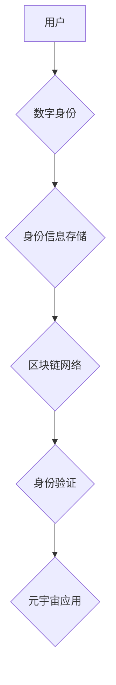

                 

## 元宇宙中的身份认证：去中心化信任体系的构建

> 关键词：元宇宙、身份认证、去中心化、信任体系、区块链、加密技术、数字身份

## 1. 背景介绍

元宇宙概念的兴起，标志着人类进入一个全新的数字世界。在这个虚拟世界中，用户将拥有更加沉浸式的体验，并能够进行各种虚拟活动，例如社交互动、游戏娱乐、商业交易等。然而，元宇宙的开放性和虚拟化特性也带来了新的安全挑战，其中身份认证问题尤为突出。

传统的身份认证体系主要依赖于集中式机构，例如政府部门或大型科技公司。用户需要向这些机构注册并提供个人信息，才能获得身份验证。这种集中式体系存在着诸多弊端：

* **单点故障风险:**  集中式机构一旦遭受攻击或故障，整个身份认证体系都可能瘫痪。
* **隐私泄露风险:** 用户个人信息集中存储在机构服务器上，容易被黑客窃取或滥用。
* **可信度问题:** 用户对集中式机构的信任度决定了身份认证的有效性。

元宇宙的特性要求身份认证体系更加安全、可靠、隐私保护和去中心化。去中心化身份认证体系，通过分布式技术和加密算法，赋予用户对自身身份数据的控制权，并建立一个基于信任的网络环境。

## 2. 核心概念与联系

### 2.1  去中心化身份认证

去中心化身份认证是指用户无需依赖任何中心机构，即可自主管理和验证自身身份。用户可以将身份信息存储在自己的设备上，并通过加密技术保护其安全。

### 2.2  数字身份

数字身份是指在数字环境中代表用户的唯一标识符，它可以包含用户的个人信息、身份证明、权限等数据。

### 2.3  区块链技术

区块链技术是一种分布式账本技术，它可以记录和验证身份信息，并确保其不可篡改和透明。

**核心概念与架构流程图**



## 3. 核心算法原理 & 具体操作步骤

### 3.1  算法原理概述

去中心化身份认证通常采用密码学算法和区块链技术来实现。用户可以使用加密算法生成自己的数字签名，并将其存储在自己的设备上。当用户需要验证身份时，他们可以将数字签名发送给元宇宙应用，应用会使用公钥验证签名，从而确认用户的身份。

### 3.2  算法步骤详解

1. **用户生成数字签名:** 用户使用私钥对自己的身份信息进行加密，生成数字签名。
2. **用户存储数字签名:** 用户将数字签名存储在自己的设备上，例如手机或钱包。
3. **用户验证身份:** 当用户需要访问元宇宙应用时，他们会向应用提供数字签名。
4. **应用验证签名:** 元宇宙应用使用用户的公钥验证数字签名，确认用户的身份。
5. **应用授权访问:** 如果签名验证成功，应用会授权用户访问相关资源。

### 3.3  算法优缺点

**优点:**

* **安全性高:** 数字签名和公钥加密算法可以确保身份信息的安全性。
* **去中心化:** 用户无需依赖任何中心机构，可以自主管理自己的身份信息。
* **隐私保护:** 用户可以选择只提供必要的身份信息，保护个人隐私。

**缺点:**

* **技术复杂:** 实现去中心化身份认证需要一定的技术门槛。
* **用户体验:** 用户需要学习如何使用数字签名和公钥加密算法，可能会影响用户体验。

### 3.4  算法应用领域

* **元宇宙游戏:** 用户可以使用去中心化身份认证来创建虚拟角色，并进行游戏交易。
* **虚拟社交平台:** 用户可以使用去中心化身份认证来建立虚拟社交关系，并保护个人隐私。
* **数字资产管理:** 用户可以使用去中心化身份认证来管理自己的数字资产，例如NFT和加密货币。

## 4. 数学模型和公式 & 详细讲解 & 举例说明

### 4.1  数学模型构建

去中心化身份认证的核心数学模型是公钥密码学模型。该模型基于两个关键概念：

* **公钥:** 用于加密信息的公开密钥。
* **私钥:** 用于解密信息的秘密密钥。

用户可以使用私钥对自己的身份信息进行加密，生成数字签名。任何人都可以使用用户的公钥验证数字签名，从而确认用户的身份。

### 4.2  公式推导过程

假设用户 Alice 的私钥为 $sk_A$，公钥为 $pk_A$。Alice 想要验证自己的身份，她需要对自己的身份信息 $M$ 进行加密，生成数字签名 $S$。

$$S = hash(M) ^ {sk_A}$$

其中，$hash(M)$ 是 Alice 的身份信息 $M$ 的哈希值，$ ^ {sk_A}$ 表示使用 Alice 的私钥 $sk_A$ 进行加密。

元宇宙应用收到 Alice 的数字签名 $S$ 后，可以使用 Alice 的公钥 $pk_A$ 验证签名。

$$verify(pk_A, M, S) = hash(M) ^ {pk_A} == S$$

如果验证成功，则表明 Alice 的身份信息 $M$ 是真实的。

### 4.3  案例分析与讲解

例如，Alice 想要在元宇宙游戏平台上创建虚拟角色。她需要向平台提供自己的身份信息，例如姓名、年龄、性别等。

Alice 使用私钥对自己的身份信息进行加密，生成数字签名。然后，她将数字签名发送给游戏平台。游戏平台使用 Alice 的公钥验证数字签名，确认 Alice 的身份信息是真实的。

一旦验证成功，游戏平台就会为 Alice 创建虚拟角色，并允许她进行游戏活动。

## 5. 项目实践：代码实例和详细解释说明

### 5.1  开发环境搭建

为了实现去中心化身份认证，我们需要搭建一个开发环境。

* **编程语言:** 选择一种支持区块链开发的编程语言，例如 Solidity 或 Rust。
* **区块链平台:** 选择一个合适的区块链平台，例如 Ethereum 或 Hyperledger Fabric。
* **开发工具:** 使用一些区块链开发工具，例如 Truffle 或 Remix。

### 5.2  源代码详细实现

以下是一个简单的去中心化身份认证代码示例，使用 Solidity 语言编写，部署在 Ethereum 区块链平台上：

```solidity
pragma solidity ^0.8.0;

contract Identity {
    mapping(address => bytes32) public identities;

    function setIdentity(bytes32 _identity) public {
        identities[msg.sender] = _identity;
    }

    function getIdentity() public view returns (bytes32) {
        return identities[msg.sender];
    }
}
```

### 5.3  代码解读与分析

* `mapping(address => bytes32) public identities;`：定义一个映射结构，将用户的地址作为键，用户的身份信息作为值。
* `function setIdentity(bytes32 _identity) public;`：允许用户设置自己的身份信息。
* `function getIdentity() public view returns (bytes32);`：允许用户获取自己的身份信息。

### 5.4  运行结果展示

部署合约后，用户可以通过调用 `setIdentity()` 函数设置自己的身份信息，并通过调用 `getIdentity()` 函数获取自己的身份信息。

## 6. 实际应用场景

### 6.1  元宇宙游戏

去中心化身份认证可以为元宇宙游戏提供更安全的玩家身份验证和资产管理机制。玩家可以使用自己的数字身份来创建虚拟角色，并进行游戏交易。

### 6.2  虚拟社交平台

去中心化身份认证可以为虚拟社交平台提供更隐私保护的社交体验。用户可以选择只提供必要的身份信息，并控制哪些信息可以被他人访问。

### 6.3  数字资产管理

去中心化身份认证可以为数字资产管理提供更安全的身份验证和权限控制机制。用户可以使用自己的数字身份来管理自己的数字资产，例如NFT和加密货币。

### 6.4  未来应用展望

随着元宇宙的发展，去中心化身份认证将有更广泛的应用场景，例如：

* **元宇宙教育:** 用户可以使用去中心化身份认证来获得教育证书和学历证明。
* **元宇宙医疗:** 用户可以使用去中心化身份认证来管理自己的医疗信息和健康记录。
* **元宇宙金融:** 用户可以使用去中心化身份认证来进行金融交易和投资。

## 7. 工具和资源推荐

### 7.1  学习资源推荐

* **区块链技术入门书籍:** 《区块链技术入门》
* **去中心化身份认证论文:** 《Decentralized Identity: A Comprehensive Overview》

### 7.2  开发工具推荐

* **Truffle:** 一个用于开发和部署以太坊智能合约的开发框架。
* **Remix:** 一个在线以太坊智能合约开发环境。

### 7.3  相关论文推荐

* 《Decentralized Identity: A Comprehensive Overview》
* 《Self-Sovereign Identity: A Primer》

## 8. 总结：未来发展趋势与挑战

### 8.1  研究成果总结

去中心化身份认证是元宇宙发展的重要技术基础，它可以为用户提供更安全、可靠、隐私保护的数字身份体验。

### 8.2  未来发展趋势

* **更完善的去中心化身份认证标准:** 随着元宇宙的发展，需要建立更完善的去中心化身份认证标准，以确保不同平台和应用之间互操作性。
* **更强大的隐私保护机制:** 需要开发更强大的隐私保护机制，以保护用户的敏感信息不被滥用。
* **更友好的用户体验:** 需要开发更友好的用户体验，以降低用户使用去中心化身份认证的门槛。

### 8.3  面临的挑战

* **技术复杂性:** 实现去中心化身份认证需要一定的技术门槛，需要更多的技术人才参与到该领域的研究和开发中。
* **用户接受度:** 用户需要接受去中心化身份认证的概念，并愿意使用新的身份验证方式。
* **监管政策:** 需要制定相应的监管政策，以规范去中心化身份认证的应用，并保护用户的合法权益。

### 8.4  研究展望

未来，去中心化身份认证技术将继续发展，并应用于更多元宇宙场景。

## 9. 附录：常见问题与解答

**Q1: 去中心化身份认证和集中式身份认证相比有什么优势？**

**A1:** 去中心化身份认证相比集中式身份认证，具有以下优势：

* **安全性高:** 用户数据分散存储，不易被攻击或泄露。
* **隐私保护:** 用户可以控制自己的身份信息，选择哪些信息公开。
* **可信度高:** 用户无需依赖任何中心机构，可以自主管理自己的身份。

**Q2: 如何实现去中心化身份认证？**

**A2:** 实现去中心化身份认证需要使用密码学算法和区块链技术。用户可以使用私钥对自己的身份信息进行加密，生成数字签名。任何人都可以使用用户的公钥验证数字签名，从而确认用户的身份。

**Q3: 去中心化身份认证有哪些应用场景？**

**A3:** 去中心化身份认证可以应用于元宇宙游戏、虚拟社交平台、数字资产管理等场景。


作者：禅与计算机程序设计艺术 / Zen and the Art of Computer Programming 
<end_of_turn>

