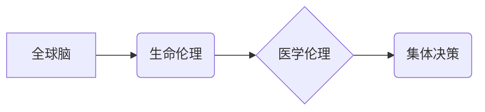

                 

## 全球脑与生命伦理委员会:集体决策下的医学伦理机构

> 关键词：全球脑、生命伦理、医学伦理、集体决策、人工智能、伦理委员会、决策模型、透明度、可解释性

## 1. 背景介绍

随着人工智能（AI）技术的飞速发展，特别是全球脑概念的提出，人类正迈向一个全新的科技时代。全球脑，作为一种连接人类大脑的超级智能网络，将拥有前所未有的计算能力和知识存储，极大地推动医疗、教育、科学等领域的进步。然而，全球脑的强大力量也带来了一系列伦理挑战，尤其是在医学领域。

传统医学伦理体系主要关注个体患者的利益，而全球脑的出现则可能涉及到群体利益、数据隐私、算法偏见等更广泛的伦理问题。例如，全球脑可能被用于诊断疾病、制定治疗方案，甚至进行基因编辑等，这些应用都可能引发伦理争议。

为了应对这些挑战，我们需要建立新的伦理框架和机制，以确保全球脑的应用安全、有效、公正。生命伦理委员会作为一种专门机构，可以为全球脑的伦理决策提供专业指导和监督。

## 2. 核心概念与联系

### 2.1 全球脑

全球脑是一个连接人类大脑的超级智能网络，旨在实现人类智慧的协同和放大。它通过先进的脑机接口技术，将人类大脑连接到一个共享的计算平台，从而实现信息共享、知识协同和智能决策。

### 2.2 生命伦理

生命伦理是一门研究生命价值、生命权利和生命尊严的哲学学科。它关注人类生命在各个阶段的道德问题，包括生育、死亡、疾病、基因工程等。

### 2.3 医学伦理

医学伦理是生命伦理的一个分支，它关注医疗实践中的道德问题，包括患者权利、医患关系、医疗资源分配、临床试验等。

### 2.4 集体决策

集体决策是指多个个体共同参与决策的过程，其结果由多数或全体成员的意见决定。

**核心概念关系图:**



## 3. 核心算法原理 & 具体操作步骤

### 3.1 算法原理概述

生命伦理委员会的决策过程可以看作是一个多主体交互的决策系统，其核心算法基于以下原理：

* **多代理模型:** 将每个委员会成员视为一个独立的代理，每个代理都有自己的价值观、知识和偏好。
* **协同决策:** 鼓励委员会成员之间进行信息交换、观点碰撞和协商，以达成共识。
* **规则约束:** 制定一套明确的决策规则，以确保决策过程的公平、公正和透明。
* **风险评估:** 对决策结果进行风险评估，并采取措施规避潜在的伦理风险。

### 3.2 算法步骤详解

1. **信息收集:** 委员会成员收集相关信息，包括患者病史、医学诊断、伦理规范、法律法规等。
2. **观点表达:** 每个成员根据自身理解和价值观，表达对问题的看法和建议。
3. **讨论协商:** 委员会成员进行公开讨论，相互交流观点，并尝试达成共识。
4. **规则应用:** 根据预先制定的决策规则，对讨论结果进行分析和评估。
5. **投票决策:** 如果无法达成一致，则通过投票的方式进行最终决策。
6. **风险评估:** 对决策结果进行风险评估，并制定相应的风险控制措施。
7. **记录和报告:** 将决策过程和结果进行记录和报告，以确保透明度和可追溯性。

### 3.3 算法优缺点

**优点:**

* **多视角决策:** 汇集不同专业背景和价值观的成员，可以从多角度分析问题，提高决策的全面性和准确性。
* **协商共识:** 通过讨论和协商，可以促进成员之间的理解和信任，提高决策的接受度和执行力。
* **透明可解释:** 决策过程公开透明，可以增强公众对伦理决策的信任和信心。

**缺点:**

* **效率问题:** 集体决策过程可能比较耗时，难以应对紧急情况。
* **意见分歧:** 不同成员的价值观和观点可能存在分歧，难以达成一致。
* **成员素质:** 委员会成员的专业水平和道德素质直接影响决策的质量。

### 3.4 算法应用领域

* 医疗伦理决策
* 人工智能伦理监管
* 生物技术伦理评估
* 遗传工程伦理讨论
* 脑科学伦理研究

## 4. 数学模型和公式 & 详细讲解 & 举例说明

### 4.1 数学模型构建

生命伦理委员会的决策过程可以抽象为一个多主体博弈模型。每个成员作为博弈参与者，其目标是最大化自身利益或实现其价值观。

**模型假设:**

* 每个成员拥有有限的知识和信息。
* 每个成员都有自己的价值观和偏好。
* 每个成员的行为会影响其他成员的利益。

**模型变量:**

* $n$: 委员会成员数量
* $i$: 个体成员编号 (1, 2, ..., n)
* $v_i$: 成员 $i$ 的价值观向量
* $a_i$: 成员 $i$ 的决策方案
* $u_i(a_1, a_2, ..., a_n)$: 成员 $i$ 的效用函数

**模型目标:**

找到一个决策方案组合 $(a_1, a_2, ..., a_n)$，使得每个成员的效用最大化，同时满足伦理规范和法律法规。

### 4.2 公式推导过程

由于生命伦理决策涉及多个复杂因素，难以用简单的数学公式精确描述。通常情况下，会采用启发式算法或模糊逻辑等方法进行决策。

**启发式算法:**

启发式算法是一种基于经验和直觉的决策方法，它通过设定一些规则和策略，来近似求解最优决策方案。

**模糊逻辑:**

模糊逻辑是一种处理不确定性和模糊信息的决策方法，它允许决策变量取模糊值，并通过模糊规则进行推理和决策。

### 4.3 案例分析与讲解

假设一个生命伦理委员会需要决定是否使用基因编辑技术治疗一名患有遗传性疾病的患者。

* **价值观:** 委员会成员可能持有不同的价值观，例如，一些成员认为基因编辑技术可以拯救生命，而另一些成员则担心其潜在的伦理风险。
* **信息:** 委员会需要收集有关基因编辑技术的科学证据、伦理规范和法律法规的信息。
* **决策:** 委员会可以通过讨论、投票和风险评估等方式，最终做出决策。

## 5. 项目实践：代码实例和详细解释说明

### 5.1 开发环境搭建

生命伦理委员会的决策系统可以基于云计算平台或分布式系统进行开发。

**技术栈:**

* **编程语言:** Python, Java, C++
* **数据库:** MySQL, PostgreSQL, MongoDB
* **云平台:** AWS, Azure, GCP
* **机器学习框架:** TensorFlow, PyTorch

### 5.2 源代码详细实现

由于生命伦理委员会的决策系统涉及多个复杂模块，例如信息收集、观点表达、协商机制、风险评估等，其源代码实现非常复杂。

**示例代码:**

```python
# 简单的投票机制示例
def vote(options):
  votes = {}
  for option in options:
    votes[option] = 0
  while True:
    choice = input("请选择选项: ")
    if choice in options:
      votes[choice] += 1
      print("投票结果:", votes)
    else:
      print("无效选项，请重新选择。")
    if all(votes[option] > 0 for option in options):
      break
  return max(votes, key=votes.get)

# 实际应用中，需要更复杂的算法和数据处理逻辑
```

### 5.3 代码解读与分析

* **vote() 函数:** 模拟了一个简单的投票机制，收集成员的投票结果并返回获得最多票数的选项。
* **实际应用:** 实际应用中，需要根据具体需求设计更复杂的算法和数据处理逻辑，例如，考虑成员的权重、价值观、风险偏好等因素。

### 5.4 运行结果展示

运行上述代码，用户可以输入选项进行投票，并查看投票结果。

## 6. 实际应用场景

### 6.1 医疗伦理决策

* **基因编辑伦理:** 评估基因编辑技术的应用伦理，例如，是否允许对人类胚胎进行基因编辑。
* **人工智能辅助医疗:** 讨论人工智能在医疗诊断和治疗中的伦理问题，例如，如何确保人工智能算法的公平性和透明度。
* **器官移植伦理:** 制定器官移植的伦理规范，例如，如何分配稀缺的器官资源。

### 6.2 人工智能伦理监管

* **算法偏见:** 评估人工智能算法的公平性和公正性，并制定措施规避算法偏见。
* **数据隐私:** 保护人工智能算法训练数据中的个人隐私信息。
* **人工智能责任:** 明确人工智能系统开发者的责任和义务。

### 6.3 生物技术伦理评估

* **克隆技术:** 评估克隆技术的伦理风险和社会影响。
* **基因检测:** 讨论基因检测技术的应用伦理，例如，如何保护基因信息隐私。
* **合成生物学:** 评估合成生物学技术的伦理风险和社会影响。

### 6.4 未来应用展望

随着全球脑技术的不断发展，生命伦理委员会将面临更多新的挑战和机遇。

* **脑机接口伦理:** 讨论脑机接口技术的应用伦理，例如，如何保护脑信息安全。
* **增强人类能力伦理:** 评估增强人类能力技术的伦理风险和社会影响。
* **人工智能与人类关系伦理:** 探讨人工智能与人类关系的伦理问题，例如，如何避免人工智能对人类的控制和替代。

## 7. 工具和资源推荐

### 7.1 学习资源推荐

* **书籍:**

    * 《生命伦理学》
    * 《人工智能伦理》
    * 《全球脑》

* **在线课程:**

    * Coursera: 伦理学课程
    * edX: 人工智能伦理课程

### 7.2 开发工具推荐

* **编程语言:** Python, Java, C++
* **数据库:** MySQL, PostgreSQL, MongoDB
* **云平台:** AWS, Azure, GCP
* **机器学习框架:** TensorFlow, PyTorch

### 7.3 相关论文推荐

* **生命伦理:**

    * Beauchamp, T. L., & Childress, J. F. (2019). Principles of biomedical ethics. Oxford University Press.
    * Kass, L. R. (2002). Life, liberty, and the defense of dignity: The challenge for bioethics. The New Atlantis, 1(1), 3-25.

* **人工智能伦理:**

    * Russell, S., & Norvig, P. (2016). Artificial intelligence: A modern approach. Pearson Education.
    * Bostrom, N. (2014). Superintelligence: Paths, dangers, strategies. Oxford University Press.

## 8. 总结：未来发展趋势与挑战

### 8.1 研究成果总结

生命伦理委员会的决策系统是一个复杂的系统工程，需要多学科交叉合作才能实现。

* **伦理学:** 提供伦理原则和价值观指导。
* **计算机科学:** 提供算法设计、数据处理和系统开发技术。
* **社会科学:** 提供社会文化背景和伦理风险评估。

### 8.2 未来发展趋势

* **人工智能辅助决策:** 利用人工智能技术辅助生命伦理委员会进行决策，提高决策效率和准确性。
* **透明可解释性:** 开发更透明可解释的决策算法，增强公众对伦理决策的信任。
* **跨国合作:** 加强跨国合作，建立全球性的生命伦理监管机制。

### 8.3 面临的挑战

* **伦理原则的冲突:** 不同文化背景和价值观下，伦理原则可能存在冲突，需要找到平衡点。
* **算法偏见:** 算法可能存在偏见，需要采取措施规避算法偏见。
* **数据隐私保护:** 需要制定有效的措施保护人工智能算法训练数据中的个人隐私信息。

### 8.4 研究展望

生命伦理委员会的决策系统是一个不断发展的领域，未来需要进一步研究和探索。

* **伦理决策模型:** 开发更完善的伦理决策模型，能够更好地处理复杂伦理问题。
* **伦理教育:** 加强伦理教育，提高公众对生命伦理问题的认识和理解。
* **伦理监管机制:** 建立完善的伦理监管机制，确保人工智能技术的安全和可持续发展。

## 9. 附录：常见问题与解答

**常见问题:**

* **生命伦理委员会的成员如何选拔？**

**解答:** 生命伦理委员会的成员通常由专家学者、法律人士、社会工作者、患者代表等组成，通过公开招募、专家推荐等方式进行选拔。

* **生命伦理委员会的决策结果如何执行？**

**解答:** 生命伦理委员会的决策结果通常具有指导意义，需要由相关机构和部门根据具体情况进行执行。

* **生命伦理委员会如何应对新兴技术带来的伦理挑战？**

**解答:** 生命伦理委员会需要不断学习和更新知识，并与相关机构和专家合作，制定应对新兴技术伦理挑战的策略。


作者：禅与计算机程序设计艺术 / Zen and the Art of Computer Programming 
<end_of_turn>

