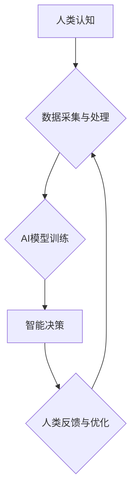

                 

## 创造更美好的世界：人类计算的终极目标

> 关键词：人工智能、计算模型、人类计算、算法优化、可持续发展、伦理规范、未来趋势

### 1. 背景介绍

人类文明的进步离不开对计算的不断探索和突破。从简单的算盘到复杂的超级计算机，计算一直是推动科技发展和社会进步的引擎。如今，人工智能（AI）的兴起，将计算推向了新的高度，为我们创造了一个充满无限可能的未来。然而，AI的发展也带来了新的挑战和伦理问题，我们需要认真思考如何利用AI的力量，创造一个更美好的世界。

本篇文章将探讨人类计算的终极目标，分析AI技术的发展趋势，并深入探讨AI在社会发展中的应用场景、伦理规范和未来挑战。

### 2. 核心概念与联系

**2.1 人类计算的本质**

人类计算是指人类利用自身认知能力和计算能力进行信息处理和决策的过程。它包含了感知、理解、推理、学习和创造等多种复杂的行为。

**2.2 人工智能的演进**

人工智能是模拟和扩展人类智能的一种技术。它涵盖了机器学习、深度学习、自然语言处理、计算机视觉等多个领域。

**2.3 人类计算与人工智能的融合**

人类计算和人工智能的融合将是未来计算发展的重要趋势。通过将人类的智慧和AI的计算能力相结合，我们可以构建更智能、更强大的计算系统，解决更复杂的问题。

**2.4 融合架构**



### 3. 核心算法原理 & 具体操作步骤

**3.1 算法原理概述**

深度学习算法是人工智能领域的核心算法之一。它通过多层神经网络模拟人类大脑的学习过程，能够从海量数据中提取特征，学习复杂的模式。

**3.2 算法步骤详解**

1. **数据预处理:** 将原始数据清洗、转换和格式化，使其适合深度学习算法的训练。
2. **网络结构设计:** 根据任务需求设计神经网络的层数、节点数量和激活函数等参数。
3. **模型训练:** 使用训练数据训练神经网络，调整网络参数，使其能够准确地预测或分类数据。
4. **模型评估:** 使用测试数据评估模型的性能，并根据评估结果进行模型调优。
5. **模型部署:** 将训练好的模型部署到实际应用场景中，用于预测、分类或其他任务。

**3.3 算法优缺点**

**优点:**

* 能够学习复杂的非线性关系。
* 具有强大的泛化能力，能够应用于多种任务。
* 随着数据量的增加，模型性能不断提升。

**缺点:**

* 需要大量的训练数据。
* 训练过程耗时且资源消耗大。
* 模型解释性较差，难以理解模型的决策过程。

**3.4 算法应用领域**

深度学习算法广泛应用于图像识别、语音识别、自然语言处理、机器翻译、推荐系统等领域。

### 4. 数学模型和公式 & 详细讲解 & 举例说明

**4.1 数学模型构建**

深度学习模型通常由多层神经网络组成，每层神经网络包含多个神经元。每个神经元接收来自上一层的输入信号，并通过激活函数进行处理，输出到下一层。

**4.2 公式推导过程**

深度学习模型的训练过程基于梯度下降算法。目标函数是衡量模型预测结果与真实结果之间的误差。梯度下降算法通过不断调整网络参数，使目标函数最小化。

**损失函数:**

$$L(w,b) = \frac{1}{N} \sum_{i=1}^{N} loss(y_i, \hat{y}_i)$$

其中：

* $w$ 和 $b$ 是网络参数。
* $N$ 是训练样本的数量。
* $y_i$ 是真实标签。
* $\hat{y}_i$ 是模型预测结果。
* $loss(y_i, \hat{y}_i)$ 是单个样本的损失函数。

**梯度:**

$$\frac{\partial L}{\partial w} = \frac{1}{N} \sum_{i=1}^{N} \frac{\partial loss(y_i, \hat{y}_i)}{\partial w}$$

**参数更新:**

$$w = w - \alpha \frac{\partial L}{\partial w}$$

其中：

* $\alpha$ 是学习率。

**4.3 案例分析与讲解**

例如，在图像分类任务中，可以使用卷积神经网络（CNN）作为深度学习模型。CNN能够自动学习图像特征，并将其用于分类。

### 5. 项目实践：代码实例和详细解释说明

**5.1 开发环境搭建**

可以使用Python语言和TensorFlow或PyTorch深度学习框架进行项目开发。

**5.2 源代码详细实现**

```python
import tensorflow as tf

# 定义模型结构
model = tf.keras.models.Sequential([
    tf.keras.layers.Conv2D(32, (3, 3), activation='relu', input_shape=(28, 28, 1)),
    tf.keras.layers.MaxPooling2D((2, 2)),
    tf.keras.layers.Conv2D(64, (3, 3), activation='relu'),
    tf.keras.layers.MaxPooling2D((2, 2)),
    tf.keras.layers.Flatten(),
    tf.keras.layers.Dense(10, activation='softmax')
])

# 编译模型
model.compile(optimizer='adam',
              loss='sparse_categorical_crossentropy',
              metrics=['accuracy'])

# 训练模型
model.fit(x_train, y_train, epochs=5)

# 评估模型
loss, accuracy = model.evaluate(x_test, y_test)
print('Test loss:', loss)
print('Test accuracy:', accuracy)
```

**5.3 代码解读与分析**

这段代码定义了一个简单的卷积神经网络模型，用于手写数字识别任务。

* `tf.keras.models.Sequential` 创建了一个顺序模型，将层级依次连接。
* `tf.keras.layers.Conv2D` 定义了一个卷积层，用于提取图像特征。
* `tf.keras.layers.MaxPooling2D` 定义了一个最大池化层，用于降维和提高模型鲁棒性。
* `tf.keras.layers.Flatten` 将多维特征转换为一维向量。
* `tf.keras.layers.Dense` 定义了一个全连接层，用于分类。
* `model.compile` 编译模型，指定优化器、损失函数和评估指标。
* `model.fit` 训练模型，使用训练数据进行迭代训练。
* `model.evaluate` 评估模型，使用测试数据计算损失和准确率。

**5.4 运行结果展示**

训练完成后，模型能够准确地识别手写数字。

### 6. 实际应用场景

**6.1 医疗诊断**

AI可以辅助医生进行疾病诊断，例如识别X光片上的肿瘤或分析病理切片。

**6.2 金融风险管理**

AI可以帮助金融机构识别欺诈交易、评估信用风险和预测市场趋势。

**6.3 自动驾驶**

AI是自动驾驶汽车的核心技术，可以帮助车辆感知周围环境、做出决策和控制行驶。

**6.4 个性化教育**

AI可以根据学生的学习进度和特点，提供个性化的学习内容和辅导。

**6.5 智能客服**

AI可以用于构建智能客服系统，自动回答用户问题和提供服务。

**6.6 未来应用展望**

随着AI技术的不断发展，其应用场景将更加广泛，例如：

* 人机协作：AI可以与人类协作完成复杂任务，例如设计、创作和研究。
* 个性化体验：AI可以根据用户的喜好和需求，提供个性化的产品和服务。
* 智慧城市：AI可以用于管理城市基础设施、优化交通流量和提高公共安全。

### 7. 工具和资源推荐

**7.1 学习资源推荐**

* **在线课程:** Coursera、edX、Udacity 等平台提供丰富的AI课程。
* **书籍:** 《深度学习》、《机器学习实战》等书籍是学习AI的基础教材。
* **开源项目:** TensorFlow、PyTorch 等开源项目提供了丰富的代码示例和工具。

**7.2 开发工具推荐**

* **Python:** Python 是AI开发的主要编程语言。
* **TensorFlow:** TensorFlow 是一个开源的机器学习框架。
* **PyTorch:** PyTorch 是另一个流行的机器学习框架。
* **Jupyter Notebook:** Jupyter Notebook 是一个交互式编程环境，方便进行AI开发和实验。

**7.3 相关论文推荐**

* **《ImageNet Classification with Deep Convolutional Neural Networks》**
* **《Attention Is All You Need》**
* **《BERT: Pre-training of Deep Bidirectional Transformers for Language Understanding》**

### 8. 总结：未来发展趋势与挑战

**8.1 研究成果总结**

近年来，AI技术取得了长足的进步，在图像识别、语音识别、自然语言处理等领域取得了突破性进展。

**8.2 未来发展趋势**

* **模型规模和能力的提升:** 未来AI模型将更加强大，能够处理更复杂的任务。
* **跨模态学习:** AI将能够学习和理解多种模态数据，例如文本、图像、音频和视频。
* **边缘计算:** AI将更加广泛地部署到边缘设备，实现更实时和高效的计算。
* **可解释性增强:** 研究者将致力于提高AI模型的可解释性，使其决策过程更加透明。

**8.3 面临的挑战**

* **数据安全和隐私保护:** AI模型的训练需要大量数据，如何确保数据安全和隐私保护是一个重要挑战。
* **算法偏见和公平性:** AI模型可能存在算法偏见，导致不公平的结果。
* **伦理规范和社会影响:** AI技术的发展需要遵循伦理规范，并考虑其对社会的影响。

**8.4 研究展望**

未来，我们需要继续探索AI技术的潜力，并将其应用于解决人类面临的重大挑战。同时，我们也需要认真思考AI技术带来的伦理问题，并制定相应的规范和政策，确保AI技术能够造福人类。

### 9. 附录：常见问题与解答

**9.1 如何选择合适的AI模型？**

选择合适的AI模型取决于具体的应用场景和数据特点。例如，对于图像识别任务，可以使用卷积神经网络；对于文本分类任务，可以使用循环神经网络或Transformer网络。

**9.2 如何解决AI模型的过拟合问题？**

过拟合是指AI模型在训练数据上表现很好，但在测试数据上表现较差。

解决过拟合的方法包括：

* 增加训练数据量。
* 使用正则化技术，例如L1正则化和L2正则化。
* 使用Dropout技术，随机丢弃一些神经元。
* 使用交叉验证技术，将数据分成多个子集，并在不同的子集上训练和评估模型。

**9.3 如何评估AI模型的性能？**

常用的AI模型性能评估指标包括：

* 准确率：正确预测的样本数量占总样本数量的比例。
* 精度：预测为正类的样本中，真正为正类的样本数量占预测为正类的样本数量的比例。
* 召回率：所有真实为正类的样本中，被正确预测为正类的样本数量占所有真实为正类的样本数量的比例。
* F1-score：精度和召回率的调和平均数。

作者：禅与计算机程序设计艺术 / Zen and the Art of Computer Programming


<end_of_turn>

