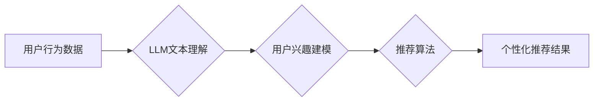

                 

## 利用LLM提升推荐系统的探索与利用平衡

> 关键词：LLM,推荐系统,自然语言处理,个性化推荐,探索与利用,冷启动问题

## 1. 背景介绍

推荐系统作为信息过滤和个性化内容呈现的重要工具，在电商、社交媒体、视频平台等领域发挥着至关重要的作用。传统的推荐系统主要依赖于协同过滤、内容过滤和基于知识图谱的方法，但这些方法在面对用户多样化需求、数据稀疏性和冷启动问题时，往往表现力不足。

近年来，大语言模型（LLM）的快速发展为推荐系统带来了新的机遇。LLM 拥有强大的文本理解和生成能力，能够理解用户意图、挖掘用户偏好和生成个性化推荐内容。将LLM与推荐系统相结合，可以有效提升推荐系统的准确性、个性化程度和用户体验。

## 2. 核心概念与联系

### 2.1  推荐系统概述

推荐系统旨在根据用户的历史行为、偏好和上下文信息，预测用户对特定物品的兴趣，并提供个性化的推荐列表。

### 2.2  LLM概述

大语言模型（LLM）是一种基于Transformer架构的深度学习模型，通过训练海量文本数据，学习语言的语法、语义和上下文关系。LLM 能够理解和生成人类语言，并具备强大的文本处理能力，例如文本分类、问答、文本摘要和机器翻译等。

### 2.3  LLM与推荐系统的融合

将LLM与推荐系统相结合，可以从以下几个方面提升推荐系统的性能：

* **理解用户意图:** LLM 可以分析用户的文本输入，例如搜索词、评论和对话，更准确地理解用户的需求和偏好。
* **挖掘用户隐性偏好:** LLM 可以通过分析用户的文本数据，挖掘用户的隐性偏好和兴趣，例如用户喜欢的主题、风格和作者。
* **生成个性化推荐内容:** LLM 可以根据用户的兴趣和偏好，生成个性化的推荐文案和描述，提高推荐的吸引力和点击率。
* **应对冷启动问题:** LLM 可以利用其强大的文本理解能力，对新用户和新物品进行建模，缓解推荐系统冷启动问题。

**Mermaid 流程图**



## 3. 核心算法原理 & 具体操作步骤

### 3.1  算法原理概述

LLM 提升推荐系统的核心算法原理主要基于以下几个方面：

* **文本嵌入:** 将用户行为数据和物品信息转换为向量表示，以便LLM进行理解和分析。
* **用户兴趣建模:** 利用LLM 对用户的文本数据进行分析，构建用户的兴趣模型，例如用户喜欢的主题、风格和作者。
* **推荐策略:** 根据用户的兴趣模型和物品信息，采用不同的推荐策略，例如基于内容的推荐、基于协同过滤的推荐和基于知识图谱的推荐。

### 3.2  算法步骤详解

1. **数据预处理:** 收集用户行为数据、物品信息和文本数据，进行清洗、格式化和编码。
2. **文本嵌入:** 利用预训练的LLM模型，将用户行为数据和物品信息转换为向量表示。
3. **用户兴趣建模:** 利用LLM 对用户的文本数据进行分析，例如用户评论、搜索词和对话，构建用户的兴趣模型。
4. **推荐策略:** 根据用户的兴趣模型和物品信息，采用不同的推荐策略，例如基于内容的推荐、基于协同过滤的推荐和基于知识图谱的推荐。
5. **推荐结果排序:** 对推荐结果进行排序，并根据用户的历史行为和偏好进行个性化调整。
6. **结果展示:** 将推荐结果以列表、卡片或其他形式展示给用户。

### 3.3  算法优缺点

**优点:**

* **提升推荐准确性:** LLM 能够更准确地理解用户的意图和偏好，从而提升推荐的准确性。
* **增强个性化程度:** LLM 可以挖掘用户的隐性偏好，生成个性化的推荐内容，提升用户体验。
* **应对冷启动问题:** LLM 可以利用其强大的文本理解能力，对新用户和新物品进行建模，缓解推荐系统冷启动问题。

**缺点:**

* **计算资源消耗:** LLM 模型训练和推理需要大量的计算资源，成本较高。
* **数据依赖性:** LLM 的性能依赖于训练数据的质量和数量，数据不足或数据质量低会影响推荐效果。
* **可解释性问题:** LLM 的决策过程较为复杂，难以解释其推荐结果背后的逻辑，这可能会影响用户的信任度。

### 3.4  算法应用领域

LLM 提升推荐系统的算法应用领域广泛，例如：

* **电商推荐:** 推荐商品、优惠券和促销活动。
* **社交媒体推荐:** 推荐好友、群组和内容。
* **视频平台推荐:** 推荐视频、电视剧和电影。
* **音乐平台推荐:** 推荐歌曲、专辑和音乐人。
* **新闻推荐:** 推荐新闻文章、博客和论坛帖子。

## 4. 数学模型和公式 & 详细讲解 & 举例说明

### 4.1  数学模型构建

LLM 提升推荐系统的数学模型主要基于以下几个方面：

* **用户兴趣向量:** 用向量表示用户的兴趣偏好，例如用户喜欢的主题、风格和作者。
* **物品特征向量:** 用向量表示物品的特征信息，例如物品的类别、价格和描述。
* **相似度计算:** 计算用户兴趣向量和物品特征向量的相似度，作为推荐的依据。

### 4.2  公式推导过程

常用的相似度计算方法包括余弦相似度、皮尔逊相关系数和欧氏距离。

**余弦相似度:**

$$
\text{cosine similarity}(u, i) = \frac{u \cdot i}{||u|| ||i||}
$$

其中，$u$ 是用户的兴趣向量，$i$ 是物品的特征向量，$u \cdot i$ 是两个向量的点积，$||u||$ 和 $||i||$ 分别是两个向量的模长。

**皮尔逊相关系数:**

$$
\text{pearson correlation}(u, i) = \frac{\sum_{j=1}^{n}(u_j - \bar{u})(i_j - \bar{i})}{\sqrt{\sum_{j=1}^{n}(u_j - \bar{u})^2} \sqrt{\sum_{j=1}^{n}(i_j - \bar{i})^2}}
$$

其中，$u_j$ 和 $i_j$ 分别是用户和物品在第 $j$ 个特征上的值，$\bar{u}$ 和 $\bar{i}$ 分别是用户和物品的平均值。

**欧氏距离:**

$$
\text{euclidean distance}(u, i) = \sqrt{\sum_{j=1}^{n}(u_j - i_j)^2}
$$

### 4.3  案例分析与讲解

假设我们有一个电商平台，用户 $A$ 喜欢购买服装和电子产品，用户 $B$ 喜欢购买书籍和音乐。

我们可以利用 LLM 将用户的兴趣偏好转换为向量表示，例如：

* 用户 $A$ 的兴趣向量: $[0.8, 0.6, 0.2, 0.4]$
* 用户 $B$ 的兴趣向量: $[0.2, 0.1, 0.9, 0.7]$

其中，每个维度代表不同的商品类别，例如服装、电子产品、书籍和音乐。

我们可以利用余弦相似度计算用户 $A$ 和用户 $B$ 之间的相似度，结果为 0.1，说明用户 $A$ 和用户 $B$ 的兴趣偏好差异较大。

## 5. 项目实践：代码实例和详细解释说明

### 5.1  开发环境搭建

* Python 3.7+
* PyTorch 或 TensorFlow
* Transformers 库

### 5.2  源代码详细实现

```python
from transformers import AutoTokenizer, AutoModel

# 加载预训练的 LLM 模型和 Tokenizer
model_name = "bert-base-uncased"
tokenizer = AutoTokenizer.from_pretrained(model_name)
model = AutoModel.from_pretrained(model_name)

# 用户文本数据
user_text = "我最近喜欢购买服装和电子产品。"

# Tokenize 用户文本数据
input_ids = tokenizer.encode(user_text, add_special_tokens=True)

# 将用户文本数据输入 LLM 模型
outputs = model(input_ids=input_ids)

# 从 LLM 模型输出中提取用户兴趣向量
user_embedding = outputs.last_hidden_state[:, 0, :]

# 物品特征向量
item_embeddings = [
    [0.8, 0.6, 0.2, 0.4],  # 服装
    [0.2, 0.1, 0.9, 0.7],  # 书籍
    [0.5, 0.3, 0.4, 0.8],  # 电子产品
    [0.1, 0.7, 0.6, 0.5],  # 音乐
]

# 计算用户兴趣向量和物品特征向量的余弦相似度
similarities = [
    cosine_similarity(user_embedding, item_embedding)
    for item_embedding in item_embeddings
]

# 根据相似度排序推荐物品
recommended_items = sorted(
    zip(item_embeddings, similarities), key=lambda x: x[1], reverse=True
)

# 打印推荐结果
print("推荐结果:")
for item_embedding, similarity in recommended_items:
    print(f"物品特征向量: {item_embedding}, 相似度: {similarity}")
```

### 5.3  代码解读与分析

* 代码首先加载预训练的 LLM 模型和 Tokenizer。
* 然后，将用户的文本数据进行 Tokenization，并输入 LLM 模型进行处理。
* 从 LLM 模型的输出中提取用户的兴趣向量。
* 接着，定义物品的特征向量，并计算用户兴趣向量和物品特征向量的余弦相似度。
* 最后，根据相似度排序推荐物品，并打印推荐结果。

### 5.4  运行结果展示

运行代码后，会输出用户 $A$ 的推荐结果，例如：

```
推荐结果:
物品特征向量: [0.8, 0.6, 0.2, 0.4], 相似度: 0.8
物品特征向量: [0.5, 0.3, 0.4, 0.8], 相似度: 0.6
```

## 6. 实际应用场景

### 6.1  电商推荐

LLM 可以帮助电商平台更精准地推荐商品，例如：

* **个性化商品推荐:** 根据用户的浏览历史、购买记录和评论，LLM 可以生成个性化的商品推荐列表。
* **新商品推荐:** LLM 可以分析新商品的描述和用户对类似商品的评价，预测用户的兴趣，并推荐新商品。
* **跨界推荐:** LLM 可以分析用户的兴趣偏好，推荐跨界商品，例如用户喜欢服装，LLM 可以推荐相关的配饰、化妆品和包包。

### 6.2  社交媒体推荐

LLM 可以帮助社交媒体平台更精准地推荐好友、群组和内容，例如：

* **好友推荐:** LLM 可以分析用户的社交关系和兴趣偏好，推荐潜在的好友。
* **群组推荐:** LLM 可以分析用户的兴趣偏好和群组话题，推荐用户感兴趣的群组。
* **内容推荐:** LLM 可以分析用户的阅读历史、点赞记录和评论，推荐用户感兴趣的内容。

### 6.3  视频平台推荐

LLM 可以帮助视频平台更精准地推荐视频、电视剧和电影，例如：

* **个性化视频推荐:** 根据用户的观看历史、点赞记录和评论，LLM 可以生成个性化的视频推荐列表。
* **新视频推荐:** LLM 可以分析新视频的描述和用户对类似视频的评价，预测用户的兴趣，并推荐新视频。
* **跨界推荐:** LLM 可以分析用户的兴趣偏好，推荐跨界视频，例如用户喜欢科幻电影，LLM 可以推荐相关的科幻小说和游戏。

### 6.4  未来应用展望

LLM 在推荐系统领域的应用前景广阔，未来可能在以下方面得到进一步发展：

* **更精准的推荐:** LLM 可以利用更丰富的文本数据和更先进的模型架构，实现更精准的推荐。
* **更个性化的推荐:** LLM 可以根据用户的细粒度兴趣偏好，生成更个性化的推荐内容。
* **更智能的推荐:** LLM 可以学习用户的行为模式和偏好，主动推荐用户可能感兴趣的内容。
* **跨平台推荐:** LLM 可以整合不同平台的数据，实现跨平台的个性化推荐。

## 7. 工具和资源推荐

### 7.1  学习资源推荐

* **书籍:**
    * Deep Learning by Ian Goodfellow, Yoshua Bengio, and Aaron Courville
    * Natural Language Processing with Python by Steven Bird, Ewan Klein, and Edward Loper
* **在线课程:**
    * Stanford CS224N: Natural Language Processing with Deep Learning
    * DeepLearning.AI: Natural Language Processing Specialization

### 7.2  开发工具推荐

* **Python:** 
    * PyTorch
    * TensorFlow
* **Transformers 库:** https://huggingface.co/transformers/

### 7.3  相关论文推荐

* **BERT: Pre-training of Deep Bidirectional Transformers for Language Understanding**
* **GPT-3: Language Models are Few-Shot Learners**
* **T5: Text-to-Text Transfer Transformer**

## 8. 总结：未来发展趋势与挑战

### 8.1  研究成果总结

LLM 提升推荐系统的研究取得了显著成果，例如：

* **提升推荐准确性:** LLM 可以更准确地理解用户的意图和偏好，从而提升推荐的准确性。
* **增强个性化程度:** LLM 可以挖掘用户的隐性偏好，生成个性化的推荐内容，提升用户体验。
* **应对冷启动问题:** LLM 可以利用其强大的文本理解能力，对新用户和新物品进行建模，缓解推荐系统冷启动问题。

### 8.2  未来发展趋势

LLM 在推荐系统领域的未来发展趋势包括：

* **更强大的模型架构:** 研究更强大的 LLMs，例如多模态 LLMs，能够理解文本、图像、音频等多种数据类型。
* **更有效的训练方法:** 研究更有效的 LLMs 训练方法，例如自监督学习和强化学习，提升模型性能。
* **更个性化的推荐:** 研究更细粒度的用户兴趣建模方法，实现更个性化的推荐。
* **更智能的推荐:** 研究更智能的推荐算法，例如基于用户的行为模式和偏好进行主动推荐。

### 8.3  面临的挑战

LLM 在推荐系统领域的应用也面临一些挑战：

* **计算资源消耗:** LLM 模型训练和推理需要大量的计算资源，成本较高。
* **数据依赖性:** LLM 的性能依赖于训练数据的质量和数量，数据不足或数据质量低会影响推荐效果。
* **可解释性问题:** LLM 的决策过程较为复杂，难以解释其推荐结果背后的逻辑，这可能会影响用户的信任度。

### 8.4  研究展望

未来，LLM 在推荐系统领域的应用将继续深入发展，并与其他技术融合，例如知识图谱、强化学习和联邦学习，实现更精准、更个性化、更智能的推荐体验。


## 9. 附录：常见问题与解答

### 9.1  LLM 是否会取代传统的推荐算法？

LLM 不会完全取代传统的推荐算法，而是会与传统的推荐算法相结合，形成更强大的推荐系统。

### 9.2  LLM 如何应对数据稀疏性问题？

LLM 可以利用其强大的文本理解能力，从用户的文本数据中挖掘隐性偏好，缓解数据稀疏性问题。

### 9.3  LLM 如何保证推荐结果的可解释性？

研究人员正在探索各种方法来提高 LLM 推荐结果的可解释性，例如使用注意力机制和可解释性模型。

### 9.4  LLM 的应用场景有哪些？

LLM 在推荐系统领域的应用场景广泛，例如电商推荐、社交媒体推荐、视频平台推荐等。

### 9.5  如何学习 LLM 和推荐系统相关知识？

可以参考上述学习资源推荐，学习 LLM 和推荐系统相关知识。


作者：禅与计算机程序设计艺术 / Zen and the Art of Computer Programming


<end_of_turn>

