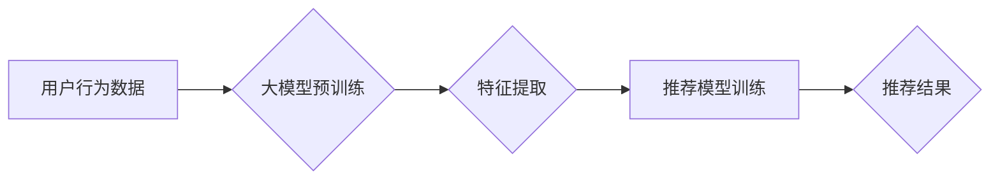

                 

## 利用大模型提升推荐系统的抗噪声能力

> 关键词：大模型、推荐系统、抗噪声、数据质量、鲁棒性、迁移学习

## 1. 背景介绍

推荐系统作为信息过滤和个性化服务的重要组成部分，在电商、社交媒体、视频平台等领域发挥着越来越重要的作用。然而，推荐系统的准确性和可靠性受到数据质量的影响很大。现实世界的数据往往存在着噪声、缺失、不一致等问题，这些噪声会对推荐系统的性能造成负面影响，导致推荐结果不准确、用户体验下降。

传统的推荐系统主要依赖于统计学习方法，例如协同过滤、基于内容的过滤和混合推荐等。这些方法对数据质量要求较高，当数据存在噪声时，容易导致模型过拟合或性能下降。近年来，大模型技术的发展为提升推荐系统的抗噪声能力提供了新的思路。

大模型，是指参数规模庞大、训练数据海量的人工智能模型。其强大的学习能力和泛化能力使其能够更好地处理复杂的数据分布和噪声。利用大模型的优势，可以有效提升推荐系统的鲁棒性，使其能够在面对噪声数据时依然保持较高的准确性和可靠性。

## 2. 核心概念与联系

### 2.1 大模型

大模型是指参数规模庞大、训练数据海量的人工智能模型。其强大的学习能力和泛化能力使其能够更好地处理复杂的数据分布和噪声。常见的代表性大模型包括GPT-3、BERT、LaMDA等。

### 2.2 推荐系统

推荐系统旨在根据用户的历史行为、偏好和上下文信息，预测用户对特定物品的兴趣，并推荐相关物品。常见的推荐系统类型包括协同过滤、基于内容的过滤和混合推荐等。

### 2.3 抗噪声能力

抗噪声能力是指推荐系统在面对噪声数据时依然能够保持较高的准确性和可靠性的能力。噪声数据是指数据中包含错误、缺失、不一致等问题的数据。

**推荐系统与大模型的联系**

大模型可以为推荐系统提供更强大的学习能力和泛化能力，从而提升推荐系统的抗噪声能力。

**Mermaid 流程图**



## 3. 核心算法原理 & 具体操作步骤

### 3.1 算法原理概述

利用大模型提升推荐系统的抗噪声能力主要基于以下原理：

* **迁移学习:** 利用大模型在其他领域的大规模数据训练得到的知识，迁移到推荐系统领域，提升推荐模型的泛化能力和抗噪声能力。
* **数据增强:** 利用大模型的文本生成能力，对原始数据进行增强，例如生成虚拟用户行为数据，丰富数据多样性，提升模型对噪声的鲁棒性。
* **噪声过滤:** 利用大模型的语义理解能力，对数据中的噪声进行识别和过滤，例如识别重复数据、错误数据等，提高数据质量。

### 3.2 算法步骤详解

1. **数据预处理:** 对原始用户行为数据进行清洗、去重、格式化等处理，确保数据质量。
2. **大模型预训练:** 选择合适的预训练大模型，例如BERT、GPT-3等，并利用大规模文本数据进行预训练。
3. **特征提取:** 将预训练好的大模型应用于用户行为数据，提取用户兴趣、偏好等特征。
4. **推荐模型训练:** 利用提取的特征，训练推荐模型，例如协同过滤、深度学习等模型。
5. **模型评估:** 利用测试数据评估推荐模型的性能，例如准确率、召回率等指标。
6. **模型部署:** 将训练好的推荐模型部署到线上环境，为用户提供个性化推荐服务。

### 3.3 算法优缺点

**优点:**

* 提升推荐系统的泛化能力和抗噪声能力。
* 能够处理复杂的数据分布和噪声。
* 提升推荐结果的准确性和可靠性。

**缺点:**

* 需要大量的计算资源和训练数据。
* 模型训练和部署成本较高。
* 需要对大模型进行调优和适配。

### 3.4 算法应用领域

* **电商推荐:** 提升商品推荐的准确性和个性化程度。
* **社交媒体推荐:** 提升用户兴趣内容的推荐效果。
* **视频平台推荐:** 提升用户观看视频的兴趣和粘性。
* **新闻推荐:** 提升用户获取新闻信息的效率和准确性。

## 4. 数学模型和公式 & 详细讲解 & 举例说明

### 4.1 数学模型构建

推荐系统的核心是预测用户对物品的评分或偏好。可以使用以下数学模型来表示：

$$
r_{u,i} = f(h_u, h_i, \theta)
$$

其中：

* $r_{u,i}$ 表示用户 $u$ 对物品 $i$ 的评分或偏好。
* $h_u$ 表示用户 $u$ 的特征向量。
* $h_i$ 表示物品 $i$ 的特征向量。
* $\theta$ 表示模型参数。
* $f$ 表示评分函数。

### 4.2 公式推导过程

推荐模型的训练目标是学习到最优的模型参数 $\theta$，使得预测评分与实际评分之间的误差最小。常用的损失函数包括均方误差 (MSE) 和交叉熵损失 (Cross-Entropy Loss)。

**均方误差 (MSE):**

$$
MSE = \frac{1}{N} \sum_{u,i} (r_{u,i} - \hat{r}_{u,i})^2
$$

其中：

* $N$ 表示训练样本的数量。
* $\hat{r}_{u,i}$ 表示模型预测的用户 $u$ 对物品 $i$ 的评分。

**交叉熵损失 (Cross-Entropy Loss):**

$$
Cross-Entropy Loss = -\frac{1}{N} \sum_{u,i} r_{u,i} \log(\hat{r}_{u,i}) + (1-r_{u,i}) \log(1-\hat{r}_{u,i})
$$

### 4.3 案例分析与讲解

假设我们有一个电商平台，需要推荐商品给用户。我们可以使用协同过滤算法构建推荐模型，并利用大模型提取用户兴趣和商品特征。

* **用户特征:** 利用大模型对用户的浏览历史、购买记录、评论等数据进行分析，提取用户的兴趣标签、偏好类型等特征。
* **商品特征:** 利用大模型对商品的标题、描述、图片等数据进行分析，提取商品的类别、属性、风格等特征。
* **评分预测:** 利用提取的用户和商品特征，以及预训练好的大模型，构建协同过滤模型，预测用户对商品的评分。

## 5. 项目实践：代码实例和详细解释说明

### 5.1 开发环境搭建

* Python 3.7+
* TensorFlow/PyTorch
* CUDA Toolkit
* HuggingFace Transformers

### 5.2 源代码详细实现

```python
# 导入必要的库
import tensorflow as tf
from transformers import AutoTokenizer, AutoModel

# 加载预训练模型和词典
model_name = "bert-base-uncased"
tokenizer = AutoTokenizer.from_pretrained(model_name)
model = AutoModel.from_pretrained(model_name)

# 用户行为数据预处理
def preprocess_data(data):
  # ... 数据清洗、格式化等操作

# 特征提取
def extract_features(data):
  # ... 利用大模型提取用户和商品特征

# 构建推荐模型
def build_model():
  # ... 构建协同过滤模型

# 模型训练
def train_model(model, data):
  # ... 利用训练数据训练模型

# 模型评估
def evaluate_model(model, data):
  # ... 利用测试数据评估模型性能

# 运行示例
data = preprocess_data(user_behavior_data)
user_features = extract_features(data)
item_features = extract_features(data)
model = build_model()
model.train(data)
evaluate_model(model, test_data)
```

### 5.3 代码解读与分析

* 代码首先导入必要的库，并加载预训练模型和词典。
* 然后对用户行为数据进行预处理，提取用户和商品特征。
* 接着构建协同过滤模型，并利用训练数据进行模型训练。
* 最后利用测试数据评估模型性能。

### 5.4 运行结果展示

* 模型训练完成后，可以利用测试数据评估模型性能，例如准确率、召回率等指标。
* 可以将推荐结果展示给用户，并收集用户反馈，进一步优化模型。

## 6. 实际应用场景

### 6.1 电商推荐

利用大模型提升电商推荐系统的抗噪声能力，可以有效提高商品推荐的准确性和个性化程度，提升用户购物体验。

### 6.2 社交媒体推荐

利用大模型提升社交媒体推荐系统的抗噪声能力，可以有效推荐用户感兴趣的内容，提升用户粘性和活跃度。

### 6.3 视频平台推荐

利用大模型提升视频平台推荐系统的抗噪声能力，可以有效推荐用户喜欢的视频，提升用户观看时长和互动率。

### 6.4 未来应用展望

随着大模型技术的不断发展，其在推荐系统领域的应用将更加广泛和深入。例如：

* 利用大模型进行更精准的用户画像和商品画像，提升推荐的个性化程度。
* 利用大模型进行跨模态推荐，例如将文本、图像、视频等多种数据融合在一起进行推荐。
* 利用大模型进行动态推荐，根据用户的实时行为和上下文信息进行个性化推荐。

## 7. 工具和资源推荐

### 7.1 学习资源推荐

* **书籍:**
    * 《深度学习》 by Ian Goodfellow, Yoshua Bengio, Aaron Courville
    * 《自然语言处理》 by Dan Jurafsky, James H. Martin
* **在线课程:**
    * Coursera: Deep Learning Specialization
    * Udacity: Machine Learning Engineer Nanodegree
* **博客和论坛:**
    * Towards Data Science
    * Machine Learning Mastery

### 7.2 开发工具推荐

* **Python:** 
    * TensorFlow
    * PyTorch
    * scikit-learn
* **HuggingFace Transformers:** 
    * 提供预训练的大模型和工具
* **云平台:**
    * AWS
    * Google Cloud Platform
    * Azure

### 7.3 相关论文推荐

* **BERT: Pre-training of Deep Bidirectional Transformers for Language Understanding**
* **GPT-3: Language Models are Few-Shot Learners**
* **Improving Recommendation Systems with Transfer Learning**

## 8. 总结：未来发展趋势与挑战

### 8.1 研究成果总结

利用大模型提升推荐系统的抗噪声能力是一个新兴的研究方向，取得了一些初步成果。大模型的强大学习能力和泛化能力为提升推荐系统的鲁棒性提供了新的思路。

### 8.2 未来发展趋势

* **模型规模和能力的提升:** 随着计算资源的不断发展，大模型的规模和能力将进一步提升，为推荐系统提供更强大的支持。
* **多模态推荐:** 将文本、图像、视频等多种数据融合在一起进行推荐，提升推荐的准确性和个性化程度。
* **动态推荐:** 根据用户的实时行为和上下文信息进行个性化推荐，提升推荐的时效性和针对性。
* **联邦学习:** 利用联邦学习技术，在保护用户隐私的前提下，提升大模型的训练效率和数据安全。

### 8.3 面临的挑战

* **计算资源和训练成本:** 大模型的训练需要大量的计算资源和时间，这对于资源有限的机构来说是一个挑战。
* **模型解释性和可解释性:** 大模型的决策过程往往难以解释，这对于推荐系统的透明度和可信度是一个挑战。
* **数据质量和隐私保护:** 大模型的训练依赖于高质量的数据，而数据质量和隐私保护是一个重要的伦理问题。

### 8.4 研究展望

未来，利用大模型提升推荐系统的抗噪声能力将是一个重要的研究方向。需要进一步探索大模型的应用场景、模型架构、训练方法和伦理问题，为构建更智能、更可靠的推荐系统提供理论和实践支持。

## 9. 附录：常见问题与解答

**Q1: 大模型的训练需要多少计算资源？**

A1: 大模型的训练需要大量的计算资源，例如GPU、TPU等。具体需要的计算资源取决于模型的规模、训练数据的大小和训练时间等因素。

**Q2: 如何评估大模型在推荐系统中的性能？**

A2: 可以利用测试数据评估大模型在推荐系统中的性能，例如准确率、召回率、NDCG等指标。

**Q3: 如何解决大模型的模型解释性和可解释性问题？**

A3: 可以利用可解释机器学习 (XAI) 技术，例如LIME、SHAP等，对大模型的决策过程进行解释。

**作者：禅与计算机程序设计艺术 / Zen and the Art of Computer Programming**<end_of_turn>

