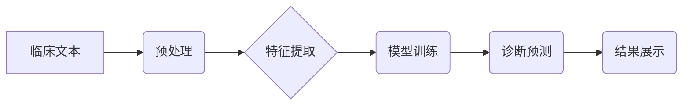

                 

## 医疗诊断中的自然语言处理应用

> 关键词：自然语言处理，医疗诊断，机器学习，深度学习，临床文本，知识图谱，医疗信息提取

## 1. 背景介绍

医疗诊断是临床实践的核心环节，准确的诊断是治疗方案成功的基石。传统上，医生依赖于临床经验、病史询问、体格检查和辅助检查结果进行诊断。然而，随着医疗数据的爆炸式增长，以及患者信息的多样性和复杂性，传统的诊断方式面临着越来越大的挑战。

自然语言处理（Natural Language Processing，NLP）作为人工智能领域的重要分支，致力于使计算机能够理解、处理和生成人类语言。近年来，NLP技术取得了长足进步，在医疗诊断领域展现出巨大的应用潜力。

## 2. 核心概念与联系

**2.1 核心概念**

* **自然语言处理 (NLP):**  NLP旨在使计算机能够理解、解释和生成人类语言。它涵盖了多种技术，包括文本分析、语音识别、机器翻译等。
* **医疗诊断:** 医疗诊断是指根据患者的症状、病史、体征等信息，确定患者所患疾病的过程。
* **临床文本:** 临床文本是指在医疗环境中产生的文本数据，例如病历、医嘱、手术记录等。

**2.2  架构图**



**2.3  联系**

NLP技术可以帮助医生从海量临床文本中提取关键信息，辅助医生进行诊断决策。具体来说，NLP技术可以用于：

* **自动提取临床信息:** 从病历、医嘱等文本中自动提取患者的症状、病史、体征、诊断结果等信息。
* **知识图谱构建:** 建立医疗领域知识图谱，将疾病、症状、治疗方法等信息进行关联，帮助医生理解疾病之间的关系和诊断逻辑。
* **诊断支持系统:** 开发基于机器学习的诊断支持系统，根据患者的临床信息预测可能的诊断结果，并提供相应的治疗建议。

## 3. 核心算法原理 & 具体操作步骤

**3.1 算法原理概述**

在医疗诊断中的NLP应用中，常用的算法包括：

* **机器学习算法:**  例如支持向量机（SVM）、逻辑回归、决策树等，可以根据训练数据学习疾病与症状之间的关系，进行诊断预测。
* **深度学习算法:** 例如卷积神经网络（CNN）、循环神经网络（RNN）、Transformer等，可以学习更复杂的文本特征，提高诊断准确率。

**3.2 算法步骤详解**

1. **数据收集和预处理:** 收集临床文本数据，并进行清洗、标注、格式化等预处理步骤。
2. **特征提取:** 使用词嵌入、TF-IDF等方法提取文本特征，将文本转换为机器可理解的数值向量。
3. **模型训练:** 选择合适的机器学习或深度学习算法，使用训练数据训练模型，学习疾病与症状之间的关系。
4. **模型评估:** 使用测试数据评估模型的性能，例如准确率、召回率、F1-score等。
5. **模型部署:** 将训练好的模型部署到实际应用环境中，用于辅助医生进行诊断决策。

**3.3 算法优缺点**

* **机器学习算法:** 优点：易于理解和实现，训练速度较快。缺点：对数据质量要求较高，难以学习复杂文本特征。
* **深度学习算法:** 优点：可以学习更复杂的文本特征，诊断准确率更高。缺点：训练时间较长，对计算资源要求较高，解释性较差。

**3.4 算法应用领域**

* **疾病诊断:** 辅助医生诊断各种疾病，例如癌症、心血管疾病、传染病等。
* **风险预测:** 预测患者患病风险，例如糖尿病、心梗等。
* **个性化治疗:** 根据患者的临床信息，推荐个性化的治疗方案。

## 4. 数学模型和公式 & 详细讲解 & 举例说明

**4.1 数学模型构建**

在医疗诊断中的NLP应用中，常用的数学模型包括：

* **逻辑回归模型:** 用于预测二分类问题，例如患者是否患有某种疾病。
* **支持向量机模型:** 用于分类和回归问题，可以学习复杂的决策边界。
* **神经网络模型:** 用于学习复杂的非线性关系，可以实现更准确的诊断预测。

**4.2 公式推导过程**

* **逻辑回归模型:**

$$
P(y=1|x) = \frac{1}{1+e^{-(w^Tx+b)}}
$$

其中：

* $P(y=1|x)$ 是患者患有疾病的概率。
* $x$ 是患者的临床特征向量。
* $w$ 是模型参数向量。
* $b$ 是模型偏置项。

**4.3 案例分析与讲解**

假设我们想要构建一个逻辑回归模型，用于预测患者是否患有糖尿病。

* **特征:** 患者的年龄、体重指数、血压、血糖水平等。
* **标签:** 患者是否患有糖尿病（1表示患病，0表示未患病）。

我们可以使用训练数据训练逻辑回归模型，学习特征与糖尿病之间的关系。然后，对于新的患者，我们可以输入其临床特征，使用训练好的模型预测其患糖尿病的概率。

## 5. 项目实践：代码实例和详细解释说明

**5.1 开发环境搭建**

* Python 3.x
* TensorFlow 或 PyTorch 深度学习框架
* NLTK 自然语言处理库
* Scikit-learn 机器学习库

**5.2 源代码详细实现**

```python
import tensorflow as tf
from tensorflow.keras.models import Sequential
from tensorflow.keras.layers import Embedding, LSTM, Dense

# 数据预处理
# ...

# 模型构建
model = Sequential()
model.add(Embedding(input_dim=vocab_size, output_dim=embedding_dim, input_length=max_length))
model.add(LSTM(units=128))
model.add(Dense(units=1, activation='sigmoid'))

# 模型编译
model.compile(optimizer='adam', loss='binary_crossentropy', metrics=['accuracy'])

# 模型训练
model.fit(x_train, y_train, epochs=10, batch_size=32)

# 模型评估
loss, accuracy = model.evaluate(x_test, y_test)
print('Loss:', loss)
print('Accuracy:', accuracy)

# 模型预测
predictions = model.predict(x_new)
```

**5.3 代码解读与分析**

* **数据预处理:** 将临床文本数据转换为机器可理解的格式，例如词嵌入、句子长度截断等。
* **模型构建:** 使用深度学习框架构建神经网络模型，例如LSTM网络，用于学习文本特征。
* **模型编译:** 设置模型的优化器、损失函数和评价指标。
* **模型训练:** 使用训练数据训练模型，更新模型参数。
* **模型评估:** 使用测试数据评估模型的性能。
* **模型预测:** 使用训练好的模型预测新的患者的诊断结果。

**5.4 运行结果展示**

* 训练过程中的损失函数值和准确率曲线。
* 测试集上的损失函数值和准确率。
* 对新患者的诊断预测结果。

## 6. 实际应用场景

**6.1 疾病诊断辅助系统**

* **癌症诊断:** 辅助医生诊断各种癌症，例如肺癌、乳腺癌、结肠癌等。
* **心血管疾病诊断:** 辅助医生诊断心梗、心衰、高血压等心血管疾病。
* **传染病诊断:** 辅助医生诊断流感、肺炎、新冠肺炎等传染病。

**6.2 医疗风险预测系统**

* **糖尿病风险预测:** 预测患者患糖尿病的风险，并提供相应的预防措施。
* **心梗风险预测:** 预测患者患心梗的风险，并提供相应的治疗方案。
* **老年人跌倒风险预测:** 预测老年人跌倒的风险，并提供相应的预防措施。

**6.3 个性化治疗方案推荐系统**

* 根据患者的临床信息，推荐个性化的治疗方案，例如药物选择、手术方案等。
* 辅助医生制定更有效的治疗方案，提高患者的治疗效果。

**6.4 未来应用展望**

* **更精准的诊断:** 利用更先进的NLP算法和深度学习模型，提高诊断的准确率和效率。
* **更个性化的治疗:** 根据患者的基因信息、生活习惯等多方面数据，提供更个性化的治疗方案。
* **远程医疗:** 利用NLP技术，实现远程医疗诊断和咨询，提高医疗服务的普及率。

## 7. 工具和资源推荐

**7.1 学习资源推荐**

* **书籍:**
    * 《深度学习》
    * 《自然语言处理入门》
* **在线课程:**
    * Coursera: 自然语言处理
    * edX: 深度学习
* **博客和网站:**
    * NLP Progress
    * Hugging Face

**7.2 开发工具推荐**

* **Python:** 
* **TensorFlow:** 
* **PyTorch:** 
* **NLTK:** 
* **SpaCy:** 

**7.3 相关论文推荐**

* **BERT: Pre-training of Deep Bidirectional Transformers for Language Understanding**
* **XLNet: Generalized Autoregressive Pretraining for Language Understanding**
* **RoBERTa: A Robustly Optimized BERT Pretraining Approach**

## 8. 总结：未来发展趋势与挑战

**8.1 研究成果总结**

近年来，NLP技术在医疗诊断领域取得了显著进展，例如：

* **疾病诊断准确率提高:** 基于深度学习的诊断模型，能够实现更高的诊断准确率。
* **医疗风险预测能力增强:** 能够更准确地预测患者患病风险，帮助医生制定更有效的预防措施。
* **个性化治疗方案推荐:** 能够根据患者的临床信息，推荐更个性化的治疗方案。

**8.2 未来发展趋势**

* **更强大的模型:** 开发更强大的深度学习模型，例如Transformer变体，提高诊断准确率和效率。
* **多模态融合:** 将文本数据与其他模态数据，例如图像、语音、电子病历等融合，实现更全面的诊断。
* **解释性增强:** 开发更具解释性的NLP模型，帮助医生理解模型的决策过程，提高信任度。

**8.3 面临的挑战**

* **数据质量:** 医疗数据往往存在不完整、不一致、格式混乱等问题，需要进行高质量的数据清洗和预处理。
* **模型解释性:** 深度学习模型的决策过程往往难以解释，需要开发更具解释性的模型，提高医生信任度。
* **伦理问题:** 医疗诊断涉及到患者隐私和安全问题，需要考虑伦理问题，确保模型的公平性和可信度。

**8.4 研究展望**

未来，NLP技术将在医疗诊断领域发挥越来越重要的作用，帮助医生提高诊断效率，降低医疗成本，最终实现更精准、更个性化的医疗服务。


## 9. 附录：常见问题与解答

**9.1 如何处理医疗文本中的专业术语？**

可以使用词典、知识库等资源进行专业术语的映射和解释，或者使用专门的医疗NLP工具进行处理。

**9.2 如何评估NLP模型在医疗诊断中的性能？**

可以使用准确率、召回率、F1-score等指标评估模型的性能，并进行临床验证，以确保模型的实用性和可靠性。

**9.3 如何确保NLP模型的安全性与隐私性？**

需要采取相应的安全措施，例如数据加密、访问控制等，保护患者隐私信息。


作者：禅与计算机程序设计艺术 / Zen and the Art of Computer Programming 
<end_of_turn>

