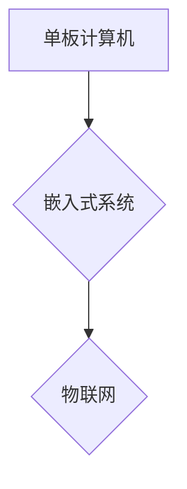

                 

## 单板计算机：Raspberry Pi 和 Arduino

> 关键词：单板计算机，Raspberry Pi，Arduino，嵌入式系统，物联网，开源硬件，微控制器，编程，电子工程

## 1. 背景介绍

单板计算机（Single-Board Computer，SBC）近年来迅速崛起，成为嵌入式系统和物联网领域不可或缺的工具。它们以其体积小巧、功能强大、价格低廉的特点，为开发者和爱好者提供了极大的便利。其中，Raspberry Pi 和 Arduino 是两款最为知名的单板计算机，分别代表了不同类型的 SBC，并拥有各自独特的优势和应用场景。

**1.1. 嵌入式系统的兴起**

嵌入式系统是指专门为特定应用而设计的计算机系统，其功能相对单一，但通常具有实时性、可靠性和低功耗等特点。随着物联网、智能家居、工业自动化等领域的快速发展，对嵌入式系统的需求不断增长。

**1.2. 单板计算机的优势**

单板计算机相较于传统计算机，具有以下优势：

* **体积小巧：** SBC 通常尺寸小巧，便于集成到各种设备中。
* **功耗低：** SBC 通常采用低功耗处理器和组件，适合电池供电的应用场景。
* **价格低廉：** SBC 的价格相对传统计算机更低，降低了开发成本。
* **开源特性：** 许多 SBC 采用开源硬件和软件，方便开发者进行定制和扩展。

**1.3. Raspberry Pi 和 Arduino 的区别**

Raspberry Pi 和 Arduino 都是非常受欢迎的单板计算机，但它们在功能、架构和应用场景上存在一些差异：

* **Raspberry Pi:** 是一款功能更强大的 SBC，搭载完整的 Linux 操作系统，支持运行各种应用程序和软件。
* **Arduino:** 是一款更侧重于硬件控制的 SBC，通常用于控制传感器、电机、LED 等硬件设备。

## 2. 核心概念与联系

### 2.1. 单板计算机架构

单板计算机通常由以下核心部件组成：

* **处理器 (CPU):** 负责执行程序指令。
* **内存 (RAM):** 用于存储正在运行的程序和数据。
* **存储器 (ROM/SD卡):** 用于存储操作系统和应用程序。
* **外设接口 (GPIO):** 用于连接传感器、电机、显示器等外部设备。
* **电源管理单元 (PMU):** 用于管理电源供给。

### 2.2. 嵌入式系统与单板计算机的关系

嵌入式系统是单板计算机的一种应用场景。单板计算机为嵌入式系统提供了硬件平台，开发者可以根据具体应用需求，编写相应的嵌入式软件，实现各种功能。

### 2.3. 物联网与单板计算机的融合

物联网是指通过网络连接各种设备和传感器，实现数据互联互通的系统。单板计算机作为物联网设备的核心，可以收集、处理和传输数据，实现智能化控制和数据分析。

**Mermaid 流程图**



## 3. 核心算法原理 & 具体操作步骤

### 3.1. 算法原理概述

单板计算机的应用通常涉及到各种算法，例如数据处理、图像识别、机器学习等。这些算法的原理和实现方式取决于具体的应用场景。

### 3.2. 算法步骤详解

具体算法步骤需要根据实际应用场景进行设计和实现。以下是一个简单的例子，演示如何使用单板计算机控制 LED 灯的闪烁：

1. **连接 LED 灯:** 将 LED 灯连接到单板计算机的 GPIO 引脚上。
2. **编写程序:** 使用 Python 语言编写程序，控制 GPIO 引脚的输出状态，实现 LED 灯的闪烁。
3. **上传程序:** 将程序上传到单板计算机上。
4. **运行程序:** 运行程序，LED 灯将开始闪烁。

### 3.3. 算法优缺点

不同的算法具有不同的优缺点，需要根据实际应用场景进行选择。例如，一些算法可能具有更高的效率，但同时也可能更复杂，需要更多的计算资源。

### 3.4. 算法应用领域

单板计算机的算法应用领域非常广泛，包括：

* **物联网:** 控制传感器、电机、灯光等设备。
* **机器人:** 控制机器人运动和行为。
* **图像识别:** 分析图像内容，识别物体和场景。
* **语音识别:** 将语音转换为文本。
* **机器学习:** 训练机器学习模型，实现智能化决策。

## 4. 数学模型和公式 & 详细讲解 & 举例说明

### 4.1. 数学模型构建

单板计算机的算法设计和实现通常需要用到数学模型，例如线性回归、逻辑回归、决策树等。这些模型可以用来描述数据之间的关系，并进行预测或分类。

### 4.2. 公式推导过程

具体的数学公式推导过程取决于所使用的算法。例如，线性回归模型的损失函数为：

$$
L(w,b) = \frac{1}{2n} \sum_{i=1}^{n} (y_i - (wx_i + b))^2
$$

其中：

* $w$ 和 $b$ 是模型的参数。
* $x_i$ 是第 $i$ 个样本的输入特征。
* $y_i$ 是第 $i$ 个样本的真实标签。
* $n$ 是样本数量。

### 4.3. 案例分析与讲解

例如，可以使用线性回归模型来预测房价。我们可以收集房子的面积、房间数量、地理位置等特征数据，以及相应的房价数据。然后，使用线性回归模型训练，学习出房价与特征之间的关系。最后，我们可以使用训练好的模型来预测新房子的房价。

## 5. 项目实践：代码实例和详细解释说明

### 5.1. 开发环境搭建

使用 Raspberry Pi 或 Arduino 进行开发需要搭建相应的开发环境。

* **Raspberry Pi:** 需要安装 Raspbian 操作系统，并配置开发工具，例如 Python、C/C++ 等。
* **Arduino:** 需要安装 Arduino IDE 软件，并连接 Arduino 板子。

### 5.2. 源代码详细实现

以下是一个简单的 Python 代码示例，演示如何使用 Raspberry Pi 控制 LED 灯的闪烁：

```python
import RPi.GPIO as GPIO
import time

GPIO.setmode(GPIO.BCM)
GPIO.setup(17, GPIO.OUT)

while True:
    GPIO.output(17, GPIO.HIGH)
    time.sleep(1)
    GPIO.output(17, GPIO.LOW)
    time.sleep(1)
```

### 5.3. 代码解读与分析

* `import RPi.GPIO as GPIO`: 导入 GPIO 库，用于控制 GPIO 引脚。
* `GPIO.setmode(GPIO.BCM)`: 设置 GPIO 引脚编号模式为 BCM 模式。
* `GPIO.setup(17, GPIO.OUT)`: 设置 GPIO 17 引脚为输出模式。
* `while True:`: 创建一个无限循环，实现 LED 灯的持续闪烁。
* `GPIO.output(17, GPIO.HIGH)`: 设置 GPIO 17 引脚为高电平，LED 灯亮起。
* `time.sleep(1)`: 暂停 1 秒钟。
* `GPIO.output(17, GPIO.LOW)`: 设置 GPIO 17 引脚为低电平，LED 灯熄灭。

### 5.4. 运行结果展示

运行上述代码后，连接到 Raspberry Pi 的 LED 灯将开始闪烁。

## 6. 实际应用场景

### 6.1. 智能家居

单板计算机可以用于构建智能家居系统，控制灯光、空调、窗帘等设备，实现自动化控制和远程管理。

### 6.2. 工业自动化

单板计算机可以用于工业自动化系统，控制机器人的运动、监测设备状态、收集生产数据等。

### 6.3. 医疗保健

单板计算机可以用于医疗保健领域，例如远程医疗、病人监测、药物管理等。

### 6.4. 未来应用展望

随着单板计算机技术的不断发展，其应用场景将更加广泛，例如：

* **边缘计算:** 单板计算机可以作为边缘计算节点，处理数据并提供本地服务。
* **人工智能:** 单板计算机可以用于部署小型人工智能模型，实现智能化决策。
* **可穿戴设备:** 单板计算机可以集成到可穿戴设备中，收集人体数据并提供健康监测服务。

## 7. 工具和资源推荐

### 7.1. 学习资源推荐

* **Raspberry Pi 官方网站:** https://www.raspberrypi.org/
* **Arduino 官方网站:** https://www.arduino.cc/
* **电子工程学习网站:** https://www.instructables.com/

### 7.2. 开发工具推荐

* **Raspberry Pi Imager:** 用于在 Raspberry Pi 上安装操作系统。
* **Arduino IDE:** 用于编写和上传 Arduino 程序。
* **Python:** 广泛用于单板计算机开发的编程语言。

### 7.3. 相关论文推荐

* **"Raspberry Pi: A Low-Cost Platform for Educational Robotics"**
* **"Arduino: A Platform for Open-Source Hardware"**

## 8. 总结：未来发展趋势与挑战

### 8.1. 研究成果总结

单板计算机技术近年来取得了显著发展，其功能、性能和应用场景不断扩展。

### 8.2. 未来发展趋势

未来单板计算机的发展趋势包括：

* **更强大的处理器:** 单板计算机的处理器性能将进一步提升，支持更复杂的应用。
* **更丰富的功能:** 单板计算机将集成更多传感器、通信模块和存储设备，功能更加丰富。
* **更低的功耗:** 单板计算机的功耗将进一步降低，更适合电池供电的应用场景。
* **更易于使用:** 单板计算机的开发环境和工具将更加友好，更易于上手。

### 8.3. 面临的挑战

单板计算机技术也面临一些挑战：

* **安全性:** 单板计算机的安全性需要进一步加强，防止恶意攻击和数据泄露。
* **可靠性:** 单板计算机的可靠性需要提高，确保其在恶劣环境下也能稳定运行。
* **生态系统:** 单板计算机的生态系统需要进一步完善，提供更多软件和硬件资源。

### 8.4. 研究展望

未来研究方向包括：

* **开发更安全、更可靠的单板计算机系统。**
* **探索单板计算机在更多领域的应用，例如医疗保健、教育、娱乐等。**
* **推动单板计算机技术的开源和共享，促进技术创新和普及。**

## 9. 附录：常见问题与解答

### 9.1. 如何选择合适的单板计算机？

选择合适的单板计算机需要根据具体的应用场景和需求进行考虑，例如：

* **功能需求:** 需要哪些功能，例如 GPIO 引脚数量、通信接口、存储容量等。
* **性能需求:** 需要什么样的处理器性能、内存容量等。
* **价格预算:** 

### 9.2. 如何安装操作系统？

可以使用相应的工具，例如 Raspberry Pi Imager，将操作系统安装到单板计算机上。

### 9.3. 如何编写程序？

可以使用相应的编程语言，例如 Python，编写程序，并上传到单板计算机上运行。


作者：禅与计算机程序设计艺术 / Zen and the Art of Computer Programming 
<end_of_turn>

