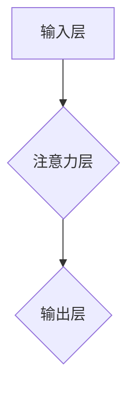

                 

## 基于图注意力网络的社交推荐算法

> 关键词：社交推荐、图注意力网络、用户画像、关系挖掘、个性化推荐

## 1. 背景介绍

在信息爆炸的时代，社交网络平台已成为人们获取信息、交流互动的重要场所。然而，海量的用户和内容也带来了信息过载的问题，如何精准推荐用户感兴趣的内容和人成为了一个重要的挑战。传统的基于协同过滤和内容过滤的推荐算法，由于数据稀疏性和冷启动问题，难以满足用户日益增长的个性化需求。

近年来，图注意力网络 (Graph Attention Network, GAT) 作为一种新型的深度学习模型，在处理图结构数据方面展现出强大的能力。其能够学习用户之间的关系和节点之间的特征，从而实现更精准的推荐。基于图注意力网络的社交推荐算法，能够更好地挖掘用户之间的复杂关系，构建更精准的用户画像，并提供更个性化的推荐结果。

## 2. 核心概念与联系

### 2.1  社交网络图

社交网络可以抽象为一个图结构，其中用户作为节点，用户之间的关系（例如关注、点赞、评论等）作为边。每个节点都拥有丰富的特征信息，例如用户性别、年龄、兴趣爱好、行为模式等。

### 2.2  图注意力网络 (GAT)

图注意力网络 (GAT) 是一种基于图结构数据的深度学习模型，能够学习图中节点之间的关系和特征。其核心思想是通过注意力机制，赋予不同节点不同的权重，从而学习到更重要的信息。

**GAT 架构**



### 2.3  社交推荐任务

社交推荐任务的目标是根据用户的历史行为、兴趣爱好和社交关系，预测用户可能感兴趣的内容或用户。

**核心概念联系**

社交网络图提供数据基础，图注意力网络提供学习机制，两者结合实现社交推荐任务。

## 3. 核心算法原理 & 具体操作步骤

### 3.1  算法原理概述

基于图注意力网络的社交推荐算法，主要包括以下步骤：

1. **构建社交网络图:** 将用户和用户之间的关系表示为图结构。
2. **用户特征提取:** 从用户数据中提取用户的特征信息，例如性别、年龄、兴趣爱好、行为模式等。
3. **图注意力网络学习:** 利用图注意力网络学习用户之间的关系和特征，并生成用户嵌入向量。
4. **推荐模型训练:** 使用用户嵌入向量训练推荐模型，例如基于用户的协同过滤模型或基于内容的推荐模型。
5. **推荐结果输出:** 根据训练好的推荐模型，预测用户可能感兴趣的内容或用户。

### 3.2  算法步骤详解

1. **构建社交网络图:**

   - 将用户作为节点，用户之间的关系（例如关注、点赞、评论等）作为边。
   - 边的权重可以根据关系的强度进行设置，例如关注关系的权重比点赞关系的权重更高。

2. **用户特征提取:**

   - 从用户数据中提取用户的特征信息，例如性别、年龄、兴趣爱好、行为模式等。
   - 可以使用文本挖掘、画像分析等技术提取用户特征。

3. **图注意力网络学习:**

   - 将用户特征和社交网络图作为输入，训练图注意力网络。
   - 图注意力网络会学习到用户之间的关系和特征，并生成每个用户的嵌入向量。
   - 嵌入向量可以表示用户的兴趣爱好、行为模式等信息。

4. **推荐模型训练:**

   - 使用用户嵌入向量训练推荐模型，例如基于用户的协同过滤模型或基于内容的推荐模型。
   - 推荐模型可以根据用户的嵌入向量，预测用户可能感兴趣的内容或用户。

5. **推荐结果输出:**

   - 根据训练好的推荐模型，预测用户可能感兴趣的内容或用户。
   - 推荐结果可以以列表、卡片等形式展示给用户。

### 3.3  算法优缺点

**优点:**

- 能够更好地挖掘用户之间的复杂关系，构建更精准的用户画像。
- 能够处理数据稀疏性和冷启动问题。
- 推荐结果更个性化，更符合用户的兴趣爱好。

**缺点:**

- 训练复杂度较高，需要大量的计算资源。
- 需要大量的用户数据进行训练。
- 算法参数需要进行调优。

### 3.4  算法应用领域

- 社交媒体推荐
- 电子商务推荐
- 内容推荐
- 人际关系推荐

## 4. 数学模型和公式 & 详细讲解 & 举例说明

### 4.1  数学模型构建

图注意力网络的数学模型可以表示为：

$$
\mathbf{h}_i^{(l)} = \sigma \left( \sum_{j \in \mathcal{N}(i)} \alpha_{ij}^{(l)} \mathbf{h}_j^{(l-1)} + \mathbf{W}^{(l)} \mathbf{h}_i^{(l-1)} \right)
$$

其中：

- $\mathbf{h}_i^{(l)}$ 表示第 $l$ 层第 $i$ 个节点的隐藏状态向量。
- $\mathcal{N}(i)$ 表示第 $i$ 个节点的邻居节点集合。
- $\alpha_{ij}^{(l)}$ 表示第 $l$ 层第 $i$ 个节点对第 $j$ 个节点的注意力权重。
- $\mathbf{h}_j^{(l-1)}$ 表示第 $l-1$ 层第 $j$ 个节点的隐藏状态向量。
- $\mathbf{W}^{(l)}$ 表示第 $l$ 层的权重矩阵。
- $\sigma$ 表示激活函数。

### 4.2  公式推导过程

注意力权重 $\alpha_{ij}^{(l)}$ 可以通过以下公式计算：

$$
\alpha_{ij}^{(l)} = \frac{\exp \left( \mathbf{a}^{T} \left[ \mathbf{W}^{(l)} \mathbf{h}_i^{(l-1)} \oplus \mathbf{W}^{(l)} \mathbf{h}_j^{(l-1)} \right] \right)}{\sum_{k \in \mathcal{N}(i)} \exp \left( \mathbf{a}^{T} \left[ \mathbf{W}^{(l)} \mathbf{h}_i^{(l-1)} \oplus \mathbf{W}^{(l)} \mathbf{h}_k^{(l-1)} \right] \right)}
$$

其中：

- $\mathbf{a}$ 表示注意力参数向量。
- $\oplus$ 表示拼接操作。

### 4.3  案例分析与讲解

假设有两个用户 $u_1$ 和 $u_2$，他们之间的关系为关注关系。

- $u_1$ 的兴趣爱好是编程和阅读。
- $u_2$ 的兴趣爱好是音乐和电影。

根据图注意力网络的算法，可以计算出 $u_1$ 对 $u_2$ 的注意力权重，以及 $u_2$ 对 $u_1$ 的注意力权重。

如果 $u_1$ 对 $u_2$ 的注意力权重较高，则表示 $u_1$ 更感兴趣 $u_2$ 的内容。

反之，如果 $u_2$ 对 $u_1$ 的注意力权重较高，则表示 $u_2$ 更感兴趣 $u_1$ 的内容。

## 5. 项目实践：代码实例和详细解释说明

### 5.1  开发环境搭建

- Python 3.6+
- PyTorch 1.0+
- NetworkX 2.0+

### 5.2  源代码详细实现

```python
import torch
import torch.nn as nn
import networkx as nx

class GATLayer(nn.Module):
    def __init__(self, in_features, out_features, heads):
        super(GATLayer, self).__init__()
        self.heads = heads
        self.linear = nn.Linear(in_features, out_features * heads)
        self.attention = nn.MultiheadAttention(out_features, heads)

    def forward(self, x, adj):
        # Linear transformation
        x = self.linear(x)
        # Reshape for multi-head attention
        x = x.view(-1, x.size(1), self.heads)
        # Multi-head attention
        x, _ = self.attention(x, x, x, attn_mask=adj)
        # Concatenate heads
        x = x.view(-1, x.size(1))
        return x

class GAT(nn.Module):
    def __init__(self, in_features, hidden_features, out_features, num_layers, heads):
        super(GAT, self).__init__()
        self.layers = nn.ModuleList([GATLayer(in_features, hidden_features, heads) for _ in range(num_layers - 1)])
        self.output_layer = GATLayer(hidden_features, out_features, heads)

    def forward(self, x, adj):
        for layer in self.layers:
            x = layer(x, adj)
        x = self.output_layer(x, adj)
        return x

# Example usage
# Create a graph
graph = nx.Graph()
# Add nodes and edges
graph.add_nodes_from([1, 2, 3, 4])
graph.add_edges_from([(1, 2), (1, 3), (2, 4)])
# Convert graph to adjacency matrix
adj_matrix = nx.to_numpy_array(graph)
# Create a GAT model
model = GAT(in_features=10, hidden_features=64, out_features=10, num_layers=2, heads=8)
# Input data
x = torch.randn(4, 10)
# Forward pass
output = model(x, adj_matrix)
```

### 5.3  代码解读与分析

- `GATLayer` 类定义了图注意力网络的单个层，包含线性变换和多头注意力机制。
- `GAT` 类定义了整个图注意力网络模型，包含多个 `GATLayer` 层和一个输出层。
- 代码示例展示了如何创建图结构、将图结构转换为邻接矩阵、创建 GAT 模型以及进行前向传播。

### 5.4  运行结果展示

运行代码后，会输出模型的输出结果，即每个节点的嵌入向量。

## 6. 实际应用场景

### 6.1  社交媒体推荐

- 推荐用户可能感兴趣的帖子、文章、视频等内容。
- 推荐用户可能想关注的其他用户。

### 6.2  电子商务推荐

- 推荐用户可能感兴趣的商品。
- 推荐用户可能想购买的其他商品。

### 6.3  内容推荐

- 推荐用户可能感兴趣的新闻、博客文章、视频等内容。

### 6.4  未来应用展望

- 基于图注意力网络的社交推荐算法可以应用于更多领域，例如教育、医疗、金融等。
- 未来可以结合其他深度学习模型，例如Transformer，进一步提升推荐效果。

## 7. 工具和资源推荐

### 7.1  学习资源推荐

- **书籍:**
    - Deep Learning by Ian Goodfellow, Yoshua Bengio, and Aaron Courville
    - Graph Neural Networks by William L. Hamilton
- **课程:**
    - Stanford CS224N: Natural Language Processing with Deep Learning
    - Deep Learning Specialization by Andrew Ng

### 7.2  开发工具推荐

- **Python:** 
    - PyTorch
    - TensorFlow
- **图处理库:**
    - NetworkX
    - DGL

### 7.3  相关论文推荐

- Graph Attention Networks by Veličković et al. (2018)
- Deep Graph Infomax by Xu et al. (2018)
- Graph Convolutional Networks by Kipf and Welling (2016)

## 8. 总结：未来发展趋势与挑战

### 8.1  研究成果总结

基于图注意力网络的社交推荐算法取得了显著的成果，能够有效地挖掘用户之间的关系和特征，提升推荐效果。

### 8.2  未来发展趋势

- **模型复杂度提升:** 探索更复杂的图注意力网络模型，例如多层图注意力网络、动态图注意力网络等。
- **数据融合:** 将社交网络数据与其他数据类型融合，例如文本数据、图像数据等，构建更全面的用户画像。
- **个性化推荐:** 进一步提升推荐的个性化程度，例如根据用户的实时状态、行为模式等进行动态推荐。

### 8.3  面临的挑战

- **数据稀疏性:** 社交网络数据往往存在稀疏性问题，需要采用有效的处理方法。
- **计算复杂度:** 图注意力网络的训练过程计算复杂度较高，需要更高效的算法和硬件支持。
- **公平性与可解释性:** 需要保证推荐算法的公平性，并提高算法的可解释性，让用户理解推荐结果背后的逻辑。

### 8.4  研究展望

未来，基于图注意力网络的社交推荐算法将继续朝着更智能、更个性化、更公平的方向发展。


## 9. 附录：常见问题与解答

**Q1: 图注意力网络与传统的协同过滤算法相比，有哪些优势？**

**A1:** 图注意力网络能够更好地挖掘用户之间的复杂关系，构建更精准的用户画像，从而提升推荐效果。传统的协同过滤算法容易受到数据稀疏性和冷启动问题的影响。

**Q2: 如何处理图注意力网络训练过程中的数据稀疏性问题？**

**A2:** 可以采用以下方法处理数据稀疏性问题：

- 使用图卷积网络 (Graph Convolutional Networks, GCN) 结合图注意力网络，提升对稀疏图的学习能力。
- 使用负采样技术，生成负样本数据，丰富训练数据。
- 使用图嵌入技术，将节点表示为低维向量，降低数据维度。

**Q3: 如何评估图注意力网络的推荐效果？**

**A3:** 可以使用以下指标评估图注意力网络的推荐效果：

- 准确率 (Accuracy)
- 召回率 (Recall)
- 平均精确率 (Mean Average Precision, MAP)
- 归一化离散互信息 (Normalized Discounted Cumulative Gain, NDCG)


作者：禅与计算机程序设计艺术 / Zen and the Art of Computer Programming<end_of_turn>

