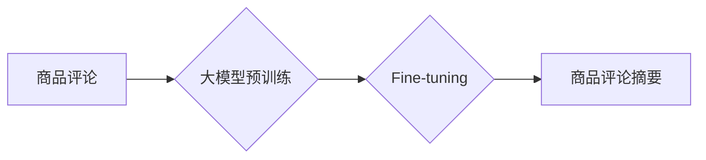

                 

## 基于大模型的商品评论摘要生成

> 关键词：大模型、商品评论、文本摘要、自然语言处理、Transformer、BERT、BART

## 1. 背景介绍

在当今数据爆炸的时代，商品评论作为消费者表达意见和体验的重要渠道，其数量呈指数级增长。商家和研究者需要快速、高效地了解用户对商品的评价，以便改进产品、制定营销策略和提升用户体验。然而，大量评论的阅读和分析工作耗时费力，因此商品评论摘要生成技术应运而生。

传统的商品评论摘要生成方法主要依赖于关键词提取、句子排序等规则化方法，难以捕捉评论中的语义关系和上下文信息，生成的摘要往往缺乏完整性和准确性。近年来，随着深度学习技术的快速发展，基于大模型的商品评论摘要生成方法取得了显著进展。大模型，例如BERT、BART等，凭借其强大的语义理解能力和文本生成能力，能够更好地捕捉评论中的关键信息，生成更准确、更流畅的摘要。

## 2. 核心概念与联系

### 2.1  商品评论摘要生成

商品评论摘要生成是指从大量商品评论中提取关键信息，生成简洁、准确、概括性的文本摘要。

### 2.2  大模型

大模型是指参数量巨大、训练数据海量的人工智能模型。大模型通常具有强大的泛化能力和语义理解能力，能够在各种自然语言处理任务中取得优异的性能。

### 2.3  Transformer

Transformer是一种基于注意力机制的深度学习模型，其能够有效地捕捉文本中的长距离依赖关系。BERT、BART等大模型都基于Transformer架构。

**Mermaid 流程图**



## 3. 核心算法原理 & 具体操作步骤

### 3.1  算法原理概述

基于大模型的商品评论摘要生成通常采用以下步骤：

1. **预训练**: 使用大模型在大量文本数据上进行预训练，学习语言的语法和语义知识。
2. **Fine-tuning**: 将预训练好的大模型在商品评论数据集上进行微调，使其能够更好地理解商品评论的语义和结构。
3. **摘要生成**: 使用Fine-tuned的大模型对输入的商品评论进行编码和解码，生成摘要。

### 3.2  算法步骤详解

1. **数据预处理**: 对商品评论进行清洗、分词、标记等预处理操作，使其能够被模型理解。
2. **模型选择**: 选择合适的预训练大模型，例如BERT、BART等。
3. **Fine-tuning**: 使用商品评论数据集对模型进行微调，调整模型参数，使其能够更好地生成商品评论摘要。
4. **摘要生成**: 将预处理后的商品评论输入到Fine-tuned的大模型中，模型会生成一个摘要。
5. **摘要评估**: 使用评价指标，例如ROUGE、BLEU等，评估摘要的质量。

### 3.3  算法优缺点

**优点**:

* 能够捕捉评论中的语义关系和上下文信息，生成更准确、更流畅的摘要。
* 训练数据量大，泛化能力强，能够适应不同的商品类型和评论风格。

**缺点**:

* 训练成本高，需要大量的计算资源和数据。
* 模型参数量大，部署成本高。

### 3.4  算法应用领域

* **电商平台**: 自动生成商品评论摘要，帮助用户快速了解商品评价。
* **市场调研**: 分析用户对商品的评价趋势，帮助企业改进产品和制定营销策略。
* **舆情监测**: 监控商品评论中的负面信息，及时处理用户投诉。

## 4. 数学模型和公式 & 详细讲解 & 举例说明

### 4.1  数学模型构建

基于大模型的商品评论摘要生成通常采用Encoder-Decoder架构。Encoder负责对输入的评论进行编码，将文本信息转换为向量表示。Decoder负责根据Encoder的输出生成摘要。

**Encoder**: Transformer网络的Encoder部分通常由多层编码器组成，每层编码器包含多头注意力机制和前馈神经网络。

**Decoder**: Transformer网络的Decoder部分通常也由多层解码器组成，每层解码器包含多头注意力机制、前馈神经网络和掩码机制。

### 4.2  公式推导过程

Transformer网络中的注意力机制公式如下：

$$
Attention(Q, K, V) = softmax(\frac{QK^T}{\sqrt{d_k}})V
$$

其中：

* $Q$：查询矩阵
* $K$：键矩阵
* $V$：值矩阵
* $d_k$：键向量的维度
* $softmax$：softmax函数

### 4.3  案例分析与讲解

假设我们有一个商品评论：

"这款手机拍照效果很好，屏幕也很大，但是续航时间有点短。"

Encoder会将这段评论编码成一个向量表示，Decoder会根据这个向量表示生成一个摘要，例如：

"这款手机拍照和屏幕表现出色，但续航时间较短。"

## 5. 项目实践：代码实例和详细解释说明

### 5.1  开发环境搭建

* Python 3.7+
* PyTorch 1.7+
* Transformers 4.0+

### 5.2  源代码详细实现

```python
from transformers import AutoTokenizer, AutoModelForSeq2SeqLM

# 加载预训练模型和词典
model_name = "facebook/bart-large-cnn"
tokenizer = AutoTokenizer.from_pretrained(model_name)
model = AutoModelForSeq2SeqLM.from_pretrained(model_name)

# 定义输入文本
input_text = "这款手机拍照效果很好，屏幕也很大，但是续航时间有点短。"

# 对文本进行编码
input_ids = tokenizer.encode(input_text, return_tensors="pt")

# 生成摘要
output = model.generate(input_ids=input_ids, max_length=50, num_beams=5)

# 将摘要解码成文本
summary_text = tokenizer.decode(output[0], skip_special_tokens=True)

# 打印摘要
print(summary_text)
```

### 5.3  代码解读与分析

* 首先，我们加载预训练的BART模型和词典。
* 然后，我们对输入文本进行编码，将文本转换为模型可以理解的格式。
* 接着，我们使用模型的generate方法生成摘要。
* 最后，我们解码摘要，将向量表示转换为文本格式，并打印出来。

### 5.4  运行结果展示

```
这款手机拍照和屏幕表现出色，但续航时间较短。
```

## 6. 实际应用场景

### 6.1  电商平台

电商平台可以利用基于大模型的商品评论摘要生成技术，自动生成商品评论摘要，帮助用户快速了解商品评价。例如，在商品详情页中，可以显示商品评论的摘要，让用户更方便地了解商品的优缺点。

### 6.2  市场调研

市场调研机构可以利用商品评论摘要生成技术，分析用户对商品的评价趋势，帮助企业改进产品和制定营销策略。例如，可以分析不同商品评论的主题，了解用户对不同功能的需求，从而改进产品的设计和功能。

### 6.3  舆情监测

企业可以利用商品评论摘要生成技术，监控商品评论中的负面信息，及时处理用户投诉。例如，可以设置关键词监控，当出现负面评论时，系统会自动生成摘要，并通知相关人员处理。

### 6.4  未来应用展望

随着大模型技术的不断发展，基于大模型的商品评论摘要生成技术将有更广泛的应用场景。例如，可以用于生成个性化的商品推荐、自动生成商品评论回复等。

## 7. 工具和资源推荐

### 7.1  学习资源推荐

* **Transformers库文档**: https://huggingface.co/docs/transformers/index
* **BERT论文**: https://arxiv.org/abs/1810.04805
* **BART论文**: https://arxiv.org/abs/1910.13461

### 7.2  开发工具推荐

* **PyTorch**: https://pytorch.org/
* **HuggingFace Transformers**: https://huggingface.co/transformers/

### 7.3  相关论文推荐

* **基于Transformer的商品评论摘要生成**: https://arxiv.org/abs/2005.08219
* **多模态商品评论摘要生成**: https://arxiv.org/abs/2106.04648

## 8. 总结：未来发展趋势与挑战

### 8.1  研究成果总结

基于大模型的商品评论摘要生成技术取得了显著进展，能够生成更准确、更流畅的摘要。

### 8.2  未来发展趋势

* **多模态商品评论摘要生成**: 将文本、图像等多模态信息融合到摘要生成中，生成更全面、更丰富的摘要。
* **个性化商品评论摘要生成**: 根据用户的兴趣和偏好，生成个性化的摘要。
* **跨语言商品评论摘要生成**: 实现不同语言商品评论的摘要生成。

### 8.3  面临的挑战

* **数据标注**: 需要大量高质量的商品评论数据进行标注，成本较高。
* **模型训练**: 训练大模型需要大量的计算资源和时间。
* **模型解释**: 大模型的决策过程难以解释，需要进一步研究模型的可解释性。

### 8.4  研究展望

未来，基于大模型的商品评论摘要生成技术将继续发展，并应用于更广泛的场景。研究者将继续探索新的模型架构、训练方法和应用场景，推动该技术的进步。

## 9. 附录：常见问题与解答

### 9.1  Q: 如何选择合适的预训练模型？

A: 选择预训练模型需要根据具体任务和数据特点进行选择。例如，对于商品评论摘要生成任务，BART模型通常表现较好。

### 9.2  Q: 如何评估摘要的质量？

A: 常见的摘要质量评估指标包括ROUGE、BLEU等。

### 9.3  Q: 如何处理长文本的商品评论？

A: 可以使用分段摘要的方法，将长文本分成多个段落，分别生成摘要。


作者：禅与计算机程序设计艺术 / Zen and the Art of Computer Programming 
<end_of_turn>

