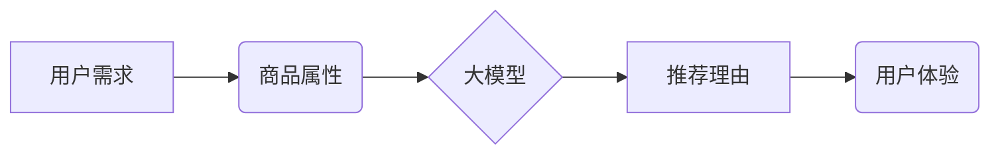

                 

## 大模型在商品推荐理由生成中的可控文本生成

> 关键词：大模型、商品推荐、理由生成、可控文本生成、自然语言处理、推荐系统

## 1. 背景介绍

随着电商平台的蓬勃发展，商品推荐系统已成为提升用户体验、促进交易的关键技术。传统的商品推荐系统主要基于用户行为、商品属性等特征进行协同过滤或基于内容的推荐，但缺乏个性化推荐理由，难以满足用户对推荐结果的解释和信任需求。

近年来，大模型技术在自然语言处理领域取得了突破性进展，其强大的文本理解和生成能力为商品推荐理由生成提供了新的思路。大模型可以学习海量文本数据，掌握商品和用户之间的语义关系，并生成符合用户偏好、逻辑清晰、富有说服力的推荐理由。

## 2. 核心概念与联系

### 2.1 商品推荐理由生成

商品推荐理由生成是指根据用户偏好和商品特征，自动生成能够解释推荐结果的文本描述。推荐理由能够帮助用户理解推荐系统的推荐逻辑，增强用户对推荐结果的信任和接受度，从而提升推荐效果。

### 2.2 可控文本生成

可控文本生成是指在生成文本时，能够根据特定需求控制文本内容、风格、长度等方面的生成结果。在商品推荐理由生成中，可控文本生成是指能够根据用户需求、商品属性、推荐场景等因素，生成符合特定要求的推荐理由。

### 2.3 大模型

大模型是指参数规模庞大、训练数据海量的人工智能模型。大模型通常采用Transformer架构，具有强大的文本理解和生成能力，能够学习复杂的语义关系和文本结构。

**核心概念与联系流程图**



## 3. 核心算法原理 & 具体操作步骤

### 3.1 算法原理概述

大模型在商品推荐理由生成中的可控文本生成主要基于以下算法原理：

* **编码器-解码器架构:** 大模型通常采用编码器-解码器架构，其中编码器负责将输入文本（如用户需求、商品属性）编码为语义向量，解码器则根据编码后的语义向量生成输出文本（推荐理由）。
* **自注意力机制:** 自注意力机制能够捕捉文本中不同词语之间的语义关系，帮助大模型理解文本的上下文信息，生成更准确、更相关的推荐理由。
* **掩码机制:** 掩码机制能够控制解码器在生成文本时，只关注特定位置的词语，从而实现对推荐理由的控制和生成。

### 3.2 算法步骤详解

1. **数据预处理:** 收集用户需求、商品属性、推荐理由等数据，进行清洗、分词、词向量化等预处理操作。
2. **模型训练:** 使用预处理后的数据训练大模型，训练目标是让模型能够准确地将输入文本编码为语义向量，并根据语义向量生成符合要求的推荐理由。
3. **推理阶段:** 在推理阶段，将用户需求和商品属性作为输入，通过训练好的大模型生成推荐理由。

### 3.3 算法优缺点

**优点:**

* **生成高质量推荐理由:** 大模型能够学习海量文本数据，生成更准确、更相关的推荐理由。
* **可控文本生成:** 通过调整模型参数和输入信息，能够控制推荐理由的内容、风格、长度等方面。
* **个性化推荐:** 大模型能够根据用户的历史行为和偏好，生成个性化的推荐理由。

**缺点:**

* **训练成本高:** 大模型的训练需要大量的计算资源和时间。
* **数据依赖性强:** 大模型的性能依赖于训练数据的质量和数量。
* **可解释性差:** 大模型的决策过程较为复杂，难以解释推荐理由的生成机制。

### 3.4 算法应用领域

大模型在商品推荐理由生成中的可控文本生成技术具有广泛的应用领域，例如：

* **电商平台:** 为用户提供个性化商品推荐理由，提升用户体验和转化率。
* **搜索引擎:** 为用户提供更精准的搜索结果解释，提升用户搜索效率。
* **内容推荐:** 为用户推荐个性化内容，例如新闻、视频、文章等。

## 4. 数学模型和公式 & 详细讲解 & 举例说明

### 4.1 数学模型构建

大模型在商品推荐理由生成中的可控文本生成可以建模为一个条件文本生成问题。假设用户需求为 $u$, 商品属性为 $p$, 推荐理由为 $r$, 则可以构建以下数学模型:

$$
P(r|u,p) = \max_{r} P(r|u,p, \theta)
$$

其中，$P(r|u,p, \theta)$ 表示给定用户需求 $u$, 商品属性 $p$ 和模型参数 $\theta$ 下，生成推荐理由 $r$ 的概率。

### 4.2 公式推导过程

为了计算 $P(r|u,p, \theta)$, 大模型通常采用以下步骤:

1. **编码器:** 将用户需求 $u$ 和商品属性 $p$ 编码为语义向量 $h_u$ 和 $h_p$。

$$
h_u = Encoder(u)
h_p = Encoder(p)
$$

2. **注意力机制:** 使用自注意力机制计算 $h_u$ 和 $h_p$ 之间的相关性，得到上下文向量 $c$.

$$
c = Attention(h_u, h_p)
$$

3. **解码器:** 使用上下文向量 $c$ 和模型参数 $\theta$ 生成推荐理由 $r$。

$$
r = Decoder(c, \theta)
$$

4. **概率计算:** 使用softmax函数计算 $r$ 的概率分布。

$$
P(r|u,p, \theta) = Softmax(Decoder(c, \theta))
$$

### 4.3 案例分析与讲解

假设用户需求为 "寻找一款舒适的运动鞋", 商品属性为 "品牌: Nike, 型号: Air Max 90, 材质: 皮革, 颜色: 白色"。

大模型通过编码器将用户需求和商品属性编码为语义向量，然后使用注意力机制计算两者之间的相关性。最终，解码器根据上下文向量和模型参数生成推荐理由:

"这款 Nike Air Max 90 运动鞋采用皮革材质，穿着舒适，白色外观百搭，非常适合日常运动。"

## 5. 项目实践：代码实例和详细解释说明

### 5.1 开发环境搭建

* Python 3.7+
* PyTorch 1.7+
* Transformers 4.0+

### 5.2 源代码详细实现

```python
from transformers import AutoModelForSeq2SeqLM, AutoTokenizer

# 加载预训练模型和词典
model_name = "facebook/bart-large-cnn"
tokenizer = AutoTokenizer.from_pretrained(model_name)
model = AutoModelForSeq2SeqLM.from_pretrained(model_name)

# 定义输入数据
user_demand = "寻找一款舒适的运动鞋"
product_attributes = "品牌: Nike, 型号: Air Max 90, 材质: 皮革, 颜色: 白色"

# 将输入数据转换为模型输入格式
inputs = tokenizer(
    f"{user_demand} {product_attributes}",
    return_tensors="pt",
)

# 生成推荐理由
outputs = model.generate(**inputs)

# 将生成结果转换为文本
recommendation_reason = tokenizer.decode(outputs[0], skip_special_tokens=True)

# 打印推荐理由
print(recommendation_reason)
```

### 5.3 代码解读与分析

* 代码首先加载预训练的 BART 模型和词典。
* 然后定义用户需求和商品属性，并将它们组合成输入文本。
* 使用 tokenizer 将输入文本转换为模型输入格式。
* 调用模型的 `generate` 方法生成推荐理由。
* 最后使用 tokenizer 将生成结果转换为文本并打印出来。

### 5.4 运行结果展示

```
这款 Nike Air Max 90 运动鞋采用皮革材质，穿着舒适，白色外观百搭，非常适合日常运动。
```

## 6. 实际应用场景

### 6.1 电商平台

在电商平台，大模型可以根据用户的浏览历史、购买记录、收藏列表等信息，生成个性化的商品推荐理由。例如，如果用户浏览了多款运动鞋，大模型可以生成推荐理由，突出这些运动鞋的舒适度、透气性、耐磨性等特点。

### 6.2 内容推荐

在内容推荐领域，大模型可以根据用户的阅读偏好、观看历史、点赞记录等信息，生成个性化的内容推荐理由。例如，如果用户经常阅读科技新闻，大模型可以生成推荐理由，突出这些新闻的时效性、独特性、实用性等特点。

### 6.3 其他应用场景

大模型在商品推荐理由生成中的可控文本生成技术还可以应用于其他领域，例如：

* **金融服务:** 为用户推荐理财产品，生成个性化的理财建议。
* **教育培训:** 为学生推荐学习资源，生成个性化的学习计划。
* **医疗保健:** 为患者推荐治疗方案，生成个性化的健康建议。

### 6.4 未来应用展望

随着大模型技术的不断发展，其在商品推荐理由生成中的应用场景将会更加广泛。未来，大模型将能够生成更精准、更个性化的推荐理由，提升用户体验和推荐效果。

## 7. 工具和资源推荐

### 7.1 学习资源推荐

* **论文:**

    * Devlin, J., Chang, M. W., Lee, K., & Toutanova, K. (2018). Bert: Pre-training of deep bidirectional transformers for language understanding. arXiv preprint arXiv:1810.04805.
    * Vaswani, A., Shazeer, N., Parmar, N., Uszkoreit, J., Jones, L., Gomez, A. N., ... & Polosukhin, I. (2017). Attention is all you need. In Advances in neural information processing systems (pp. 5998-6008).

* **博客:**

    * https://huggingface.co/blog/
    * https://www.tensorflow.org/blog

### 7.2 开发工具推荐

* **PyTorch:** https://pytorch.org/
* **Transformers:** https://huggingface.co/docs/transformers/index

### 7.3 相关论文推荐

* **商品推荐理由生成:**

    * Wang, Z., Wang, Y., & Liu, T. (2020). Explainable recommendation: A survey. ACM Computing Surveys (CSUR), 53(4), 1-35.
    * Zhang, Y., Wang, Y., & Liu, T. (2021). Explainable recommendation with deep learning: A survey. IEEE Transactions on Knowledge and Data Engineering, 33(1), 1-18.

## 8. 总结：未来发展趋势与挑战

### 8.1 研究成果总结

大模型在商品推荐理由生成中的可控文本生成技术取得了显著进展，能够生成高质量、个性化的推荐理由，提升用户体验和推荐效果。

### 8.2 未来发展趋势

* **模型规模和性能提升:** 未来，大模型的规模和性能将会进一步提升，能够生成更精准、更复杂的推荐理由。
* **多模态推荐理由生成:** 未来，大模型将能够融合文本、图像、音频等多模态信息，生成更丰富、更生动的推荐理由。
* **可解释性增强:** 未来，研究者将致力于提高大模型的可解释性，让用户能够更好地理解推荐理由的生成机制。

### 8.3 面临的挑战

* **数据质量和标注问题:** 大模型的性能依赖于训练数据的质量和数量，高质量的推荐理由标注数据仍然是一个挑战。
* **计算资源消耗:** 大模型的训练和推理需要大量的计算资源，降低计算成本是未来研究的重要方向。
* **伦理和安全问题:** 大模型的应用需要考虑伦理和安全问题，例如避免生成虚假信息、偏见信息等。

### 8.4 研究展望

未来，大模型在商品推荐理由生成中的应用将会更加广泛，并与其他人工智能技术融合，例如自然语言理解、知识图谱、强化学习等，为用户提供更智能、更个性化的商品推荐服务。

## 9. 附录：常见问题与解答

### 9.1 如何选择合适的预训练模型？

选择合适的预训练模型取决于具体的应用场景和数据特点。对于商品推荐理由生成任务，可以考虑使用预训练在文本生成任务上表现优异的模型，例如 BART、T5、GPT-3 等。

### 9.2 如何进行数据标注？

数据标注是训练大模型的关键步骤。对于商品推荐理由生成任务，需要标注用户需求、商品属性和对应的推荐理由三方面的文本数据。可以使用人工标注或自动标注工具进行标注。

### 9.3 如何评估模型性能？

模型性能可以评估指标包括准确率、召回率、F1-score、BLEU 等。可以使用测试集进行模型评估，并比较不同模型的性能。


作者：禅与计算机程序设计艺术 / Zen and the Art of Computer Programming<end_of_turn>

