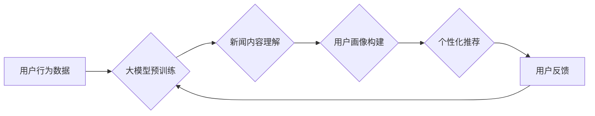

                 

## 大模型在新闻推荐中的应用

> 关键词：大模型、新闻推荐、深度学习、Transformer、BERT、用户画像、内容理解、个性化推荐

## 1. 背景介绍

新闻信息爆炸时代，海量新闻资讯涌现，用户难以从其中筛选出真正感兴趣的内容。新闻推荐系统应运而生，旨在根据用户的兴趣偏好和阅读历史，智能推荐相关新闻，提升用户阅读体验。传统新闻推荐系统主要依赖于基于内容的推荐、基于协同过滤的推荐和基于用户的行为数据分析等方法，但这些方法在面对海量数据和复杂用户需求时，存在一定的局限性。

近年来，深度学习技术取得了长足发展，特别是大模型的出现，为新闻推荐领域带来了新的机遇。大模型，是指参数规模庞大、训练数据海量、具备强大的泛化能力的深度学习模型。其强大的语义理解和文本生成能力，能够更精准地理解用户需求和新闻内容，从而实现更个性化、更精准的新闻推荐。

## 2. 核心概念与联系

### 2.1  新闻推荐系统

新闻推荐系统旨在根据用户的兴趣偏好和阅读历史，智能推荐相关新闻，提升用户阅读体验。

### 2.2  大模型

大模型是指参数规模庞大、训练数据海量、具备强大的泛化能力的深度学习模型。其强大的语义理解和文本生成能力，能够更精准地理解用户需求和新闻内容，从而实现更个性化、更精准的新闻推荐。

### 2.3  Transformer模型

Transformer模型是一种新型的深度学习架构，其核心是自注意力机制，能够有效捕捉文本序列中的长距离依赖关系。BERT、GPT等大模型都基于Transformer架构。

**Mermaid 流程图**



## 3. 核心算法原理 & 具体操作步骤

### 3.1  算法原理概述

大模型在新闻推荐中的应用主要基于以下核心算法原理：

* **预训练语言模型:** 大模型通过预训练语言模型，例如BERT，学习了丰富的语言知识和语义理解能力。
* **用户画像构建:** 利用用户的行为数据，如阅读历史、点赞、评论等，构建用户的兴趣偏好和阅读习惯画像。
* **内容理解:** 利用预训练语言模型对新闻内容进行理解，提取新闻主题、关键词、情感倾向等信息。
* **个性化推荐:** 根据用户的兴趣画像和新闻内容理解结果，利用推荐算法，例如基于用户的协同过滤、基于内容的推荐等，生成个性化的新闻推荐列表。

### 3.2  算法步骤详解

1. **数据收集和预处理:** 收集用户行为数据和新闻内容数据，进行清洗、格式化和特征提取等预处理工作。
2. **大模型预训练:** 利用公开的预训练语言模型，例如BERT，对新闻内容和用户行为数据进行预训练，学习语言知识和语义理解能力。
3. **用户画像构建:** 利用用户的行为数据，构建用户的兴趣偏好和阅读习惯画像，例如用户的阅读主题、喜欢的新闻类型、阅读时间段等。
4. **内容理解:** 利用预训练语言模型对新闻内容进行理解，提取新闻主题、关键词、情感倾向等信息，构建新闻的语义向量表示。
5. **个性化推荐:** 根据用户的兴趣画像和新闻内容理解结果，利用推荐算法，例如基于用户的协同过滤、基于内容的推荐等，生成个性化的新闻推荐列表。
6. **推荐结果评估:** 利用用户点击、阅读、分享等行为数据，评估推荐系统的效果，并根据评估结果进行模型调优和迭代。

### 3.3  算法优缺点

**优点:**

* **精准度高:** 大模型的强大的语义理解能力，能够更精准地理解用户需求和新闻内容，从而实现更精准的新闻推荐。
* **个性化强:** 大模型能够根据用户的兴趣画像，生成个性化的新闻推荐列表，提升用户阅读体验。
* **泛化能力强:** 预训练语言模型的训练数据海量，具备强大的泛化能力，能够适应不同的新闻领域和用户群体。

**缺点:**

* **计算资源需求高:** 大模型的训练和推理需要大量的计算资源，成本较高。
* **数据依赖性强:** 大模型的性能依赖于训练数据的质量和数量，数据不足或数据质量低会影响推荐效果。
* **可解释性差:** 大模型的决策过程较为复杂，难以解释推荐结果背后的逻辑，缺乏透明度。

### 3.4  算法应用领域

大模型在新闻推荐领域的应用不仅限于新闻平台，还可以应用于以下领域:

* **搜索引擎:** 提升搜索结果的精准度和相关性。
* **社交媒体:** 推荐用户感兴趣的内容和话题。
* **电商平台:** 推荐用户感兴趣的商品和服务。
* **教育平台:** 推荐用户感兴趣的学习资源和课程。

## 4. 数学模型和公式 & 详细讲解 & 举例说明

### 4.1  数学模型构建

新闻推荐系统可以构建基于用户的协同过滤模型，例如基于矩阵分解的协同过滤模型。

**用户-新闻交互矩阵:**

用户-新闻交互矩阵是一个稀疏矩阵，其中每个元素表示用户对特定新闻的交互行为，例如点击、阅读、点赞等。

**矩阵分解:**

将用户-新闻交互矩阵分解成两个低维矩阵，分别表示用户特征矩阵和新闻特征矩阵。

**公式:**

$$
R = U \cdot V^T
$$

其中:

* $R$ 是用户-新闻交互矩阵
* $U$ 是用户特征矩阵
* $V^T$ 是新闻特征矩阵的转置

### 4.2  公式推导过程

通过最小化用户-新闻交互矩阵与分解后的矩阵的误差，可以得到用户特征矩阵和新闻特征矩阵。

**损失函数:**

$$
L = \frac{1}{2} \sum_{u,i} (R_{ui} - \hat{R}_{ui})^2
$$

其中:

* $R_{ui}$ 是用户 $u$ 对新闻 $i$ 的真实交互行为
* $\hat{R}_{ui}$ 是用户 $u$ 对新闻 $i$ 的预测交互行为

**优化算法:**

利用梯度下降算法或其他优化算法，最小化损失函数，得到用户特征矩阵和新闻特征矩阵。

### 4.3  案例分析与讲解

假设有一个用户-新闻交互矩阵，其中每个元素表示用户对特定新闻的点击次数。通过矩阵分解，可以得到用户特征矩阵和新闻特征矩阵。

用户特征矩阵可以表示用户的兴趣偏好，例如新闻主题、新闻类型、新闻来源等。新闻特征矩阵可以表示新闻的内容特征，例如新闻主题、关键词、情感倾向等。

通过用户特征矩阵和新闻特征矩阵，可以预测用户对特定新闻的点击次数，从而实现新闻推荐。

## 5. 项目实践：代码实例和详细解释说明

### 5.1  开发环境搭建

* Python 3.6+
* TensorFlow/PyTorch
* Jupyter Notebook

### 5.2  源代码详细实现

```python
# 导入必要的库
import tensorflow as tf

# 定义用户-新闻交互矩阵
R = tf.constant([[1, 0, 1],
                 [0, 1, 0],
                 [1, 1, 1]])

# 定义用户特征矩阵和新闻特征矩阵的维度
num_users = R.shape[0]
num_news = R.shape[1]
latent_dim = 10

# 初始化用户特征矩阵和新闻特征矩阵
U = tf.Variable(tf.random.normal([num_users, latent_dim]))
V = tf.Variable(tf.random.normal([num_news, latent_dim]))

# 定义损失函数
def loss_function(R, U, V):
    predictions = tf.matmul(U, V, transpose_b=True)
    return tf.reduce_mean(tf.square(R - predictions))

# 定义优化器
optimizer = tf.keras.optimizers.Adam()

# 训练模型
for epoch in range(100):
    with tf.GradientTape() as tape:
        loss = loss_function(R, U, V)
    gradients = tape.gradient(loss, [U, V])
    optimizer.apply_gradients(zip(gradients, [U, V]))

# 打印训练结果
print(loss)

# 使用训练好的模型进行预测
predictions = tf.matmul(U, V, transpose_b=True)
print(predictions)
```

### 5.3  代码解读与分析

* 代码首先定义了用户-新闻交互矩阵，以及用户特征矩阵和新闻特征矩阵的维度。
* 然后，代码初始化了用户特征矩阵和新闻特征矩阵。
* 接着，代码定义了损失函数，用于衡量模型预测结果与真实交互行为之间的误差。
* 接下来，代码定义了优化器，用于更新模型参数。
* 最后，代码训练模型，并使用训练好的模型进行预测。

### 5.4  运行结果展示

训练完成后，代码会输出损失函数的值，以及模型预测结果。

## 6. 实际应用场景

### 6.1  新闻平台

新闻平台可以利用大模型构建个性化新闻推荐系统，根据用户的兴趣偏好和阅读历史，推荐用户感兴趣的新闻，提升用户阅读体验和平台粘性。

### 6.2  搜索引擎

搜索引擎可以利用大模型提升搜索结果的精准度和相关性，例如，根据用户的搜索历史和语义理解，推荐更相关的搜索结果。

### 6.3  社交媒体

社交媒体平台可以利用大模型推荐用户感兴趣的内容和话题，例如，根据用户的兴趣爱好和社交关系，推荐相关的文章、视频和讨论。

### 6.4  未来应用展望

大模型在新闻推荐领域的应用前景广阔，未来可能应用于以下领域:

* **多模态新闻推荐:** 结合文本、图像、音频等多模态数据，构建更全面的用户画像和新闻内容理解模型。
* **跨语言新闻推荐:** 实现跨语言的新闻推荐，打破语言障碍，为全球用户提供个性化新闻服务。
* **个性化新闻生成:** 利用大模型生成个性化的新闻内容，满足用户的特定需求。

## 7. 工具和资源推荐

### 7.1  学习资源推荐

* **论文:**
    * BERT: Pre-training of Deep Bidirectional Transformers for Language Understanding
    * Transformer: Attention Is All You Need
* **博客:**
    * The Illustrated Transformer
    * Understanding BERT

### 7.2  开发工具推荐

* **TensorFlow:** 开源深度学习框架
* **PyTorch:** 开源深度学习框架
* **Hugging Face Transformers:** 预训练模型库

### 7.3  相关论文推荐

* **News Recommendation with Deep Learning:** https://arxiv.org/abs/1803.01261
* **Personalized News Recommendation with BERT:** https://arxiv.org/abs/1909.06731

## 8. 总结：未来发展趋势与挑战

### 8.1  研究成果总结

大模型在新闻推荐领域取得了显著的成果，能够实现更精准、更个性化的新闻推荐，提升用户阅读体验。

### 8.2  未来发展趋势

* **多模态新闻推荐:** 结合文本、图像、音频等多模态数据，构建更全面的用户画像和新闻内容理解模型。
* **跨语言新闻推荐:** 实现跨语言的新闻推荐，打破语言障碍，为全球用户提供个性化新闻服务。
* **个性化新闻生成:** 利用大模型生成个性化的新闻内容，满足用户的特定需求。

### 8.3  面临的挑战

* **数据安全和隐私保护:** 大模型训练需要大量用户数据，如何保证数据安全和隐私保护是一个重要挑战。
* **模型可解释性:** 大模型的决策过程较为复杂，难以解释推荐结果背后的逻辑，缺乏透明度。
* **计算资源需求:** 大模型的训练和推理需要大量的计算资源，成本较高。

### 8.4  研究展望

未来，研究者将继续探索大模型在新闻推荐领域的应用，解决上述挑战，构建更智能、更安全、更透明的新闻推荐系统。

## 9. 附录：常见问题与解答

**Q1: 大模型的训练需要多少数据？**

A1: 大模型的训练需要海量数据，通常需要数十亿甚至数百亿个样本。

**Q2: 大模型的训练需要多少计算资源？**

A2: 大模型的训练需要大量的计算资源，通常需要使用高性能计算集群。

**Q3: 如何保证大模型的公平性和避免偏见？**

A3: 

* 使用多样化的训练数据，减少数据偏差。
* 开发公平性评估指标，监测模型的公平性。
* 采用反偏见算法，减少模型的偏见。


作者：禅与计算机程序设计艺术 / Zen and the Art of Computer Programming 
<end_of_turn>

