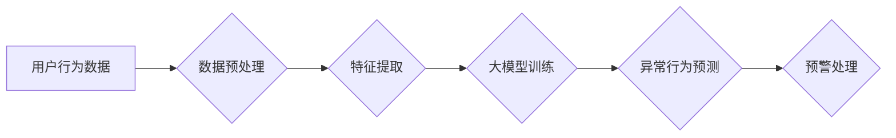

                 

## 大模型在电商平台用户行为异常检测中的应用

> 关键词：大模型、用户行为异常检测、电商平台、深度学习、自然语言处理、推荐系统、安全保障

## 1. 背景介绍

随着电商平台的蓬勃发展，用户数据呈指数级增长，平台面临着日益严峻的安全挑战。用户行为异常检测作为电商平台安全保障的重要组成部分，旨在识别和预防潜在的欺诈行为、恶意攻击和账户盗用等风险。传统基于规则的异常检测方法难以应对复杂多变的用户行为模式，而机器学习和深度学习技术为用户行为异常检测提供了新的思路和方法。

大模型，作为近年来人工智能领域取得的重大突破，凭借其强大的学习能力和泛化能力，在用户行为异常检测领域展现出巨大的潜力。大模型能够从海量用户数据中学习到复杂的特征和模式，并对异常行为进行更精准的识别和预测。

## 2. 核心概念与联系

### 2.1 用户行为异常检测

用户行为异常检测是指通过分析用户在电商平台上的行为数据，识别与正常用户行为模式相悖的异常行为，并对其进行预警和处理。异常行为可以包括但不限于：

* **欺诈行为:**  虚假账户注册、恶意刷单、虚假交易等。
* **恶意攻击:**  DDoS攻击、SQL注入、跨站脚本攻击等。
* **账户盗用:**  密码泄露、账号被盗用、身份盗用等。

### 2.2 大模型

大模型是指参数量巨大、训练数据量庞大的深度学习模型。大模型通常具有以下特点：

* **参数量大:**  大模型通常拥有数十亿甚至数千亿个参数，能够学习到更复杂的特征和模式。
* **训练数据量大:**  大模型的训练需要海量数据，才能充分发挥其学习能力。
* **泛化能力强:**  由于训练数据量大，大模型能够更好地泛化到未知数据，对新的异常行为也具有较强的识别能力。

### 2.3 核心架构

大模型在电商平台用户行为异常检测中的应用，通常采用以下架构：



**数据预处理:** 对用户行为数据进行清洗、转换和格式化，使其适合大模型训练。

**特征提取:** 从用户行为数据中提取关键特征，例如用户购买历史、浏览记录、评论内容等。

**大模型训练:** 使用大模型对提取的特征进行训练，学习用户行为的正常模式和异常模式。

**异常行为预测:** 将新用户行为数据输入训练好的大模型，预测其是否属于异常行为。

**预警处理:** 对预测出的异常行为进行预警和处理，例如锁定账户、冻结资金等。

## 3. 核心算法原理 & 具体操作步骤

### 3.1 算法原理概述

大模型在用户行为异常检测中的应用主要基于以下核心算法：

* **深度神经网络:** 深度神经网络能够学习到用户行为数据的复杂特征和模式，并对异常行为进行识别和预测。常见的深度神经网络架构包括卷积神经网络（CNN）、循环神经网络（RNN）和Transformer。
* **自然语言处理:** 自然语言处理技术可以用于分析用户评论、聊天记录等文本数据，提取用户情感、意图和潜在风险信息。
* **推荐系统:** 推荐系统可以用于分析用户行为数据，预测用户未来的行为，并识别与预测结果不符的异常行为。

### 3.2 算法步骤详解

1. **数据收集:** 收集电商平台用户的行为数据，包括但不限于购买记录、浏览记录、评论内容、聊天记录等。
2. **数据预处理:** 对收集到的数据进行清洗、转换和格式化，例如去除噪声数据、转换数据类型、标准化数据等。
3. **特征提取:** 从预处理后的数据中提取关键特征，例如用户购买频率、平均购买金额、评论情感倾向、聊天内容主题等。
4. **模型训练:** 使用深度神经网络、自然语言处理或推荐系统等算法，对提取的特征进行训练，学习用户行为的正常模式和异常模式。
5. **模型评估:** 使用测试数据对训练好的模型进行评估，评估模型的准确率、召回率、F1-score等指标。
6. **模型部署:** 将训练好的模型部署到电商平台，实时监控用户行为数据，并对异常行为进行预警和处理。

### 3.3 算法优缺点

**优点:**

* **高准确率:** 大模型能够学习到复杂的特征和模式，对异常行为的识别准确率更高。
* **自动化程度高:** 大模型的训练和部署可以自动化，降低人工成本。
* **适应性强:** 大模型能够适应不断变化的用户行为模式。

**缺点:**

* **训练成本高:** 大模型的训练需要大量数据和计算资源，成本较高。
* **解释性差:** 大模型的决策过程较为复杂，难以解释其识别异常行为的依据。
* **数据依赖性强:** 大模型的性能依赖于训练数据的质量和数量。

### 3.4 算法应用领域

大模型在用户行为异常检测领域具有广泛的应用场景，例如：

* **电商平台:** 识别欺诈交易、恶意刷单、账户盗用等异常行为。
* **金融机构:** 识别信用卡欺诈、账户异常登录、资金转移异常等风险行为。
* **社交媒体平台:** 识别垃圾信息、恶意评论、网络暴力等违规行为。
* **医疗机构:** 识别医疗欺诈、医疗数据泄露、医疗设备故障等风险事件。

## 4. 数学模型和公式 & 详细讲解 & 举例说明

### 4.1 数学模型构建

大模型在用户行为异常检测中的应用通常基于以下数学模型：

* **概率模型:** 

例如，可以使用贝叶斯网络或马尔科夫链模型来建模用户行为的概率分布，并识别与正常分布相悖的异常行为。

* **损失函数:** 

例如，可以使用交叉熵损失函数或均方误差损失函数来衡量模型预测结果与真实标签之间的差异，并通过优化损失函数来训练模型。

* **激活函数:** 

例如，可以使用ReLU、Sigmoid或Softmax等激活函数来引入非线性，提高模型的表达能力。

### 4.2 公式推导过程

例如，可以使用贝叶斯定理来推导用户行为异常的概率：

$$P(异常|特征) = \frac{P(特征|异常) * P(异常)}{P(特征)}$$

其中：

* $P(异常|特征)$ 是给定特征条件下用户行为异常的概率。
* $P(特征|异常)$ 是给定用户行为异常条件下特征出现的概率。
* $P(异常)$ 是用户行为异常的先验概率。
* $P(特征)$ 是特征出现的概率。

### 4.3 案例分析与讲解

例如，假设电商平台收集到用户购买历史数据，并发现某些用户购买商品的频率和金额异常高，可以使用贝叶斯定理来计算这些用户的异常概率。

如果我们假设用户购买频率和金额异常高的概率为0.1，并且这些特征在异常用户中出现的概率为0.8，那么我们可以计算出这些用户的异常概率。

## 5. 项目实践：代码实例和详细解释说明

### 5.1 开发环境搭建

* **操作系统:** Ubuntu 20.04 LTS
* **编程语言:** Python 3.8
* **深度学习框架:** TensorFlow 2.0
* **其他工具:** Jupyter Notebook、Git

### 5.2 源代码详细实现

```python
import tensorflow as tf

# 定义模型结构
model = tf.keras.models.Sequential([
    tf.keras.layers.Dense(64, activation='relu', input_shape=(10,)),
    tf.keras.layers.Dense(32, activation='relu'),
    tf.keras.layers.Dense(1, activation='sigmoid')
])

# 编译模型
model.compile(optimizer='adam',
              loss='binary_crossentropy',
              metrics=['accuracy'])

# 训练模型
model.fit(x_train, y_train, epochs=10)

# 评估模型
loss, accuracy = model.evaluate(x_test, y_test)
print('Loss:', loss)
print('Accuracy:', accuracy)
```

### 5.3 代码解读与分析

* **模型结构:** 代码定义了一个简单的全连接神经网络模型，包含三个全连接层和一个sigmoid激活函数的输出层。
* **模型编译:** 使用Adam优化器、二分类交叉熵损失函数和准确率作为评估指标编译模型。
* **模型训练:** 使用训练数据训练模型，训练10个epochs。
* **模型评估:** 使用测试数据评估模型的性能，输出损失值和准确率。

### 5.4 运行结果展示

运行代码后，会输出模型的训练损失和准确率，以及测试集上的损失和准确率。

## 6. 实际应用场景

### 6.1 欺诈交易检测

大模型可以分析用户购买历史、支付方式、IP地址等信息，识别与正常交易模式相悖的欺诈交易。例如，如果用户突然购买大量高价值商品，或者使用异常的支付方式，大模型可以将其标记为潜在的欺诈交易，并进行进一步的核实。

### 6.2 恶意刷单检测

大模型可以分析用户浏览记录、购买记录、评论内容等信息，识别恶意刷单行为。例如，如果用户频繁购买同一商品，并留下虚假评论，大模型可以将其标记为恶意刷单，并采取相应的措施，例如冻结账户或取消订单。

### 6.3 账户盗用检测

大模型可以分析用户登录时间、登录地点、操作行为等信息，识别账户盗用行为。例如，如果用户在短时间内从多个不同的地点登录账户，或者进行异常的操作，大模型可以将其标记为潜在的账户盗用，并进行身份验证。

### 6.4 未来应用展望

随着大模型技术的不断发展，其在电商平台用户行为异常检测领域的应用将更加广泛和深入。例如，大模型可以用于个性化异常检测，根据用户的行为特征和风险等级进行定制化的异常检测策略。此外，大模型还可以与其他技术，例如强化学习和联邦学习相结合，进一步提高异常检测的准确率和效率。

## 7. 工具和资源推荐

### 7.1 学习资源推荐

* **书籍:**
    * 《深度学习》 - Ian Goodfellow, Yoshua Bengio, Aaron Courville
    * 《自然语言处理》 - Jurafsky, Martin
* **在线课程:**
    * Coursera: 深度学习 Specialization
    * Udacity: 自然语言处理 Nanodegree
* **博客和论坛:**
    * TensorFlow Blog
    * PyTorch Blog
    * Kaggle

### 7.2 开发工具推荐

* **深度学习框架:** TensorFlow, PyTorch, Keras
* **数据处理工具:** Pandas, NumPy
* **可视化工具:** Matplotlib, Seaborn

### 7.3 相关论文推荐

* **BERT: Pre-training of Deep Bidirectional Transformers for Language Understanding**
* **Attention Is All You Need**
* **Generative Adversarial Networks**

## 8. 总结：未来发展趋势与挑战

### 8.1 研究成果总结

大模型在电商平台用户行为异常检测领域取得了显著的成果，能够提高异常行为的识别准确率，降低人工成本，并适应不断变化的用户行为模式。

### 8.2 未来发展趋势

* **模型规模和能力提升:** 未来大模型的规模和能力将继续提升，能够学习到更复杂的特征和模式，识别更精细的异常行为。
* **模型解释性和可解释性增强:** 研究者将致力于提高大模型的解释性和可解释性，使模型的决策过程更加透明，更容易被理解和信任。
* **模型个性化和定制化:** 未来大模型将更加个性化和定制化，根据用户的行为特征和风险等级进行定制化的异常检测策略。

### 8.3 面临的挑战

* **数据质量和隐私保护:** 大模型的训练需要海量数据，而数据质量和隐私保护是关键挑战。
* **模型训练成本和效率:** 大模型的训练成本和效率仍然是一个挑战，需要探索更有效的训练方法和硬件资源。
* **模型安全性和鲁棒性:** 大模型可能受到攻击和操纵，需要提高模型的安全性和鲁棒性。

### 8.4 研究展望

未来，大模型在电商平台用户行为异常检测领域将继续发挥重要作用，并与其他技术，例如强化学习和联邦学习相结合，实现更智能、更安全、更有效的异常检测系统。

## 9. 附录：常见问题与解答

**Q1: 大模型的训练需要多少数据？**

A1: 大模型的训练需要海量数据，通常需要数十亿甚至数千亿个数据点。

**Q2: 大模型的训练成本很高吗？**

A2: 是的，大模型的训练成本很高，需要大量的计算资源和时间。

**Q3: 大模型的解释性如何？**

A3: 大模型的解释性相对较差，其决策过程较为复杂，难以解释其识别异常行为的依据。


作者：禅与计算机程序设计艺术 / Zen and the Art of Computer Programming 
<end_of_turn>

