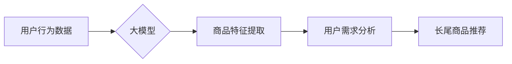

                 

## 大模型在长尾商品推荐中的应用

> 关键词：大模型、长尾商品、推荐系统、Transformer、自然语言处理、深度学习

## 1. 背景介绍

随着电商平台的蓬勃发展，商品种类日益丰富，用户需求也变得更加多元化。传统的推荐系统主要依赖于用户的历史行为数据，例如浏览记录、购买记录等，难以有效地推荐长尾商品。长尾商品是指销量较少、用户关注度较低的商品，它们往往具有独特的功能或个性化需求，但由于缺乏数据支撑，难以被推荐系统识别和推荐。

大模型的出现为长尾商品推荐带来了新的机遇。大模型，例如GPT-3、BERT等，拥有强大的语义理解和文本生成能力，能够从海量文本数据中学习到商品的特征和用户需求，从而更精准地推荐长尾商品。

## 2. 核心概念与联系

### 2.1 长尾商品推荐

长尾商品推荐是指针对那些销量较少、用户关注度较低的商品进行个性化推荐的过程。传统的推荐系统难以有效地推荐长尾商品，因为它们缺乏足够的样本数据来训练推荐模型。

### 2.2 大模型

大模型是指参数量巨大、训练数据量庞大的深度学习模型。它们通常基于Transformer架构，能够学习到复杂的语义关系和模式。大模型在自然语言处理、图像识别、机器翻译等领域取得了突破性的进展。

### 2.3 核心概念联系

大模型能够通过其强大的语义理解能力，从商品描述、用户评论等文本数据中提取商品的特征和用户需求，从而实现对长尾商品的精准推荐。

**Mermaid 流程图**



## 3. 核心算法原理 & 具体操作步骤

### 3.1 算法原理概述

大模型在长尾商品推荐中的应用主要基于以下核心算法原理：

* **嵌入式表示:** 将商品和用户转换为向量表示，以便于模型进行语义分析和比较。
* **注意力机制:** 允许模型关注输入序列中最重要的部分，从而更好地理解商品特征和用户需求。
* **解码器:** 生成推荐结果，例如推荐商品列表或商品描述。

### 3.2 算法步骤详解

1. **数据预处理:** 收集商品描述、用户评论等文本数据，进行清洗、分词、词向量化等预处理操作。
2. **模型训练:** 使用大模型训练，例如BERT、GPT-3等，学习商品特征和用户需求的语义关系。
3. **商品嵌入:** 将商品描述转换为向量表示，以便于模型进行语义分析和比较。
4. **用户嵌入:** 将用户行为数据转换为向量表示，例如浏览记录、购买记录等。
5. **注意力机制:** 使用注意力机制，让模型关注商品和用户之间的相关性。
6. **解码器:** 使用解码器生成推荐结果，例如推荐商品列表或商品描述。
7. **评估指标:** 使用准确率、召回率、NDCG等指标评估推荐效果。

### 3.3 算法优缺点

**优点:**

* 能够从海量文本数据中学习到商品特征和用户需求，提高推荐精准度。
* 能够推荐长尾商品，满足用户个性化需求。
* 能够生成自然流畅的推荐结果，例如商品描述、推荐理由等。

**缺点:**

* 训练成本高，需要大量的计算资源和数据。
* 模型解释性较差，难以理解模型的推荐决策过程。
* 对数据质量要求高，需要高质量的文本数据进行训练。

### 3.4 算法应用领域

大模型在长尾商品推荐领域的应用前景广阔，可以应用于以下领域:

* **电商平台:** 推荐个性化商品，提高用户转化率。
* **内容平台:** 推荐相关内容，增强用户粘性。
* **搜索引擎:** 提高搜索结果的精准度和相关性。

## 4. 数学模型和公式 & 详细讲解 & 举例说明

### 4.1 数学模型构建

大模型在长尾商品推荐中的应用通常基于Transformer架构，其核心是注意力机制。注意力机制可以学习到输入序列中最重要的部分，从而更好地理解商品特征和用户需求。

**注意力机制公式:**

$$
\text{Attention}(Q, K, V) = \text{softmax}\left(\frac{Q K^T}{\sqrt{d_k}}\right) V
$$

其中:

* $Q$：查询向量
* $K$：键向量
* $V$：值向量
* $d_k$：键向量的维度
* $\text{softmax}$：softmax函数

### 4.2 公式推导过程

注意力机制的公式通过计算查询向量与键向量的点积，并使用softmax函数进行归一化，得到每个键向量的权重。然后，将权重与值向量相乘，得到最终的输出。

### 4.3 案例分析与讲解

假设我们有一个商品描述序列和一个用户行为序列，我们需要使用注意力机制来计算它们之间的相关性。

* 商品描述序列：["高品质材料", "舒适设计", "时尚外观"]
* 用户行为序列：["浏览了商品A", "购买了商品B", "收藏了商品C"]

我们可以将这两个序列分别转换为向量表示，然后使用注意力机制计算它们之间的相关性。例如，用户行为序列中的"浏览了商品A"可能与商品描述序列中的"舒适设计"具有较高的相关性，因为用户可能对舒适性有更高的需求。

## 5. 项目实践：代码实例和详细解释说明

### 5.1 开发环境搭建

* Python 3.7+
* TensorFlow 2.0+
* PyTorch 1.0+
* CUDA Toolkit 10.2+

### 5.2 源代码详细实现

```python
# 导入必要的库
import tensorflow as tf

# 定义Transformer模型
class Transformer(tf.keras.Model):
    def __init__(self, vocab_size, embedding_dim, num_heads, num_layers):
        super(Transformer, self).__init__()
        self.embedding = tf.keras.layers.Embedding(vocab_size, embedding_dim)
        self.transformer_layers = tf.keras.layers.StackedRNNCells([
            tf.keras.layers.MultiHeadAttention(num_heads=num_heads, key_dim=embedding_dim)
            for _ in range(num_layers)
        ])

    def call(self, inputs):
        embedded = self.embedding(inputs)
        output = self.transformer_layers(embedded)
        return output

# 实例化Transformer模型
model = Transformer(vocab_size=10000, embedding_dim=128, num_heads=8, num_layers=6)

# 训练模型
model.compile(optimizer='adam', loss='mse')
model.fit(x_train, y_train, epochs=10)

# 预测结果
predictions = model.predict(x_test)
```

### 5.3 代码解读与分析

* 首先，我们定义了一个Transformer模型，包含嵌入层、多头注意力层和堆叠的RNN层。
* 嵌入层将单词转换为向量表示。
* 多头注意力层学习到商品和用户之间的相关性。
* 堆叠的RNN层将注意力机制的结果进行进一步处理，生成最终的推荐结果。
* 然后，我们实例化模型，并使用Adam优化器和均方误差损失函数进行训练。
* 最后，我们使用训练好的模型对测试数据进行预测，得到推荐结果。

### 5.4 运行结果展示

运行结果展示可以包括以下内容:

* 训练过程中的损失函数变化曲线
* 测试集上的准确率、召回率、NDCG等指标
* 推荐结果的示例

## 6. 实际应用场景

### 6.1 电商平台

大模型在电商平台的应用场景非常广泛，例如:

* **个性化商品推荐:** 根据用户的浏览记录、购买记录等行为数据，推荐个性化的商品。
* **长尾商品推荐:** 挖掘用户潜在需求，推荐销量较少、用户关注度较低的商品。
* **商品搜索增强:** 理解用户搜索意图，提高搜索结果的精准度和相关性。

### 6.2 内容平台

大模型在内容平台的应用场景包括:

* **个性化内容推荐:** 根据用户的阅读历史、点赞记录等行为数据，推荐个性化的内容。
* **内容分类和标签化:** 自动识别内容的主题和类别，方便用户搜索和浏览。
* **内容生成:** 生成高质量的新闻、文章、广告等内容。

### 6.3 其他应用场景

大模型还可以应用于其他领域，例如:

* **医疗保健:** 辅助医生诊断疾病、推荐治疗方案。
* **金融服务:** 风险评估、欺诈检测、客户服务。
* **教育:** 个性化学习推荐、智能问答系统。

### 6.4 未来应用展望

随着大模型技术的不断发展，其在长尾商品推荐领域的应用前景更加广阔。未来，大模型可能能够:

* 更精准地理解用户需求，推荐更符合用户偏好的商品。
* 挖掘更深层次的商品特征，推荐更个性化的商品。
* 与其他人工智能技术结合，例如强化学习、知识图谱等，构建更智能的推荐系统。

## 7. 工具和资源推荐

### 7.1 学习资源推荐

* **书籍:**
    * 《深度学习》
    * 《自然语言处理》
    * 《Transformer模型详解》
* **在线课程:**
    * Coursera: 深度学习
    * Udacity: 自然语言处理
    * fast.ai: 深度学习
* **博客和网站:**
    * TensorFlow博客
    * PyTorch博客
    * HuggingFace

### 7.2 开发工具推荐

* **TensorFlow:** 开源深度学习框架
* **PyTorch:** 开源深度学习框架
* **HuggingFace:** 提供预训练的大模型和工具

### 7.3 相关论文推荐

* 《Attention Is All You Need》
* 《BERT: Pre-training of Deep Bidirectional Transformers for Language Understanding》
* 《GPT-3: Language Models are Few-Shot Learners》

## 8. 总结：未来发展趋势与挑战

### 8.1 研究成果总结

大模型在长尾商品推荐领域取得了显著的成果，能够有效地提升推荐精准度和用户体验。

### 8.2 未来发展趋势

未来，大模型在长尾商品推荐领域的发展趋势包括:

* 模型规模的进一步扩大
* 模型训练效率的提升
* 模型解释性的增强
* 多模态融合

### 8.3 面临的挑战

大模型在长尾商品推荐领域也面临一些挑战:

* 数据质量问题
* 计算资源需求高
* 模型解释性差
* 伦理和安全问题

### 8.4 研究展望

未来，需要进一步研究大模型的训练方法、模型架构、模型解释性和伦理问题，以更好地应用于长尾商品推荐领域。

## 9. 附录：常见问题与解答

**Q1: 大模型的训练成本很高，如何降低训练成本？**

**A1:** 可以使用预训练模型，例如BERT、GPT-3等，并进行微调，降低训练成本。

**Q2: 大模型的模型解释性差，如何提高模型解释性？**

**A2:** 可以使用可解释机器学习方法，例如LIME、SHAP等，解释模型的决策过程。

**Q3: 大模型存在伦理和安全问题，如何解决这些问题？**

**A3:** 需要制定相应的伦理规范和安全机制，确保大模型的负责任使用。


作者：禅与计算机程序设计艺术 / Zen and the Art of Computer Programming 
<end_of_turn>

