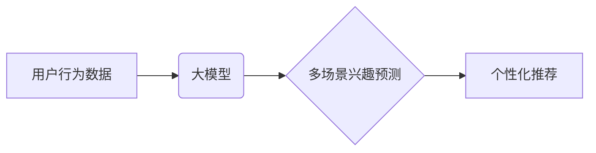

                 

## 大模型辅助的推荐系统多场景兴趣预测

> 关键词：大模型、推荐系统、兴趣预测、多场景、迁移学习、个性化推荐

## 1. 背景介绍

随着互联网和移动互联网的快速发展，海量用户数据不断涌现，推荐系统作为连接用户和内容的重要桥梁，在电商、社交、娱乐等领域发挥着越来越重要的作用。传统的推荐系统主要依赖于用户历史行为数据，例如点击、购买、评分等，但这些数据往往局限于单一场景，难以全面刻画用户的复杂兴趣。

大模型的出现为推荐系统带来了新的机遇。大模型拥有强大的语义理解和泛化能力，能够从海量文本数据中学习用户兴趣的深层特征，并将其应用于多场景兴趣预测。

## 2. 核心概念与联系

### 2.1  推荐系统

推荐系统旨在根据用户的历史行为和偏好，预测用户对潜在项目的兴趣，并推荐最相关的项目。推荐系统可以分为基于内容的推荐、基于协同过滤的推荐和基于深度学习的推荐三大类。

### 2.2  大模型

大模型是指参数规模庞大、训练数据海量的人工智能模型。大模型通常采用Transformer架构，能够学习到语言的复杂语义关系，并应用于各种自然语言处理任务，例如文本分类、机器翻译、问答系统等。

### 2.3  多场景兴趣预测

多场景兴趣预测是指根据用户在不同场景下的行为数据，预测用户在未来场景下的兴趣。例如，根据用户在电商平台的购买记录和社交平台的点赞记录，预测用户在旅行平台上的兴趣。

**核心概念与架构关系**



## 3. 核心算法原理 & 具体操作步骤

### 3.1  算法原理概述

大模型辅助的推荐系统多场景兴趣预测主要基于迁移学习的思想。首先，利用大模型从海量文本数据中学习到用户兴趣的通用特征。然后，将这些特征迁移到特定场景的推荐任务中，并结合场景特有的行为数据进行微调，最终实现多场景兴趣预测。

### 3.2  算法步骤详解

1. **预训练大模型:** 使用海量文本数据预训练大模型，例如BERT、RoBERTa等，学习到语言的语义表示和用户兴趣相关的特征。

2. **特征提取:** 将用户在不同场景下的行为数据转换为文本格式，例如用户购买记录、浏览历史、评论内容等，并使用预训练好的大模型提取其语义特征。

3. **迁移学习:** 将大模型预训练的通用特征迁移到特定场景的推荐任务中，并结合场景特有的行为数据进行微调。

4. **兴趣预测:** 利用微调后的模型预测用户在未来场景下的兴趣，并生成个性化的推荐列表。

### 3.3  算法优缺点

**优点:**

* 能够学习到用户兴趣的深层特征，提升推荐的准确性和个性化程度。
* 迁移学习的思想可以有效利用已有知识，降低模型训练成本和时间。
* 适用于多场景兴趣预测，能够提供更全面的用户体验。

**缺点:**

* 需要海量文本数据进行预训练，数据获取和处理成本较高。
* 模型训练复杂度高，需要强大的计算资源。
* 迁移学习效果依赖于预训练模型和目标任务的相似性。

### 3.4  算法应用领域

大模型辅助的推荐系统多场景兴趣预测在以下领域具有广泛的应用前景:

* **电商推荐:** 根据用户的购物历史、浏览记录和评论内容，预测用户在未来场景下的购买兴趣，提供个性化的商品推荐。
* **社交推荐:** 根据用户的社交关系、点赞记录和评论内容，预测用户在未来场景下的社交兴趣，推荐潜在的朋友或兴趣小组。
* **内容推荐:** 根据用户的阅读历史、观看记录和点赞内容，预测用户在未来场景下的内容兴趣，推荐相关的文章、视频或音频。
* **旅游推荐:** 根据用户的旅行历史、兴趣爱好和地理位置，预测用户在未来场景下的旅行兴趣，推荐合适的旅游目的地和行程安排。

## 4. 数学模型和公式 & 详细讲解 & 举例说明

### 4.1  数学模型构建

假设我们有一个用户集合 $U$，一个项目集合 $I$，以及一个用户-项目交互矩阵 $R$，其中 $R_{ui}$ 表示用户 $u$ 对项目 $i$ 的交互行为。

我们的目标是预测用户 $u$ 对项目 $i$ 的兴趣评分 $R_{ui}$。我们可以使用以下数学模型来表示：

$$
R_{ui} = f(h_u, h_i, c)
$$

其中：

* $h_u$ 是用户 $u$ 的特征向量，表示用户的兴趣偏好和属性。
* $h_i$ 是项目 $i$ 的特征向量，表示项目的类别、内容和属性。
* $c$ 是场景特征向量，表示当前场景的上下文信息。
* $f$ 是一个映射函数，将用户特征、项目特征和场景特征映射到兴趣评分。

### 4.2  公式推导过程

为了实现多场景兴趣预测，我们可以使用迁移学习的思想，将预训练好的大模型的特征提取能力应用于我们的推荐模型。

假设我们有一个预训练好的大模型 $M$，它可以将文本数据映射到语义特征向量。我们可以使用以下公式来提取用户、项目和场景的特征：

$$
h_u = M(text_u)
$$

$$
h_i = M(text_i)
$$

$$
c = M(text_c)
$$

其中：

* $text_u$ 是用户 $u$ 的文本数据，例如用户的购买记录、浏览历史和评论内容。
* $text_i$ 是项目 $i$ 的文本数据，例如项目的描述、类别和属性。
* $text_c$ 是场景 $c$ 的文本数据，例如用户的地理位置、时间戳和设备信息。

然后，我们可以将提取的特征向量 $h_u$、$h_i$ 和 $c$ 代入我们的推荐模型 $f$ 中，得到用户 $u$ 对项目 $i$ 的兴趣评分 $R_{ui}$。

### 4.3  案例分析与讲解

例如，我们想要预测用户在电商平台上的购买兴趣。我们可以使用用户的购买历史、浏览记录和评论内容作为文本数据，将其输入预训练好的大模型 $M$ 中，提取用户的特征向量 $h_u$。

然后，我们可以使用商品的描述、类别和属性作为文本数据，将其输入大模型 $M$ 中，提取商品的特征向量 $h_i$。

最后，我们可以将用户的特征向量 $h_u$、商品的特征向量 $h_i$ 和场景特征向量 $c$ (例如用户的地理位置、时间戳和设备信息) 代入我们的推荐模型 $f$ 中，得到用户对商品的购买兴趣评分 $R_{ui}$。

## 5. 项目实践：代码实例和详细解释说明

### 5.1  开发环境搭建

为了实现大模型辅助的推荐系统多场景兴趣预测，我们需要搭建一个开发环境，包括以下软件和工具:

* Python 3.x
* PyTorch 或 TensorFlow
* CUDA 和 cuDNN (用于GPU加速)
* HuggingFace Transformers (用于加载预训练模型)
* Scikit-learn (用于数据处理和模型评估)

### 5.2  源代码详细实现

```python
import torch
from transformers import BertModel, BertTokenizer

# 加载预训练模型和词典
model_name = "bert-base-uncased"
tokenizer = BertTokenizer.from_pretrained(model_name)
model = BertModel.from_pretrained(model_name)

# 定义推荐模型
class RecommenderModel(torch.nn.Module):
    def __init__(self, embedding_dim, hidden_dim):
        super(RecommenderModel, self).__init__()
        self.embedding = torch.nn.Embedding(vocab_size, embedding_dim)
        self.fc = torch.nn.Linear(embedding_dim, hidden_dim)
        self.output = torch.nn.Linear(hidden_dim, 1)

    def forward(self, user_input, item_input):
        user_embedding = self.embedding(user_input)
        item_embedding = self.embedding(item_input)
        combined_embedding = user_embedding + item_embedding
        hidden = torch.relu(self.fc(combined_embedding))
        output = self.output(hidden)
        return output

# 实例化推荐模型
model = RecommenderModel(embedding_dim=768, hidden_dim=128)

# 训练模型
# ...

# 预测用户兴趣
user_input = tokenizer("用户文本数据", return_tensors="pt")
item_input = tokenizer("商品文本数据", return_tensors="pt")
prediction = model(user_input, item_input)
```

### 5.3  代码解读与分析

* 我们首先加载预训练好的BERT模型和词典。
* 然后，我们定义了一个推荐模型，它包含一个嵌入层、一个全连接层和一个输出层。
* 嵌入层将用户和商品的文本数据映射到语义特征向量。
* 全连接层对特征向量进行非线性变换。
* 输出层将变换后的特征向量映射到兴趣评分。
* 最后，我们实例化推荐模型并进行训练。

### 5.4  运行结果展示

训练完成后，我们可以使用模型预测用户对商品的兴趣评分。

## 6. 实际应用场景

### 6.1  电商推荐

大模型辅助的推荐系统可以帮助电商平台提供更精准的商品推荐，提升用户购物体验和转化率。例如，根据用户的购物历史、浏览记录和评论内容，预测用户对未来商品的兴趣，并推荐相关的商品。

### 6.2  社交推荐

大模型可以帮助社交平台推荐更相关的用户和内容，提升用户粘性和活跃度。例如，根据用户的社交关系、点赞记录和评论内容，预测用户对未来朋友或兴趣小组的兴趣，并推荐相关的用户或群组。

### 6.3  内容推荐

大模型可以帮助内容平台推荐更符合用户兴趣的内容，提升用户阅读和观看体验。例如，根据用户的阅读历史、观看记录和点赞内容，预测用户对未来文章、视频或音频的兴趣，并推荐相关的作品。

### 6.4  未来应用展望

随着大模型技术的不断发展，大模型辅助的推荐系统将有更广泛的应用场景，例如：

* 个性化教育推荐
* 智能医疗诊断辅助
* 智慧城市服务推荐

## 7. 工具和资源推荐

### 7.1  学习资源推荐

* **书籍:**
    * 《深度学习》 by Ian Goodfellow, Yoshua Bengio, and Aaron Courville
    * 《自然语言处理》 by Dan Jurafsky and James H. Martin
* **在线课程:**
    * Coursera: Deep Learning Specialization
    * Stanford CS224N: Natural Language Processing with Deep Learning
* **博客和网站:**
    * HuggingFace Blog: https://huggingface.co/blog
    * OpenAI Blog: https://openai.com/blog

### 7.2  开发工具推荐

* **Python:** https://www.python.org/
* **PyTorch:** https://pytorch.org/
* **TensorFlow:** https://www.tensorflow.org/
* **HuggingFace Transformers:** https://huggingface.co/docs/transformers/index

### 7.3  相关论文推荐

* **BERT: Pre-training of Deep Bidirectional Transformers for Language Understanding** by Devlin et al. (2018)
* **RoBERTa: A Robustly Optimized BERT Pretraining Approach** by Liu et al. (2019)
* **Transfer Learning for Recommender Systems** by Wang et al. (2019)

## 8. 总结：未来发展趋势与挑战

### 8.1  研究成果总结

大模型辅助的推荐系统多场景兴趣预测取得了显著的成果，能够有效提升推荐的准确性和个性化程度。

### 8.2  未来发展趋势

* **模型规模和能力的提升:** 未来，大模型的规模和能力将继续提升，能够学习到更深层的用户兴趣特征。
* **多模态融合:** 将文本、图像、音频等多模态数据融合到推荐模型中，提升推荐的丰富性和准确性。
* **联邦学习:** 利用联邦学习技术，在保护用户隐私的前提下，实现大规模数据共享和模型训练。

### 8.3  面临的挑战

* **数据获取和隐私保护:** 大模型训练需要海量数据，如何获取高质量数据并保护用户隐私是一个重要的挑战。
* **模型训练成本:** 大模型的训练成本很高，需要强大的计算资源和优化算法。
* **模型解释性和可解释性:** 大模型的决策过程往往难以解释，如何提高模型的解释性和可解释性是一个重要的研究方向。

### 8.4  研究展望

未来，大模型辅助的推荐系统将朝着更智能、更个性化、更安全的方向发展。

## 9. 附录：常见问题与解答

**Q1: 大模型辅助的推荐系统与传统的推荐系统相比有什么优势？**

**A1:** 大模型辅助的推荐系统能够学习到用户兴趣的深层特征，并将其应用于多场景兴趣预测，提升推荐的准确性和个性化程度。

**Q2: 如何选择合适的预训练模型？**

**A2:** 选择预训练模型需要考虑模型的规模、能力和任务相关性。对于文本数据，BERT、RoBERTa等预训练模型效果较好。

**Q3: 如何解决数据获取和隐私保护问题？**

**A3:** 可以采用联邦学习技术，在保护用户隐私的前提下，实现大规模数据共享和模型训练。

**作者：禅与计算机程序设计艺术 / Zen and the Art of Computer Programming**<end_of_turn>

