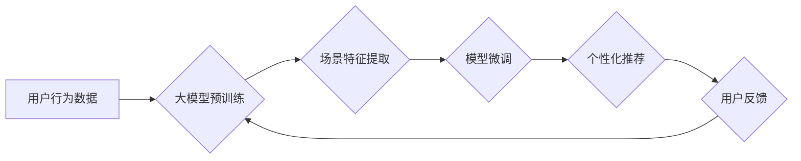

                 

## 大模型辅助的推荐系统多场景适配方法

> 关键词：大模型、推荐系统、场景适配、个性化推荐、多模态数据、迁移学习

## 1. 背景介绍

推荐系统作为信息过滤和个性化内容呈现的重要工具，在电商、社交媒体、视频平台等领域发挥着至关重要的作用。传统的推荐系统主要依赖于用户历史行为数据，例如点击、购买、评分等，通过协同过滤、内容过滤等算法构建用户兴趣模型，并推荐相似的商品或内容。然而，随着用户行为数据的多样化和复杂化，传统的推荐系统面临着以下挑战：

* **数据稀疏性:** 用户行为数据往往存在稀疏性，难以准确捕捉用户细粒度的兴趣偏好。
* **冷启动问题:** 新用户或新商品缺乏历史行为数据，难以进行有效的推荐。
* **场景多样性:** 用户在不同的场景下，例如购物、娱乐、学习等，对推荐内容的需求和偏好也不同。

近年来，大模型技术的发展为推荐系统带来了新的机遇。大模型具备强大的语义理解和泛化能力，能够从海量文本、图像、音频等多模态数据中学习用户兴趣和偏好，并生成更精准、个性化的推荐结果。

## 2. 核心概念与联系

大模型辅助的推荐系统多场景适配方法的核心概念包括：

* **大模型:** 指规模庞大、训练数据丰富的人工智能模型，例如GPT-3、BERT、DALL-E等。
* **场景适配:** 指根据不同的场景需求，对推荐系统进行调整和优化，以提高推荐效果。
* **个性化推荐:** 指根据用户的兴趣偏好、行为模式等信息，提供个性化的推荐结果。

**核心架构：**



## 3. 核心算法原理 & 具体操作步骤

### 3.1  算法原理概述

大模型辅助的推荐系统多场景适配方法主要基于以下算法原理：

* **迁移学习:** 利用预训练的大模型，在目标场景下进行微调，以提高模型的适应性和效率。
* **多模态学习:** 融合文本、图像、音频等多模态数据，构建更全面的用户兴趣模型。
* **场景特征嵌入:** 将场景信息嵌入到模型中，引导模型根据场景需求进行推荐。

### 3.2  算法步骤详解

1. **数据预处理:** 收集用户行为数据、场景特征数据以及大模型预训练所需的文本、图像等多模态数据。对数据进行清洗、格式化和特征提取。
2. **大模型预训练:** 利用公开的预训练大模型，例如BERT、GPT-3等，在海量文本数据上进行预训练，学习语言表示和语义理解能力。
3. **场景特征提取:** 对不同场景的数据进行分析，提取场景特征，例如用户行为模式、时间段、设备类型等。将场景特征转换为可供模型学习的向量表示。
4. **模型微调:** 将预训练的大模型加载到目标场景，并根据场景特征进行微调。微调过程中，使用目标场景下的用户行为数据进行训练，以提高模型在目标场景下的推荐效果。
5. **个性化推荐:** 利用微调后的模型，根据用户的兴趣偏好、行为模式以及当前场景特征，生成个性化的推荐结果。

### 3.3  算法优缺点

**优点:**

* **提升推荐精准度:** 大模型的强大语义理解能力能够更准确地捕捉用户兴趣偏好。
* **解决冷启动问题:** 通过迁移学习，可以利用预训练模型的知识，降低新用户或新商品的冷启动问题。
* **适应场景多样性:** 通过场景特征嵌入，可以根据不同的场景需求进行模型调整，提高推荐效果。

**缺点:**

* **计算资源需求高:** 大模型训练和推理需要大量的计算资源。
* **数据隐私问题:** 大模型训练需要使用大量用户数据，需要妥善处理数据隐私问题。
* **模型解释性差:** 大模型的决策过程较为复杂，难以解释模型的推荐结果。

### 3.4  算法应用领域

大模型辅助的推荐系统多场景适配方法在以下领域具有广泛的应用前景：

* **电商推荐:** 为用户推荐个性化的商品，提高转化率。
* **内容推荐:** 为用户推荐个性化的新闻、视频、音乐等内容，增强用户粘性。
* **社交推荐:** 为用户推荐新的朋友、兴趣小组等，拓展社交圈。
* **教育推荐:** 为学生推荐个性化的学习资源，提高学习效率。

## 4. 数学模型和公式 & 详细讲解 & 举例说明

### 4.1  数学模型构建

假设用户集合为U，商品集合为I，场景集合为S。用户u对商品i在场景s下的评分为r<sub>u,i,s</sub>。

推荐系统的目标是预测用户u在场景s下对商品i的评分。

我们可以构建一个基于大模型的推荐模型，将用户u、商品i和场景s的特征向量作为输入，输出用户u对商品i在场景s下的评分预测值。

### 4.2  公式推导过程

模型的输出可以表示为：

$$
\hat{r}_{u,i,s} = f(u, i, s, \theta)
$$

其中：

* $\hat{r}_{u,i,s}$ 是模型预测的用户u对商品i在场景s下的评分。
* $u$, $i$, $s$ 分别是用户u、商品i和场景s的特征向量。
* $f$ 是一个基于大模型的评分预测函数。
* $\theta$ 是模型的参数。

### 4.3  案例分析与讲解

例如，我们可以使用BERT模型对用户、商品和场景的文本特征进行编码，然后使用一个全连接层将编码后的特征向量映射到评分预测值。

## 5. 项目实践：代码实例和详细解释说明

### 5.1  开发环境搭建

* Python 3.7+
* PyTorch 1.7+
* Transformers 4.0+

### 5.2  源代码详细实现

```python
import torch
from transformers import BertModel, BertTokenizer

class RecommenderModel(torch.nn.Module):
    def __init__(self, bert_model_name='bert-base-uncased'):
        super(RecommenderModel, self).__init__()
        self.bert = BertModel.from_pretrained(bert_model_name)
        self.fc = torch.nn.Linear(768, 1)  # 768 是 BERT 的隐藏层维度

    def forward(self, user_input, item_input, scene_input):
        user_output = self.bert(user_input)[0]
        item_output = self.bert(item_input)[0]
        scene_output = self.bert(scene_input)[0]
        
        # 将用户、商品和场景的特征向量进行融合
        # ...

        # 通过全连接层预测评分
        prediction = self.fc(fused_features)
        return prediction

# 实例化模型
model = RecommenderModel()

# 加载预训练模型参数
model.load_state_dict(torch.load('model_weights.pth'))

# 使用模型进行预测
user_input = ['用户A']
item_input = ['商品B']
scene_input = ['场景C']
prediction = model(user_input, item_input, scene_input)
print(prediction)
```

### 5.3  代码解读与分析

* 该代码实现了一个基于BERT模型的推荐系统。
* 模型首先使用BERT模型对用户、商品和场景的文本特征进行编码。
* 然后，将编码后的特征向量进行融合，并通过一个全连接层预测评分。
* 模型的训练和推理过程需要使用大量的计算资源。

### 5.4  运行结果展示

运行结果将显示用户u对商品i在场景s下的评分预测值。

## 6. 实际应用场景

### 6.1  电商推荐

大模型辅助的推荐系统可以帮助电商平台根据用户的历史购买记录、浏览记录、购物车内容等信息，以及用户的当前位置、时间、设备类型等场景特征，推荐个性化的商品。

### 6.2  内容推荐

大模型可以分析用户的阅读习惯、观看历史、点赞记录等信息，并根据用户的兴趣偏好和当前场景，推荐个性化的新闻、视频、音乐等内容。

### 6.3  社交推荐

大模型可以分析用户的社交关系、兴趣爱好、行为模式等信息，并根据用户的社交圈和当前场景，推荐新的朋友、兴趣小组等。

### 6.4  未来应用展望

随着大模型技术的不断发展，大模型辅助的推荐系统将应用于更多领域，例如教育推荐、医疗推荐、金融推荐等。

## 7. 工具和资源推荐

### 7.1  学习资源推荐

* **论文:**
    * [BERT: Pre-training of Deep Bidirectional Transformers for Language Understanding](https://arxiv.org/abs/1810.04805)
    * [GPT-3: Language Models are Few-Shot Learners](https://arxiv.org/abs/2005.14165)
    * [DALL-E: Creating Images from Text](https://openai.com/blog/dall-e/)
* **在线课程:**
    * **Coursera:** 自然语言处理
    * **edX:** 深度学习

### 7.2  开发工具推荐

* **PyTorch:** 深度学习框架
* **Transformers:** 预训练模型库
* **HuggingFace:** 预训练模型平台

### 7.3  相关论文推荐

* [Large Language Models for Recommender Systems](https://arxiv.org/abs/2203.04743)
* [Multi-Modal Recommender Systems: A Survey](https://arxiv.org/abs/2106.08237)

## 8. 总结：未来发展趋势与挑战

### 8.1  研究成果总结

大模型辅助的推荐系统多场景适配方法取得了显著的成果，能够提升推荐精准度、解决冷启动问题、适应场景多样性。

### 8.2  未来发展趋势

* **多模态融合:** 进一步融合文本、图像、音频等多模态数据，构建更全面的用户兴趣模型。
* **场景理解:** 提升模型对场景的理解能力，更加精准地根据场景需求进行推荐。
* **个性化定制:** 提供更个性化的推荐体验，例如根据用户的喜好生成个性化推荐列表、推荐个性化商品组合等。

### 8.3  面临的挑战

* **计算资源需求:** 大模型训练和推理需要大量的计算资源，成本较高。
* **数据隐私问题:** 大模型训练需要使用大量用户数据，需要妥善处理数据隐私问题。
* **模型解释性差:** 大模型的决策过程较为复杂，难以解释模型的推荐结果。

### 8.4  研究展望

未来，我们将继续研究大模型辅助的推荐系统多场景适配方法，探索更有效的模型架构、训练策略和场景理解机制，以提供更精准、个性化、可解释的推荐体验。

## 9. 附录：常见问题与解答

* **Q1: 大模型训练需要多少计算资源？**

A1: 大模型训练需要大量的计算资源，例如GPU、TPU等。具体需要的计算资源取决于模型规模、训练数据量等因素。

* **Q2: 如何解决大模型训练的数据隐私问题？**

A2: 可以采用以下方法解决数据隐私问题：

* **数据脱敏:** 对用户数据进行脱敏处理，去除敏感信息。
* **联邦学习:** 在不共享原始数据的情况下，利用分布式训练方法进行模型训练。
* **差分隐私:** 在数据训练过程中加入噪声，保护用户隐私。

* **Q3: 如何解释大模型的推荐结果？**

A3: 

* **局部解释:** 分析模型对特定用户的推荐结果的影响因素。
* **全局解释:** 分析模型的整体决策机制，例如哪些特征对模型决策影响较大。
* **可解释模型:** 使用可解释性更好的模型，例如决策树、线性回归等。


作者：禅与计算机程序设计艺术 / Zen and the Art of Computer Programming 
<end_of_turn>

