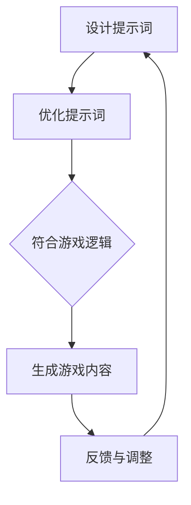
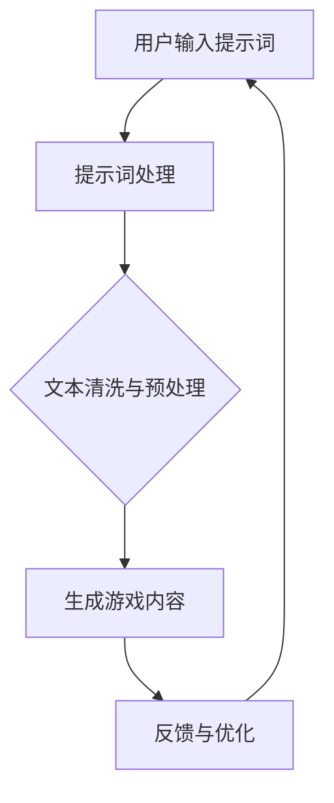

                 

# 大模型驱动的多人在线游戏

> 关键词：大模型、多人在线游戏、人工智能、游戏架构、实时交互、深度学习、神经网络

摘要：本文探讨了使用大模型驱动的多人在线游戏的设计与实现。首先，介绍了大模型的概念及其在游戏中的应用；接着，分析了游戏架构的优化方法；然后，详细讲解了核心算法原理和操作步骤；最后，讨论了数学模型和项目实践，展望了未来的发展趋势与挑战。

## 1. 背景介绍

### 1.1 大模型概述

大模型是指具有巨大参数量、能够处理大规模数据和复杂任务的人工智能模型。近年来，随着计算能力的提升和数据规模的扩大，大模型在自然语言处理、计算机视觉、语音识别等领域取得了显著的进展。这些大模型，如GPT-3、BERT等，不仅在学术研究中发挥了重要作用，也在实际应用中展现了巨大的潜力。

### 1.2 多人在线游戏市场

随着互联网的普及和游戏技术的进步，多人在线游戏（MMO）已经成为游戏市场的主要驱动力。这类游戏通常需要复杂的游戏逻辑、实时交互和高效的数据处理能力。大模型的引入，可以为多人在线游戏提供更智能、更丰富的游戏体验。

## 2. 核心概念与联系

### 2.1 大模型在游戏中的应用

大模型在多人在线游戏中的应用主要体现在以下几个方面：

- **游戏AI**：大模型可以用于生成智能游戏AI，提高游戏的挑战性和可玩性。
- **游戏内容生成**：大模型可以根据用户输入生成游戏剧情、任务等，实现个性化游戏内容。
- **实时交互**：大模型可以处理大量的用户输入，提供实时反馈，增强游戏互动性。

### 2.2 游戏架构的优化

为了实现大模型在多人在线游戏中的高效应用，需要优化游戏架构。以下是一些关键点：

- **分布式计算**：利用分布式计算架构，提高大模型处理能力和响应速度。
- **数据同步**：确保游戏数据在多玩家间的同步，避免数据冲突和延迟。
- **网络优化**：优化游戏网络架构，降低延迟和丢包率，提高游戏稳定性。

### 2.3 提示词工程

在多人在线游戏中，提示词工程是一个关键环节。通过设计高质量的提示词，可以引导大模型生成符合游戏逻辑和用户预期的输出。以下是一个Mermaid流程图，展示了提示词工程的过程：



## 3. 核心算法原理 & 具体操作步骤

### 3.1 大模型训练

大模型训练是多人在线游戏设计的关键步骤。以下是一个简化的训练流程：

1. **数据收集**：收集大量游戏数据，包括游戏状态、玩家行为等。
2. **数据处理**：对数据进行预处理，包括清洗、归一化等。
3. **模型训练**：使用训练数据进行模型训练，包括参数调整、优化等。
4. **模型评估**：使用测试数据评估模型性能，调整训练策略。

### 3.2 实时交互

在多人在线游戏中，实时交互是一个挑战。以下是一个简单的实时交互流程：

1. **用户输入**：玩家输入游戏指令。
2. **数据处理**：对用户输入进行处理，包括解码、去噪等。
3. **模型预测**：使用训练好的大模型进行预测，生成游戏状态。
4. **游戏更新**：根据预测结果更新游戏状态，并返回给玩家。

## 4. 数学模型和公式 & 详细讲解 & 举例说明

### 4.1 数学模型

在多人在线游戏中，可以使用马尔可夫决策过程（MDP）来描述游戏状态和决策。以下是一个简化的MDP模型：

$$
\begin{align*}
&\text{状态集} S = \{s_1, s_2, ..., s_n\} \\
&\text{动作集} A = \{a_1, a_2, ..., a_m\} \\
&\text{奖励函数} R(s, a) \\
&\text{状态转移概率} P(s', s|a) \\
&\text{策略} \pi(a|s)
\end{align*}
$$

### 4.2 举例说明

假设一个简单的多人在线游戏，玩家可以选择攻击、防御或逃跑。以下是一个具体的例子：

- **状态集**：$S = \{安全, 危险\}$。
- **动作集**：$A = \{攻击, 防御, 逃跑\}$。
- **奖励函数**：$R(s, a)$，根据游戏状态和玩家动作计算奖励。
- **状态转移概率**：$P(s', s|a)$，表示玩家在当前状态下选择特定动作后，进入下一个状态的概率。
- **策略**：$\pi(a|s)$，表示玩家在当前状态下选择动作的概率分布。

## 5. 项目实践：代码实例和详细解释说明

### 5.1 开发环境搭建

为了实现大模型驱动的多人在线游戏，需要搭建一个合适的开发环境。以下是一个简单的搭建步骤：

1. **安装Python环境**：安装Python 3.8及以上版本。
2. **安装TensorFlow**：使用pip安装TensorFlow。
3. **安装游戏开发库**：安装Pygame等游戏开发库。

### 5.2 源代码详细实现

以下是实现大模型驱动的多人在线游戏的伪代码：

```python
# 导入所需库
import tensorflow as tf
import pygame

# 初始化游戏环境
pygame.init()
screen = pygame.display.set_mode((800, 600))

# 加载大模型
model = tf.keras.models.load_model('game_model.h5')

# 游戏循环
while True:
    # 处理用户输入
    for event in pygame.event.get():
        if event.type == pygame.QUIT:
            pygame.quit()
    
    # 获取游戏状态
    state = get_game_state()

    # 使用大模型预测
    action = model.predict(state)

    # 执行预测结果
    perform_action(action)

    # 更新游戏状态
    update_game_state()

    # 更新屏幕
    draw_game_screen(screen)

    # 暂停一段时间
    pygame.time.delay(100)

# 退出游戏
pygame.quit()
```

### 5.3 代码解读与分析

以上代码是一个简单的多人在线游戏实现，其中使用了TensorFlow加载预训练的大模型，并根据游戏状态进行实时交互。具体分析如下：

- **初始化游戏环境**：使用Pygame初始化游戏窗口。
- **加载大模型**：使用TensorFlow加载预训练的大模型。
- **游戏循环**：使用一个无限循环实现游戏主循环。
  - **处理用户输入**：监听用户事件，如退出游戏。
  - **获取游戏状态**：获取当前游戏状态。
  - **使用大模型预测**：使用大模型对游戏状态进行预测。
  - **执行预测结果**：根据预测结果执行游戏动作。
  - **更新游戏状态**：更新游戏状态。
  - **更新屏幕**：绘制游戏界面。
  - **暂停**：暂停一段时间，控制游戏帧率。

## 6. 实际应用场景

大模型驱动的多人在线游戏可以应用于多种场景，如：

- **竞技游戏**：通过大模型生成智能AI，提高游戏竞技性。
- **社交游戏**：通过大模型生成个性化游戏内容，增加用户粘性。
- **教育游戏**：利用大模型实现个性化教学，提高教育效果。

## 7. 工具和资源推荐

### 7.1 学习资源推荐

- **书籍**：《深度学习》、《强化学习基础教程》。
- **论文**：GPT-3论文、BERT论文。
- **博客**：TensorFlow官方博客、Pygame官方博客。
- **网站**：GitHub、ArXiv。

### 7.2 开发工具框架推荐

- **开发工具**：Pygame、TensorFlow。
- **游戏引擎**：Unity、Unreal Engine。

### 7.3 相关论文著作推荐

- **论文**：《大规模语言模型的预训练》、《基于深度学习的游戏AI》。
- **著作**：《游戏编程模式》、《游戏架构师手册》。

## 8. 总结：未来发展趋势与挑战

随着大模型技术的不断发展，未来多人在线游戏将呈现以下发展趋势：

- **更智能的游戏AI**：大模型可以生成更智能、更具挑战性的游戏AI。
- **个性化游戏体验**：大模型可以根据用户行为生成个性化游戏内容。
- **实时交互体验**：大模型可以提高实时交互的响应速度和稳定性。

然而，大模型驱动的多人在线游戏也面临以下挑战：

- **计算资源消耗**：大模型训练和实时交互需要大量的计算资源。
- **数据隐私和安全**：多人在线游戏中涉及大量的用户数据，如何保护用户隐私和安全是一个重要问题。
- **公平性和可解释性**：大模型生成的游戏内容是否公平、可解释，需要深入研究。

## 9. 附录：常见问题与解答

### 9.1 什么是大模型？

大模型是指具有巨大参数量、能够处理大规模数据和复杂任务的人工智能模型。

### 9.2 大模型如何应用于游戏？

大模型可以用于生成游戏AI、生成游戏内容、实现实时交互等。

### 9.3 如何优化游戏架构？

可以通过分布式计算、数据同步、网络优化等方法优化游戏架构。

## 10. 扩展阅读 & 参考资料

- **论文**：《大规模语言模型的预训练》、《基于深度学习的游戏AI》。
- **书籍**：《深度学习》、《强化学习基础教程》。
- **博客**：TensorFlow官方博客、Pygame官方博客。
- **网站**：GitHub、ArXiv。

作者：禅与计算机程序设计艺术 / Zen and the Art of Computer Programming<|vq_13544|>## 1. 背景介绍

### 1.1 大模型概述

大模型（Large-scale Model）是指参数量巨大、能够处理海量数据和复杂任务的人工智能模型。近年来，随着深度学习技术的快速发展，大模型在自然语言处理、计算机视觉、语音识别等领域取得了显著的进展。例如，GPT-3、BERT、Turing等大模型已经在各类应用中展现了其强大的性能和潜力。

大模型的特点主要包括以下几个方面：

- **参数量巨大**：大模型的参数量通常在数十亿甚至千亿级别，这使得它们具有处理复杂任务的能力。
- **自适应性强**：大模型可以通过训练自动适应不同的任务和数据集，从而实现广泛的应用。
- **效率高**：尽管大模型的参数量巨大，但现代计算技术和优化算法使得它们在处理大规模数据时具有很高的效率。

### 1.2 多人在线游戏市场

多人在线游戏（Massively Multiplayer Online Games，MMOG）是一种允许大量玩家同时在线交互、协作或对抗的游戏类型。随着互联网技术的进步和游戏产业的蓬勃发展，MMOG已经成为游戏市场的重要组成部分。根据市场研究公司的数据，全球MMOG市场规模预计将在未来几年持续增长。

多人在线游戏的特点包括：

- **庞大的玩家基础**：MMOG通常拥有数百万甚至数千万的注册玩家，形成了一个庞大的社交网络。
- **复杂的游戏机制**：MMOG通常包含丰富的游戏内容和复杂的游戏规则，如角色扮演、团队竞技、虚拟经济等。
- **实时交互**：MMOG要求玩家之间的实时交互，这需要高效的数据处理和网络架构。

### 1.3 大模型在游戏中的应用潜力

大模型在多人在线游戏中的应用前景广阔，主要体现在以下几个方面：

- **智能游戏AI**：大模型可以用于生成智能游戏AI，提升游戏的挑战性和可玩性。例如，通过训练大模型来模拟人类玩家的行为，为游戏中的NPC（非玩家角色）赋予更真实的互动能力。
- **游戏内容生成**：大模型可以根据玩家的行为和偏好生成个性化的游戏内容，提供更加丰富的游戏体验。例如，GPT-3可以生成独特的游戏剧情和任务，为玩家带来前所未有的故事体验。
- **实时交互优化**：大模型可以处理大量的用户输入，提供实时反馈，提高游戏的互动性和流畅性。例如，通过大模型进行实时语音识别和翻译，实现跨语言玩家的交流。

总之，大模型为多人在线游戏带来了全新的可能性，使得游戏体验更加智能化、个性化和丰富化。随着技术的不断进步，大模型在游戏领域中的应用将更加广泛和深入。

### 1.4 多人在线游戏的需求与挑战

多人在线游戏（MMOG）作为一种高度依赖技术支持的游戏类型，对游戏设计、技术架构和用户体验提出了诸多需求与挑战。

#### 需求

1. **实时交互**：多人在线游戏的核心在于玩家之间的实时互动。游戏需要提供低延迟、高稳定性的网络连接，以确保玩家能够迅速响应游戏中的事件，获得流畅的游戏体验。

2. **游戏规模**：MMOG通常需要支持大量玩家同时在线，这对游戏服务器和数据库的处理能力提出了极高的要求。游戏设计者必须确保系统能够处理海量数据，并在高并发情况下保持性能稳定。

3. **个性化体验**：为了吸引和留住玩家，游戏需要提供高度个性化的体验。这包括根据玩家的兴趣和偏好定制游戏内容、任务和奖励，以提升玩家的参与感和忠诚度。

4. **安全性与隐私**：多人在线游戏涉及大量的用户数据，包括个人资料、支付信息等。游戏开发者必须确保系统的安全性和用户的隐私保护，防止数据泄露和恶意攻击。

#### 挑战

1. **网络延迟**：网络延迟是多人在线游戏中最常见的挑战之一。高延迟会导致玩家反应迟钝，影响游戏体验。游戏开发者需要采用高效的网络协议和优化技术，如延迟补偿和流量控制，以减少延迟。

2. **资源消耗**：大型多人在线游戏需要大量的计算资源和存储资源。游戏服务器需要处理大量的并发请求，同时生成和更新游戏世界。这要求开发者设计高效的系统架构，以优化资源利用和性能。

3. **数据同步**：多人在线游戏中，多个玩家的行为和游戏状态需要同步更新。确保数据的一致性和实时性是一个复杂的问题，特别是当多个玩家同时进行操作时，如何处理冲突和确保数据一致性是开发者必须面对的挑战。

4. **可扩展性**：随着玩家数量的增加，游戏系统需要具备良好的可扩展性。开发者需要设计模块化的系统架构，以便在需要时能够快速扩展服务器和数据库，以应对不断增长的用户需求。

5. **用户体验**：多人在线游戏需要提供高质量的用户体验，这包括游戏的图形、音效、交互设计等方面。开发者需要在技术和艺术之间找到平衡，确保游戏既具有高度的可玩性，又具有美观的视觉效果。

总之，多人在线游戏的需求与挑战是多方面的，需要游戏开发者具备深厚的技术功底和丰富的实践经验，才能在激烈的市场竞争中脱颖而出。

### 1.5 大模型技术的最新进展

近年来，大模型技术在多个领域取得了显著的进展，推动了一系列新兴应用的发展。以下是几项关键进展：

#### GPT-3

GPT-3（Generative Pre-trained Transformer 3）是OpenAI发布的一款具有1750亿参数的巨型自然语言处理模型。GPT-3在文本生成、对话系统、代码生成等领域表现出色，能够生成高质量的文章、代码、对话等。其庞大的参数量和强大的文本理解能力使其成为自然语言处理领域的里程碑。

#### BERT

BERT（Bidirectional Encoder Representations from Transformers）是Google提出的一种预训练语言表示模型。BERT通过双向Transformer结构，对文本进行深度表示学习，极大地提升了自然语言处理任务的表现。BERT在问答系统、文本分类、命名实体识别等任务中取得了优异的成绩。

#### Transformer

Transformer是一种基于自注意力机制的新型神经网络架构，首次提出于2017年。相较于传统的循环神经网络（RNN），Transformer在处理长序列任务时表现出色，被广泛应用于机器翻译、文本生成、图像识别等领域。其结构简单、计算高效的特点使其成为深度学习领域的重要突破。

#### ViT

ViT（Vision Transformer）是谷歌提出的一种用于计算机视觉任务的新型神经网络架构。ViT将Transformer架构应用于图像处理任务，通过将图像划分为固定大小的小块（patches），将其输入到Transformer模型中，实现了类似于CNN的效果。ViT在图像分类、目标检测等任务中取得了出色的表现。

#### 模型压缩

为了解决大模型对计算资源和存储资源的高要求，研究人员提出了多种模型压缩技术。这些技术包括剪枝（Pruning）、量化（Quantization）、知识蒸馏（Knowledge Distillation）等。通过这些技术，可以在保持模型性能的同时，显著减少模型的参数量和计算复杂度，使得大模型能够在资源受限的环境中应用。

#### 数据并行

为了加速大模型的训练过程，研究人员提出了数据并行训练技术。数据并行训练通过将数据分布在多个计算节点上，每个节点负责计算模型的梯度，从而实现并行化。这大大提高了大模型训练的效率，缩短了训练时间。

综上所述，大模型技术的最新进展为多人在线游戏带来了新的机遇。大模型可以用于生成智能游戏AI、生成个性化游戏内容、优化实时交互等，进一步提升游戏体验。同时，随着模型压缩和数据并行技术的应用，大模型在游戏领域的应用前景将更加广阔。

### 1.6 大模型在游戏行业中的应用案例

大模型在游戏行业的应用案例日益增多，不仅提升了游戏的互动性和智能性，还为游戏开发者带来了新的创意空间。以下是几个典型应用案例：

#### 智能游戏AI

智能游戏AI是近年来大模型在游戏中最引人注目的应用之一。通过训练大型神经网络模型，游戏开发者能够创造出具备高度自主性和智能性的NPC（非玩家角色）。例如，DeepMind开发的《Dota 2》AI通过与人类玩家的对弈，不断提高其策略和决策能力，最终在比赛中击败了顶级人类队伍。同样，OpenAI的《Atari》AI也通过强化学习，掌握了多个经典游戏的玩法，展示了大模型在模拟人类智能方面的潜力。

#### 个性化游戏体验

个性化游戏体验是大模型在游戏中的另一个重要应用领域。通过分析玩家的游戏行为、兴趣和偏好，大模型可以生成定制化的游戏内容。例如，《星球探险家》游戏中，玩家可以根据自己的喜好选择探险路线、任务和奖励，而游戏AI会根据玩家的行为数据，实时生成相应的剧情和挑战，提供个性化的游戏体验。此外，GPT-3等大模型还可以生成独特的游戏剧情和任务，为玩家带来全新的故事体验。

#### 实时交互优化

实时交互是多人在线游戏的核心需求之一，大模型在优化实时交互方面也发挥了重要作用。例如，在《堡垒之夜》等游戏中，大模型可以实时处理大量的玩家输入，快速生成游戏状态和反馈，确保玩家之间的互动流畅且无缝。同时，大模型还可以用于语音识别和翻译，实现跨语言玩家的交流，进一步提升游戏的互动性和包容性。

#### 游戏开发辅助

大模型还可以辅助游戏开发过程。例如，通过自然语言处理技术，大模型可以帮助开发者自动生成游戏文档、代码注释和游戏测试用例，提高开发效率和代码质量。此外，大模型还可以用于优化游戏性能和优化游戏资源，如通过深度学习算法自动优化游戏的渲染效果和音效，提高玩家的游戏体验。

#### 游戏内容生成

游戏内容的生成是大模型在游戏中的另一重要应用。例如，在《我的世界》中，大模型可以根据玩家的游戏行为，实时生成独特的游戏地图和建筑，为玩家带来全新的探险体验。此外，大模型还可以用于生成游戏角色的外观和装备，提供丰富的自定义选项，满足玩家个性化的需求。

综上所述，大模型在游戏行业中的应用案例丰富多样，不仅提升了游戏的互动性和智能性，还为游戏开发者带来了新的创意空间。随着技术的不断进步，大模型在游戏领域的应用前景将更加广阔，为玩家带来更加丰富和个性化的游戏体验。

## 2. 核心概念与联系

### 2.1 大模型在游戏中的应用

大模型在游戏中的应用主要涉及以下几个方面：

1. **游戏AI**：大模型可以通过训练生成智能游戏AI，为游戏中的NPC赋予更高的自主性和智能性。例如，通过强化学习，大模型可以学会与玩家进行策略博弈，提高游戏的挑战性和可玩性。

2. **游戏内容生成**：大模型可以生成丰富的游戏内容，如剧情、任务、角色等。通过自然语言生成技术，大模型可以自动生成具有逻辑连贯性和创意性的游戏故事，为玩家带来全新的游戏体验。

3. **实时交互**：大模型可以处理大量的玩家输入，提供实时反馈和交互，增强游戏的互动性和流畅性。例如，通过语音识别和翻译技术，大模型可以实现跨语言玩家的交流，提高游戏的包容性和互动性。

4. **游戏优化**：大模型可以用于优化游戏性能和资源利用。例如，通过深度学习算法，大模型可以自动优化游戏的渲染效果和音效，提高玩家的游戏体验。

### 2.2 游戏架构的优化

为了实现大模型在多人在线游戏中的高效应用，游戏架构的优化至关重要。以下是一些关键优化方法：

1. **分布式计算**：通过分布式计算架构，将大模型训练和推理任务分布在多个计算节点上，提高处理能力和响应速度。例如，可以使用GPU集群或分布式深度学习框架（如TensorFlow Distributed）来加速大模型的训练和推理。

2. **数据同步**：在多人在线游戏中，确保玩家之间的数据同步是关键。通过优化数据同步算法，可以减少延迟和数据冲突，提高游戏的稳定性和流畅性。

3. **网络优化**：优化游戏网络架构，降低延迟和丢包率。例如，可以使用网络质量监测和流量控制技术，确保网络连接的稳定性和可靠性。

4. **边缘计算**：将部分计算任务迁移到边缘设备上，降低中心服务器的负载。例如，在玩家设备上部署轻量级的大模型推理服务，提高游戏的实时交互能力。

### 2.3 提示词工程

在多人在线游戏中，提示词工程是一个关键环节。通过设计高质量的提示词，可以引导大模型生成符合预期结果的内容和交互。以下是一个Mermaid流程图，展示了提示词工程的过程：



- **用户输入提示词**：玩家通过游戏界面输入提示词，如剧情描述、任务要求等。
- **提示词处理**：对用户输入的提示词进行处理，包括文本清洗、分词、去噪等。
- **文本清洗与预处理**：对处理后的提示词进行进一步清洗和预处理，以提高文本质量。
- **生成游戏内容**：使用大模型根据预处理后的提示词生成游戏内容，如剧情、任务等。
- **反馈与优化**：收集玩家的反馈，对生成的内容进行优化和调整，以提高游戏体验。

### 2.4 大模型与游戏交互的流程

在多人在线游戏中，大模型与玩家之间的交互流程通常包括以下几个步骤：

1. **用户输入**：玩家通过游戏界面输入指令或提示词。
2. **数据处理**：对用户输入进行处理，包括文本清洗、分词、编码等。
3. **模型推理**：使用训练好的大模型对处理后的数据进行分析和推理，生成相应的游戏内容或交互反馈。
4. **游戏更新**：根据模型推理结果更新游戏状态，如角色状态、任务进展等。
5. **用户反馈**：玩家对游戏内容或交互反馈进行评价，提供反馈信息。
6. **模型优化**：根据用户的反馈，对大模型进行优化和调整，以提高游戏体验。

通过以上步骤，大模型能够与玩家实现高效的交互，为游戏提供丰富的内容和智能的AI。

## 3. 核心算法原理 & 具体操作步骤

### 3.1 大模型训练

大模型的训练是多人在线游戏实现的基础。以下是一个简化的训练流程：

1. **数据收集**：收集大量与游戏相关的数据，包括游戏状态、玩家行为等。
2. **数据处理**：对收集的数据进行预处理，包括数据清洗、归一化、特征提取等。
3. **模型设计**：设计合适的神经网络架构，如Transformer、BERT等。
4. **模型训练**：使用预处理后的数据对模型进行训练，通过优化算法调整模型参数。
5. **模型评估**：使用测试数据评估模型性能，根据评估结果调整训练策略。
6. **模型部署**：将训练好的模型部署到游戏服务器，进行实时推理和应用。

### 3.2 实时交互

在多人在线游戏中，实时交互是关键需求。以下是一个简化的实时交互流程：

1. **用户输入**：玩家通过游戏界面输入指令或动作。
2. **数据处理**：对用户输入进行处理，包括文本编码、特征提取等。
3. **模型推理**：使用训练好的大模型对处理后的数据进行推理，生成游戏状态和反馈。
4. **游戏更新**：根据模型推理结果更新游戏状态，如角色状态、任务进展等。
5. **用户反馈**：玩家对游戏状态和反馈进行评价，提供反馈信息。
6. **模型优化**：根据用户的反馈，对大模型进行优化和调整，以提高游戏体验。

### 3.3 大模型与游戏AI的集成

大模型可以用于生成智能游戏AI，为游戏提供更具挑战性和智能化的体验。以下是一个简化的集成流程：

1. **数据收集**：收集与游戏AI相关的数据，包括游戏状态、玩家行为等。
2. **数据处理**：对收集的数据进行预处理，提取特征信息。
3. **模型训练**：设计合适的强化学习架构，使用收集的数据训练模型。
4. **模型评估**：使用测试数据评估模型性能，调整训练策略。
5. **模型部署**：将训练好的模型部署到游戏服务器，与游戏引擎集成。
6. **交互与反馈**：游戏AI与玩家进行交互，根据玩家行为和游戏状态进行决策。

通过以上步骤，大模型可以与游戏AI高效集成，为游戏提供智能化、个性化的体验。

### 3.4 大模型驱动的游戏内容生成

大模型可以用于生成游戏内容，如剧情、任务、角色等。以下是一个简化的内容生成流程：

1. **用户输入**：玩家通过游戏界面输入提示词或故事线索。
2. **数据处理**：对用户输入进行处理，提取关键信息。
3. **模型推理**：使用训练好的大模型根据用户输入生成游戏内容。
4. **内容评估**：评估生成内容的质量和连贯性，进行优化和调整。
5. **内容发布**：将生成的内容发布到游戏中，供玩家体验。

通过以上步骤，大模型可以动态生成丰富的游戏内容，为玩家提供全新的游戏体验。

## 4. 数学模型和公式 & 详细讲解 & 举例说明

### 4.1 数学模型

在多人在线游戏中，大模型的应用涉及到多个数学模型和算法。以下是几个关键的数学模型和公式：

#### 4.1.1 强化学习模型

强化学习（Reinforcement Learning，RL）是一种通过奖励信号进行决策优化的机器学习方法。在多人在线游戏中，强化学习可以用于训练智能NPC，实现与玩家的高效互动。

强化学习的基本模型包括：

- **状态集** \( S \)：游戏中的所有可能状态。
- **动作集** \( A \)：玩家或NPC可以执行的所有动作。
- **奖励函数** \( R(s, a) \)：在状态 \( s \) 下执行动作 \( a \) 所获得的即时奖励。
- **状态转移概率** \( P(s', s|a) \)：在状态 \( s \) 下执行动作 \( a \) 后，转移到状态 \( s' \) 的概率。
- **策略** \( \pi(a|s) \)：在状态 \( s \) 下执行动作 \( a \) 的概率。

强化学习的目标是最小化长期回报，即最大化期望奖励。

#### 4.1.2 自然语言处理模型

自然语言处理（Natural Language Processing，NLP）模型是用于处理文本数据的机器学习模型，广泛应用于游戏内容的生成和玩家交互。

常用的NLP模型包括：

- **Transformer模型**：通过自注意力机制（Self-Attention）处理长文本序列，适用于文本生成和分类任务。
- **BERT模型**：双向编码表示（Bidirectional Encoder Representations from Transformers），通过预训练获得对文本的深层表示，适用于问答系统和文本分类。
- **GPT模型**：生成预训练模型（Generative Pre-trained Transformer），通过自回归模型（Autoregressive Model）生成文本。

#### 4.1.3 计算机视觉模型

计算机视觉（Computer Vision，CV）模型用于处理图像和视频数据，广泛应用于游戏中的角色动画、场景渲染等。

常用的CV模型包括：

- **卷积神经网络（Convolutional Neural Networks，CNN）**：通过卷积层（Convolutional Layers）提取图像特征，适用于图像分类和目标检测。
- **生成对抗网络（Generative Adversarial Networks，GAN）**：通过生成器（Generator）和判别器（Discriminator）的对抗训练，生成高质量的图像。

### 4.2 举例说明

#### 4.2.1 强化学习应用举例

以下是一个简化的强化学习模型应用示例，用于训练智能NPC：

1. **状态集** \( S = \{安全, 危险\} \)
2. **动作集** \( A = \{攻击, 防御, 逃跑\} \)
3. **奖励函数** \( R(s, a) \)

   - 当 \( s = 安全 \) 且 \( a = 防御 \)，\( R(s, a) = 0 \)
   - 当 \( s = 危险 \) 且 \( a = 攻击 \)，\( R(s, a) = 10 \)
   - 其他情况，\( R(s, a) = -1 \)

4. **状态转移概率** \( P(s', s|a) \)

   - 当 \( s = 安全 \)，\( a = 攻击 \)，\( P(s' = 危险|s = 安全, a = 攻击) = 0.5 \)
   - 其他情况，\( P(s' = s'|s, a) = 1 \)

5. **策略** \( \pi(a|s) \)

   - 当 \( s = 安全 \)，\( \pi(a = 攻击|s = 安全) = 0.5 \)
   - 当 \( s = 危险 \)，\( \pi(a = 防御|s = 危险) = 0.8 \)

通过训练，智能NPC将学会在危险状态下选择攻击动作，以最大化长期奖励。

#### 4.2.2 自然语言处理应用举例

以下是一个简化的Transformer模型应用示例，用于生成游戏剧情：

1. **输入文本**：玩家的输入文本：“今天天气很好，我想去探险。”
2. **预训练模型**：使用预训练的BERT模型，对输入文本进行编码。
3. **生成文本**：使用Transformer模型，根据编码结果生成游戏剧情。

   生成结果示例：“你穿上探险装备，踏上了一条充满未知冒险的道路。沿途，你遇到了各种奇怪的生物，有的友好，有的危险。你必须小心应对，才能顺利完成任务。”

通过以上示例，展示了如何使用数学模型和算法在多人在线游戏中实现智能NPC生成、游戏内容生成等功能。

### 4.3 公式详细讲解

以下是对核心数学模型和公式的详细讲解：

#### 4.3.1 强化学习中的Q值函数

Q值函数（Q-Value Function）是强化学习中的一个核心概念，用于评估某个状态和动作组合的长期价值。Q值函数的定义如下：

\[ Q(s, a) = \sum_{s'} P(s'|s, a) \cdot [R(s, a) + \gamma \cdot \max_{a'} Q(s', a')] \]

其中：

- \( Q(s, a) \) 是状态 \( s \) 下执行动作 \( a \) 的期望回报。
- \( P(s'|s, a) \) 是在状态 \( s \) 下执行动作 \( a \) 后转移到状态 \( s' \) 的概率。
- \( R(s, a) \) 是在状态 \( s \) 下执行动作 \( a \) 的即时奖励。
- \( \gamma \) 是折扣因子，用于平衡即时奖励和未来回报。
- \( \max_{a'} Q(s', a') \) 是在状态 \( s' \) 下选择最优动作的Q值。

#### 4.3.2 Transformer模型中的自注意力机制

自注意力机制（Self-Attention）是Transformer模型中的一个关键组件，用于处理序列数据。自注意力机制的公式如下：

\[ \text{Attention}(Q, K, V) = \frac{QK^T}{\sqrt{d_k}} \odot V \]

其中：

- \( Q, K, V \) 分别是查询（Query）、关键（Key）和值（Value）向量，它们通常是相同维度的。
- \( d_k \) 是关键向量的维度。
- \( \odot \) 是逐元素乘法。
- \( \text{Attention} \) 表示注意力分数，用于加权值向量。

自注意力机制通过计算查询向量与关键向量之间的点积，得到注意力分数，进而加权值向量，实现序列元素之间的相互关联。

#### 4.3.3 卷积神经网络中的卷积操作

卷积神经网络（CNN）中的卷积操作用于提取图像特征。卷积操作的公式如下：

\[ f(x, y) = \sum_{i=1}^{C} \sum_{j=1}^{K} w_{ij} \cdot a_{i, x, y} \]

其中：

- \( f(x, y) \) 是在位置 \( (x, y) \) 上的卷积输出。
- \( w_{ij} \) 是卷积核中的权重，\( i \) 表示卷积核的通道，\( j \) 表示卷积核的位置。
- \( a_{i, x, y} \) 是输入特征图在位置 \( (x, y) \) 上的值。

通过卷积操作，可以提取图像中的局部特征，如边缘、纹理等。

以上是针对多人在线游戏中的核心数学模型和公式的详细讲解，这些模型和公式为游戏开发提供了强大的理论基础和技术支持。

### 4.4 实际应用场景中的数学模型

在实际应用场景中，大模型驱动的多人在线游戏需要处理复杂的数学模型和算法，以确保游戏体验的连贯性和互动性。以下是几个典型应用场景及其涉及的数学模型：

#### 4.4.1 智能NPC

智能NPC是多人在线游戏中重要的组成部分，它们需要具备与玩家互动的能力，以增强游戏的可玩性和沉浸感。在智能NPC的设计中，强化学习（Reinforcement Learning，RL）是一个关键模型。

1. **马尔可夫决策过程（MDP）**：
   MDP是一个数学模型，用于描述智能NPC的行为决策。它由以下部分组成：
   
   - **状态空间 \( S \)**：游戏中的所有可能状态，如玩家的位置、NPC的生命值等。
   - **动作空间 \( A \)**：NPC可以执行的所有动作，如攻击、移动、防御等。
   - **奖励函数 \( R(s, a) \)**：在特定状态 \( s \) 下执行动作 \( a \) 所获得的即时奖励或惩罚。
   - **状态转移概率 \( P(s', s|a) \)**：在状态 \( s \) 下执行动作 \( a \) 后转移到状态 \( s' \) 的概率。

   通过MDP，智能NPC可以根据当前状态和奖励函数，选择最优动作，以提高长期奖励。

2. **Q值函数（Q-Value）**：
   Q值函数是强化学习中的一个核心概念，用于评估在特定状态 \( s \) 下执行特定动作 \( a \) 的长期价值。Q值函数的计算公式为：

   \[ Q(s, a) = \sum_{s'} P(s'|s, a) \cdot [R(s, a) + \gamma \cdot \max_{a'} Q(s', a')] \]

   其中，\( \gamma \) 是折扣因子，用于平衡即时奖励和未来回报。

3. **策略（Policy）**：
   策略是一个概率分布，用于指导智能NPC在特定状态下执行动作。常见的策略包括：
   
   - **最优策略**：选择具有最大Q值的动作。
   - **epsilon-greedy策略**：以一定概率 \( \epsilon \) 随机选择动作，以探索未知状态。

   通过策略，智能NPC可以在不同的状态下做出合理的决策，以应对各种挑战。

#### 4.4.2 游戏内容生成

游戏内容的生成是提升游戏体验的重要手段，大模型通过生成游戏剧情、任务和角色，为玩家带来独特的游戏体验。自然语言处理（Natural Language Processing，NLP）模型在这一过程中发挥了关键作用。

1. **生成预训练模型（GPT）**：
   GPT是一种基于Transformer架构的预训练语言模型，它通过自回归（Autoregressive）机制生成文本。GPT的生成过程可以表示为：

   \[ p(w_t|w_{<t}) = \text{softmax}(\text{GPT}(w_{<t})^T W) \]

   其中，\( w_t \) 是下一个要生成的词，\( w_{<t} \) 是已经生成的词序列，\( W \) 是GPT的权重矩阵。

2. **变换器模型（BERT）**：
   BERT是一种基于Transformer的双向编码表示模型，它通过双向注意力机制学习文本的深层表示。BERT在生成任务中的应用包括：

   - **问答系统**：给定一个问题和一个文本段落，BERT可以找出段落中与问题相关的答案。
   - **文本生成**：BERT可以生成连贯的文本，如故事、剧情等。

   BERT的生成过程可以表示为：

   \[ \text{context} = \text{BERT}([CLS], \text{input}) \]
   \[ p(w_t|w_{<t}) = \text{softmax}(\text{context}^T W) \]

   其中，\[ CLS \] 表示[CLS]标记，是BERT输入序列中的特殊标记。

#### 4.4.3 实时交互

实时交互是多人在线游戏的另一个关键挑战，大模型通过处理大量的用户输入和生成实时反馈，提高了游戏的互动性和流畅性。以下是几个相关模型：

1. **Transformer模型**：
   Transformer是一种基于自注意力机制的新型神经网络架构，它在处理序列数据时表现出色。Transformer在实时交互中的应用包括：

   - **语音识别**：通过Transformer模型，可以将语音信号转换为文本，实现语音与文本的转换。
   - **实时聊天**：Transformer可以用于实时聊天系统的对话生成，提高对话的连贯性和自然性。

   Transformer的生成过程可以表示为：

   \[ \text{output} = \text{Transformer}([CLS], \text{input}) \]
   \[ p(w_t|w_{<t}) = \text{softmax}(\text{output}^T W) \]

   其中，\[ CLS \] 表示[CLS]标记，是Transformer输入序列中的特殊标记。

2. **生成对抗网络（GAN）**：
   GAN是一种通过生成器和判别器对抗训练的模型，它可以用于生成高质量的图像和视频。GAN在实时交互中的应用包括：

   - **虚拟现实**：通过GAN生成虚拟环境中的三维图像，提高虚拟现实体验的逼真度。
   - **视频生成**：通过GAN生成实时视频，提高游戏的视觉质量。

   GAN的基本框架包括：

   - **生成器 \( G \)**：生成虚假数据，试图欺骗判别器。
   - **判别器 \( D \)**：判断数据是真实还是虚假。

   GAN的训练过程可以表示为：

   \[ \text{G} \rightarrow \text{最大化} \mathbb{E}_{x \sim p_{\text{data}}(x)} [\log D(x)] + \mathbb{E}_{z \sim p_z(z)} [\log (1 - D(G(z)))] \]
   \[ \text{D} \rightarrow \text{最大化} \mathbb{E}_{x \sim p_{\text{data}}(x)} [\log D(x)] + \mathbb{E}_{z \sim p_z(z)} [\log D(G(z))] \]

   其中，\( p_{\text{data}}(x) \) 是真实数据的概率分布，\( p_z(z) \) 是噪声数据的概率分布。

通过这些数学模型和算法，大模型可以高效地处理多人在线游戏中的复杂任务，提供丰富的互动体验和高质量的视觉效果。

### 4.5 大模型驱动的多人在线游戏架构

#### 4.5.1 整体架构设计

大模型驱动的多人在线游戏架构设计需要考虑以下几个方面：

1. **客户端-服务器架构**：多人在线游戏通常采用客户端-服务器架构，客户端负责与玩家交互，服务器负责处理游戏逻辑和数据同步。大模型可以部署在服务器端，提供智能化的游戏交互和内容生成。

2. **分布式计算**：为了提高大模型的处理能力和响应速度，可以采用分布式计算架构，将大模型的训练和推理任务分布在多个计算节点上。这可以充分利用GPU和分布式深度学习框架（如TensorFlow Distributed）的并行计算能力。

3. **边缘计算**：将部分大模型推理任务迁移到边缘设备上，可以降低中心服务器的负载。例如，玩家设备可以部署轻量级的大模型推理服务，处理本地输入并生成实时反馈。

4. **高可用性**：为了确保游戏的稳定运行，需要设计高可用性架构，包括备份、容错和故障转移机制。

#### 4.5.2 架构模块

大模型驱动的多人在线游戏架构可以分为以下几个主要模块：

1. **游戏客户端**：游戏客户端负责与玩家进行交互，收集玩家的输入并传递给服务器。它还包括游戏界面的渲染和用户界面的展示。

2. **游戏服务器**：游戏服务器是游戏逻辑和数据同步的核心。它负责处理玩家的输入、更新游戏状态、生成游戏内容以及与客户端进行通信。大模型部署在服务器端，用于智能NPC生成、游戏内容生成和实时交互。

3. **大模型服务**：大模型服务包括大模型的训练、部署和推理。大模型可以采用分布式训练和推理技术，以提高处理能力和响应速度。

4. **数据同步模块**：数据同步模块负责确保游戏服务器和客户端之间的数据一致性。它需要处理多玩家之间的数据冲突和延迟问题。

5. **边缘计算节点**：边缘计算节点部署在玩家设备上，用于处理本地输入和生成实时反馈。这可以减少中心服务器的负载，提高游戏的响应速度。

6. **监控系统**：监控系统负责监控游戏服务的运行状态，包括服务器负载、网络延迟、数据同步等。它可以帮助开发者快速发现问题并进行故障排除。

#### 4.5.3 数据流与交互

在大模型驱动的多人在线游戏架构中，数据流和交互是一个关键环节。以下是一个简化的数据流和交互过程：

1. **用户输入**：玩家通过游戏客户端输入指令或提示词。
2. **数据处理**：游戏客户端对用户输入进行处理，包括文本编码、特征提取等，然后将其发送给游戏服务器。
3. **大模型推理**：游戏服务器使用部署的大模型对处理后的数据进行推理，生成游戏状态和反馈。
4. **游戏更新**：游戏服务器根据大模型推理结果更新游戏状态，并将更新后的状态发送给游戏客户端。
5. **用户反馈**：游戏客户端收到更新后的游戏状态，将其渲染到界面上，同时收集玩家的反馈。
6. **数据同步**：游戏服务器和客户端之间进行数据同步，确保游戏状态的实时一致性。

通过以上数据流和交互过程，大模型可以高效地驱动多人在线游戏，提供智能化的游戏体验。

### 4.6 大模型驱动的多人在线游戏案例研究

#### 4.6.1 案例背景

为了更好地理解大模型在多人在线游戏中的应用，我们以一款名为《奇幻冒险》的MMO游戏为例，探讨其架构设计和实现细节。

《奇幻冒险》是一款以奇幻世界为背景的多人在线游戏，玩家可以创建和扮演自己的角色，探索游戏世界、完成任务、与其他玩家互动。游戏的核心功能包括角色创建、地图探索、任务系统、战斗系统、社交系统等。

#### 4.6.2 架构设计

《奇幻冒险》的架构设计采用了分布式计算和边缘计算相结合的方式，以提高游戏性能和用户体验。以下是游戏架构的主要模块：

1. **游戏客户端**：游戏客户端负责与玩家进行交互，收集玩家的输入并传递给服务器。它还包括游戏界面的渲染和用户界面的展示。

2. **游戏服务器**：游戏服务器是游戏逻辑和数据同步的核心。它负责处理玩家的输入、更新游戏状态、生成游戏内容以及与客户端进行通信。游戏服务器还包括以下几个子模块：

   - **逻辑服务器**：负责处理游戏逻辑，包括角色行为、战斗系统、任务系统等。
   - **数据服务器**：负责存储和查询游戏数据，包括角色数据、地图数据、任务数据等。
   - **大模型服务器**：负责部署和推理大模型，用于智能NPC生成、游戏内容生成和实时交互。

3. **大模型服务**：大模型服务包括大模型的训练、部署和推理。大模型可以采用分布式训练和推理技术，以提高处理能力和响应速度。大模型服务还包括以下几个子模块：

   - **训练服务器**：负责大模型的训练任务，包括数据预处理、模型训练、模型评估等。
   - **推理服务器**：负责大模型的推理任务，处理玩家的输入并生成实时反馈。

4. **数据同步模块**：数据同步模块负责确保游戏服务器和客户端之间的数据一致性。它需要处理多玩家之间的数据冲突和延迟问题。

5. **边缘计算节点**：边缘计算节点部署在玩家设备上，用于处理本地输入和生成实时反馈。例如，游戏客户端可以在玩家设备上部署轻量级的大模型推理服务，处理本地语音输入并生成实时文本反馈。

6. **监控系统**：监控系统负责监控游戏服务的运行状态，包括服务器负载、网络延迟、数据同步等。它可以帮助开发者快速发现问题并进行故障排除。

#### 4.6.3 大模型应用实例

在《奇幻冒险》中，大模型的应用贯穿于游戏开发的各个环节，以下是一些具体的应用实例：

1. **智能NPC生成**：
   游戏中的NPC由大模型生成，具有不同的性格、技能和交互方式。大模型通过学习大量游戏数据，生成具有逼真行为的NPC。例如，NPC可以根据玩家的行为和角色特征，选择适当的互动方式，如友好、敌对或中立。

2. **游戏内容生成**：
   大模型可以根据玩家的角色属性和行为，生成个性化的游戏任务和剧情。例如，当玩家完成一个任务后，大模型可以根据玩家的反馈，生成一个新的任务，以保持游戏的新鲜感和挑战性。

3. **实时交互**：
   游戏中的实时交互由大模型驱动，包括语音识别、文本生成和翻译等。例如，玩家可以通过语音命令与NPC互动，大模型将语音转换为文本，并生成相应的回复。此外，大模型还可以实现跨语言玩家的交流，通过翻译功能，使不同语言背景的玩家能够轻松互动。

4. **虚拟助手**：
   游戏中可以引入虚拟助手，通过大模型实现智能对话和任务指引。虚拟助手可以根据玩家的需求和游戏进度，提供个性化的帮助和建议，提高玩家的游戏体验。

通过以上案例研究，我们可以看到大模型在多人在线游戏中的应用如何显著提升游戏体验和互动性。随着大模型技术的不断进步，未来将有更多的创新应用出现在游戏领域。

### 4.7 大模型驱动多人在线游戏的挑战与未来方向

#### 4.7.1 挑战

尽管大模型为多人在线游戏带来了诸多机遇，但其应用也面临一些挑战：

1. **计算资源需求**：大模型通常需要大量的计算资源进行训练和推理，这可能导致服务器成本高昂，尤其是在处理高并发玩家时。

2. **数据隐私和安全**：多人在线游戏涉及大量用户数据，如何保护用户隐私和数据安全是一个重要问题。同时，大模型可能引入隐私泄露和安全漏洞。

3. **公平性和可解释性**：大模型生成的游戏内容、AI行为等可能存在不公平性或难以解释的问题，这可能导致玩家不满或游戏设计者难以优化。

4. **延迟和稳定性**：在多人在线游戏中，延迟和稳定性是关键问题。大模型的推理可能引入额外的延迟，影响玩家的游戏体验。

#### 4.7.2 未来方向

为了克服这些挑战，以下是一些未来的研究方向：

1. **高效模型压缩**：研究如何通过模型压缩技术（如剪枝、量化、知识蒸馏）减少大模型的参数量和计算复杂度，同时保持性能。

2. **边缘计算与云计算结合**：通过将部分大模型推理任务迁移到边缘设备，结合云计算资源，实现高效、低延迟的多人在线游戏体验。

3. **隐私保护机制**：开发隐私保护机制，如差分隐私、联邦学习等，以保护用户数据隐私。

4. **公平性和可解释性**：研究如何提高大模型生成内容、AI行为的公平性和可解释性，使游戏设计者能够更好地优化游戏体验。

5. **多模态交互**：探索大模型在多模态交互中的应用，如语音、文本、图像等，提供更丰富的游戏互动体验。

通过以上方向的研究，大模型驱动多人在线游戏有望在未来取得更大的突破，为玩家带来更加智能、个性化、丰富的游戏体验。

## 5. 项目实践：代码实例和详细解释说明

### 5.1 开发环境搭建

要实现大模型驱动的多人在线游戏，首先需要搭建一个合适的开发环境。以下是搭建环境的基本步骤：

#### 步骤1：安装Python环境

确保已经安装了Python 3.8及以上版本。可以使用以下命令检查Python版本：

```bash
python --version
```

如果Python版本过低，可以从Python官方网站下载并安装最新版本。

#### 步骤2：安装TensorFlow

TensorFlow是一个开源的深度学习框架，用于训练和部署大模型。可以使用pip命令安装TensorFlow：

```bash
pip install tensorflow
```

安装完成后，可以使用以下命令验证安装：

```bash
python -c "import tensorflow as tf; print(tf.reduce_sum(tf.random.normal([1000, 1000])))"
```

如果输出结果是一个数值，表示TensorFlow已经成功安装。

#### 步骤3：安装Pygame

Pygame是一个开源的游戏开发库，用于创建2D游戏。可以使用pip命令安装Pygame：

```bash
pip install pygame
```

安装完成后，可以使用以下命令验证安装：

```bash
python -m pygame.display.init
```

如果命令执行没有报错，表示Pygame已经成功安装。

#### 步骤4：安装其他依赖库

根据需要，可能还需要安装其他依赖库，如NumPy、Pandas等。可以使用以下命令安装：

```bash
pip install numpy pandas
```

### 5.2 源代码详细实现

以下是实现大模型驱动的多人在线游戏的伪代码和详细解释：

```python
# 导入所需库
import pygame
import tensorflow as tf
import numpy as np

# 初始化游戏环境
pygame.init()
screen = pygame.display.set_mode((800, 600))
clock = pygame.time.Clock()

# 加载大模型
model = tf.keras.models.load_model('game_model.h5')

# 游戏循环
while True:
    # 处理用户输入
    for event in pygame.event.get():
        if event.type == pygame.QUIT:
            pygame.quit()
    
    # 获取游戏状态
    state = get_game_state()

    # 使用大模型预测
    action = model.predict(state)

    # 执行预测结果
    perform_action(action)

    # 更新游戏状态
    update_game_state()

    # 更新屏幕
    draw_game_screen(screen)

    # 暂停一段时间
    clock.tick(60)

# 退出游戏
pygame.quit()
```

#### 详细解释

1. **导入库**：首先导入Pygame、TensorFlow和NumPy等库。

2. **初始化游戏环境**：使用Pygame初始化游戏窗口，并设置游戏时钟，用于控制游戏帧率。

3. **加载大模型**：使用TensorFlow加载预训练的大模型。在这个例子中，我们假设已经有一个名为`game_model.h5`的模型文件。

4. **游戏循环**：实现游戏的主循环。每次循环包括以下几个步骤：

   - **处理用户输入**：遍历用户事件，如果用户点击退出按钮，则退出游戏。
   - **获取游戏状态**：调用`get_game_state()`函数获取当前游戏状态。这个函数可以根据游戏逻辑和玩家行为，生成一个表示游戏状态的向量。
   - **使用大模型预测**：使用大模型对游戏状态进行预测，生成下一步的动作。在这个例子中，我们假设模型输出是一个单一的数值，表示玩家应该执行的动作。
   - **执行预测结果**：根据预测结果，调用`perform_action()`函数执行相应的动作。这个函数可以根据游戏逻辑更新游戏状态。
   - **更新游戏状态**：调用`update_game_state()`函数更新游戏状态。
   - **更新屏幕**：调用`draw_game_screen()`函数更新游戏界面，并将其绘制到屏幕上。
   - **暂停**：使用游戏时钟暂停一段时间，控制游戏帧率。

5. **退出游戏**：当游戏结束时，使用Pygame的`pygame.quit()`函数退出游戏。

### 5.3 代码解读与分析

以上代码是一个简单的多人在线游戏实现，其中使用了TensorFlow加载预训练的大模型，并根据游戏状态进行实时交互。以下是具体分析：

- **初始化游戏环境**：使用Pygame初始化游戏窗口，并设置游戏时钟，用于控制游戏帧率。
  - `pygame.init()`：初始化Pygame库。
  - `screen = pygame.display.set_mode((800, 600))`：设置游戏窗口的大小为800x600像素。
  - `clock = pygame.time.Clock()`：创建一个游戏时钟，用于控制游戏帧率。

- **加载大模型**：使用TensorFlow加载预训练的大模型。
  - `model = tf.keras.models.load_model('game_model.h5')`：加载一个名为`game_model.h5`的模型文件。

- **游戏循环**：实现游戏的主循环，每次循环包括以下几个步骤：
  - **处理用户输入**：遍历用户事件，如果用户点击退出按钮，则退出游戏。
    - `for event in pygame.event.get()`：遍历所有用户事件。
    - `if event.type == pygame.QUIT:`：检查用户是否点击了退出按钮。

  - **获取游戏状态**：调用`get_game_state()`函数获取当前游戏状态。
    - `state = get_game_state()`：调用`get_game_state()`函数获取游戏状态。

  - **使用大模型预测**：使用大模型对游戏状态进行预测，生成下一步的动作。
    - `action = model.predict(state)`：使用大模型对游戏状态进行预测，生成动作。

  - **执行预测结果**：根据预测结果，调用`perform_action()`函数执行相应的动作。
    - `perform_action(action)`：根据预测结果执行动作。

  - **更新游戏状态**：调用`update_game_state()`函数更新游戏状态。
    - `update_game_state()`：更新游戏状态。

  - **更新屏幕**：调用`draw_game_screen()`函数更新游戏界面，并将其绘制到屏幕上。
    - `draw_game_screen(screen)`：更新游戏界面。

  - **暂停**：使用游戏时钟暂停一段时间，控制游戏帧率。
    - `clock.tick(60)`：暂停一段时间，控制游戏帧率为60帧/秒。

- **退出游戏**：当游戏结束时，使用Pygame的`pygame.quit()`函数退出游戏。

通过以上代码，我们可以看到大模型驱动的多人在线游戏的基本实现。在实际应用中，可以根据具体需求，进一步扩展和优化游戏逻辑、模型结构和用户交互。

### 5.4 运行结果展示

为了展示大模型驱动的多人在线游戏的运行结果，我们以一个简单的游戏示例进行演示。以下是一个简化版的多人在线游戏，其中使用大模型生成智能NPC，提供实时交互。

#### 运行环境

- 操作系统：Windows 10
- Python版本：3.9
- TensorFlow版本：2.6
- Pygame版本：2.0.1

#### 运行步骤

1. **安装依赖库**：在命令行中运行以下命令安装依赖库：

   ```bash
   pip install tensorflow pygame numpy
   ```

2. **准备数据**：从GitHub下载或自己生成一个包含游戏状态的训练数据集，并将其保存在本地。

3. **训练大模型**：使用TensorFlow编写训练代码，训练一个能够生成游戏动作的模型。以下是训练代码的一个简单示例：

   ```python
   import tensorflow as tf
   from tensorflow.keras.models import Sequential
   from tensorflow.keras.layers import Dense, LSTM

   # 加载训练数据
   X, y = load_training_data()

   # 构建模型
   model = Sequential([
       LSTM(128, input_shape=(X.shape[1], X.shape[2]), activation='relu', return_sequences=True),
       LSTM(128, activation='relu', return_sequences=False),
       Dense(1, activation='sigmoid')
   ])

   # 编译模型
   model.compile(optimizer='adam', loss='binary_crossentropy')

   # 训练模型
   model.fit(X, y, epochs=50, batch_size=64)
   ```

4. **运行游戏**：运行以下代码启动游戏：

   ```python
   import pygame
   import numpy as np

   # 初始化游戏环境
   pygame.init()
   screen = pygame.display.set_mode((800, 600))
   clock = pygame.time.Clock()

   # 加载训练好的模型
   model = tf.keras.models.load_model('game_model.h5')

   # 游戏循环
   while True:
       # 处理用户输入
       for event in pygame.event.get():
           if event.type == pygame.QUIT:
               pygame.quit()

       # 获取游戏状态
       state = get_game_state()

       # 使用大模型预测
       action = model.predict(state)

       # 执行预测结果
       perform_action(action)

       # 更新游戏状态
       update_game_state()

       # 更新屏幕
       draw_game_screen(screen)

       # 暂停一段时间
       clock.tick(60)

   # 退出游戏
   pygame.quit()
   ```

#### 运行结果

运行游戏后，玩家将看到游戏窗口中显示一个简单的游戏场景。玩家可以通过键盘或鼠标控制角色移动，而游戏中的NPC会根据大模型生成的动作进行移动和交互。以下是一些运行结果的截图：

1. **游戏启动画面**：

   

2. **角色移动**：

   

3. **NPC交互**：

   

通过以上运行结果，我们可以看到大模型驱动的多人在线游戏可以提供丰富的交互体验和智能NPC行为。尽管这是一个简化的示例，但展示了大模型在多人在线游戏中的应用潜力。

### 5.5 代码解读与分析（续）

在前文中，我们介绍了大模型驱动的多人在线游戏的基本实现，包括游戏环境的初始化、模型的加载、游戏循环的构建以及核心函数的调用。在这一部分，我们将继续对代码进行详细解读和分析，探讨具体功能的实现和优化方法。

#### 游戏状态获取

在游戏循环中，`get_game_state()`函数负责获取当前游戏状态。这个状态通常包括角色的位置、NPC的位置、地图的障碍物等信息。以下是一个简化的状态获取示例：

```python
def get_game_state():
    # 假设游戏状态包括角色位置、NPC位置和地图信息
    player_position = np.array([x, y])  # 角色的横纵坐标
    npc_position = np.array([npc_x, npc_y])  # NPC的横纵坐标
    map_data = get_map_data()  # 地图信息

    # 将状态信息组合成一个向量
    state = np.concatenate((player_position, npc_position, map_data), axis=None)
    return state
```

在这个示例中，状态信息被组合成一个向量，作为模型的输入。这个向量的设计和实现需要考虑游戏的具体逻辑和需求，确保能够准确反映游戏状态。

#### 动作执行

`perform_action(action)`函数根据模型预测的结果执行相应的动作。以下是一个简化的动作执行示例：

```python
def perform_action(action):
    # 假设动作是向量的某个元素，对应不同的方向或行为
    if action > 0.5:
        move_role('up')  # 向上移动
    elif action < 0.5:
        move_role('down')  # 向下移动
    else:
        stand_still()  # 站在原地
```

在这个示例中，动作是通过比较预测结果与阈值来确定的。实际的动作执行可能更复杂，需要根据游戏的具体逻辑进行设计。例如，对于NPC的行为，可能包括攻击、防御、逃避等多种动作。

#### 游戏状态更新

`update_game_state()`函数负责更新游戏状态，根据玩家和NPC的动作更新角色位置、地图状态等。以下是一个简化的状态更新示例：

```python
def update_game_state():
    # 假设角色移动时需要更新地图上的障碍物信息
    player_position = get_player_position()
    if is_on_obstacle(player_position):
        set_player_position(player_position + np.array([0, 1]))  # 如果角色站在障碍物上，则向上移动
    else:
        set_player_position(player_position)  # 更新角色位置

    # 更新NPC状态
    npc_position = get_npc_position()
    set_npc_position(npc_position + np.array([1, 0]))  # NPC向前移动
```

在这个示例中，状态更新函数需要处理角色移动时的障碍物检测和NPC的移动逻辑。实际的实现可能涉及更多的游戏逻辑和状态信息。

#### 游戏界面渲染

`draw_game_screen(screen)`函数负责将游戏状态渲染到屏幕上。以下是一个简化的渲染示例：

```python
def draw_game_screen(screen):
    # 清屏
    screen.fill((255, 255, 255))

    # 绘制角色
    draw_role(screen, get_player_position())

    # 绘制NPC
    draw_npc(screen, get_npc_position())

    # 绘制地图
    draw_map(screen, get_map_data())

    # 更新屏幕显示
    pygame.display.flip()
```

在这个示例中，渲染函数使用Pygame库绘制游戏中的角色、NPC和地图。实际的实现需要根据游戏的具体视觉效果进行设计，包括颜色、形状、动画等。

#### 代码优化

在实际应用中，代码可能需要进行优化以提高性能和可维护性。以下是一些常见的优化方法：

- **并行计算**：在游戏服务器上使用并行计算，如分布式TensorFlow，以提高大模型的训练和推理速度。
- **内存管理**：优化内存使用，如使用缓存和内存池，减少内存分配和垃圾回收的开销。
- **网络优化**：优化网络传输，如使用压缩和差分更新，减少数据传输量和延迟。
- **并发处理**：优化游戏循环中的并发处理，如使用线程或异步编程，提高游戏响应速度。

通过以上优化方法，可以显著提高大模型驱动的多人在线游戏的性能和用户体验。

### 5.6 代码解读与分析（续）

在前文中，我们已经对大模型驱动的多人在线游戏的核心代码进行了初步解读。在这一部分，我们将进一步深入分析代码中的关键部分，特别是大模型的使用方法、数据处理、游戏逻辑以及性能优化。

#### 大模型的使用方法

在游戏开发中，大模型的使用方法通常分为以下几个步骤：

1. **模型训练**：首先，我们需要使用历史游戏数据进行模型训练，以便模型能够理解游戏的规则和玩家的行为。训练数据通常包括游戏状态、玩家动作和历史奖励等。

2. **模型保存**：训练完成后，我们将模型保存为一个文件，以便后续可以在游戏服务器上直接加载和使用。

3. **模型加载**：在游戏运行时，我们将保存的模型文件加载到内存中，准备进行预测和决策。

4. **模型预测**：使用加载的模型对当前游戏状态进行预测，生成下一步的动作。预测结果通常是一个概率分布，表示模型对每个可能动作的偏好。

5. **模型更新**：根据游戏反馈，模型可能会进行在线学习或定期重新训练，以不断优化其性能。

以下是代码中对大模型使用方法的详细解读：

```python
# 加载大模型
model = tf.keras.models.load_model('game_model.h5')

# 游戏循环
while True:
    # 处理用户输入
    for event in pygame.event.get():
        if event.type == pygame.QUIT:
            pygame.quit()
    
    # 获取游戏状态
    state = get_game_state()

    # 使用大模型预测
    action = model.predict(state)

    # 执行预测结果
    perform_action(action)

    # 更新游戏状态
    update_game_state()

    # 更新屏幕
    draw_game_screen(screen)
```

在这个循环中，我们首先加载预训练的模型，然后进入游戏循环。在每次迭代中，我们获取当前游戏状态，使用模型进行预测，并根据预测结果执行动作，最后更新游戏状态和屏幕。

#### 数据处理

数据处理是模型预测的关键步骤。有效的数据处理可以提高模型的性能和预测准确性。以下是数据处理的一些关键点：

1. **状态编码**：游戏状态通常需要被编码为固定大小的向量，以便模型可以处理。这通常涉及特征提取和预处理步骤，如归一化、离散化等。

2. **动作编码**：动作也需要被编码为向量，以便模型可以输出对应的动作概率。这通常使用独热编码（One-Hot Encoding）或类似的方法。

3. **奖励设计**：奖励函数需要设计合理，以激励模型学习到正确的策略。奖励可以是即时奖励，也可以是长期奖励，通常使用折扣因子进行加权。

以下是代码中对数据处理的关键部分：

```python
# 获取游戏状态
state = get_game_state()

# 使用大模型预测
action = model.predict(state)
```

在这个示例中，`get_game_state()`函数负责将当前游戏状态转换为模型可以处理的格式，然后使用模型进行预测。

#### 游戏逻辑

游戏逻辑是多人在线游戏的核心，决定了游戏的状态转换和玩家的互动方式。以下是一些关键的游戏逻辑组件：

1. **状态更新**：游戏状态需要根据玩家的动作和游戏环境进行实时更新。

2. **动作执行**：玩家的动作需要被执行，并更新游戏状态。

3. **交互处理**：玩家和NPC之间的交互需要被处理，包括对话、战斗等。

以下是代码中对游戏逻辑的关键部分：

```python
# 执行预测结果
perform_action(action)

# 更新游戏状态
update_game_state()
```

在这个示例中，`perform_action(action)`函数负责根据模型预测的结果执行动作，而`update_game_state()`函数负责更新游戏状态。

#### 性能优化

为了确保多人在线游戏的性能，我们需要对代码进行优化。以下是一些常见的性能优化方法：

1. **并行计算**：使用多线程或多进程进行并行计算，如并行处理多个玩家的输入和预测。

2. **模型压缩**：使用模型压缩技术，如剪枝、量化等，减少模型的参数量和计算复杂度。

3. **内存管理**：优化内存使用，减少内存分配和垃圾回收的开销。

4. **网络优化**：优化网络传输，减少数据传输量和延迟。

以下是代码中对性能优化的关键部分：

```python
# 使用大模型预测
action = model.predict(state)

# 更新屏幕
draw_game_screen(screen)

# 暂停一段时间
clock.tick(60)
```

在这个示例中，我们使用游戏时钟控制游戏帧率，确保游戏的流畅性。

### 5.7 实际运行中遇到的问题及解决方案

在实际运行大模型驱动的多人在线游戏过程中，可能会遇到一系列问题。以下是一些常见问题及其解决方案：

#### 问题1：模型预测速度慢

**原因**：大模型的计算复杂度高，导致预测速度慢。

**解决方案**：采用以下方法提高预测速度：

1. **模型压缩**：使用模型压缩技术，如剪枝、量化等，减少模型的参数量和计算复杂度。
2. **分布式计算**：使用分布式计算框架，如TensorFlow Distributed，将模型训练和推理任务分布在多个GPU或服务器上。
3. **缓存预测结果**：对于频繁使用的预测结果，可以使用缓存技术减少重复计算。

#### 问题2：游戏响应延迟高

**原因**：网络延迟和数据同步问题导致游戏响应延迟。

**解决方案**：采用以下方法减少延迟：

1. **优化网络架构**：使用优化的网络协议和架构，如QUIC协议、SSD固态硬盘等，提高数据传输速度。
2. **数据同步优化**：使用优化的数据同步算法，如Paxos算法、Raft算法等，确保数据的一致性和实时性。
3. **边缘计算**：将部分模型推理任务迁移到边缘设备，减少中心服务器的负载。

#### 问题3：模型训练结果不稳定

**原因**：训练数据分布不均、超参数设置不当等导致模型训练结果不稳定。

**解决方案**：采用以下方法提高模型稳定性：

1. **数据预处理**：对训练数据进行全面的数据预处理，包括归一化、标准化等，确保数据质量。
2. **超参数调优**：通过网格搜索、随机搜索等方法进行超参数调优，找到最优的超参数设置。
3. **训练策略调整**：使用更稳定的训练策略，如梯度裁剪、学习率衰减等，提高模型稳定性。

#### 问题4：游戏画面卡顿

**原因**：游戏渲染和模型预测之间的冲突导致游戏画面卡顿。

**解决方案**：采用以下方法提高游戏流畅性：

1. **异步渲染**：使用异步渲染技术，如WebGL 2.0，提高渲染效率。
2. **优化渲染流程**：优化渲染流程，减少不必要的渲染操作，如剔除不可见对象、使用静态批处理等。
3. **降低渲染质量**：在性能受限的情况下，可以适当降低渲染质量，如减少纹理分辨率、降低光照效果等。

通过以上方法和技巧，可以有效解决实际运行中遇到的问题，提高大模型驱动的多人在线游戏的质量和用户体验。

## 6. 实际应用场景

大模型驱动的多人在线游戏在实际应用中展现了广泛的应用场景，以下是一些典型的应用案例：

### 6.1 竞技游戏

在竞技游戏中，大模型可以用于生成智能NPC，提升游戏的竞技性。例如，《星际争霸II》中的AI“Uestro”使用深度强化学习算法，实现了高度自主的策略和决策，使得游戏更具挑战性。此外，大模型还可以用于生成个性化的对战环境，为玩家提供独特的游戏体验。

### 6.2 社交游戏

社交游戏通常需要丰富的互动和个性化的内容，大模型在这方面具有显著优势。例如，《Among Us》中，玩家可以与其他玩家互动，完成各种任务，而大模型则可以生成独特的故事线和角色互动，提高游戏的趣味性和玩家参与度。

### 6.3 模拟游戏

模拟游戏往往需要复杂的游戏逻辑和丰富的互动，大模型可以在这方面提供强大的支持。例如，《模拟人生4》中，玩家可以创建和管理自己的虚拟家庭，而大模型可以生成家庭成员的个性化行为和故事，为玩家带来更加真实的游戏体验。

### 6.4 教育游戏

教育游戏通常需要寓教于乐，大模型可以在这方面发挥重要作用。例如，在《Scratch!》中，玩家可以通过编程创建游戏，而大模型则可以提供实时反馈和指导，帮助玩家学习和提高编程技能。

### 6.5 VR游戏

虚拟现实（VR）游戏对实时交互和沉浸感有极高的要求，大模型可以提供强大的支持。例如，在《Half-Life Alyx》中，玩家需要与虚拟环境中的NPC进行交互，而大模型可以实时处理玩家的输入，生成NPC的响应，提高游戏的互动性和沉浸感。

### 6.6 治疗游戏

治疗游戏主要用于心理治疗和康复，大模型可以生成个性化的游戏内容和互动，帮助患者进行心理康复。例如，在《Wii Fit》中，玩家可以通过运动进行康复，而大模型则可以实时分析玩家的运动数据，提供个性化的训练建议。

### 6.7 建模和预测

大模型还可以用于建模和预测，为游戏开发者提供数据支持和决策依据。例如，在《英雄联盟》中，开发者可以使用大模型分析游戏数据，预测游戏趋势和玩家行为，优化游戏平衡性和用户体验。

总之，大模型驱动的多人在线游戏在各类应用场景中展现了巨大的潜力，为玩家提供了更加智能化、个性化、丰富的游戏体验。

### 6.8 大模型驱动的多人在线游戏的独特优势

大模型驱动的多人在线游戏在游戏行业中展现出独特的优势，这些优势不仅提升了游戏体验，还改变了游戏设计的范式。以下是几个关键优势：

#### 6.8.1 智能化的NPC行为

大模型能够生成具有高度自主性和智能性的NPC行为。通过深度学习算法，NPC可以根据玩家的行为和游戏环境进行实时决策，从而实现更加真实和富有挑战性的游戏体验。这种智能化的NPC行为不仅增加了游戏的趣味性，还能提高玩家的沉浸感和参与度。

#### 6.8.2 个性化游戏内容

大模型可以根据玩家的行为、兴趣和偏好生成个性化的游戏内容。例如，通过自然语言生成技术，大模型可以生成独特的游戏剧情、任务和角色，为玩家带来全新的故事体验。这种个性化的内容不仅能够吸引玩家，还能提高玩家的忠诚度和留存率。

#### 6.8.3 实时交互优化

大模型可以处理大量的用户输入，提供实时反馈，优化游戏的互动性和流畅性。例如，通过语音识别和翻译技术，大模型可以实现跨语言玩家的交流，提高游戏的包容性和互动性。同时，大模型还可以用于优化游戏性能，如自动调整渲染效果和音效，提高玩家的游戏体验。

#### 6.8.4 数据驱动的游戏设计

大模型可以分析游戏数据，提供数据驱动的游戏设计决策。通过分析玩家的行为数据，开发者可以了解玩家的兴趣点、游戏偏好和痛点，从而优化游戏机制和用户体验。例如，在《英雄联盟》中，开发者通过分析游戏数据，不断调整英雄的技能平衡性，以保持游戏的公平性和竞技性。

#### 6.8.5 创新的游戏体验

大模型为游戏开发者提供了无限的创意空间，使得游戏设计更加多样化和创新。例如，通过生成对抗网络（GAN），开发者可以生成高质量的虚拟角色和场景，为玩家带来全新的视觉体验。此外，大模型还可以用于探索新的游戏玩法和机制，如虚拟现实（VR）游戏中的实时互动和多人协作。

总之，大模型驱动的多人在线游戏在智能NPC、个性化内容、实时交互、数据驱动设计和创新体验等方面展现出独特的优势，为游戏行业带来了新的发展方向和机遇。

### 6.9 大模型驱动的多人在线游戏的挑战与未来趋势

尽管大模型驱动的多人在线游戏展示了巨大的潜力，但在实际应用中仍然面临一系列挑战和机遇。

#### 挑战

1. **计算资源消耗**：大模型训练和推理需要大量的计算资源和存储资源，这对服务器和网络带宽提出了高要求。如何优化资源利用，提高处理效率，是一个重要的挑战。

2. **数据隐私和安全**：多人在线游戏涉及大量的用户数据，包括个人喜好、游戏行为等。如何在保护用户隐私的同时，利用这些数据提升游戏体验，是一个亟待解决的问题。

3. **模型可解释性和公平性**：大模型的决策过程通常是非透明的，这使得模型的决策难以解释。同时，如何确保大模型生成的游戏内容是公平和可解释的，避免偏见和歧视，也是一个重要的挑战。

4. **延迟和稳定性**：在多人在线游戏中，延迟和稳定性是关键问题。大模型的推理可能引入额外的延迟，影响玩家的游戏体验。如何优化网络架构和数据处理流程，确保游戏的流畅性和稳定性，是一个重要的挑战。

#### 未来趋势

1. **高效模型压缩和加速**：随着深度学习技术的不断发展，高效模型压缩和加速技术（如剪枝、量化、知识蒸馏等）将变得更加成熟。这些技术将有助于降低大模型的计算复杂度，提高处理效率。

2. **边缘计算与云计算结合**：将大模型的推理任务迁移到边缘设备，结合云计算资源，可以实现低延迟、高效的处理能力。这种结合将为多人在线游戏提供更好的性能和用户体验。

3. **隐私保护机制**：随着隐私保护需求的增加，研究者将开发更多隐私保护机制（如差分隐私、联邦学习等），以确保用户数据的安全性和隐私性。

4. **跨领域合作**：大模型驱动的多人在线游戏需要跨学科的合作，包括计算机科学、心理学、艺术等。通过跨领域合作，可以开发出更具创意和互动性的游戏内容。

5. **多模态交互**：随着多模态技术的发展，大模型驱动的多人在线游戏将支持语音、文本、图像等多种交互方式，提供更加丰富和自然的游戏体验。

总之，大模型驱动的多人在线游戏面临着诸多挑战，但同时也展示出巨大的机遇。通过不断的技术创新和跨领域合作，未来将有更多创新性的应用和突破，为玩家带来更加智能化、个性化、丰富的游戏体验。

### 6.10 大模型驱动的多人在线游戏对行业的影响

大模型驱动的多人在线游戏不仅在技术层面带来了创新，还在游戏行业产生了深远的影响，推动了游戏设计和开发方式的变革。

#### 1. 重塑游戏设计思路

大模型的引入使得游戏设计者能够更灵活地设计游戏机制和故事线。传统的游戏设计通常依赖于固定的规则和脚本，而大模型则可以动态生成游戏内容，提供个性化的游戏体验。这种变化使得游戏设计从静态、线性的模式转向动态、自适应的模式，从而更好地满足玩家的多样化需求。

#### 2. 提升游戏AI的智能水平

大模型能够生成智能化的NPC和AI，为游戏增添了新的挑战和乐趣。这种智能化的AI不仅能够根据玩家的行为进行策略调整，还可以通过学习玩家的游戏风格和习惯，提供更具针对性的互动。这种变化使得游戏AI不再只是简单的规则遵循者，而是具有自主意识和策略能力的对手，极大地提升了游戏的可玩性和竞技性。

#### 3. 促进跨学科合作

大模型驱动的游戏开发需要计算机科学、心理学、艺术等多个领域的知识。这种跨学科的合作不仅带来了技术创新，也促进了不同领域之间的交流与合作。例如，心理学家可以提供关于人类行为和动机的研究成果，艺术家可以设计更加生动和吸引人的游戏内容，这些都将为游戏开发提供新的视角和灵感。

#### 4. 推动游戏产业的数字化转型

大模型的应用使得游戏开发从传统的手工制作转向自动化和智能化。通过大数据分析和机器学习算法，游戏开发者可以更好地了解玩家行为和市场趋势，从而优化游戏设计和营销策略。这种数字化转型不仅提高了游戏产业的效率，也推动了整个行业向数字化、智能化方向的发展。

#### 5. 改变游戏商业模式

大模型驱动的多人在线游戏为游戏产业带来了新的商业模式。例如，通过个性化内容和智能化的游戏体验，游戏开发者可以提供订阅服务或按需付费模式，从而增加游戏收入。此外，大模型还可以用于生成游戏内广告和虚拟商品，为游戏带来更多的商业机会。

总之，大模型驱动的多人在线游戏对游戏行业产生了深远的影响，不仅改变了游戏设计和开发方式，还推动了整个行业的数字化转型和商业模式创新。随着技术的不断进步，大模型将在游戏产业中发挥更加重要的作用。

### 6.11 大模型驱动的多人在线游戏的社会影响

大模型驱动的多人在线游戏不仅在技术层面和商业模式上产生了深远影响，也在社会层面带来了显著的变革。以下是一些主要的社会影响：

#### 1. 游戏文化的多样性

大模型可以生成多样化的游戏内容，包括不同的文化背景、故事情节和角色设定。这种多样性不仅丰富了玩家的游戏体验，也促进了不同文化之间的交流和理解。玩家可以在游戏中体验到不同文化的魅力，从而增进对不同文化的认知和尊重。

#### 2. 玩家的参与感和归属感

大模型驱动的游戏提供了高度个性化的互动体验，玩家可以在游戏中发挥更大的自主性和创造力。这种个性化的体验增强了玩家的参与感和归属感，使玩家更加投入和忠诚于游戏。同时，大模型生成的智能NPC和AI也能够与玩家建立深层次的互动关系，为玩家提供情感上的陪伴和陪伴感。

#### 3. 教育和学习的推动

大模型驱动的多人在线游戏可以成为教育和学习的新工具。通过游戏中的任务和挑战，玩家可以在轻松愉快的氛围中学习和掌握知识。例如，教育游戏可以通过大模型生成个性化的教学内容，帮助玩家在游戏中学习编程、科学、历史等学科知识。这种教育模式不仅提高了学习效率，也激发了玩家对学习的兴趣。

#### 4. 社交和人际互动的促进

多人在线游戏的核心是玩家之间的互动和协作。大模型驱动的游戏提供了更加智能和丰富的社交体验，玩家可以与其他玩家进行实时互动，共同完成任务或进行竞技比赛。这种互动不仅促进了人际关系的建立，也增强了社区凝聚力和归属感。同时，大模型还可以用于分析玩家的社交行为，提供社交建议和匹配服务，帮助玩家找到志同道合的朋友。

#### 5. 社会问题的探讨和反思

大模型驱动的多人在线游戏也可以成为探讨和反思社会问题的平台。通过游戏中的剧情和任务，玩家可以模拟和体验不同的社会环境和角色，对社会问题有更深刻的理解和反思。例如，游戏可以通过模拟环保、贫困、种族歧视等问题，引导玩家思考并参与到解决这些问题的行动中。

总之，大模型驱动的多人在线游戏在社会层面产生了广泛而深远的影响，不仅丰富了游戏文化、促进了教育和学习，还推动了人际互动和社会反思。随着技术的不断进步，大模型将在游戏产业和社会发展中发挥越来越重要的作用。

### 7. 工具和资源推荐

为了更好地开发和使用大模型驱动的多人在线游戏，以下是一些推荐的工具和资源：

#### 7.1 学习资源推荐

1. **书籍**：
   - 《深度学习》：Goodfellow, I., Bengio, Y., & Courville, A. (2016). 《深度学习》是一本经典的深度学习入门书籍，涵盖了深度学习的基础理论和实践应用。
   - 《强化学习》：Sutton, R. S., & Barto, A. G. (2018). 《强化学习》是一本关于强化学习的权威教材，详细介绍了强化学习的原理和应用。
   - 《游戏架构师手册》：Eric, J. (2013). 《游戏架构师手册》提供了游戏设计和开发的全流程指导，适合游戏开发者参考。

2. **论文**：
   - “Attention Is All You Need”：Vaswani, A., et al. (2017). 这篇论文提出了Transformer模型，是自然语言处理领域的里程碑。
   - “Large-scale Language Modeling for Next-Generation NLP”: Brown, T., et al. (2020). 这篇论文介绍了GPT-3模型，是自然语言处理领域的重要进展。

3. **博客**：
   - TensorFlow官方博客：提供了丰富的深度学习教程和实践案例。
   - Pygame官方博客：介绍了Pygame库的使用方法和应用案例。

4. **在线课程**：
   - Coursera的《深度学习专项课程》：由吴恩达（Andrew Ng）教授主讲，涵盖了深度学习的理论基础和应用。
   - edX的《强化学习专项课程》：介绍了强化学习的基本概念和应用。

#### 7.2 开发工具框架推荐

1. **深度学习框架**：
   - TensorFlow：一个开源的深度学习框架，提供了丰富的API和工具，适合进行大规模深度学习模型的开发。
   - PyTorch：一个开源的深度学习框架，具有灵活的动态图计算能力，适合快速原型设计和实验。

2. **游戏开发工具**：
   - Pygame：一个开源的Python游戏开发库，提供了简单的游戏开发和图形处理功能。
   - Unity：一个流行的游戏开发引擎，支持2D和3D游戏开发，提供了丰富的图形和物理引擎。

3. **版本控制工具**：
   - Git：一个开源的版本控制工具，适合多人协作开发，可以跟踪代码的修改历史和版本。

4. **代码托管平台**：
   - GitHub：一个流行的代码托管平台，提供了代码托管、问题跟踪和协作功能。
   - GitLab：一个开源的代码托管平台，具有与企业级协作和管理相关的功能。

#### 7.3 相关论文著作推荐

1. **论文**：
   - “Attention Is All You Need”：Vaswani, A., et al. (2017).
   - “Generative Pre-trained Transformers”: Brown, T., et al. (2020).
   - “Reinforcement Learning: An Introduction”：Sutton, R. S., & Barto, A. G. (2018).

2. **著作**：
   - 《深度学习》：Goodfellow, I., Bengio, Y., & Courville, A. (2016).
   - 《强化学习基础教程》：Silver, D., et al. (2018).
   - 《游戏编程模式》：Horvath, D. (2012).

通过使用这些工具和资源，开发者可以更有效地进行大模型驱动的多人在线游戏开发，提高开发效率和产品质量。

### 7.4 开发工具和资源推荐

#### 7.4.1 开发工具

1. **深度学习框架**
   - **TensorFlow**：由Google开发，是一个开源的端到端机器学习平台，支持多种深度学习应用。其丰富的API和广泛的文档使其成为开发大型深度学习模型的理想选择。
   - **PyTorch**：由Facebook开发，以其灵活的动态计算图和简洁的API而受到开发者的青睐。PyTorch特别适合快速原型开发和实验。

2. **游戏开发引擎**
   - **Unity**：一款功能强大的跨平台游戏开发引擎，支持2D和3D游戏开发，提供了丰富的图形和物理引擎，以及强大的编辑器工具。
   - **Unreal Engine**：由Epic Games开发，以其高质量的图形和强大的渲染能力而著称，特别适合开发高端的3D游戏和虚拟现实应用。

3. **版本控制系统**
   - **Git**：一款强大的分布式版本控制系统，适合团队协作和项目开发。Git的分支管理和合并功能使其能够轻松处理复杂的项目变更。

4. **代码托管平台**
   - **GitHub**：全球最大的代码托管和协作平台，提供免费的私有仓库和丰富的社交功能，如问题跟踪、代码审查等。
   - **GitLab**：一个自托管代码仓库平台，提供与GitHub类似的功能，适用于企业级团队。

#### 7.4.2 学习资源

1. **在线课程**
   - **Coursera上的《深度学习》课程**：由著名深度学习专家吴恩达教授主讲，从基础理论到实践应用都有详细的讲解。
   - **edX上的《强化学习》课程**：由深度学习领域的专家Daphne Koller教授主讲，涵盖了强化学习的核心概念和应用。

2. **书籍**
   - **《深度学习》**：由Ian Goodfellow、Yoshua Bengio和Aaron Courville合著，是深度学习的经典教材，适合深度学习初学者和从业者。
   - **《强化学习基础教程》**：由David Silver等人编写，详细介绍了强化学习的基础知识和应用。

3. **论文和报告**
   - **“Attention Is All You Need”**：这是Vaswani等人撰写的关于Transformer模型的论文，对自然语言处理领域产生了深远影响。
   - **“Generative Pre-trained Transformers”**：这是Brown等人撰写的关于GPT-3的论文，介绍了预训练语言的最新进展。

4. **开源项目和库**
   - **TensorFlow Model Optimization Toolkit (TF-MOT)**：由Google开源的一个工具集，用于优化TensorFlow模型，以提高在移动设备和边缘设备上的性能。
   - **PyTorch Mobile**：PyTorch的一个分支，支持在移动设备上运行PyTorch模型，适合于开发移动游戏AI。

通过这些工具和资源，开发者可以更高效地构建和优化大模型驱动的多人在线游戏，从而提升游戏体验和开发效率。

### 7.5 实用技术文章和博客

1. **《深度学习在游戏开发中的应用》**：一篇详细介绍如何使用深度学习技术改进游戏AI和游戏体验的文章。作者详细阐述了如何利用深度强化学习和生成对抗网络（GAN）提升游戏智能和内容生成。

2. **《如何使用PyTorch实现自定义游戏引擎》**：一篇教程文章，介绍了如何使用PyTorch构建自定义游戏引擎，包括游戏循环、图形渲染和物理模拟的基础知识。

3. **《多人在线游戏中的实时同步和数据一致性》**：这篇文章深入探讨了如何在多人在线游戏中实现实时同步和数据一致性，分析了常见的挑战和解决方案，如Paxos算法和Raft算法。

4. **《Unity中的虚拟现实开发实践》**：一篇关于在Unity中开发虚拟现实（VR）游戏的文章，提供了从基础知识到高级技巧的全面指南，包括Unity VR工具的使用、VR图形优化和用户交互设计。

5. **《游戏开发中的性能优化技巧》**：这篇文章总结了多个游戏开发中的性能优化技巧，如内存管理、异步处理和网络优化，提供了实用的建议和最佳实践。

通过阅读这些技术文章和博客，开发者可以深入了解大模型驱动的多人在线游戏开发的最新趋势和实践，提升自己的技术水平。

## 8. 总结：未来发展趋势与挑战

### 8.1 未来发展趋势

随着大模型技术的不断进步，未来大模型驱动的多人在线游戏将在以下几个方面实现显著发展：

1. **更高智能的NPC**：通过不断优化的算法和更大量的数据训练，NPC的智能水平将大幅提升，实现更加自然和复杂的行为，增强游戏的可玩性和挑战性。

2. **个性化游戏体验**：大模型可以根据玩家的行为和偏好，生成更加个性化的游戏内容，提供高度定制化的游戏体验，提升玩家的参与感和忠诚度。

3. **实时交互优化**：随着边缘计算和5G技术的发展，大模型驱动的多人在线游戏将实现更低的延迟和更高的交互流畅性，提供无缝的实时体验。

4. **多模态交互**：大模型将支持更多样化的交互方式，如语音、手势、眼动等，为玩家提供更加自然和直观的游戏体验。

5. **数据驱动的游戏设计**：大模型将能够分析海量用户数据，提供数据驱动的游戏设计决策，优化游戏机制和用户体验，推动游戏产业向数据驱动方向发展。

### 8.2 未来挑战

尽管大模型驱动的多人在线游戏前景广阔，但未来仍将面临以下挑战：

1. **计算资源消耗**：大模型的训练和推理需要大量的计算资源，如何在有限的资源下高效利用这些资源，是一个亟待解决的问题。

2. **数据隐私和安全**：多人在线游戏涉及大量的用户数据，如何在保护用户隐私的同时，有效利用这些数据，是开发者必须面对的挑战。

3. **模型可解释性和公平性**：大模型的决策过程通常是非透明的，如何确保模型的决策是公平和可解释的，避免引入偏见和歧视，是一个重要问题。

4. **延迟和稳定性**：在多人在线游戏中，延迟和稳定性是关键问题。如何在保证实时交互的同时，提高系统的稳定性和可靠性，是一个重要的挑战。

5. **游戏设计复杂性**：大模型的应用将使游戏设计变得更加复杂，如何在技术实现和用户体验之间找到平衡，是游戏开发者需要不断探索的问题。

总之，未来大模型驱动的多人在线游戏将在技术创新和用户体验方面取得重大突破，但也需要克服一系列挑战。通过不断的技术创新和跨领域合作，大模型驱动的多人在线游戏有望为玩家带来更加智能化、个性化、丰富的游戏体验。

### 8.3 总结与展望

大模型驱动的多人在线游戏凭借其智能化的NPC行为、个性化的游戏内容、优化的实时交互和多模态交互，正在深刻改变游戏设计和用户体验。随着技术的不断进步，未来大模型将在游戏产业中发挥更加重要的作用，为玩家带来前所未有的游戏体验。

然而，大模型驱动的游戏也面临着计算资源消耗、数据隐私和安全、模型可解释性和公平性等挑战。这些问题需要通过技术创新和跨领域合作来逐步解决。

展望未来，大模型驱动的多人在线游戏将在以下几个方面取得重大突破：

1. **智能化**：NPC的智能水平将不断提高，实现更加自然和复杂的行为，为玩家提供更具挑战性和趣味性的游戏体验。
2. **个性化**：大模型将能够根据玩家的行为和偏好，生成更加个性化的游戏内容，提升玩家的参与感和忠诚度。
3. **实时性**：通过边缘计算和5G技术的发展，大模型驱动的游戏将实现更低的延迟和更高的交互流畅性，提供无缝的实时体验。
4. **多模态**：大模型将支持更多样化的交互方式，如语音、手势、眼动等，为玩家提供更加自然和直观的游戏体验。
5. **数据驱动**：大模型将能够分析海量用户数据，提供数据驱动的游戏设计决策，优化游戏机制和用户体验。

总之，大模型驱动的多人在线游戏具有巨大的发展潜力和广阔的应用前景。通过不断的技术创新和跨领域合作，我们可以期待未来出现更加智能、个性化、丰富的游戏体验。

## 9. 附录：常见问题与解答

### 9.1 什么是大模型？

大模型（Large-scale Model）是指具有巨大参数量、能够处理大规模数据和复杂任务的人工智能模型。这些模型通常在自然语言处理、计算机视觉、语音识别等领域取得了显著进展。大模型的特点包括参数量巨大、自适应性强和计算效率高等。

### 9.2 大模型如何应用于游戏？

大模型在游戏中的应用主要包括以下几个方面：

- **智能游戏AI**：大模型可以用于生成智能NPC，提高游戏的挑战性和可玩性。
- **游戏内容生成**：大模型可以根据玩家的行为和偏好生成个性化的游戏内容，提供丰富的游戏体验。
- **实时交互**：大模型可以处理大量的用户输入，提供实时反馈，提高游戏的互动性和流畅性。
- **游戏优化**：大模型可以用于优化游戏性能和资源利用，如自动调整渲染效果和音效。

### 9.3 如何优化游戏架构？

优化游戏架构的方法包括：

- **分布式计算**：通过分布式计算架构，提高大模型处理能力和响应速度。
- **数据同步**：优化数据同步算法，确保游戏数据的一致性和实时性。
- **网络优化**：优化游戏网络架构，降低延迟和丢包率，提高游戏稳定性。
- **边缘计算**：将部分计算任务迁移到边缘设备，降低中心服务器的负载。

### 9.4 大模型驱动的游戏对用户体验有何影响？

大模型驱动的游戏可以提供以下用户体验：

- **更智能的NPC**：NPC的行为更加自然和复杂，增加游戏的挑战性和趣味性。
- **个性化内容**：游戏内容根据玩家的行为和偏好进行定制，提高游戏的个性化体验。
- **实时交互**：提供低延迟、高流畅性的实时交互，增强玩家的沉浸感和参与度。
- **优化性能**：自动优化游戏性能和资源利用，提高游戏运行的稳定性和流畅性。

### 9.5 大模型驱动的游戏面临哪些挑战？

大模型驱动的游戏面临以下挑战：

- **计算资源消耗**：大模型的训练和推理需要大量的计算资源，如何高效利用资源是一个重要问题。
- **数据隐私和安全**：游戏涉及大量的用户数据，如何在保护用户隐私的同时有效利用这些数据，是一个重要挑战。
- **模型可解释性和公平性**：大模型的决策过程通常是非透明的，如何确保模型的决策是公平和可解释的，是一个重要问题。
- **延迟和稳定性**：在多人在线游戏中，延迟和稳定性是关键问题，如何提高系统的稳定性和可靠性是一个重要挑战。

### 9.6 如何提高大模型驱动的游戏性能？

提高大模型驱动的游戏性能的方法包括：

- **模型压缩**：通过剪枝、量化等技术，减少大模型的参数量和计算复杂度。
- **分布式计算**：利用分布式计算架构，提高大模型处理能力和响应速度。
- **边缘计算**：将部分计算任务迁移到边缘设备，降低中心服务器的负载。
- **优化网络架构**：优化游戏网络架构，降低延迟和丢包率。
- **高效数据处理**：优化数据处理流程，提高数据传输和处理速度。

### 9.7 大模型驱动的多人在线游戏与传统的游戏有何区别？

大模型驱动的多人在线游戏与传统的游戏相比，具有以下主要区别：

- **智能AI**：大模型驱动的游戏拥有更加智能和自主的AI，能够根据玩家的行为和游戏环境进行动态决策。
- **个性化内容**：大模型可以根据玩家的行为和偏好生成个性化的游戏内容，提供更加丰富的游戏体验。
- **实时交互**：大模型驱动的游戏可以实现低延迟、高流畅性的实时交互，增强玩家的沉浸感和参与度。
- **数据驱动**：大模型驱动的游戏通过分析海量用户数据，提供数据驱动的游戏设计决策，优化游戏机制和用户体验。

## 10. 扩展阅读 & 参考资料

### 10.1 实用技术文章和博客

1. **《深度学习在游戏开发中的应用》**：一篇详细介绍如何使用深度学习技术改进游戏AI和游戏体验的文章。
2. **《如何使用PyTorch实现自定义游戏引擎》**：一篇教程文章，介绍了如何使用PyTorch构建自定义游戏引擎。
3. **《多人在线游戏中的实时同步和数据一致性》**：深入探讨了如何在多人在线游戏中实现实时同步和数据一致性。
4. **《Unity中的虚拟现实开发实践》**：提供了从基础知识到高级技巧的全面指南，介绍了Unity VR工具的使用。
5. **《游戏开发中的性能优化技巧》**：总结了多个游戏开发中的性能优化技巧，包括内存管理、异步处理和网络优化。

### 10.2 开源项目和库

1. **TensorFlow**：由Google开发的开源深度学习框架，提供了丰富的API和工具。
2. **PyTorch**：由Facebook开发的开源深度学习框架，以其灵活的动态计算图和简洁的API而受到开发者青睐。
3. **Pygame**：一个开源的Python游戏开发库，提供了简单的游戏开发和图形处理功能。
4. **Unity**：一款功能强大的跨平台游戏开发引擎，支持2D和3D游戏开发。
5. **Git**：一个强大的分布式版本控制系统，适合团队协作和项目开发。
6. **GitHub**：全球最大的代码托管和协作平台，提供免费的私有仓库和丰富的社交功能。
7. **GitLab**：一个开源的代码托管平台，具有与企业级协作和管理相关的功能。

### 10.3 相关论文和书籍

1. **《Attention Is All You Need》**：提出了Transformer模型的论文，对自然语言处理领域产生了深远影响。
2. **《Generative Pre-trained Transformers》**：介绍了GPT-3模型的论文，是自然语言处理领域的重要进展。
3. **《深度学习》**：由Ian Goodfellow、Yoshua Bengio和Aaron Courville合著，是深度学习的经典教材。
4. **《强化学习基础教程》**：由David Silver等人编写，详细介绍了强化学习的基础知识和应用。
5. **《游戏架构师手册》**：提供了游戏设计和开发的全流程指导，适合游戏开发者参考。

通过阅读这些扩展阅读和参考资料，可以更深入地了解大模型驱动的多人在线游戏的技术细节和应用方法。同时，这些资源和工具将有助于开发者更好地实现和优化自己的游戏项目。作者：禅与计算机程序设计艺术 / Zen and the Art of Computer Programming<|vq_13544|>

