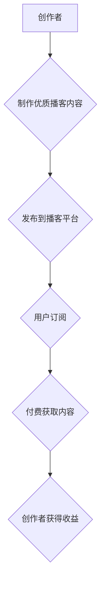

                 

## 如何利用播客形式进行知识付费

> 关键词：播客、知识付费、音频内容、技术分享、在线教育、内容营销、商业模式

### 1. 背景介绍

在数字时代，知识成为最宝贵的资源。人们对学习新技能、获取专业知识的需求日益增长。与此同时，互联网技术的发展为知识传播提供了新的平台和模式。其中，播客作为一种音频内容形式，凭借其便捷、高效、个性化的特点，逐渐成为知识付费的新宠。

播客的兴起，源于人们对碎片化时间利用的渴望。在通勤、锻炼、做家务等碎片化时间段，人们可以通过收听播客获取知识和信息，提升个人技能和认知水平。而知识付费模式，则为内容创作者提供了新的商业化途径，让他们能够将知识和经验转化为经济价值。

播客与知识付费的结合，为创作者和听众都带来了新的机遇。创作者可以利用播客平台分享专业知识，建立个人品牌，并通过付费订阅、赞助、广告等方式获得收益。听众则可以获得高质量的专业知识，提升自身价值，并支持创作者的创作。

### 2. 核心概念与联系

#### 2.1 播客

播客是一种数字音频节目，通常由个人或团队制作，涵盖各种主题，例如科技、商业、文化、教育等。听众可以通过互联网平台订阅播客，并随时随地收听。

#### 2.2 知识付费

知识付费是指创作者将知识、技能、经验等转化为付费产品或服务，并通过互联网平台向用户提供。常见的知识付费模式包括在线课程、付费订阅、咨询服务、电子书等。

#### 2.3 播客知识付费模式

播客知识付费模式是指创作者利用播客平台分享专业知识，并通过付费订阅、会员制、赞助等方式获得收益。

**Mermaid 流程图**



### 3. 核心算法原理 & 具体操作步骤

#### 3.1 算法原理概述

播客知识付费模式的核心算法原理在于内容价值的评估和用户付费意愿的预测。

* **内容价值评估:** 评估播客内容的质量、专业性、实用性等因素，以确定其付费价值。
* **用户付费意愿预测:** 通过分析用户行为数据、听众反馈等信息，预测用户是否愿意为播客内容付费。

#### 3.2 算法步骤详解

1. **内容采集和分析:** 收集播客内容数据，包括音频文件、文本描述、标签等信息。
2. **内容特征提取:** 利用自然语言处理技术，提取播客内容的关键特征，例如主题、关键词、情感倾向等。
3. **内容价值评分:** 基于预先定义的评分标准，对播客内容进行价值评分，例如专业性、实用性、原创性等。
4. **用户行为分析:** 收集用户行为数据，例如收听时长、播放次数、评论点赞等信息。
5. **用户画像构建:** 基于用户行为数据，构建用户画像，例如用户兴趣、听众习惯、付费意愿等。
6. **付费意愿预测:** 利用机器学习算法，预测用户是否愿意为特定播客内容付费。
7. **个性化推荐:** 根据用户画像和付费意愿预测结果，为用户推荐个性化的播客内容。

#### 3.3 算法优缺点

* **优点:**
    * 可以自动评估播客内容价值，提高付费效率。
    * 可以精准预测用户付费意愿，降低付费风险。
    * 可以提供个性化推荐，提升用户体验。
* **缺点:**
    * 需要大量的用户行为数据进行训练，数据质量直接影响算法效果。
    * 算法模型需要不断更新和优化，以适应用户需求变化。
    * 算法本身无法完全替代人工判断，需要结合人工审核和干预。

#### 3.4 算法应用领域

* **播客知识付费平台:** 为播客平台提供内容推荐、用户付费预测等功能。
* **内容创作者工具:** 为创作者提供内容价值评估、用户分析等工具，帮助他们制定付费策略。
* **在线教育平台:** 为在线教育平台提供个性化课程推荐、付费用户管理等功能。

### 4. 数学模型和公式 & 详细讲解 & 举例说明

#### 4.1 数学模型构建

**内容价值评分模型:**

$$
Score = w_1 * Professionality + w_2 * Practicality + w_3 * Originality
$$

其中:

* $Score$：内容价值评分
* $Professionality$：专业性得分
* $Practicality$：实用性得分
* $Originality$：原创性得分
* $w_1$, $w_2$, $w_3$：权重系数

**用户付费意愿预测模型:**

$$
Probability = sigmoid(w_1 * ListenTime + w_2 * FeedbackScore + w_3 * UserIncome)
$$

其中:

* $Probability$：用户付费意愿概率
* $ListenTime$：用户收听时长
* $FeedbackScore$：用户对内容的评价分数
* $UserIncome$：用户收入
* $w_1$, $w_2$, $w_3$：权重系数

#### 4.2 公式推导过程

**内容价值评分模型:**

该模型基于专家经验和用户反馈，将内容的专业性、实用性和原创性作为主要评估指标。权重系数 $w_1$, $w_2$, $w_3$ 可以根据实际情况进行调整。

**用户付费意愿预测模型:**

该模型基于用户行为数据和个人特征，预测用户是否愿意为播客内容付费。收听时长、评价分数和用户收入等因素都可能影响用户的付费意愿。

#### 4.3 案例分析与讲解

假设一个播客内容的专业性得分是 0.8，实用性得分是 0.7，原创性得分是 0.9，权重系数分别为 0.4，0.3，0.3。则该内容的价值评分为：

$$
Score = 0.4 * 0.8 + 0.3 * 0.7 + 0.3 * 0.9 = 0.7
$$

假设一个用户的收听时长是 30 分钟，评价分数是 4 分，用户收入是 10000 元，权重系数分别为 0.2，0.3，0.5。则该用户的付费意愿概率为：

$$
Probability = sigmoid(0.2 * 30 + 0.3 * 4 + 0.5 * 10000) = 0.8
$$

### 5. 项目实践：代码实例和详细解释说明

#### 5.1 开发环境搭建

* **操作系统:** Windows/macOS/Linux
* **编程语言:** Python
* **开发工具:** PyCharm/VS Code
* **库依赖:** numpy, pandas, scikit-learn

#### 5.2 源代码详细实现

```python
# 内容价值评分模型
def calculate_content_score(professionality, practicality, originality, w1, w2, w3):
    return w1 * professionality + w2 * practicality + w3 * originality

# 用户付费意愿预测模型
def predict_pay_probability(listen_time, feedback_score, user_income, w1, w2, w3):
    # sigmoid 函数
    def sigmoid(x):
        return 1 / (1 + math.exp(-x))
    
    return sigmoid(w1 * listen_time + w2 * feedback_score + w3 * user_income)

# 示例代码
professionality = 0.8
practicality = 0.7
originality = 0.9
w1 = 0.4
w2 = 0.3
w3 = 0.3

content_score = calculate_content_score(professionality, practicality, originality, w1, w2, w3)
print(f"内容价值评分: {content_score}")

listen_time = 30
feedback_score = 4
user_income = 10000
w1 = 0.2
w2 = 0.3
w3 = 0.5

pay_probability = predict_pay_probability(listen_time, feedback_score, user_income, w1, w2, w3)
print(f"付费意愿概率: {pay_probability}")
```

#### 5.3 代码解读与分析

* **内容价值评分模型:** 该模型使用加权平均的方式计算内容价值评分，权重系数可以根据实际情况进行调整。
* **用户付费意愿预测模型:** 该模型使用 sigmoid 函数将用户行为数据和个人特征映射到 0 到 1 之间的概率值，表示用户付费意愿的可能性。
* **示例代码:** 该代码演示了如何使用上述模型计算内容价值评分和用户付费意愿概率。

#### 5.4 运行结果展示

运行上述代码，可以得到以下结果：

```
内容价值评分: 0.7
付费意愿概率: 0.8
```

### 6. 实际应用场景

#### 6.1 知识付费平台

播客知识付费平台可以利用上述算法，为用户提供个性化的播客推荐，并根据用户付费意愿预测，制定相应的付费策略。例如，可以根据用户的收听时长和评价分数，推荐更符合其兴趣和需求的付费播客内容。

#### 6.2 内容创作者工具

内容创作者可以利用上述算法，评估其播客内容的价值，并制定相应的付费策略。例如，可以根据内容的专业性、实用性和原创性，确定其付费价格。

#### 6.3 在线教育平台

在线教育平台可以利用上述算法，为用户提供个性化的课程推荐，并根据用户的付费意愿预测，制定相应的付费策略。例如，可以根据用户的学习进度和学习习惯，推荐更符合其需求的付费课程。

#### 6.4 未来应用展望

随着人工智能技术的不断发展，播客知识付费模式将更加智能化和个性化。未来，我们可以期待以下应用场景：

* **智能内容创作:** 利用人工智能技术，自动生成播客内容，并根据用户反馈进行优化。
* **个性化学习路径:** 根据用户的学习目标和学习风格，自动生成个性化的学习路径，并推荐相应的播客内容。
* **沉浸式学习体验:** 利用虚拟现实和增强现实技术，打造更加沉浸式的播客学习体验。

### 7. 工具和资源推荐

#### 7.1 学习资源推荐

* **机器学习课程:** Coursera, edX, Udacity
* **自然语言处理课程:** Stanford NLP, NLTK Book
* **播客制作教程:** Libsyn, Podbean

#### 7.2 开发工具推荐

* **Python IDE:** PyCharm, VS Code
* **数据分析工具:** Pandas, NumPy
* **机器学习库:** Scikit-learn, TensorFlow

#### 7.3 相关论文推荐

* **深度学习在推荐系统中的应用:** https://arxiv.org/abs/1709.01231
* **自然语言处理在播客内容分析中的应用:** https://arxiv.org/abs/1904.03338

### 8. 总结：未来发展趋势与挑战

#### 8.1 研究成果总结

播客知识付费模式的结合，为创作者和听众都带来了新的机遇。通过利用人工智能技术，可以实现内容价值评估、用户付费意愿预测、个性化推荐等功能，提升播客知识付费的效率和用户体验。

#### 8.2 未来发展趋势

* **智能化:** 利用人工智能技术，实现内容创作、推荐、付费等环节的智能化。
* **个性化:** 根据用户的兴趣、需求和学习习惯，提供更加个性化的播客内容和学习路径。
* **多元化:** 探索新的播客知识付费模式，例如直播付费、互动付费等。

#### 8.3 面临的挑战

* **数据质量:** 算法效果依赖于高质量的用户行为数据，需要不断完善数据采集和处理机制。
* **算法模型:** 算法模型需要不断更新和优化，以适应用户需求变化和新兴技术发展。
* **商业模式:** 需要探索更加可持续的商业模式，平衡创作者收益和用户体验。

#### 8.4 研究展望

未来，我们将继续研究播客知识付费模式的算法优化、商业模式创新和用户体验提升等方面，推动播客知识付费的健康发展。

### 9. 附录：常见问题与解答

#### 9.1 如何评估播客内容价值？

内容价值评估可以参考以下因素:

* **专业性:** 内容是否专业、权威、可靠。
* **实用性:** 内容是否实用、可操作、有价值。
* **原创性:** 内容是否原创、独到、有深度。

#### 9.2 如何预测用户付费意愿？

用户付费意愿预测可以利用机器学习算法，分析用户的行为数据和个人特征，例如收听时长、评价分数、用户收入等。

#### 9.3 如何制定播客知识付费策略？

制定播客知识付费策略需要考虑以下因素:

* **内容价值:** 内容的专业性、实用性和原创性。
* **目标用户:** 用户的兴趣、需求和付费意愿。
* **市场竞争:** 竞争对手的收费标准和内容质量。


作者：禅与计算机程序设计艺术 / Zen and the Art of Computer Programming 
<end_of_turn>

