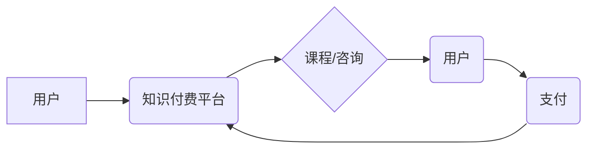

                 

## 如何利用知识付费实现在线创业指导与商业计划书？

> 关键词：知识付费、在线创业、商业计划书、课程开发、市场营销、技术架构、数据分析

## 1. 背景介绍

近年来，互联网技术的发展和移动互联网的普及，为知识付费模式提供了广阔的发展空间。知识付费是指通过付费的方式获取知识、技能和服务的商业模式。它以其便捷性、高效性和个性化特点，迅速成为一种备受关注的商业模式。

在线创业指导与商业计划书是知识付费领域的重要内容。创业者可以通过付费获取专业的创业指导和商业计划书模板，帮助他们更好地规划和执行创业项目。

## 2. 核心概念与联系

**2.1 知识付费模式**

知识付费模式的核心是将知识和技能作为商品，通过线上平台进行销售。它打破了传统教育模式的时空限制，让用户可以随时随地获取所需知识。

**2.2 在线创业指导**

在线创业指导是指通过线上平台提供创业相关的咨询、培训、辅导等服务。它可以帮助创业者解决创业过程中遇到的各种问题，提高创业成功率。

**2.3 商业计划书**

商业计划书是创业者为自己的项目制定的一份详细的规划文档，它包括了项目的背景、目标、市场分析、运营模式、财务预测等内容。一份好的商业计划书可以帮助创业者获得投资、招募人才、管理项目。

**2.4 知识付费平台**

知识付费平台是提供知识付费服务的线上平台，例如：

* **课程平台:**  Udemy, Coursera, Skillshare
* **付费博客平台:** Substack, Patreon
* **直播平台:** Twitch, Bilibili

**2.5 架构图**



## 3. 核心算法原理 & 具体操作步骤

**3.1 算法原理概述**

知识付费平台的运营需要涉及到多个算法，例如：

* **推荐算法:** 根据用户的兴趣和行为，推荐相关的课程或咨询服务。
* **定价算法:** 根据课程的价值、市场需求和竞争情况，制定合理的课程价格。
* **营销算法:** 通过数据分析和模型预测，优化营销策略，提高用户转化率。

**3.2 算法步骤详解**

* **推荐算法:**

    1. 收集用户行为数据，例如：浏览记录、购买记录、评价记录等。
    2. 利用机器学习算法，构建用户兴趣模型。
    3. 根据用户兴趣模型，推荐相关的课程或咨询服务。

* **定价算法:**

    1. 分析课程的价值，例如：课程内容、授课老师、学习效果等。
    2. 研究市场需求，例如：课程的竞争对手、目标用户的付费意愿等。
    3. 根据价值和市场需求，制定合理的课程价格。

* **营销算法:**

    1. 收集用户数据，例如：用户画像、行为特征、购买偏好等。
    2. 利用数据分析工具，挖掘用户需求和痛点。
    3. 根据用户需求，设计精准的营销策略，例如：个性化推荐、定向广告等。

**3.3 算法优缺点**

* **推荐算法:**

    优点：可以提高用户体验，提升课程推荐的精准度。
    缺点：容易陷入推荐偏差，导致用户缺乏探索新知识的动力。

* **定价算法:**

    优点：可以帮助平台制定合理的课程价格，提高盈利能力。
    缺点：需要准确掌握市场信息和用户需求，否则容易导致定价失误。

* **营销算法:**

    优点：可以提高营销效率，降低营销成本。
    缺点：需要收集和分析大量用户数据，存在隐私安全风险。

**3.4 算法应用领域**

* **教育培训:** 推荐课程、制定课程价格、精准营销。
* **在线咨询:** 推荐咨询师、制定咨询价格、精准营销。
* **电子商务:** 推荐商品、制定商品价格、精准营销。

## 4. 数学模型和公式 & 详细讲解 & 举例说明

**4.1 数学模型构建**

知识付费平台的运营可以抽象为一个多变量优化问题，目标是最大化平台的收益，而约束条件包括用户需求、课程成本、平台运营成本等。

**4.2 公式推导过程**

平台收益可以表示为：

$$
收益 = 课程销售收入 - 课程成本 - 平台运营成本
$$

其中：

* 课程销售收入 = 课程价格 * 课程销量
* 课程成本 = 课程制作成本 + 课程推广成本
* 平台运营成本 = 平台维护成本 + 人员成本 + 其他运营成本

**4.3 案例分析与讲解**

假设一个知识付费平台推出了一门编程课程，课程价格为 100 元，预计课程销量为 1000 人，课程制作成本为 5000 元，平台运营成本为 2000 元。

那么，该课程的预期收益为：

$$
收益 = 100元 * 1000人 - 5000元 - 2000元 = 80000元 - 7000元 = 73000元
$$

## 5. 项目实践：代码实例和详细解释说明

**5.1 开发环境搭建**

* **操作系统:** Linux, macOS, Windows
* **编程语言:** Python, JavaScript, Java
* **数据库:** MySQL, PostgreSQL, MongoDB
* **云服务平台:** AWS, Azure, Google Cloud

**5.2 源代码详细实现**

以下是一个简单的 Python 代码示例，用于实现课程推荐算法：

```python
import pandas as pd
from sklearn.metrics.pairwise import cosine_similarity

# 加载用户行为数据
data = pd.read_csv('user_behavior.csv')

# 计算用户-课程之间的余弦相似度
user_item_matrix = data.pivot_table(index='user_id', columns='course_id', values='rating')
similarity_matrix = cosine_similarity(user_item_matrix)

# 获取用户ID
user_id = 1

# 获取用户已观看的课程ID
watched_courses = data[data['user_id'] == user_id]['course_id'].tolist()

# 计算用户与其他课程的相似度
user_similarity = similarity_matrix[user_id]

# 获取相似度最高的课程ID
recommended_courses = user_similarity.argsort()[-5:][::-1]

# 打印推荐课程ID
print(f'推荐课程ID: {recommended_courses}')
```

**5.3 代码解读与分析**

* 该代码首先加载用户行为数据，并构建用户-课程之间的评分矩阵。
* 然后，利用余弦相似度算法计算用户之间和用户与课程之间的相似度。
* 最后，根据用户已观看的课程，推荐相似度最高的课程。

**5.4 运行结果展示**

运行该代码后，将输出用户ID为 1 的用户推荐的 5 个课程ID。

## 6. 实际应用场景

**6.1 在线课程平台**

知识付费平台可以提供各种类型的在线课程，例如：编程、设计、写作、营销等。

**6.2 在线咨询平台**

知识付费平台可以提供在线咨询服务，例如：法律咨询、心理咨询、职业规划等。

**6.3 付费博客平台**

知识付费平台可以提供付费博客服务，例如：专业领域的深度文章、行业分析报告等。

**6.4 未来应用展望**

* **个性化学习:** 利用人工智能技术，为用户提供个性化的学习路径和推荐。
* **沉浸式体验:** 利用虚拟现实和增强现实技术，打造更沉浸式的学习体验。
* **元宇宙学习:** 在元宇宙环境中，提供更丰富的学习场景和互动体验。

## 7. 工具和资源推荐

**7.1 学习资源推荐**

* **书籍:** 《The Lean Startup》、《Zero to One》、《Hooked》
* **课程:** Coursera上的《Entrepreneurship 101》、《Business Strategy》
* **网站:** Startup Grind, TechCrunch, VentureBeat

**7.2 开发工具推荐**

* **课程平台:** Thinkific, Teachable, Kajabi
* **直播平台:** Zoom, GoToWebinar, OBS Studio
* **支付平台:** Stripe, PayPal, Alipay

**7.3 相关论文推荐**

* **知识付费模式研究:** 《知识付费模式的现状与发展趋势》
* **在线创业指导研究:** 《在线创业指导平台的构建与应用》
* **商业计划书研究:** 《商业计划书的写作与应用》

## 8. 总结：未来发展趋势与挑战

**8.1 研究成果总结**

* 知识付费模式发展迅速，成为一种重要的商业模式。
* 在线创业指导和商业计划书是知识付费领域的重要内容。
* 算法技术可以帮助知识付费平台提高运营效率和用户体验。

**8.2 未来发展趋势**

* 个性化学习、沉浸式体验、元宇宙学习将成为未来知识付费发展趋势。
* 知识付费平台将更加注重用户体验和内容质量。
* 知识付费平台将与其他行业融合，形成新的商业模式。

**8.3 面临的挑战**

* 如何提高用户粘性，防止用户流失。
* 如何保证内容质量，避免低质量内容泛滥。
* 如何应对监管政策的变化，确保平台合法合规运营。

**8.4 研究展望**

* 深入研究知识付费模式的生态系统，探索新的商业模式。
* 研究人工智能技术在知识付费领域的应用，提高平台运营效率。
* 研究知识付费对教育和社会发展的影响，促进知识共享和创新。

## 9. 附录：常见问题与解答

**9.1 如何选择合适的知识付费平台？**

* 考虑平台的定位、用户群体、课程类型等因素。
* 了解平台的收费标准、服务内容、技术支持等情况。
* 阅读其他用户的评价和反馈，了解平台的优缺点。

**9.2 如何制作高质量的知识付费课程？**

* 确定课程目标和受众群体。
* 规划课程内容，确保内容丰富、实用、有价值。
* 使用专业的拍摄和制作工具，制作高质量的视频和音频内容。
* 提供完善的售后服务，及时解答用户的疑问。


作者：禅与计算机程序设计艺术 / Zen and the Art of Computer Programming 
<end_of_turn>

