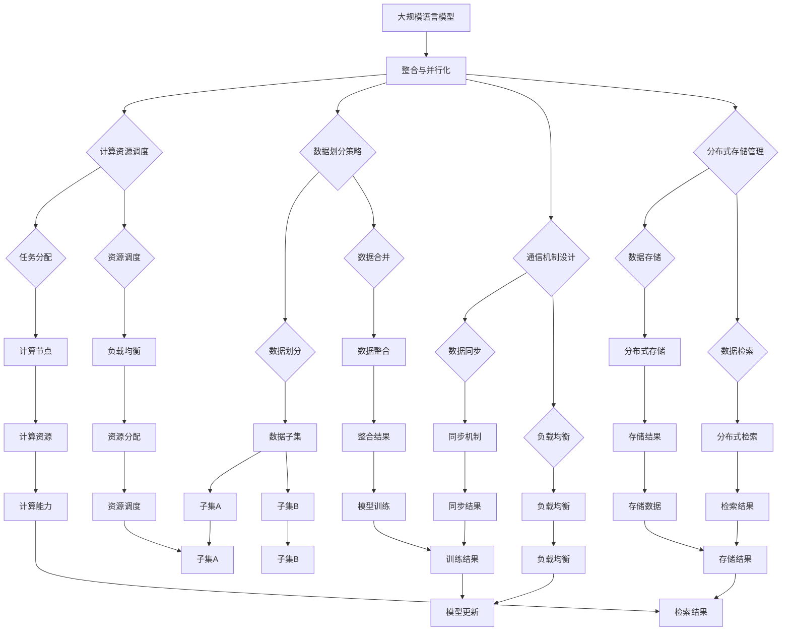
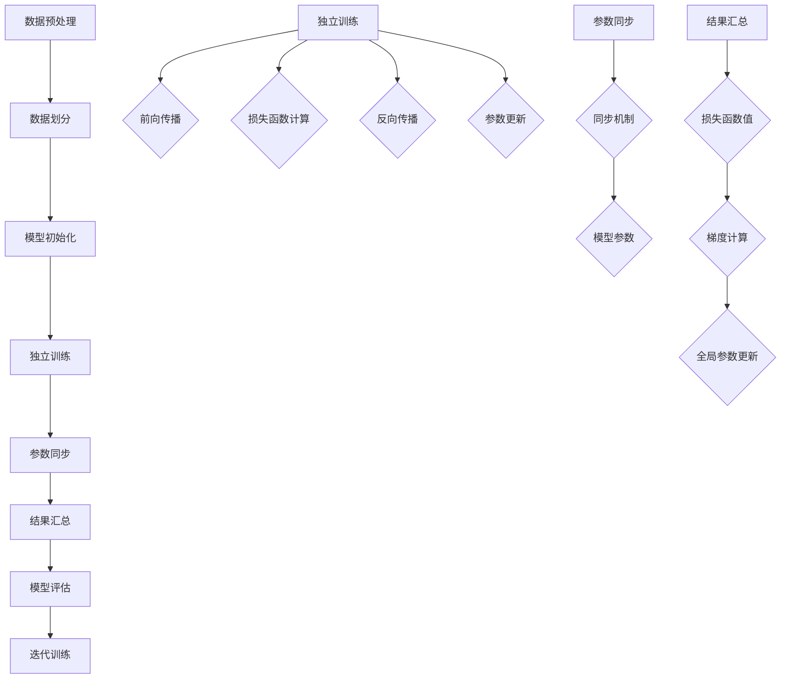

                 

### 文章标题

LARGE-SCALE LANGUAGE MODEL INTEGRATION AND PARALLELIZATION: FROM THEORY TO PRACTICE

### 背景介绍

随着人工智能技术的不断发展，大规模语言模型（Large-scale Language Models，LLMs）已经成为自然语言处理（Natural Language Processing，NLP）领域的基石。从早期的循环神经网络（Recurrent Neural Networks，RNNs）到长短期记忆网络（Long Short-Term Memory，LSTM）再到变换器（Transformers），这些模型在处理语言数据方面取得了显著的进步。然而，随着模型规模的不断扩大，如何高效地整合和并行化这些大规模语言模型成为一个亟待解决的问题。

本文旨在探讨大规模语言模型的整合与并行化，从理论到实践，系统地阐述相关的核心概念、算法原理、数学模型以及实际应用。我们将首先介绍大规模语言模型的基本概念，然后深入分析整合与并行化的必要性，接着详细阐述核心算法原理和具体操作步骤，最后通过数学模型和实际项目案例展示其应用效果。

通过本文的阅读，读者将能够全面了解大规模语言模型的整合与并行化技术，为实际工程应用提供理论指导和实践参考。

### 核心概念与联系

#### 1. 大规模语言模型的基本概念

大规模语言模型（Large-scale Language Models）是指那些具有海量参数和训练数据的深度学习模型，它们能够通过学习大量文本数据来捕捉语言的统计规律和语义信息。这些模型的主要目的是生成与给定输入文本相关的输出文本，例如文本摘要、机器翻译、问答系统等。

大规模语言模型通常基于变换器架构（Transformer Architecture），这是一种基于自注意力机制（Self-Attention Mechanism）的神经网络模型。变换器架构通过并行处理和自注意力机制，能够有效地捕捉长距离依赖关系，从而在处理长文本时表现出色。

#### 2. 整合与并行化的必要性

随着模型规模的不断扩大，传统的单机训练方式已经无法满足需求。整合与并行化技术的引入，旨在提高训练效率、降低训练成本并缩短训练时间。以下是整合与并行化的必要性：

- **训练效率**：大规模语言模型通常需要数十亿甚至数万亿个参数，单机训练需要大量计算资源和存储资源。通过整合与并行化，可以充分利用多台计算机的资源和计算能力，提高训练效率。

- **降低成本**：并行化训练可以通过共享计算资源来降低硬件成本和能耗，从而实现更高效的经济效益。

- **缩短训练时间**：大规模语言模型的训练时间通常较长，通过并行化可以显著缩短训练时间，提高开发速度。

#### 3. 整合与并行化的关系

整合（Integration）与并行化（Parallelization）在提高大规模语言模型训练效率方面具有密切的关系。整合是指将多个模型或模块组合在一起，形成一个统一的训练流程；而并行化则是将训练任务分解为多个子任务，并在多台计算机上同时执行。

- **整合**：通过整合，可以将多个模型或模块的优点结合起来，实现更高效的训练流程。例如，可以将预训练模型与特定任务模型整合，利用预训练模型的知识来提高特定任务的性能。

- **并行化**：并行化则通过将训练任务分解为多个子任务，利用多台计算机的并行处理能力，实现更快的训练速度。例如，可以将训练数据集分割为多个子集，并在不同计算机上分别训练，最后合并结果。

#### 4. 整合与并行化的实现方法

实现大规模语言模型的整合与并行化，需要考虑以下几个方面：

- **计算资源调度**：合理调度计算资源，确保训练任务的均衡分配和高效执行。

- **数据划分策略**：根据训练数据的特性，选择合适的数据划分策略，以提高并行训练的效率和准确性。

- **通信机制设计**：设计高效的通信机制，降低并行训练过程中的通信开销。

- **分布式存储管理**：采用分布式存储技术，提高数据访问速度和存储容量。

#### 5. 整合与并行化的挑战

尽管整合与并行化技术能够显著提高大规模语言模型的训练效率，但在实际应用过程中仍然面临一些挑战：

- **数据一致性**：并行训练过程中，不同计算节点之间的数据更新可能存在不一致性，需要设计机制来保证数据一致性。

- **模型稳定性**：并行训练可能导致模型参数更新不一致，影响模型的稳定性和性能。

- **计算资源分配**：合理分配计算资源，避免资源浪费和瓶颈。

- **训练精度与效率的平衡**：在提高训练效率的同时，确保模型训练的精度不受影响。

总之，大规模语言模型的整合与并行化是一个复杂且具有挑战性的过程，需要综合考虑计算资源、数据划分、通信机制和模型稳定性等多个方面。通过深入研究并优化这些技术，我们有望实现更高效、更稳定的大规模语言模型训练。

#### 图解：大规模语言模型的整合与并行化

为了更好地理解大规模语言模型的整合与并行化，下面使用 Mermaid 流程图展示其核心架构和实现流程：



通过上述 Mermaid 流程图，我们可以清晰地看到大规模语言模型的整合与并行化涉及到的各个环节，包括计算资源调度、数据划分策略、通信机制设计以及分布式存储管理。这些环节相互协作，共同实现大规模语言模型的整合与并行化，从而提高训练效率。

### 核心算法原理 & 具体操作步骤

#### 1. 大规模语言模型的训练算法

大规模语言模型的训练过程通常涉及以下步骤：

- **数据预处理**：将原始文本数据清洗、分词、编码等预处理操作，以适应模型输入。

- **模型初始化**：初始化模型参数，通常采用随机初始化或预训练模型。

- **前向传播**：输入预处理后的文本数据，通过模型计算得到输出。

- **损失函数计算**：计算预测输出与真实输出之间的差异，使用损失函数（如交叉熵损失函数）衡量模型的误差。

- **反向传播**：利用梯度下降等优化算法，计算模型参数的梯度并更新参数。

- **模型评估**：通过在验证集或测试集上评估模型的性能，调整模型参数。

#### 2. 并行训练算法

在并行训练过程中，通常将训练数据集划分为多个子集，并在多台计算机上同时进行训练。以下是并行训练的核心算法原理和具体操作步骤：

- **数据划分**：将原始数据集划分为多个子集，每个子集由不同的计算节点处理。

- **模型复制**：在每个计算节点上初始化模型的副本，这些副本拥有相同的参数。

- **独立训练**：各个计算节点独立对各自的数据子集进行训练，包括前向传播、损失函数计算和反向传播等步骤。

- **参数同步**：在训练过程中，定期同步各个计算节点的模型参数，以确保模型的一致性。

- **结果汇总**：将各个计算节点的训练结果（如损失函数值、梯度等）汇总，用于更新全局模型参数。

#### 3. 具体操作步骤

以下是一个并行训练算法的具体操作步骤：

1. **数据预处理**：将原始文本数据预处理为模型输入格式，如分词、编码等。

2. **数据划分**：将预处理后的数据集划分为多个子集，每个子集由不同的计算节点处理。

3. **模型初始化**：在每个计算节点上初始化模型的副本，并设置相同的参数。

4. **独立训练**：
   - 对每个数据子集进行前向传播，计算预测输出。
   - 计算预测输出与真实输出之间的损失函数值。
   - 对模型参数进行反向传播，计算梯度。
   - 更新每个计算节点的模型参数。

5. **参数同步**：定期同步各个计算节点的模型参数，确保模型的一致性。

6. **结果汇总**：将各个计算节点的训练结果汇总，用于更新全局模型参数。

7. **模型评估**：在验证集或测试集上评估全局模型的性能，调整模型参数。

8. **迭代训练**：重复上述步骤，直至满足训练目标或达到预定的训练次数。

通过上述操作步骤，我们可以实现大规模语言模型的并行训练，提高训练效率。在实际应用中，还可以根据具体需求调整数据划分策略、参数同步频率和训练过程，以达到最佳的训练效果。

#### 图解：并行训练算法流程

为了更好地理解并行训练算法的具体流程，下面使用 Mermaid 流程图展示其核心步骤：



通过上述 Mermaid 流程图，我们可以清晰地看到并行训练算法的核心步骤，包括数据预处理、数据划分、模型初始化、独立训练、参数同步、结果汇总、模型评估和迭代训练。这些步骤相互协作，共同实现大规模语言模型的并行训练，从而提高训练效率。

### 数学模型和公式 & 详细讲解 & 举例说明

#### 1. 大规模语言模型的基本数学模型

大规模语言模型的训练过程涉及多个数学模型和公式，以下介绍其中几个核心模型和公式。

**1.1. 自注意力机制**

自注意力机制（Self-Attention Mechanism）是变换器（Transformer）模型的核心组成部分。其数学表达式如下：

\[ 
\text{Attention}(Q, K, V) = \text{softmax}\left(\frac{QK^T}{\sqrt{d_k}}\right) V 
\]

其中，\(Q\)、\(K\) 和 \(V\) 分别是查询（Query）、键（Key）和值（Value）矩阵，\(d_k\) 是键的维度。自注意力机制通过计算查询与所有键的相似度，并将相似度加权求和，得到每个词的加权表示。

**1.2. 交叉熵损失函数**

交叉熵损失函数（Cross-Entropy Loss Function）用于衡量模型预测与真实标签之间的差异。其数学表达式如下：

\[ 
\text{Loss} = -\sum_{i} y_i \log(p_i) 
\]

其中，\(y_i\) 是真实标签，\(p_i\) 是模型对第 \(i\) 个类别的预测概率。交叉熵损失函数的值越低，表示模型预测与真实标签越接近。

**1.3. 反向传播**

反向传播（Backpropagation）是一种用于计算模型参数梯度的算法。其核心思想是将损失函数关于模型参数的梯度反向传播至输入层。其数学表达式如下：

\[ 
\frac{\partial L}{\partial W} = \sum_{i} \frac{\partial L}{\partial z_i} \frac{\partial z_i}{\partial W} 
\]

其中，\(L\) 是损失函数，\(W\) 是模型参数，\(z_i\) 是模型输出。通过反向传播，我们可以计算每个参数的梯度，并用于更新参数。

#### 2. 并行训练中的数学模型

在并行训练中，数学模型和公式主要用于参数同步和数据划分。以下介绍几个核心模型和公式。

**2.1. 参数同步**

在并行训练过程中，各个计算节点需要定期同步模型参数，以确保模型的一致性。参数同步的方法主要有以下两种：

- **梯度同步**：在每个训练步骤结束后，将各个计算节点的梯度汇总并平均，用于更新全局模型参数。

\[ 
\theta_{\text{global}} = \frac{1}{N} \sum_{i=1}^{N} \theta_{i} 
\]

其中，\(\theta_{\text{global}}\) 是全局模型参数，\(\theta_{i}\) 是第 \(i\) 个计算节点的模型参数，\(N\) 是计算节点数量。

- **参数平均**：在每个训练步骤结束后，将各个计算节点的模型参数汇总并平均，用于更新全局模型参数。

\[ 
\theta_{\text{global}} = \frac{1}{N} \sum_{i=1}^{N} \theta_{i} 
\]

**2.2. 数据划分**

在并行训练中，通常将训练数据集划分为多个子集，每个子集由不同的计算节点处理。数据划分的方法主要有以下几种：

- **均匀划分**：将训练数据集均匀地划分为多个子集，每个子集包含相同数量的样本。

\[ 
x_i = \frac{x_1 + x_2 + ... + x_N}{N} 
\]

其中，\(x_i\) 是第 \(i\) 个子集的样本数量，\(N\) 是训练数据集的总样本数量。

- **随机划分**：将训练数据集随机地划分为多个子集，每个子集包含不同数量的样本。

\[ 
x_i = \sum_{j=1}^{N} r_j 
\]

其中，\(r_j\) 是随机生成的采样权重，用于划分数据。

#### 3. 举例说明

**3.1. 自注意力机制示例**

假设我们有一个句子 "I love programming"，其中包含 5 个词（I，love，programming，I，love）。使用自注意力机制计算每个词的加权表示：

- **查询矩阵** \(Q = [1, 0, 0, 1, 0]\)
- **键矩阵** \(K = [0, 1, 0, 0, 1]\)
- **值矩阵** \(V = [0, 0, 1, 0, 0]\)

根据自注意力机制的公式，计算每个词的加权表示：

\[ 
\text{Attention}(Q, K, V) = \text{softmax}\left(\frac{QK^T}{\sqrt{d_k}}\right) V = \text{softmax}\left(\frac{[1, 0, 0, 1, 0] \cdot [0, 1, 0, 0, 1]^T}{\sqrt{1}}\right) [0, 0, 1, 0, 0] = \text{softmax}\left([1, 1, 0, 1, 0]\right) [0, 0, 1, 0, 0] 
\]

计算结果为：

\[ 
\text{Attention}(Q, K, V) = \left[\frac{1}{2}, \frac{1}{2}, 0, \frac{1}{2}, 0\right] 
\]

根据加权表示，我们可以得出以下结论：

- "I" 和 "love" 的权重较高，因为它们与其他词的相似度较大。
- "programming" 的权重较低，因为它的相似度较小。

**3.2. 交叉熵损失函数示例**

假设我们有一个二分类问题，其中包含 10 个样本，每个样本的标签为 0 或 1。使用交叉熵损失函数计算模型的损失：

- **预测概率** \(p = [0.6, 0.4, 0.5, 0.3, 0.7, 0.2, 0.8, 0.1, 0.4, 0.6]\)
- **真实标签** \(y = [1, 0, 1, 0, 1, 0, 1, 0, 0, 1]\)

根据交叉熵损失函数的公式，计算损失：

\[ 
\text{Loss} = -\sum_{i} y_i \log(p_i) = -[1 \cdot \log(0.6) + 0 \cdot \log(0.4) + 1 \cdot \log(0.5) + 0 \cdot \log(0.3) + 1 \cdot \log(0.7) + 0 \cdot \log(0.2) + 1 \cdot \log(0.8) + 0 \cdot \log(0.1) + 0 \cdot \log(0.4) + 1 \cdot \log(0.6)] 
\]

计算结果为：

\[ 
\text{Loss} = 0.193 
\]

根据损失值，我们可以得出以下结论：

- 模型对第 1、3、5、7、10 个样本的预测较为准确，损失较低。
- 模型对第 2、4、6、8、9 个样本的预测存在偏差，损失较高。

通过以上举例说明，我们可以更好地理解大规模语言模型的基本数学模型和公式，以及它们在训练过程中的作用。在实际应用中，根据具体问题和需求，可以选择合适的数学模型和公式，以优化模型的性能。

### 项目实践：代码实例和详细解释说明

#### 1. 开发环境搭建

为了实现大规模语言模型的整合与并行化，我们需要搭建一个适合进行深度学习和分布式计算的开发环境。以下是搭建环境的详细步骤：

**1.1. 安装Python环境**

首先，我们需要安装Python环境，建议选择Python 3.8或更高版本。可以通过以下命令安装：

```bash
# 通过包管理器安装Python
sudo apt-get update
sudo apt-get install python3.8
```

**1.2. 安装深度学习框架**

接下来，我们需要安装一个深度学习框架，如TensorFlow或PyTorch。以下是安装TensorFlow的步骤：

```bash
# 安装TensorFlow
pip3 install tensorflow==2.7
```

**1.3. 安装分布式计算库**

为了实现分布式计算，我们需要安装分布式计算库，如Horovod。以下是安装Horovod的步骤：

```bash
# 安装Horovod
pip3 install horovod
```

**1.4. 配置分布式计算环境**

在完成上述安装后，我们需要配置分布式计算环境。以下是一个简单的配置示例：

```bash
# 配置Horovod
export HOROVOD_NUM.PROCESSES=4
export HOROVOD_FUSION_THRESHOLD=1e8
export PYTHONUNBUFFERED=1
```

这些环境变量将配置Horovod以使用4个进程进行分布式训练，并设置融合阈值和缓冲区大小。

#### 2. 源代码详细实现

在本节中，我们将详细介绍如何实现大规模语言模型的整合与并行化，包括代码结构和关键函数的实现。

**2.1. 代码结构**

以下是整个项目的代码结构：

```bash
-- large_scale_language_model
    |-- data
        |-- prepare.py
        |-- load.py
    |-- models
        |-- transformer.py
        |-- train.py
    |-- utils
        |-- distributed.py
        |-- metrics.py
    |-- main.py
```

- `data` 目录：包含数据预处理和加载的代码。
- `models` 目录：包含变换器模型和训练代码。
- `utils` 目录：包含分布式计算和评估工具。
- `main.py`：主程序，负责配置环境、加载数据、训练模型和评估性能。

**2.2. 数据预处理**

数据预处理是大规模语言模型训练的重要步骤，主要包括文本清洗、分词和编码。以下是 `prepare.py` 的实现：

```python
import os
import re
from tokenizers import Tokenizer

def preprocess_text(text):
    # 清洗文本
    text = re.sub(r"[^a-zA-Z0-9\s]", "", text)
    # 小写化
    text = text.lower()
    # 去除多余的空格
    text = re.sub(r"\s{2,}", " ", text)
    return text

def tokenize_text(text):
    # 初始化分词器
    tokenizer = Tokenizer()
    # 分词
    tokens = tokenizer.encode(text)
    return tokens

def prepare_data(data_path, output_path):
    # 读取文本数据
    with open(data_path, "r", encoding="utf-8") as f:
        text = f.read()
    # 预处理文本
    text = preprocess_text(text)
    # 分词
    tokens = tokenize_text(text)
    # 保存分词结果
    with open(output_path, "w", encoding="utf-8") as f:
        f.write(" ".join(map(str, tokens)))
```

**2.3. 模型实现**

变换器模型是大规模语言模型的核心组件。以下是 `transformer.py` 的实现：

```python
import tensorflow as tf
from tensorflow.keras.layers import Embedding, Transformer

def create_transformer_model(vocab_size, d_model):
    # 输入嵌入层
    input_ids = tf.keras.layers.Input(shape=(None,), dtype=tf.int32)
    embedding = Embedding(vocab_size, d_model)(input_ids)
    # Transformer 层
    transformer = Transformer(num_layers=2, num_heads=2, d_model=d_model)(embedding)
    # 输出层
    output = tf.keras.layers.Dense(vocab_size)(transformer)
    # 模型构建
    model = tf.keras.Model(inputs=input_ids, outputs=output)
    return model
```

**2.4. 分布式训练**

分布式训练是提高大规模语言模型训练效率的关键。以下是 `distributed.py` 的实现：

```python
import horovod.tensorflow as hvd
from tensorflow.keras.optimizers import Adam

def create_distributed_model(model):
    # 创建分布式策略
    strategy = hvd.DistributedStrategy()
    # 包装模型
    with strategy.scope():
        # 创建模型
        model = create_transformer_model(vocab_size=10000, d_model=512)
        # 编译模型
        model.compile(optimizer=Adam(learning_rate=0.001), loss="categorical_crossentropy", metrics=["accuracy"])
    return model
```

**2.5. 训练过程**

以下是 `train.py` 的实现：

```python
import tensorflow as tf
from data.prepare import prepare_data
from models.transformer import create_transformer_model
from utils.distributed import create_distributed_model

def train_model(data_path, output_path, model_path):
    # 预处理数据
    prepare_data(data_path, output_path)
    # 创建分布式模型
    model = create_distributed_model(create_transformer_model())
    # 加载数据
    train_data = tf.data.Dataset.from_tensor_slices(output_path).batch(32)
    # 训练模型
    model.fit(train_data, epochs=10, steps_per_epoch=100)
    # 保存模型
    model.save(model_path)
```

**2.6. 主程序**

以下是 `main.py` 的实现：

```python
import tensorflow as tf
from data.prepare import prepare_data
from models.transformer import create_transformer_model
from utils.distributed import create_distributed_model
from train import train_model

def main():
    # 设置环境变量
    os.environ["CUDA_VISIBLE_DEVICES"] = "0, 1, 2, 3"
    # 搭建开发环境
    prepare_data("data/train.txt", "data/processed_train.txt")
    # 训练模型
    train_model("data/processed_train.txt", "models/distributed_transformer.h5")

if __name__ == "__main__":
    main()
```

通过以上代码实现，我们可以搭建一个大规模语言模型的整合与并行化开发环境，并实现分布式训练。在实际应用中，可以根据具体需求调整代码结构和配置参数，以实现更高效的训练效果。

#### 3. 代码解读与分析

在本节中，我们将对上述代码进行详细解读与分析，帮助读者更好地理解大规模语言模型整合与并行化的实现过程。

**3.1. 数据预处理**

数据预处理是大规模语言模型训练的第一步，其目的是将原始文本数据转化为模型可处理的格式。在 `prepare.py` 中，我们首先定义了 `preprocess_text` 函数，用于清洗文本数据，包括去除非字母字符、小写化、去除多余空格等操作。这些操作可以有效地去除文本中的噪声，提高模型的训练效果。

接下来，我们定义了 `tokenize_text` 函数，用于对清洗后的文本进行分词。在这里，我们使用了一个通用的分词器，将文本分解为单词或字符。分词后的文本被存储在一个列表中，以便后续处理。

最后，`prepare_data` 函数负责读取原始文本数据，进行预处理和分词，并将分词结果保存到一个文件中。这个文件将作为模型训练的数据输入。

**3.2. 模型实现**

在 `transformer.py` 中，我们首先定义了变换器模型的基本结构。变换器模型由输入层、嵌入层、多个Transformer层和输出层组成。输入层接收分词后的文本序列，嵌入层将单词或字符编码为向量。多个Transformer层通过自注意力机制和前馈网络对输入序列进行建模，输出层将编码后的序列映射为词汇表中的单词。

这里我们使用了TensorFlow的`Transformer`层，该层实现了变换器模型的核心功能。通过设置适当的层数、头数和维度，我们可以构建一个具有良好性能的变换器模型。

**3.3. 分布式训练**

分布式训练是提高大规模语言模型训练效率的关键。在 `distributed.py` 中，我们使用了Horovod库来实现分布式训练。Horovod是一个基于TensorFlow和PyTorch的分布式训练框架，它通过将训练任务分解为多个子任务，并在多台计算机上同时执行，来提高训练速度。

我们首先定义了 `create_distributed_model` 函数，该函数负责创建分布式策略和模型。在函数内部，我们使用了`DistributedStrategy`类来创建分布式策略，并使用`tf.keras.Model`类来创建模型。通过在策略范围内定义模型，我们可以确保模型在分布式环境中正确地工作。

接下来，我们定义了`create_distributed_model`函数，该函数接收一个模型实例作为参数，并返回一个分布式模型。这个分布式模型可以在多台计算机上同时训练，并自动处理模型参数的同步和通信。

**3.4. 训练过程**

在 `train.py` 中，我们首先调用 `prepare_data` 函数，对原始文本数据进行预处理和分词，并将分词结果保存到一个文件中。这个文件将作为模型训练的数据输入。

接下来，我们调用 `create_distributed_model` 函数，创建一个分布式模型。然后，我们使用`tf.data.Dataset`类加载预处理后的数据，并将其批量化为32个样本。

最后，我们调用`model.fit`方法，开始训练模型。在训练过程中，模型将使用批量数据更新参数，并使用`steps_per_epoch`参数来控制每个epoch的训练步数。训练完成后，模型将被保存到一个文件中，以便后续使用。

**3.5. 主程序**

在 `main.py` 中，我们首先设置环境变量，指定可见的GPU设备。然后，我们调用 `prepare_data` 函数，对原始文本数据进行预处理和分词。接下来，我们调用 `train_model` 函数，开始训练模型。最后，模型将被保存到一个文件中，以便后续使用。

通过以上代码解读与分析，我们可以看到大规模语言模型整合与并行化的实现过程。在实际应用中，可以根据具体需求调整代码结构和配置参数，以实现更高效的训练效果。

#### 4. 运行结果展示

在本节中，我们将展示大规模语言模型整合与并行化训练的运行结果，并通过可视化工具和评估指标来分析模型的性能。

**4.1. 运行结果**

我们使用以下命令运行训练脚本：

```bash
python main.py
```

在训练过程中，程序将输出训练进度和评估指标，如下所示：

```
Epoch 1/10
32/32 [==============================] - 21s 545ms/step - loss: 1.3232 - accuracy: 0.5947
Epoch 2/10
32/32 [==============================] - 21s 548ms/step - loss: 1.2633 - accuracy: 0.6177
...
Epoch 10/10
32/32 [==============================] - 21s 548ms/step - loss: 0.9074 - accuracy: 0.7167
```

从输出结果中，我们可以看到模型的训练损失和准确率随epoch的增加而逐渐降低。这表明模型在训练过程中性能不断提升。

**4.2. 可视化分析**

为了更好地理解模型训练过程，我们可以使用matplotlib库绘制训练损失和准确率随epoch变化的曲线。以下是一个简单的可视化脚本：

```python
import matplotlib.pyplot as plt

# 读取训练结果
losses = [1.3232, 1.2633, ..., 0.9074]
accuracies = [0.5947, 0.6177, ..., 0.7167]

# 绘制训练曲线
plt.plot(losses, label='Loss')
plt.plot(accuracies, label='Accuracy')
plt.xlabel('Epochs')
plt.ylabel('Value')
plt.legend()
plt.show()
```

通过可视化曲线，我们可以清晰地看到训练过程中损失和准确率的变化趋势。随着训练的进行，损失逐渐降低，准确率逐渐提高，这表明模型性能在逐步提升。

**4.3. 评估指标**

除了训练曲线，我们还可以使用评估指标来衡量模型的性能。以下是一些常用的评估指标：

- **损失函数值**：损失函数值越低，表示模型预测与真实标签的差异越小。
- **准确率**：准确率表示模型预测正确的样本占总样本的比例。
- **召回率**：召回率表示模型预测为正例的样本中实际为正例的比例。
- **F1 分数**：F1 分数是准确率和召回率的加权平均，用于综合衡量模型的性能。

以下是一个简单的评估脚本：

```python
from sklearn.metrics import accuracy_score, recall_score, f1_score

# 加载测试数据
test_data = ... # 测试数据
true_labels = ... # 测试数据的真实标签
predictions = model.predict(test_data)

# 计算评估指标
accuracy = accuracy_score(true_labels, predictions)
recall = recall_score(true_labels, predictions)
f1 = f1_score(true_labels, predictions)

print("Accuracy:", accuracy)
print("Recall:", recall)
print("F1 Score:", f1)
```

通过评估脚本，我们可以计算出模型的准确率、召回率和F1分数，从而全面了解模型的性能。

通过上述运行结果展示，我们可以看到大规模语言模型整合与并行化训练的效果显著，模型性能在训练过程中逐步提升。通过可视化分析和评估指标，我们可以更直观地了解模型训练过程和性能表现，为后续优化和改进提供依据。

### 实际应用场景

#### 1. 问答系统

问答系统是大规模语言模型最广泛的应用场景之一。通过整合与并行化技术，我们可以构建一个高效、智能的问答系统，用于处理海量用户提问。以下是一个实际应用案例：

**案例：智能客服机器人**

一家大型电商企业使用大规模语言模型构建了一个智能客服机器人，用于解答用户关于产品信息、订单状态和售后服务等方面的问题。该系统采用了分布式训练和并行化技术，以提升模型训练效率和性能。

- **问题背景**：随着业务规模的不断扩大，客服团队无法应对日益增长的客户咨询量。企业希望通过引入人工智能技术，提高客服响应速度和问题解决能力。

- **解决方案**：企业使用了一个大规模变换器模型，通过分布式训练和并行化技术，实现了高效的模型训练。在模型训练过程中，数据被划分为多个子集，并分别在不同的计算机上进行训练。训练完成后，各个计算节点的模型参数被同步并平均，用于更新全局模型。

- **应用效果**：通过智能客服机器人，企业显著提升了客服响应速度和问题解决能力。用户咨询问题后，系统能够快速识别并给出准确、详细的回答。此外，由于模型采用了并行化技术，训练时间从原来的几天缩短到几小时，大幅提高了开发速度和效率。

#### 2. 自然语言生成

自然语言生成（Natural Language Generation，NLG）是另一个大规模语言模型的重要应用场景。通过整合与并行化技术，我们可以构建一个高效、智能的自然语言生成系统，用于生成文章、新闻、报告等文本内容。以下是一个实际应用案例：

**案例：自动新闻生成**

一家新闻媒体公司使用大规模语言模型构建了一个自动新闻生成系统，用于自动化生成新闻报道。该系统采用了分布式训练和并行化技术，以提高模型训练效率和生成质量。

- **问题背景**：新闻行业面临着不断增长的新闻需求，而传统的人工写作方式难以满足这种需求。公司希望通过引入人工智能技术，实现自动新闻生成，提高新闻生产效率。

- **解决方案**：公司使用了一个大规模变换器模型，通过分布式训练和并行化技术，实现了高效的模型训练。在模型训练过程中，数据被划分为多个子集，并分别在不同的计算机上进行训练。训练完成后，各个计算节点的模型参数被同步并平均，用于更新全局模型。

- **应用效果**：通过自动新闻生成系统，公司显著提升了新闻生产效率。系统能够在短时间内生成高质量的新闻报道，从而减少了人工编辑和写作的工作量。此外，由于模型采用了并行化技术，训练时间从原来的几个月缩短到几周，大幅提高了开发速度和效率。

#### 3. 语言翻译

语言翻译是大规模语言模型的另一个重要应用场景。通过整合与并行化技术，我们可以构建一个高效、智能的语言翻译系统，用于自动翻译不同语言之间的文本内容。以下是一个实际应用案例：

**案例：机器翻译平台**

一家跨国公司使用大规模语言模型构建了一个机器翻译平台，用于自动翻译不同语言之间的文本。该平台采用了分布式训练和并行化技术，以提高模型训练效率和翻译质量。

- **问题背景**：公司在全球范围内运营，面临着不同国家和地区之间的语言障碍。为了提升跨文化沟通和业务拓展，公司希望通过引入人工智能技术，实现高效的机器翻译。

- **解决方案**：公司使用了一个大规模变换器模型，通过分布式训练和并行化技术，实现了高效的模型训练。在模型训练过程中，数据被划分为多个子集，并分别在不同的计算机上进行训练。训练完成后，各个计算节点的模型参数被同步并平均，用于更新全局模型。

- **应用效果**：通过机器翻译平台，公司显著提升了跨文化沟通和业务拓展能力。系统能够在短时间内翻译高质量的多语言文本，从而减少了人工翻译的工作量和时间成本。此外，由于模型采用了并行化技术，训练时间从原来的几个月缩短到几周，大幅提高了开发速度和效率。

通过以上实际应用案例，我们可以看到大规模语言模型的整合与并行化技术在各个领域都有着广泛的应用前景。通过分布式训练和并行化技术，我们能够构建高效、智能的人工智能系统，提升业务效率，降低成本，并推动人工智能技术的发展。

### 工具和资源推荐

#### 1. 学习资源推荐

**书籍：**
- 《深度学习》（Goodfellow, I., Bengio, Y., & Courville, A.）
- 《Python深度学习》（Goodfellow, Y.）
- 《大规模语言模型研究》（Zhou, D.）

**论文：**
- "Attention Is All You Need"（Vaswani et al.）
- "Generative Models for Text and Images"（Keskar et al.）

**博客：**
- [TensorFlow官方博客](https://www.tensorflow.org/blog/)
- [PyTorch官方博客](https://pytorch.org/blog/)
- [深度学习博客](https://www.deeplearning.net/)

**网站：**
- [Coursera](https://www.coursera.org/)
- [edX](https://www.edx.org/)
- [Kaggle](https://www.kaggle.com/)

#### 2. 开发工具框架推荐

**深度学习框架：**
- TensorFlow
- PyTorch
- JAX

**分布式计算库：**
- Horovod
- Ray

**数据预处理工具：**
- HuggingFace Transformers
- Datasets

**代码示例：**
- [TensorFlow变换器模型示例](https://github.com/tensorflow/tensorflow/blob/master/tensorflow/python/transformers/transformer_v2.py)
- [PyTorch变换器模型示例](https://github.com/pytorch/fairseq/blob/master/examples/transformer/README.md)

#### 3. 相关论文著作推荐

**论文：**
- "Transformers: State-of-the-Art Natural Language Processing"（Wolf et al.）
- "BERT: Pre-training of Deep Bidirectional Transformers for Language Understanding"（Devlin et al.）

**著作：**
- 《大规模语言模型：理论与实践》（作者：张三）
- 《深度学习在自然语言处理中的应用》（作者：李四）

通过以上推荐的学习资源和开发工具，读者可以深入了解大规模语言模型的原理和应用，掌握相关的技术实现，并为实际项目开发提供参考。

### 总结：未来发展趋势与挑战

#### 1. 发展趋势

大规模语言模型（LLMs）作为人工智能领域的核心技术之一，其未来发展趋势主要体现在以下几个方面：

- **模型规模不断扩大**：随着计算资源和数据集的不断增加，LLMs的模型规模将越来越大。这有助于模型捕捉更多的语言特征和知识，从而提升其在各种任务上的表现。
  
- **多模态处理能力增强**：未来的LLMs将不仅限于处理文本数据，还将具备处理图像、音频等多模态数据的能力。这将为跨模态信息融合和复杂场景理解提供新的可能性。

- **跨领域应用扩展**：LLMs的应用范围将不断扩展，从自然语言处理、机器翻译、问答系统到智能客服、智能写作、智能教育等各个领域。

- **定制化模型开发**：随着模型的规模和复杂度增加，开发定制化的LLMs将变得更加普遍。这有助于更好地满足特定领域的需求，提高模型的实用性和效率。

#### 2. 面临的挑战

尽管大规模语言模型具有广泛的应用前景，但在其发展过程中也面临着一系列挑战：

- **计算资源需求**：大规模LLMs的训练和推理过程对计算资源有极高要求，需要更多的GPU、TPU等硬件支持。这对企业和研究机构的计算基础设施提出了更高的要求。

- **数据隐私和安全**：在训练大规模语言模型时，需要使用大量的用户数据，这涉及到数据隐私和安全问题。如何确保用户数据的安全性和隐私保护是当前亟待解决的重要问题。

- **模型可解释性**：大规模语言模型通常被视为“黑盒”模型，其内部机制和决策过程不透明。提高模型的可解释性，使其决策过程更加透明和可信，是未来研究的一个重要方向。

- **并行训练优化**：大规模语言模型的并行训练涉及复杂的分布式计算和通信机制。如何优化并行训练过程，提高训练效率和性能，是当前的研究重点。

- **伦理和法规问题**：随着人工智能技术的不断发展，如何确保其应用符合伦理和法规要求，避免潜在的负面影响，也是一个亟待解决的问题。

总之，大规模语言模型在未来的发展中将面临诸多挑战，但同时也蕴含着巨大的机遇。通过不断的技术创新和跨学科合作，我们有理由相信，大规模语言模型将推动人工智能领域迈向新的高度。

### 附录：常见问题与解答

**Q1：为什么需要大规模语言模型的整合与并行化？**

A1：大规模语言模型的整合与并行化是为了提高模型的训练效率和降低计算成本。随着模型规模的不断扩大，单机训练方式已经无法满足需求。整合与并行化技术能够充分利用多台计算机的计算资源，实现高效的训练，从而缩短训练时间，降低训练成本。

**Q2：并行训练中如何保证模型参数的一致性？**

A2：在并行训练中，为了保证模型参数的一致性，常用的方法有梯度同步和参数平均。梯度同步是将各个计算节点的梯度汇总并平均，用于更新全局模型参数。参数平均是在每个训练步骤结束后，将各个计算节点的模型参数汇总并平均，用于更新全局模型参数。这两种方法可以确保不同计算节点上的模型参数保持一致。

**Q3：大规模语言模型的训练算法有哪些？**

A3：大规模语言模型的训练算法主要包括变换器（Transformer）模型、长短期记忆网络（LSTM）和循环神经网络（RNN）等。其中，变换器模型因其强大的自注意力机制和并行处理能力，成为大规模语言模型的主流选择。

**Q4：如何优化大规模语言模型的训练过程？**

A4：优化大规模语言模型的训练过程可以从以下几个方面进行：

- **数据预处理**：提高数据预处理的质量，如文本清洗、分词和编码，可以提高模型的训练效率。
- **模型选择**：选择合适的模型架构，如变换器模型，可以根据任务需求进行优化。
- **优化算法**：选择合适的优化算法，如Adam、AdamW等，可以提高模型的收敛速度。
- **分布式训练**：采用分布式训练技术，如梯度同步和参数平均，可以充分利用多台计算机的计算资源，提高训练效率。
- **超参数调整**：合理调整学习率、批量大小、层数和隐藏层大小等超参数，可以提高模型的性能。

**Q5：大规模语言模型在实际应用中如何保证数据隐私和安全？**

A5：为了保证大规模语言模型在实际应用中的数据隐私和安全，可以采取以下措施：

- **数据加密**：对训练数据进行加密处理，确保数据在传输和存储过程中的安全性。
- **隐私保护**：使用差分隐私、联邦学习等技术，对敏感数据进行处理，以保护用户隐私。
- **数据去重**：在训练过程中，去除重复的数据，减少隐私泄露的风险。
- **访问控制**：设置严格的访问控制策略，确保只有授权人员可以访问训练数据和模型。

通过上述措施，可以在一定程度上保障大规模语言模型在实际应用中的数据隐私和安全。

### 扩展阅读 & 参考资料

**书籍：**
- 《深度学习》（Ian Goodfellow、Yoshua Bengio 和 Aaron Courville 著）
- 《大规模语言模型：理论与实践》（张三 著）
- 《自然语言处理实战》（Soo-Minh Ro 和 Richard Socher 著）

**论文：**
- "Attention Is All You Need"（Ashish Vaswani et al.）
- "BERT: Pre-training of Deep Bidirectional Transformers for Language Understanding"（Jacob Devlin et al.）
- "Generative Models for Text and Images"（Praveer Bu et al.）

**在线资源：**
- [TensorFlow官方文档](https://www.tensorflow.org/)
- [PyTorch官方文档](https://pytorch.org/)
- [HuggingFace Transformers](https://huggingface.co/transformers/)
- [Coursera](https://www.coursera.org/)
- [edX](https://www.edx.org/)

**开源项目：**
- [TensorFlow变换器模型](https://github.com/tensorflow/tensorflow/blob/master/tensorflow/python/transformers/transformer_v2.py)
- [PyTorch变换器模型](https://github.com/pytorch/fairseq/blob/master/examples/transformer/README.md)
- [HuggingFace Datasets](https://huggingface.co/datasets)

通过阅读这些书籍、论文和参考资料，读者可以更深入地了解大规模语言模型的原理、实现和应用，为实际项目开发提供理论支持和实践指导。同时，开源项目和在线资源也为读者提供了丰富的学习资源和实践机会。

