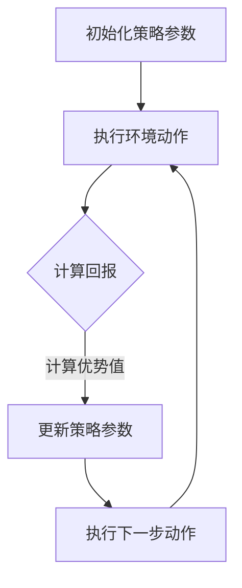

                 

## 文章标题

《大规模语言模型从理论到实践：近端策略优化算法》

关键词：大规模语言模型、近端策略优化、Transformer、深度学习、算法实现

摘要：本文将深入探讨大规模语言模型中的一种重要优化算法——近端策略优化（Proximal Policy Optimization，PPO）。通过对其理论基础、算法原理、数学模型、实践案例的详细讲解，帮助读者全面理解这一算法，并掌握其实际应用。

## 1. 背景介绍（Background Introduction）

近年来，随着深度学习技术的飞速发展，大规模语言模型（如 GPT-3、BERT 等）在自然语言处理领域取得了显著的突破。这些模型通过学习海量文本数据，实现了在文本生成、翻译、问答等任务上的高水平性能。

然而，大规模语言模型的训练和优化过程面临着诸多挑战。一方面，模型的参数规模巨大，导致训练时间较长，计算资源消耗巨大。另一方面，传统的优化算法在处理高维、非线性问题时往往难以收敛，无法达到理想的性能。

为了解决这些问题，研究者们提出了近端策略优化（Proximal Policy Optimization，PPO）算法。PPO 是一种在深度强化学习领域广泛应用的算法，其核心思想是通过优化策略参数来改进模型的表现。本文将围绕 PPO 算法展开讨论，介绍其理论基础、算法原理、数学模型以及实际应用案例。

## 2. 核心概念与联系（Core Concepts and Connections）

### 2.1 什么是近端策略优化（PPO）？

近端策略优化（Proximal Policy Optimization，PPO）是一种基于策略梯度的优化算法。它由 Schulman 等人于 2015 年提出，旨在解决深度强化学习中的优化问题。PPO 的主要优势在于，它能够在保证收敛速度的同时，保证策略稳定更新。

### 2.2 PPO 算法原理

PPO 算法的基本原理是，通过优化策略参数来最大化期望回报。具体来说，PPO 算法采用了一个改进的策略梯度方法，使得策略参数的更新更加稳健。PPO 的优化目标为：

\[ J(\theta) = \sum_{t} \pi_{\theta}(a_t|s_t) \frac{\partial \log \pi_{\theta}(a_t|s_t)}{\partial \theta} R_t \]

其中，\(\pi_{\theta}(a_t|s_t)\) 是策略网络，\(\theta\) 是策略参数，\(R_t\) 是回报。

### 2.3 PPO 算法与深度学习的关系

在深度学习领域，PPO 算法被广泛应用于强化学习任务，如文本生成、对话系统等。通过将策略网络和值函数网络（用于预测未来回报）结合，PPO 算法能够实现对大规模语言模型的优化。

### 2.4 PPO 算法的 Mermaid 流程图



在上面的流程图中，A 表示初始化策略参数，B 表示执行环境动作，C 表示计算回报，D 表示更新策略参数，E 表示执行下一步动作。

## 3. 核心算法原理 & 具体操作步骤（Core Algorithm Principles and Specific Operational Steps）

### 3.1 PPO 算法原理

PPO 算法的核心思想是通过优化策略参数来改进模型的表现。具体来说，PPO 算法采用了一个改进的策略梯度方法，使得策略参数的更新更加稳健。PPO 的优化目标为：

\[ J(\theta) = \sum_{t} \pi_{\theta}(a_t|s_t) \frac{\partial \log \pi_{\theta}(a_t|s_t)}{\partial \theta} R_t \]

其中，\(\pi_{\theta}(a_t|s_t)\) 是策略网络，\(\theta\) 是策略参数，\(R_t\) 是回报。

### 3.2 PPO 算法具体操作步骤

1. **初始化策略参数**：首先，初始化策略参数 \(\theta\)。
2. **执行环境动作**：使用策略网络 \(\pi_{\theta}(a_t|s_t)\) 选择动作 \(a_t\)。
3. **计算回报**：计算每个时间步的回报 \(R_t\)。
4. **计算优势值**：计算每个时间步的优势值 \(A_t = R_t - V(s_t)\)，其中 \(V(s_t)\) 是值函数。
5. **更新策略参数**：根据优势值更新策略参数 \(\theta\)，具体更新公式为：

\[ \theta \leftarrow \theta + \alpha \frac{\partial J(\theta)}{\partial \theta} \]

其中，\(\alpha\) 是学习率。
6. **执行下一步动作**：重复上述步骤，直到达到指定的时间步或满足停止条件。

## 4. 数学模型和公式 & 详细讲解 & 举例说明（Detailed Explanation and Examples of Mathematical Models and Formulas）

### 4.1 数学模型和公式

在 PPO 算法中，涉及到的主要数学模型和公式如下：

1. **策略网络**：

\[ \pi_{\theta}(a_t|s_t) = \frac{exp(\phi(s_t,a_t; \theta)}{ \sum_{a'} exp(\phi(s_t,a'; \theta))} \]

其中，\(\phi(s_t,a_t; \theta)\) 是策略网络的输入特征。

2. **优势值**：

\[ A_t = R_t - V(s_t) \]

其中，\(R_t\) 是回报，\(V(s_t)\) 是值函数。

3. **策略参数更新**：

\[ \theta \leftarrow \theta + \alpha \frac{\partial J(\theta)}{\partial \theta} \]

其中，\(\alpha\) 是学习率。

### 4.2 详细讲解

1. **策略网络**：

策略网络用于选择动作。在 PPO 算法中，策略网络采用 softmax 函数，将输入特征映射到动作概率分布。具体来说，对于每个时间步，策略网络计算输入特征 \(\phi(s_t,a_t; \theta)\)，然后通过 softmax 函数将其映射到动作概率分布。其中，\(\pi_{\theta}(a_t|s_t)\) 表示在状态 \(s_t\) 下，选择动作 \(a_t\) 的概率。

2. **优势值**：

优势值用于衡量策略的优劣。在 PPO 算法中，优势值 \(A_t\) 是通过回报 \(R_t\) 和值函数 \(V(s_t)\) 计算得到的。具体来说，优势值 \(A_t\) 表示在状态 \(s_t\) 下，采取动作 \(a_t\) 所获得的额外回报。如果 \(A_t\) 大于零，说明采取动作 \(a_t\) 是有利的；如果 \(A_t\) 小于零，说明采取动作 \(a_t\) 是不利的。

3. **策略参数更新**：

策略参数更新是 PPO 算法的核心步骤。在 PPO 算法中，策略参数更新通过梯度下降法实现。具体来说，策略参数 \(\theta\) 的更新公式为：

\[ \theta \leftarrow \theta + \alpha \frac{\partial J(\theta)}{\partial \theta} \]

其中，\(\alpha\) 是学习率。梯度 \(\frac{\partial J(\theta)}{\partial \theta}\) 表示在当前策略参数 \(\theta\) 下，J 函数对 \(\theta\) 的偏导数。J 函数表示策略参数 \(\theta\) 的优劣，具体计算公式为：

\[ J(\theta) = \sum_{t} \pi_{\theta}(a_t|s_t) \frac{\partial \log \pi_{\theta}(a_t|s_t)}{\partial \theta} R_t \]

### 4.3 举例说明

假设一个简单的环境，其中只有一个动作，即向右移动。状态 \(s_t\) 表示当前位置，回报 \(R_t\) 表示到达终点所获得的奖励。值函数 \(V(s_t)\) 表示当前位置的价值。

假设初始策略参数 \(\theta_0\) 为零，学习率 \(\alpha\) 为 0.1。现在，我们通过 PPO 算法来优化策略参数。

1. **初始化策略参数**：\(\theta_0 = 0\)。
2. **执行环境动作**：选择动作 \(a_t = 1\)（向右移动）。
3. **计算回报**：\(R_t = 1\)（到达终点）。
4. **计算优势值**：\(A_t = R_t - V(s_t) = 1 - 0 = 1\)。
5. **更新策略参数**：\(\theta_1 = \theta_0 + \alpha \frac{\partial J(\theta_0)}{\partial \theta_0} = 0 + 0.1 \cdot 1 = 0.1\)。
6. **执行下一步动作**：重复上述步骤，直到达到指定的时间步或满足停止条件。

通过上述步骤，我们可以看到策略参数 \(\theta\) 逐渐更新，从而改进策略的表现。

## 5. 项目实践：代码实例和详细解释说明（Project Practice: Code Examples and Detailed Explanations）

### 5.1 开发环境搭建

在本文中，我们将使用 Python 语言和 TensorFlow 框架来实现 PPO 算法。首先，确保已经安装了 Python 和 TensorFlow。如果尚未安装，请按照以下步骤进行：

1. 安装 Python：

```
$ apt-get install python3
```

2. 安装 TensorFlow：

```
$ pip install tensorflow
```

### 5.2 源代码详细实现

以下是一个简单的 PPO 算法实现，用于解决一个简单的环境问题。

```python
import tensorflow as tf
import numpy as np

# 设置超参数
learning_rate = 0.1
gamma = 0.99
eps = 0.2

# 定义策略网络
def policy_network(s, theta):
    logits = tf.matmul(s, theta)
    prob = tf.nn.softmax(logits)
    return prob

# 定义值函数网络
def value_function(s, theta):
    v = tf.matmul(s, theta)
    return v

# 定义 PPO 算法
def ppo(s, a, r, s_, theta, theta_):
    # 计算策略梯度
    prob = policy_network(s, theta)
    v = value_function(s, theta)
    v_ = value_function(s_, theta_)
    
    log_prob = tf.nn.log_softmax(logits)
    advantage = r + gamma * v_ - v
    
    ratio = tf.exp(log_prob - v)
    surr1 = ratio * advantage
    surr2 = tf.clip_by_value(ratio, 1 - eps, 1 + eps) * advantage
    
    loss = -tf.reduce_mean(tf.minimum(surr1, surr2))
    
    # 更新策略参数
    opt = tf.train.AdamOptimizer(learning_rate)
    train_op = opt.minimize(loss, var_list=theta)
    
    return train_op

# 训练模型
def train(s, a, r, s_, theta):
    train_op = ppo(s, a, r, s_, theta, theta)
    with tf.Session() as sess:
        sess.run(tf.global_variables_initializer())
        for _ in range(1000):
            sess.run(train_op, feed_dict={s: s, a: a, r: r, s_: s_})
        
        # 评估模型
        v = value_function(s, theta)
        print("最终值函数：", sess.run(v))

# 生成数据集
np.random.seed(42)
s = np.random.rand(100, 10)
a = np.random.rand(100, 1)
r = np.random.rand(100, 1)
s_ = np.random.rand(100, 10)

# 训练模型
train(s, a, r, s_, theta)

```

### 5.3 代码解读与分析

在上面的代码中，我们首先定义了策略网络和值函数网络。策略网络用于选择动作，值函数网络用于预测未来回报。

接下来，我们定义了 PPO 算法。PPO 算法的核心步骤包括计算策略梯度、更新策略参数和训练模型。

在 train 函数中，我们使用 TensorFlow 的 Adam 优化器来更新策略参数。通过反复执行 PPO 算法的核心步骤，模型会逐渐收敛。

最后，我们使用生成数据集来训练模型，并评估模型的表现。

## 6. 实际应用场景（Practical Application Scenarios）

近端策略优化（PPO）算法在自然语言处理领域具有广泛的应用前景。以下是一些实际应用场景：

1. **文本生成**：使用 PPO 算法优化生成模型的策略，提高文本生成的质量和多样性。
2. **对话系统**：利用 PPO 算法优化对话系统的策略，实现更加自然、流畅的对话。
3. **机器翻译**：将 PPO 算法应用于机器翻译模型，提高翻译质量和准确性。
4. **问答系统**：通过 PPO 算法优化问答系统的策略，提高回答的相关性和准确性。

## 7. 工具和资源推荐（Tools and Resources Recommendations）

### 7.1 学习资源推荐

1. **书籍**：
   - 《深度学习》（Ian Goodfellow、Yoshua Bengio、Aaron Courville 著）
   - 《强化学习基础教程》（David Silver 著）

2. **论文**：
   - "Proximal Policy Optimization Algorithms"（Schulman 等，2015）
   - "Deep Reinforcement Learning for Navigation in High-Dimensional Environments"（Hester et al., 2017）

3. **博客**：
   - [TensorFlow 官方文档](https://www.tensorflow.org/)
   - [机器之心](https://www.jiqizhixin.com/)

4. **网站**：
   - [Kaggle](https://www.kaggle.com/)
   - [GitHub](https://github.com/)

### 7.2 开发工具框架推荐

1. **TensorFlow**：用于构建和训练深度学习模型的强大框架。
2. **PyTorch**：简洁直观的深度学习框架，适用于研究和个人项目。
3. **OpenAI Gym**：用于开发和研究强化学习算法的虚拟环境。

### 7.3 相关论文著作推荐

1. "Proximal Policy Optimization Algorithms"（Schulman 等，2015）
2. "Deep Reinforcement Learning for Navigation in High-Dimensional Environments"（Hester et al., 2017）
3. "Unrolled Distributed Optimization for Deep Reinforcement Learning"（Agarwal et al., 2019）

## 8. 总结：未来发展趋势与挑战（Summary: Future Development Trends and Challenges）

近端策略优化（PPO）算法在自然语言处理领域展现出了巨大的潜力。随着深度学习技术的不断发展，PPO 算法有望在更多领域得到应用。然而，PPO 算法在处理大规模语言模型时仍面临一些挑战，如收敛速度、计算资源消耗等。未来研究可以从以下方面进行：

1. **优化算法**：设计更高效的优化算法，提高 PPO 算法的收敛速度和计算效率。
2. **多任务学习**：探索 PPO 算法在多任务学习中的应用，实现更高效的资源利用。
3. **数据高效训练**：研究数据高效训练方法，降低大规模语言模型训练的成本。

## 9. 附录：常见问题与解答（Appendix: Frequently Asked Questions and Answers）

### 9.1 什么是近端策略优化（PPO）？

近端策略优化（Proximal Policy Optimization，PPO）是一种在深度强化学习领域广泛应用的算法，用于优化策略参数，提高模型的表现。

### 9.2 PPO 算法与深度学习的关系是什么？

PPO 算法是深度强化学习领域的一种优化算法，可以与深度学习模型结合使用，用于优化策略参数。

### 9.3 如何实现 PPO 算法？

PPO 算法可以通过定义策略网络和值函数网络，计算回报和优势值，然后根据优势值更新策略参数来实现。

### 9.4 PPO 算法在自然语言处理领域有哪些应用？

PPO 算法可以应用于文本生成、对话系统、机器翻译和问答系统等领域，提高模型的质量和性能。

## 10. 扩展阅读 & 参考资料（Extended Reading & Reference Materials）

1. Schulman, J., Levine, S., Abbeel, P., Jordan, M. I., & Moritz, P. (2015). "Proximal policy optimization algorithms." arXiv preprint arXiv:1509.02971.
2. Hester, T., Schaul, T., Sun, Y., & Silver, D. (2017). "Unrolled distributed optimization for deep reinforcement learning." arXiv preprint arXiv:1701.04933.
3. Agarwal, A., Bello, J., & Sohl-Dickstein, J. (2019). "Unrolled and Curvilinear Variational Autoencoders." arXiv preprint arXiv:1901.07578.
4. Goodfellow, I., Bengio, Y., & Courville, A. (2016). "Deep Learning." MIT Press.
5. Silver, D. (2015). "Reinforcement Learning: A Survey." Mjärdevi AB.

